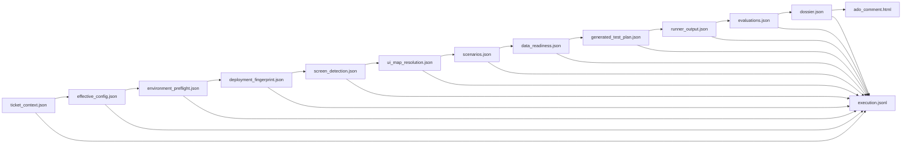

# Plan estructural de mejoras para Stacky QA UAT Agent

## 1. Resumen ejecutivo del roadmap

Stacky QA UAT Agent debe evolucionar de una cadena que “intenta compilar, generar y ejecutar” a un **pipeline gobernado por gates**, con contratos duros, evidencia inmutable por ejecución y bloqueo temprano cuando ambiente, datos, UI map o contratos no están listos.

La prioridad no es sumar más Playwright ni más IA. La prioridad es cerrar la confiabilidad forense: cada ejecución debe ser identificable por `run_id`, reproducible, auditable y con `verdict/category/reason/failed_stage` determinísticos. El Deep Research deja claro que Stacky ya tiene piezas maduras —`dry-run`, publicación segura, UI maps versionados, compilador con `compiled/out_of_scope_items`, `execution.jsonl` parcial y capacidades avanzadas en Stacky Agents—, pero todavía existen brechas críticas en identidad de ejecución, gates y evidencia homogénea. Stacky Agents ya opera bajo una filosofía de humano-en-el-loop y expone QA UAT vía `POST /api/qa-uat/run`, con historial, SSE y publicación controlada, lo que conviene reutilizar en lugar de duplicar gobernanza.  

La recomendación de ejecución es:

1. **Cerrar P0 en los primeros 4 sprints**: `run_id`, evidence isolation, fingerprint `off|soft|hard`, UI map gate, data readiness y bloqueo temprano.
2. **Luego endurecer contratos y evidencia**: JSON Schema para compiler/generator, veredictos normalizados, evidence bundle estándar y dossier consistente.
3. **Después integrar gobernanza Stacky Agents**: Contract Validator, confidence scoring, audit chain, rollback/publish policy y human gate.
4. **Finalmente atacar flakiness y automatización avanzada**: locator quality, mutation testing, AI triage, priorización inteligente y auto-healing asistido.

El objetivo operativo a 8 sprints es que todo run pueda responder:

> Qué ticket ejecuté, contra qué build, con qué datos, qué pantalla detecté, qué UI map usé, qué escenarios compilé, qué contratos validé, qué se ejecutó, qué evidencia quedó, cuál fue el veredicto, por qué falló y quién debe actuar.

---

## 2. Principios de diseño del nuevo pipeline

### 2.1. Identidad de ejecución primero

`ticket_id` no puede ser identidad de sesión. Debe ser solo un atributo. La identidad real debe ser `run_id`.

Regla:

```text
evidence/<ticket_id>/<run_id>/
```

No debe existir un `execution.jsonl` nuevo con múltiples `session_end` para el mismo `session_id`.

### 2.2. Fallar temprano antes del browser

Playwright no debe descubrir problemas de build, UI map, datos o contrato.

Orden deseado:

```text
ENV → deployment fingerprint → screen detection → UI map → compiler contract → data readiness → generator contract → runner
```

### 2.3. Contratos duros entre stages

Cada stage debe producir JSON validado contra schema. Nada “más o menos válido” debe llegar al siguiente stage.

Contratos mínimos:

```text
RunContext.schema.json
ScreenDetection.schema.json
UiMapResolution.schema.json
ScenarioSpec.schema.json
GeneratedTestPlan.schema.json
RunnerResult.schema.json
Dossier.schema.json
```

### 2.4. `UNKNOWN` no es aceptable en runs nuevos

`UNKNOWN` solo puede existir como categoría excepcional de crash no clasificado de la herramienta, y debe abrir bug P0.

Regla:

```text
session_end.verdict != null
verdict in PASS|FAIL|BLOCKED|MIXED|SKIPPED
```

### 2.5. Evidencia o no ocurrió

Incluso un run bloqueado en el primer segundo debe dejar:

```text
execution.jsonl
result.json
effective_config.json
pipeline_verdict_decision.json
```

Si llegó a Playwright, debe agregar trace, screenshots, JUnit, logs y runner summary.

### 2.6. IA bajo contrato, no IA libre

La IA puede clasificar, generar, resumir y sugerir, pero:

```text
LLM propone → JSON Schema valida → pipeline decide → humano aprueba impacto externo
```

Esto encaja con las capacidades existentes de Stacky Agents: Contract Validator, confidence scoring, audit chain, egress controls, logs estructurados y rollback de acciones ADO ya están documentados en el producto general.  

### 2.7. Gobernanza antes de escala

No se debe aumentar volumen de E2E/UAT mientras existan:

```text
verdict=null
UNKNOWN
execution logs mezclados
fingerprint advisory sin gate
UI map faltante sin bloqueo
data readiness inexistente
aliases inventados
publish sin evidence bundle completo
```

---

## 3. Arquitectura objetivo

### 3.1. Flujo ideal end-to-end

```mermaid
flowchart TD
    A[Intake ticket ADO/Jira/Mantis] --> B[Create run_id + artifact root]
    B --> C[Environment preflight]
    C -->|blocked| Z1[BLOCKED ENV]
    C --> D[Deployment fingerprint gate off|soft|hard]
    D -->|hard mismatch| Z2[BLOCKED ENV_BUILD]
    D --> E[Screen detection]
    E -->|ambiguous/low confidence| Z3[BLOCKED PIP_SCREEN]
    E --> F[UI map resolution]
    F -->|missing and rebuild fails| Z4[BLOCKED GEN_UI_MAP]
    F --> G[Scenario compiler]
    G -->|schema invalid| Z5[BLOCKED PIP_CONTRACT]
    G -->|compiled=0| Z6[BLOCKED PIP_NO_EXECUTABLE]
    G --> H[Data readiness gate]
    H -->|missing data| Z7[BLOCKED DATA_REQUIRED]
    H --> I[Test generator]
    I -->|schema invalid or alias missing| Z8[BLOCKED GEN_CONTRACT]
    I --> J[Playwright runner]
    J --> K[Evidence bundle]
    K --> L[Verdict normalizer + triage]
    L --> M[Dossier]
    M --> N[Policy-as-code publish gate]
    N -->|dry-run| O[Local evidence only]
    N -->|publish approved| P[ADO/Jira/Mantis comment]
    P --> Q[Audit + rollback metadata]
```

### 3.2. Flujo de artefactos



### 3.3. Estructura objetivo de evidencia

```text
evidence/
  122/
    latest.json
    index.json
    uat-122-20260509T123456Z/
      execution.jsonl
      result.json
      effective_config.json
      environment_preflight.json
      deployment_fingerprint.json
      screen_detection.json
      ui_map_resolution.json
      ui_map_used.json
      scenarios.json
      data_readiness.json
      generated_test_plan.json
      generated/
        rf008_ca01.spec.ts
      runner/
        junit.xml
        playwright-results.json
        playwright-report/
        test-results/
        screenshots/
        traces/
        console.log
        network.har
      evaluations.json
      triage.json
      dossier.json
      ado_comment.html
      publish_audit.json
```

### 3.4. Taxonomía oficial de resultado

| Verdict   | Category      | Uso                                                          |
| --------- | ------------- | ------------------------------------------------------------ |
| `PASS`    | `null`        | Todo lo ejecutable pasó.                                     |
| `FAIL`    | `APP`         | Fallo real de producto o aserción funcional.                 |
| `BLOCKED` | `ENV`         | Entorno, build, login, configuración o URL inválida.         |
| `BLOCKED` | `DATA`        | Datos mínimos inexistentes, grilla vacía, catálogo faltante. |
| `BLOCKED` | `PIP`         | Error del pipeline, scope, compiler, contrato interno.       |
| `BLOCKED` | `GEN`         | UI map faltante, alias inventado, test plan inválido.        |
| `BLOCKED` | `NAV`         | Selector, frame, navegación o timeout de UI real.            |
| `BLOCKED` | `OBS`         | Evidencia incompleta o inconsistente.                        |
| `MIXED`   | múltiple      | Escenarios con resultados heterogéneos.                      |
| `SKIPPED` | `PIP` o `GOV` | No hay UAT ejecutable o policy no permite ejecución.         |

### 3.5. Cambios por categoría

| Categoría          | Cambios principales                                                                            |
| ------------------ | ---------------------------------------------------------------------------------------------- |
| Arquitectura       | `run_id` real, artifact root por run, pipeline con gates explícitos, taxonomía de veredictos.  |
| Pipeline           | Orden ENV → UI map → compiler → data → generator → runner → dossier → publish gate.            |
| Observabilidad     | `execution.jsonl` por run, eventos normalizados, `pipeline_verdict_decision`, evidence bundle. |
| Datos              | `data_readiness.json`, reason `GRID_EMPTY`, SQL/request de datos seguro y reversible.          |
| Generación LLM     | JSON Schema, Structured Outputs o validación equivalente, no alias fuera del UI map.           |
| Playwright/runner  | Timeouts configurables, trace/screenshot/JUnit, clasificación APP/NAV/DATA/OPS.                |
| ADO/governance     | `dry-run` por defecto, publish policy, rollback, idempotencia, human gate.                     |
| Testing/validación | Regression fixtures 120/122, mutation testing, contract tests, negative tests.                 |

---

## 4. Roadmap por fases

| Fase   |    Sprints | Objetivo                                                                  | Prioridad dominante |
| ------ | ---------: | ------------------------------------------------------------------------- | ------------------- |
| Fase 0 |   Sprint 0 | Discovery, baseline, contradicciones y contratos de decisión.             | P0                  |
| Fase 1 |   Sprint 1 | Evidencia inmutable por `run_id`.                                         | P0                  |
| Fase 2 | Sprint 2–3 | Gates críticos: ENV, UI Map, Data Readiness.                              | P0                  |
| Fase 3 |   Sprint 4 | Contratos duros compiler/generator.                                       | P1                  |
| Fase 4 |   Sprint 5 | Evidence bundle, veredictos, dossier y normalización forense.             | P1                  |
| Fase 5 |   Sprint 6 | Stacky Agents governance, Contract Validator, confidence, publish policy. | P1                  |
| Fase 6 |   Sprint 7 | Locator quality, Playwright hardening, reducción de flakiness.            | P2                  |
| Fase 7 |   Sprint 8 | Mutation testing, AI triage, mejora continua y optimizaciones futuras.    | P2/P3               |

---

## 5. Plan por sprints

## Sprint 0 — Discovery, baseline y hardening inicial

**Objetivo**
Alinear el estado real del código, evidencia histórica y documentos. Convertir contradicciones del Deep Research en spikes accionables y dejar una baseline medible antes de tocar P0.

**Problemas que resuelve**

| Hallazgo original                                                                 | Riesgo reducido                                               |
| --------------------------------------------------------------------------------- | ------------------------------------------------------------- |
| Código más nuevo que evidencia histórica del ticket 122.                          | Falsas conclusiones sobre bugs ya corregidos o no corregidos. |
| `ENV-001` contradictorio: fingerprint existe pero advisory.                       | Reimplementar algo que ya existe parcialmente.                |
| `FIX-5` contradictorio: `UNKNOWN` separado, no necesariamente fusionado a `FAIL`. | Normalizar veredictos mal definidos.                          |
| `nav_helper.ts` no verificable.                                                   | Basar tareas en archivo que podría no existir.                |
| Ticket 120 con evidencia incompleta.                                              | Diseñar validación sin fixture real.                          |

**Alcance**

* Inventario técnico de módulos reales.
* Baseline de evidencia para tickets 116, 119, 120, 122.
* Matriz “hallazgo → estado verificable → acción”.
* Definición de contratos mínimos.
* Congelamiento de nuevas features de QA UAT hasta cerrar P0.

**Épicas**

1. Baseline forense.
2. Discovery de módulos.
3. Contratos mínimos de resultado.
4. Plan de regression fixtures.

**Tareas técnicas**

* Inventariar:

  * `qa_uat_pipeline.py`
  * `execution_logger.py`
  * `environment_preflight.py`
  * `deployment_fingerprint.py`
  * `ui_map_builder.py`
  * `uat_scenario_compiler.py`
  * `playwright_test_generator.py`
  * `uat_test_runner.py`
  * `log_analyzer.py`
  * `ado_evidence_publisher.py`
  * `backend/api/qa_uat.py`
* Confirmar si existe o no `nav_helper.ts`, o cuál es el helper equivalente.
* Extraer fixtures mínimos de tickets:

  * 120: build mismatch, grid empty.
  * 122: wrong screen, compiled=0, multiple `session_end`.
* Definir `VerdictTaxonomy.md`.
* Definir `ExecutionEvents.md`.
* Definir `EvidenceBundle.md`.
* Crear baseline de métricas:

  * runs sin `execution.jsonl`;
  * runs con `verdict=null`;
  * runs con múltiples `session_end`;
  * `UNKNOWN`;
  * `NAVIGATION_TIMEOUT`;
  * UI maps faltantes.

**Componentes afectados**

```text
docs/
tests/fixtures/qa_uat/
log_analyzer.py
backend/api/qa_uat.py
qa_uat_pipeline.py
```

**Dependencias**

* Acceso a evidencia histórica.
* Confirmación de paths reales del repo.
* Aprobación de taxonomía de veredictos.

**Riesgos**

* Evidencia histórica incompleta.
* Fixtures no reproducibles.
* Código público y código interno desalineados.

**Criterios de aceptación**

* Existe matriz de contradicciones con estado: `confirmed | partially_confirmed | not_verified | legacy_evidence`.
* Se acuerda que `ticket_id != session_id`.
* Se acuerda que `UNKNOWN` es bug de tool en runs nuevos.
* Se acuerda que P0 bloquea nuevas features.

**Evidencia esperada**

```text
docs/qa_uat_baseline.md
docs/qa_uat_verdict_taxonomy.md
docs/qa_uat_event_contracts.md
tests/fixtures/qa_uat/ticket_120/
tests/fixtures/qa_uat/ticket_122/
```

**Definition of Done**

* Baseline aprobada por Tech Lead y QA Lead.
* Riesgos no verificados convertidos en spikes.
* Backlog P0 congelado y ordenado.

**Métricas de éxito**

| Métrica                                      |         Target |
| -------------------------------------------- | -------------: |
| Hallazgos P0 con owner                       |           100% |
| Contradicciones convertidas en tarea/spike   |           100% |
| Fixtures iniciales 120/122 disponibles       | ≥ 1 por ticket |
| Features nuevas QA UAT aceptadas antes de P0 |              0 |

---

## Sprint 1 — Evidencia inmutable por `run_id`

**Objetivo**
Separar evidencia por ejecución real y eliminar contaminación forense entre re-runs del mismo ticket.

**Problemas que resuelve**

| Hallazgo original                                                                         | Riesgo reducido                                         |
| ----------------------------------------------------------------------------------------- | ------------------------------------------------------- |
| `execution.jsonl` del ticket 122 contiene múltiples `session_end` con mismo `session_id`. | Pérdida de causalidad y análisis automático incorrecto. |
| Logger usa `ticket_id` como identidad de sesión.                                          | Re-runs mezclados y evidencia no reproducible.          |
| Evidencia heterogénea entre tickets 116/119/122.                                          | Diagnóstico transversal incompleto.                     |

**Alcance**

* Crear `run_id`.
* Artifact root por run.
* `latest.json` e `index.json` por ticket.
* `session_start` y `session_end` obligatorios.
* `ticket_id` y `run_id` en todos los eventos.
* Compatibilidad con legacy evidence.

**Épicas**

1. Run identity.
2. Artifact isolation.
3. JSONL contract.
4. Legacy migration/read compatibility.

**Tareas técnicas**

* Implementar generador de `run_id`:

```text
uat-<ticket_id>-<YYYYMMDDTHHMMSSZ>-<shortuuid>
```

* Cambiar `ExecutionLogger(session_id=str(ticket_id))` por:

```python
ExecutionLogger(ticket_id=ticket_id, run_id=run_id, artifact_root=...)
```

* Crear estructura:

```text
evidence/<ticket_id>/<run_id>/execution.jsonl
```

* Agregar `evidence/<ticket_id>/latest.json`.
* Agregar `evidence/<ticket_id>/index.json`.
* Añadir evento `artifact_root_created`.
* Asegurar `session_end` en `finally`.
* Crear validación:

```text
one_session_start
one_session_end
same_run_id_all_events
no_verdict_null
```

* Actualizar `log_analyzer.py` para leer:

  * formato nuevo por `run_id`;
  * formato legacy por ticket.
* Actualizar `backend/api/qa_uat.py` para retornar `run_id` y `artifact_root`.

**Componentes afectados**

```text
execution_logger.py
qa_uat_pipeline.py
log_analyzer.py
backend/api/qa_uat.py
ado_evidence_publisher.py
qa_dossier_builder.py
tests/
```

**Dependencias**

* Sprint 0: event contract aprobado.
* Decisión de naming para `run_id`.

**Riesgos**

* Romper consumidores actuales que esperan `evidence/<ticket_id>/execution.jsonl`.
* Duplicar publicación ADO si el hash actual depende del path anterior.
* Migración incompleta de evidencia legacy.

**Criterios de aceptación**

* Dos re-runs del ticket 122 generan carpetas distintas.
* Ningún `execution.jsonl` nuevo contiene más de un `session_end`.
* Todos los eventos tienen `run_id`.
* `session_end.data.verdict` nunca es `null`.
* `log_analyzer` puede leer formato nuevo y legacy.

**Evidencia esperada**

```text
evidence/122/uat-122-.../execution.jsonl
evidence/122/uat-122-.../result.json
evidence/122/index.json
evidence/122/latest.json
```

Ejemplo mínimo:

```json
{
  "ts": "2026-05-09T12:34:56.001Z",
  "event": "session_start",
  "ticket_id": 122,
  "run_id": "uat-122-20260509T123456Z-a1b2c3",
  "stage": "pipeline",
  "data": {
    "mode": "dry-run",
    "artifact_root": "evidence/122/uat-122-20260509T123456Z-a1b2c3"
  }
}
```

**Definition of Done**

* Tests unitarios y regression pasan.
* Nuevo formato documentado.
* Legacy analyzer no rompe.
* Stacky Agents UI/API muestra `run_id`.

**Métricas de éxito**

| Métrica                                     | Target |
| ------------------------------------------- | -----: |
| Runs nuevos con `execution.jsonl`           |   100% |
| Runs nuevos con un solo `session_end`       |   100% |
| Eventos sin `run_id`                        |      0 |
| `verdict=null` en runs nuevos               |      0 |
| Tiempo para ubicar evidencia del último run |  < 5 s |

---

## Sprint 2 — Gates ENV y UI Map

**Objetivo**
Bloquear temprano por build incorrecto o UI map faltante, antes de generar o ejecutar tests inválidos.

**Problemas que resuelve**

| Hallazgo original                                                                  | Riesgo reducido                                             |
| ---------------------------------------------------------------------------------- | ----------------------------------------------------------- |
| `deployment_fingerprint.py` existe pero es advisory.                               | Falsos FAIL/BLOCKED contra build incorrecto.                |
| UI map cache cubre `FrmAgenda.aspx`, pero no necesariamente `FrmDetalleClie.aspx`. | Generación contra pantalla incorrecta o aliases inventados. |
| Ticket 122 detectó `FrmAgenda.aspx` históricamente.                                | Scope incorrecto y runner sin escenarios válidos.           |

**Alcance**

* Policy `QA_UAT_DEPLOYMENT_POLICY=off|soft|hard`.
* Gate `deployment_fingerprint`.
* Gate `ui_map_resolution`.
* Bloqueo por `GEN_UI_MAP_MISSING`.
* Screen detection auditable.
* Sin fallback silencioso a `FrmAgenda.aspx`.

**Épicas**

1. Deployment fingerprint policy.
2. Screen detection hardening.
3. UI map resolution gate.
4. UI map coverage para pantallas críticas.

**Tareas técnicas**

* Extender `environment_preflight.py`:

```python
policy = os.getenv("QA_UAT_DEPLOYMENT_POLICY", "soft")
```

* Implementar decisiones:

| Policy | Mismatch                     | Missing fingerprint              |
| ------ | ---------------------------- | -------------------------------- |
| `off`  | continúa sin gate            | continúa                         |
| `soft` | warning + continúa           | warning + continúa               |
| `hard` | `BLOCKED ENV BUILD_MISMATCH` | `BLOCKED ENV BUILD_UNVERIFIABLE` |

* Emitir evento:

```json
{
  "event": "deployment_fingerprint_checked",
  "stage": "environment_preflight",
  "data": {
    "policy": "hard",
    "expected_build_id": "Task-122-RF-008-v1",
    "active_build_id": "Task-119-RF-006-v3",
    "matched": false,
    "decision": "BLOCKED"
  }
}
```

* Crear o extraer `screen_detector.py`.
* Crear `screen_aliases.yml`.
* Emitir `screen_detection.json`.
* Bloquear si:

  * pantalla ambigua;
  * pantalla con baja confianza;
  * pantalla objetivo sin UI map y rebuild no permitido/fallido.
* Implementar `ui_map_resolution`:

```json
{
  "screen": "FrmDetalleClie.aspx",
  "cache_hit": false,
  "rebuild_attempted": true,
  "ok": false,
  "reason": "UI_MAP_MISSING"
}
```

* Rebuild inicial de:

  * `FrmAgenda.aspx`;
  * `FrmDetalleClie.aspx`;
  * pantallas necesarias para ticket 120 si se identifican.

**Componentes afectados**

```text
environment_preflight.py
deployment_fingerprint.py
screen_detector.py
screen_aliases.yml
ui_map_builder.py
qa_uat_pipeline.py
execution_logger.py
cache/ui_maps/
tests/
```

**Dependencias**

* Sprint 1: artifact root por run.
* Fuente confiable o provisional de fingerprint.
* Acceso a ambiente para rebuild UI maps.

**Riesgos**

* Fingerprint hard puede bloquear demasiados dry-runs si el ambiente no expone versión.
* UI map rebuild puede requerir login/datos.
* Screen aliases mal calibrados pueden bloquear tickets válidos.

**Criterios de aceptación**

* En `hard`, mismatch bloquea antes del browser.
* En `hard`, fingerprint no verificable bloquea con `BUILD_UNVERIFIABLE`.
* Si falta UI map de pantalla objetivo, no se ejecuta generator ni runner.
* Ticket 122 no cae silenciosamente a `FrmAgenda.aspx`.
* `ui_map_resolution.json` siempre existe.

**Evidencia esperada**

```text
deployment_fingerprint.json
screen_detection.json
ui_map_resolution.json
ui_map_used.json cuando aplique
execution.jsonl con eventos ENV/UI_MAP
```

**Definition of Done**

* Tests `off|soft|hard` pasan.
* Regression ticket 122 cubre UI map missing.
* `GEN_UI_MAP_MISSING` aparece como `BLOCKED`, no como `UNKNOWN`.
* Documentación de cómo crear/rebuild UI maps.

**Métricas de éxito**

| Métrica                                    | Target |
| ------------------------------------------ | -----: |
| Mismatch en policy hard que llega a runner |      0 |
| UI map missing que llega a generator       |      0 |
| Fallback silencioso a pantalla default     |      0 |
| `screen_detection_result` presente         |   100% |
| `ui_map_resolution` presente               |   100% |

---

## Sprint 3 — Data readiness y bloqueo temprano

**Objetivo**
Separar fallos de datos de fallos de navegación y bloquear antes del runner cuando faltan grillas, catálogos o entidades mínimas.

**Problemas que resuelve**

| Hallazgo original                                                            | Riesgo reducido                                 |
| ---------------------------------------------------------------------------- | ----------------------------------------------- |
| Falta gate formal de `data_readiness`.                                       | `NAVIGATION_TIMEOUT` usado para datos ausentes. |
| `data_request.json` existe como flujo free-form, pero no como gate estándar. | Diagnóstico tardío y no gobernado.              |
| Grillas vacías pueden confundirse con selector roto.                         | Falsos NAV/BLOCKED y pérdida de confianza.      |

**Alcance**

* Stage `data_readiness`.
* Artefacto `data_readiness.json`.
* Reason codes `GRID_EMPTY`, `CATALOG_MISSING`, `TEST_ENTITY_NOT_FOUND`.
* Salida con request de datos o seed SQL seguro.
* No ejecutar Playwright si datos mínimos faltan.

**Épicas**

1. Data readiness contract.
2. Screen/grid mapping.
3. Safe data request/seed.
4. DATA vs NAV classification.

**Tareas técnicas**

* Crear `data_readiness_checker.py` o extender `uat_precondition_checker.py`.
* Definir schema:

```json
{
  "screen": "FrmDetalleClie.aspx",
  "scenario_id": "RF-008-CA-01",
  "checks": [
    {
      "type": "grid_min_rows",
      "grid_alias": "GridObligaciones",
      "min_rows": 1,
      "actual_rows": 0,
      "status": "blocked",
      "reason": "GRID_EMPTY"
    }
  ]
}
```

* Integrar con UI map para identificar grillas.
* Integrar con BD read-only si existe `PROJECT_DB_URL`.
* Si no hay BD, ejecutar precheck UI rápido como stage separado.
* Prohibir DML automático.
* Emitir:

  * `data_request.json`;
  * `seed_sql_suggestion.sql` opcional;
  * `rollback_sql_suggestion.sql` opcional.
* Clasificar:

  * grilla existe sin filas → `DATA GRID_EMPTY`;
  * selector de grilla inexistente → `NAV SELECTOR_NOT_FOUND`;
  * catálogo vacío → `DATA CATALOG_MISSING`.

**Componentes afectados**

```text
data_readiness_checker.py
uat_precondition_checker.py
ui_map_builder.py
qa_uat_pipeline.py
execution_logger.py
playwright_test_generator.py
tests/
```

**Dependencias**

* Sprint 2: UI map resolution.
* Conocimiento de grillas/catálogos por pantalla.
* Acceso read-only a BD o ruta UI confiable.

**Riesgos**

* Falta de esquema DB completo.
* Seed SQL inseguro si se genera demasiado específico.
* Falsos `DATA_REQUIRED` por queries mal calibradas.

**Criterios de aceptación**

* Grilla vacía devuelve `BLOCKED DATA GRID_EMPTY`.
* No devuelve `NAVIGATION_TIMEOUT` para datos ausentes conocidos.
* `data_readiness.json` siempre existe cuando hay escenarios ejecutables.
* Si falta data, runner no inicia.
* Seed SQL sugerido es idempotente, etiquetado y con rollback.

**Evidencia esperada**

```text
data_readiness.json
data_request.json
seed_sql_suggestion.sql opcional
rollback_sql_suggestion.sql opcional
execution.jsonl con data_readiness_result
```

**Definition of Done**

* Tests unitarios DATA/NAV pasan.
* Ticket 120 tiene dos fixtures:

  * build correcto + grid empty;
  * build correcto + data ready.
* No se ejecuta runner si `data_readiness.status=blocked`.

**Métricas de éxito**

| Métrica                               |           Target |
| ------------------------------------- | ---------------: |
| `GRID_EMPTY` clasificado como DATA    | 100% de fixtures |
| `NAVIGATION_TIMEOUT` por grilla vacía |                0 |
| Runner iniciado con data blocked      |                0 |
| Data readiness artifact presente      |             100% |
| Seeds sin rollback                    |                0 |

---

## Sprint 4 — Contratos duros compiler/generator

**Objetivo**
Garantizar que compiler y generator solo intercambien objetos válidos, sin aliases inventados, enums inválidos ni escenarios incoherentes.

**Problemas que resuelve**

| Hallazgo original                                                       | Riesgo reducido                                                 |
| ----------------------------------------------------------------------- | --------------------------------------------------------------- |
| Compilador tiene contrato explícito, pero enforcement no es end-to-end. | Stages aceptan JSON incompleto o ambiguo.                       |
| Generator puede degradar si falta UI map.                               | Specs plausibles pero inválidos.                                |
| `compiled=0` puede continuar a stages posteriores.                      | Runner con `scenario_count=0`, `verdict=null` o no-tests-found. |

**Alcance**

* JSON Schema para compiler y generator.
* Validación antes de persistir y antes de avanzar.
* `compiled=0` como bloqueo determinístico.
* Selector contract validation.
* Reuso del patrón Contract Validator de Stacky Agents.

**Épicas**

1. ScenarioSpec schema.
2. GeneratedTestPlan schema.
3. Selector contract.
4. Contract validation integration.

**Tareas técnicas**

* Crear schemas:

```text
schemas/ScenarioCompilerResult.schema.json
schemas/ScenarioSpec.schema.json
schemas/GeneratedTestPlan.schema.json
schemas/SelectorContract.schema.json
```

* Validar compiler output:

```text
compiled
out_of_scope
scenarios[]
out_of_scope_items[]
warnings[]
```

* Reglas duras:

```text
compiled=0 + out_of_scope>0 → BLOCKED PIP NO_EXECUTABLE_SCENARIOS
compiled=0 + out_of_scope=0 → BLOCKED PIP COMPILER_EMPTY
scenario.screen missing → PIP CONTRACT_INVALID
scenario.selectors_requested missing → PIP CONTRACT_INVALID
```

* Validar generator input contra UI map:

```text
selectors_requested ⊆ ui_map.aliases
```

* Si alias falta:

```text
BLOCKED GEN SELECTOR_ALIAS_NOT_IN_UI_MAP
```

* No escribir `.spec.ts` si el contrato falla.
* Integrar resultado de Contract Validator y confidence scoring en metadata del run.
* Añadir `compiler_contract_result` y `generator_contract_result`.

**Componentes afectados**

```text
uat_scenario_compiler.py
playwright_test_generator.py
contract_validator.py o adapter QA UAT
schemas/
qa_uat_pipeline.py
execution_logger.py
tests/
```

**Dependencias**

* Sprint 2: UI map gate.
* Sprint 3: data readiness contract.
* Disponibilidad o adaptación del Contract Validator de Stacky Agents.

**Riesgos**

* Rechazo inicial de outputs que antes pasaban por tolerancia.
* Ajustes necesarios en prompts/templates del LLM.
* Contract Validator general puede no mapear 1:1 a QA UAT.

**Criterios de aceptación**

* Toda salida inválida produce `*_CONTRACT_INVALID`.
* Generator no corre si compiler contract falla.
* Runner no corre si generator contract falla.
* Alias fuera de UI map bloquea.
* `compiled=0` nunca llega a runner.

**Evidencia esperada**

```text
compiler_contract_result.json
generator_contract_result.json
selector_contract.json
scenarios.json validado
generated_test_plan.json validado
```

**Definition of Done**

* Schemas versionados.
* Tests negativos pasan.
* Prompts ajustados para respetar schemas.
* Contract score visible en dossier.

**Métricas de éxito**

| Métrica                                         | Target |
| ----------------------------------------------- | -----: |
| Outputs compiler sin schema válido que avanzan  |      0 |
| Outputs generator sin schema válido que avanzan |      0 |
| Specs escritos con alias faltante               |      0 |
| Runner iniciado con `compiled=0`                |      0 |
| Contract score disponible                       |   100% |

---

## Sprint 5 — Evidence bundle, veredictos y dossier

**Objetivo**
Estandarizar evidencia, normalizar veredictos y generar dossier confiable para revisión humana y publicación.

**Problemas que resuelve**

| Hallazgo original                                             | Riesgo reducido                               |
| ------------------------------------------------------------- | --------------------------------------------- |
| Evidence bundle no homogéneo por run.                         | Forense caro y poco confiable.                |
| `UNKNOWN`/`verdict=null` o summary ambiguo.                   | Publicaciones o diagnósticos incorrectos.     |
| ADO publisher es sólido, pero necesita policy-as-code previa. | Publicar evidencia incompleta o no gobernada. |

**Alcance**

* `result.json` estándar.
* `dossier.json` estándar.
* `pipeline_verdict_decision`.
* Normalización de verdict/reason.
* Evidence completeness checker.
* ADO comment generado desde dossier.

**Épicas**

1. Verdict normalizer.
2. Evidence bundle builder.
3. Dossier builder.
4. Publish readiness checker.

**Tareas técnicas**

* Implementar `verdict_normalizer.py`.
* Definir reason codes oficiales:

```text
BUILD_MISMATCH
BUILD_UNVERIFIABLE
UI_MAP_MISSING
SCREEN_AMBIGUOUS
NO_EXECUTABLE_SCENARIOS
COMPILER_CONTRACT_INVALID
GENERATOR_CONTRACT_INVALID
SELECTOR_ALIAS_NOT_IN_UI_MAP
GRID_EMPTY
CATALOG_MISSING
SELECTOR_TIMEOUT
SELECTOR_NOT_FOUND
ASSERTION_FAILED
RUNNER_CRASH
EVIDENCE_INCOMPLETE
```

* Crear `evidence_bundle_manifest.json`:

```json
{
  "required": ["execution.jsonl", "result.json", "effective_config.json"],
  "present": [...],
  "missing": [],
  "complete": true
}
```

* Crear `dossier.json`:

```json
{
  "ticket_id": 122,
  "run_id": "...",
  "verdict": "BLOCKED",
  "category": "GEN",
  "reason": "UI_MAP_MISSING",
  "failed_stage": "ui_map",
  "root_cause_summary": "...",
  "human_action_required": "...",
  "artifacts": {...}
}
```

* Generar `ado_comment.html` desde dossier.
* Bloquear publish si:

  * `verdict=null`;
  * `UNKNOWN`;
  * evidence bundle incompleto;
  * falta `run_id`;
  * falta `pipeline_verdict_decision`.

**Componentes afectados**

```text
verdict_normalizer.py
qa_dossier_builder.py
ado_evidence_publisher.py
log_analyzer.py
qa_uat_pipeline.py
execution_logger.py
tests/
```

**Dependencias**

* Sprint 1: `run_id`.
* Sprint 4: contracts.
* Política de reason codes aprobada.

**Riesgos**

* Dossier demasiado verboso o poco útil para ADO.
* Publish bloqueado por evidencia opcional mal clasificada como requerida.
* Diferencias entre dry-run y publish.

**Criterios de aceptación**

* Ningún run nuevo termina con `verdict=null`.
* `UNKNOWN` bloquea publish.
* Dossier incluye `run_id`, `verdict`, `category`, `reason`, `failed_stage`, `evidence_refs`.
* Evidence bundle incompleto produce `BLOCKED OBS EVIDENCE_INCOMPLETE` o bloquea publish según etapa.
* ADO comment es idempotente por `run_id` + hash.

**Evidencia esperada**

```text
result.json
evidence_bundle_manifest.json
dossier.json
ado_comment.html
publish_audit.json
pipeline_verdict_decision event
```

**Definition of Done**

* Dossier renderizado en dry-run.
* Publish readiness checker integrado.
* Regression 120/122 valida dossier.
* `log_analyzer` reporta categorías normalizadas.

**Métricas de éxito**

| Métrica                         | Target |
| ------------------------------- | -----: |
| Runs nuevos con `result.json`   |   100% |
| Runs nuevos con `dossier.json`  |   100% |
| Publish con evidence incompleto |      0 |
| Publish con `UNKNOWN`           |      0 |
| `verdict=null`                  |      0 |

---

## Sprint 6 — Integración con Stacky Agents governance

**Objetivo**
Reutilizar capacidades maduras de Stacky Agents: Contract Validator, confidence scoring, audit chain, SSE, rollback, publish approval y policy-as-code.

**Problemas que resuelve**

| Hallazgo original                                                             | Riesgo reducido                          |
| ----------------------------------------------------------------------------- | ---------------------------------------- |
| QA UAT evoluciona como tool aislada aunque Stacky Agents ya tiene governance. | Duplicación de deuda técnica.            |
| Contract Validator y confidence scoring existen en ecosistema general.        | QA UAT sin confianza por stage.          |
| Publish ADO sólido, pero falta policy formal.                                 | Efectos externos sin evidencia completa. |

**Alcance**

* QA UAT run como `AgentExecution` o entidad vinculada.
* Metadata de contract/confidence por stage.
* Publish policy.
* Human approval.
* Rollback metadata.
* SSE timeline de stages.

**Épicas**

1. QA UAT execution model.
2. Governance adapter.
3. Publish policy-as-code.
4. UI timeline/human gate.

**Tareas técnicas**

* Enriquecer `backend/api/qa_uat.py` para guardar:

  * `run_id`;
  * artifact root;
  * verdict/category/reason;
  * contract results;
  * confidence.
* Adaptar Contract Validator para:

  * `ScenarioCompilerResult`;
  * `GeneratedTestPlan`;
  * `Dossier`.
* Agregar confidence scoring por stage:

```json
{
  "stage": "screen_detection",
  "confidence": 0.94,
  "signals": ["exact_aspx_match", "source=analisis_tecnico"]
}
```

* Implementar `qa_uat_publish_policy.py`:

```text
allow publish only if:
  verdict in PASS|FAIL|BLOCKED|MIXED
  verdict != UNKNOWN
  evidence_bundle_complete=true
  run_id present
  dossier present
  human_approved=true
```

* Integrar rollback existente para comentarios QA UAT.
* Agregar evento `human_decision`.
* Mostrar timeline de stages en UI/LogsPanel.

Stacky Agents ya documenta historial inmutable por ticket, logs SSE, endpoints de ejecución, QA UAT pipeline y rollback ADO; este sprint debe conectar QA UAT con esas capacidades en vez de crear una gobernanza paralela.  

**Componentes afectados**

```text
backend/api/qa_uat.py
backend/models.py
backend/agent_runner.py opcional
backend/contract_validator.py
backend/services/stacky_logger.py
ado_evidence_publisher.py
frontend LogsPanel / ExecutionHistory / QA UAT modal
qa_uat_publish_policy.py
```

**Dependencias**

* Sprint 5: dossier y evidence bundle.
* Acceso al modelo `AgentExecution`.
* Definición de human approval UX.

**Riesgos**

* Acoplar demasiado QA UAT al runner genérico de agentes.
* Duplicar logs: `execution.jsonl` vs `system_logs`.
* Rollback diferente por tracker.

**Criterios de aceptación**

* Cada QA UAT run aparece en historial de Stacky Agents con `run_id`.
* SSE muestra stages.
* Publish requiere evidence complete + human approval.
* Rollback conserva output/evidencia y registra operación.
* Contract/confidence visibles en metadata.

**Evidencia esperada**

```text
AgentExecution metadata con qa_uat.run_id
system_logs con qa_uat lifecycle
publish_policy_result.json
human_decision event
rollback audit cuando aplique
```

**Definition of Done**

* UI puede abrir último run QA UAT por ticket.
* Publish bloqueado si no cumple policy.
* Rollback probado en dry-run/mock.
* Contract/confidence integrados sin duplicar lógica.

**Métricas de éxito**

| Métrica                           |            Target |
| --------------------------------- | ----------------: |
| QA UAT runs visibles en historial |              100% |
| Publish sin human approval        |                 0 |
| Publish policy bypass             |                 0 |
| Rollback auditable                | 100% de publishes |
| Stages visibles vía SSE           |              100% |

---

## Sprint 7 — Locator quality, Playwright hardening y reducción de flakiness

**Objetivo**
Reducir fragilidad de UI automation mediante calidad de locators, timeouts configurables, evidencia Playwright estándar y clasificación de flake.

**Problemas que resuelve**

| Hallazgo original                                              | Riesgo reducido                                 |
| -------------------------------------------------------------- | ----------------------------------------------- |
| Playwright debe usar locators basados en contratos explícitos. | Selectores frágiles y flakes.                   |
| `nav_helper.ts` no verificado; riesgo de hard waits.           | Timeouts opacos y navegación no diagnosticable. |
| Evidence Playwright no homogénea.                              | Fallos difíciles de reproducir.                 |

**Alcance**

* Locator quality scoring.
* Preferencia por `getByRole`, labels, `data-testid`.
* No hard waits.
* Timeouts por env/config.
* Trace/JUnit/screenshots.
* Flake classification y retry events.

**Épicas**

1. Locator quality program.
2. Playwright config hardening.
3. Runner classification.
4. Flake observability.

**Tareas técnicas**

* Auditar helpers reales de navegación.
* Crear `locator_quality.py` o extender UI map:

```json
{
  "alias": "cmbProvincia",
  "locator_strategy": "role",
  "robustness": "high",
  "score": 0.92,
  "warnings": []
}
```

* Penalizar:

  * XPath absoluto;
  * CSS por posición;
  * texto dinámico;
  * IDs generados;
  * hard wait.
* Actualizar generator para priorizar:

  * `getByRole`;
  * `getByLabel`;
  * `getByTestId`;
  * selector estable de UI map.
* Configurar Playwright:

```text
trace on-first-retry
screenshot only-on-failure
video retain-on-failure opcional
JUnit reporter
JSON reporter
```

* Crear eventos:

```json
retry_decision
locator_quality_result
runner_summary
flake_suspected
```

* Clasificar:

  * assertion failure → `FAIL APP`;
  * selector missing → `BLOCKED NAV SELECTOR_NOT_FOUND`;
  * selector timeout → `BLOCKED NAV SELECTOR_TIMEOUT`;
  * worker crash → `BLOCKED OPS RUNNER_CRASH`;
  * total tests 0 → `BLOCKED PIP NO_TESTS_EXECUTED`.

**Componentes afectados**

```text
ui_map_builder.py
locator_quality.py
playwright_test_generator.py
uat_test_runner.py
playwright.config.ts
helpers de navegación reales
tests/
```

**Dependencias**

* Sprint 4: selector contract.
* Sprint 5: evidence bundle.
* Confirmación de helper Playwright real.

**Riesgos**

* Cambios de locator pueden romper tests existentes.
* `data-testid` puede requerir cambios en la app.
* Retries pueden ocultar flake si no se registran.

**Criterios de aceptación**

* Locators low quality quedan reportados.
* Specs generados no usan hard waits salvo excepción justificada.
* Todo fallo Playwright tiene JUnit + screenshot o trace según policy.
* `total=0` nunca produce PASS.
* Retry queda logueado con razón.

**Evidencia esperada**

```text
locator_quality_report.json
runner_summary.json
junit.xml
playwright-results.json
trace.zip en fallo/retry
screenshots/
retry_decision events
```

**Definition of Done**

* Suite Playwright usa config central.
* Helpers auditados o spike cerrado.
* Regression 120/122 con evidence Playwright.
* Métrica de locator quality visible.

**Métricas de éxito**

| Métrica                                   |                      Target |
| ----------------------------------------- | --------------------------: |
| Hard waits en specs generados             |                           0 |
| Fallos sin JUnit/runner summary           |                           0 |
| `total=0` como PASS                       |                           0 |
| Locators low quality sin deuda registrada |                           0 |
| `NAVIGATION_TIMEOUT` genérico             | reducción ≥ 70% vs baseline |

---

## Sprint 8 — Mutation testing, AI triage y mejora continua

**Objetivo**
Agregar validación avanzada y triage inteligente sobre una base ya confiable, sin romper la gobernanza.

**Problemas que resuelve**

| Hallazgo original                                                  | Riesgo reducido                            |
| ------------------------------------------------------------------ | ------------------------------------------ |
| Necesidad de mutation testing para compiler/generator/linter.      | Reglas frágiles o tests que siempre pasan. |
| AI triage recomendado, pero solo después de evidencia normalizada. | Diagnóstico lento y manual.                |
| Learning y confidence deben ser verificables.                      | Falsa sensación de aprendizaje aplicado.   |

**Alcance**

* Mutation tests sobre reglas críticas.
* AI triage estructurado.
* Evals de triage.
* Learning applied evidence.
* Priorización futura opcional.
* Auto-healing solo como sugerencia.

**Épicas**

1. Mutation testing.
2. AI triage schema.
3. Triage evals.
4. Learning verification.
5. Future optimization backlog.

**Tareas técnicas**

* Crear mutation suite para:

  * `compiled=0`;
  * reason code mapping;
  * UI map missing;
  * selector alias validation;
  * data readiness classification;
  * publish policy.
* Crear `failure_triage.py`.
* Definir `triage.schema.json`:

```json
{
  "verdict": "BLOCKED",
  "category": "GEN",
  "reason": "UI_MAP_MISSING",
  "confidence": 0.96,
  "evidence": [],
  "owner": "qa_automation",
  "next_action": "rebuild UI map"
}
```

* Crear eval fixtures:

  * `ticket_120_env_mismatch`;
  * `ticket_120_grid_empty`;
  * `ticket_122_ui_map_missing`;
  * `ticket_122_wrong_screen`;
  * `unknown_null_verdict_regression`.
* Integrar confidence scoring de Stacky Agents.
* Emitir `learning_applied` si un learning afecta runtime.
* Crear `selector_healing_suggestion` solo sugerencia, no auto-apply.
* Documentar extensiones futuras:

  * prioritization;
  * quarantine registry;
  * prompt injection detection;
  * budget enforcement.

**Componentes afectados**

```text
failure_triage.py
triage.schema.json
evals/qa_uat_triage/
mutation_tests/
learning_store.py o equivalente
locator_quality.py
qa_dossier_builder.py
tests/
```

**Dependencias**

* Sprint 5: evidence bundle.
* Sprint 6: confidence/governance.
* Fixtures confiables.

**Riesgos**

* AI triage alucina causa si faltan artefactos.
* Mutation testing aumenta tiempo de CI.
* Auto-healing mal gobernado puede ocultar regresiones.

**Criterios de aceptación**

* Mutation tests detectan mutantes en reglas P0.
* Todo run no PASS tiene `triage.json`.
* Triage valida contra schema.
* AI triage pasa evals mínimos 120/122.
* Auto-healing no modifica repo sin aprobación.

**Evidencia esperada**

```text
mutation_report.json
triage.json
triage_eval_report.json
learning_applied events
selector_healing_suggestion.json opcional
```

**Definition of Done**

* Mutation suite corre en CI o lane separado.
* AI triage habilitado solo si pasa evals.
* Dossier incluye triage con confidence.
* P3 queda como backlog, no como dependencia de confiabilidad.

**Métricas de éxito**

| Métrica                              |     Target |
| ------------------------------------ | ---------: |
| Mutantes sobrevivientes en reglas P0 | 0 críticos |
| Runs no PASS con `triage.json`       |       100% |
| Triage schema invalid                |          0 |
| Eval accuracy tickets 120/122        |      ≥ 90% |
| Auto-healing aplicado sin aprobación |          0 |

---

## 6. Backlog priorizado consolidado

| Prioridad | Iniciativa                  | Descripción                                       | Sprint sugerido | Dependencias                             | Riesgo mitigado                        | Esfuerzo estimado  | Criterios de aceptación                                                 |      |                                                |
| --------- | --------------------------- | ------------------------------------------------- | --------------: | ---------------------------------------- | -------------------------------------- | ------------------ | ----------------------------------------------------------------------- | ---- | ---------------------------------------------- |
| P0        | `run_id` real por ejecución | Separar identidad de run de `ticket_id`.          |               1 | Sprint 0                                 | Logs contaminados, causalidad rota.    | M                  | Dos re-runs del 122 generan carpetas distintas y un solo `session_end`. |      |                                                |
| P0        | Artifact root por run       | `evidence/<ticket>/<run_id>/`.                    |               1 | `run_id`                                 | Evidencia mezclada.                    | M                  | `latest.json`, `index.json`, `execution.jsonl` por run.                 |      |                                                |
| P0        | `session_end` obligatorio   | Garantizar cierre en `finally`.                   |               1 | Logger                                   | Runs invisibles o truncados.           | S                  | Todo run tiene `session_start` y `session_end`.                         |      |                                                |
| P0        | `verdict` no nulo           | Prohibir `verdict=null`.                          |             1/5 | Taxonomía                                | `UNKNOWN`, publish ambiguo.            | S                  | `grep verdict:null` en runs nuevos devuelve 0.                          |      |                                                |
| P0        | Fingerprint `off            | soft                                              |           hard` | Convertir advisory en gate configurable. | 2                                      | Fuente fingerprint | Ejecutar build incorrecto.                                              | M    | En `hard`, mismatch bloquea antes del browser. |
| P0        | UI map gate                 | Bloquear si falta UI map de pantalla objetivo.    |               2 | Screen detection                         | Aliases inventados, scope incorrecto.  | M                  | UI map missing no llega a generator.                                    |      |                                                |
| P0        | Screen detection auditable  | `screen_detection.json`, sin fallback silencioso. |               2 | Alias catalog                            | Ticket 122 contra pantalla incorrecta. | M                  | 122 selecciona `FrmDetalleClie.aspx` o bloquea con razón.               |      |                                                |
| P0        | Data readiness gate         | Validar grillas/catálogos antes del runner.       |               3 | UI map/BD                                | `NAVIGATION_TIMEOUT` por datos vacíos. | L                  | Grilla vacía → `BLOCKED DATA GRID_EMPTY`.                               |      |                                                |
| P0        | No runner con `compiled=0`  | Cortar si no hay escenarios ejecutables.          |               4 | Compiler schema                          | Runner inútil, no-tests-found.         | S                  | `compiled=0` → `BLOCKED PIP NO_EXECUTABLE`.                             |      |                                                |
| P1        | JSON Schema compiler        | Validar salida del compiler.                      |               4 | Schemas                                  | Contratos implícitos.                  | M                  | Output inválido produce `COMPILER_CONTRACT_INVALID`.                    |      |                                                |
| P1        | JSON Schema generator       | Validar test plan generado.                       |               4 | Schemas/UI map                           | Specs inválidos.                       | M                  | Output inválido no escribe `.spec.ts`.                                  |      |                                                |
| P1        | Selector contract           | Validar aliases contra UI map.                    |               4 | UI map                                   | Alias inventado.                       | M                  | Missing alias → `GEN SELECTOR_ALIAS_NOT_IN_UI_MAP`.                     |      |                                                |
| P1        | Evidence bundle estándar    | Manifest de evidencia requerida/opcional.         |               5 | Artifact root                            | Forense incompleto.                    | M                  | `evidence_bundle_complete=true` para publish.                           |      |                                                |
| P1        | Verdict normalizer          | Taxonomía única de verdict/category/reason.       |               5 | Schemas                                  | Diagnóstico inconsistente.             | M                  | Dossier y `session_end` usan mismos reason codes.                       |      |                                                |
| P1        | Dossier estándar            | `dossier.json` + `ado_comment.html`.              |               5 | Evidence bundle                          | Publicaciones pobres.                  | M                  | ADO comment contiene run_id, cause y artifacts.                         |      |                                                |
| P1        | Publish policy-as-code      | Bloquear publish sin evidencia/human approval.    |               6 | Dossier                                  | Publicación insegura.                  | M                  | `UNKNOWN` o evidence incomplete bloquean publish.                       |      |                                                |
| P1        | Reuso Contract Validator    | Integrar QA UAT con validator Stacky Agents.      |               6 | Schemas                                  | Duplicación de governance.             | M                  | Contract score por stage visible.                                       |      |                                                |
| P1        | Confidence scoring          | Score por stage y dossier.                        |               6 | Stacky Agents                            | Triage sin confianza.                  | M                  | Dossier incluye confidence y señales.                                   |      |                                                |
| P1        | Rollback metadata           | Conectar publish QA UAT con rollback existente.   |               6 | Publisher                                | Comentarios erróneos sin reversión.    | S/M                | Publish tiene rollback audit.                                           |      |                                                |
| P2        | Locator quality program     | Scoring de locators y deuda visible.              |               7 | UI map                                   | Flakiness por selectors débiles.       | M                  | Locators low quality reportados y no silenciosos.                       |      |                                                |
| P2        | Playwright config estándar  | Timeouts env, trace, screenshot, JUnit.           |               7 | Runner                                   | Artefactos inconsistentes.             | M                  | Todo fallo tiene JUnit y evidencia.                                     |      |                                                |
| P2        | Flake/retry events          | Registrar retries y sospecha de flake.            |               7 | Runner summary                           | Retry como anestesia.                  | M                  | Todo retry tiene reason y attempt.                                      |      |                                                |
| P2        | Mutation testing            | Mutar reglas compiler/generator/policy.           |               8 | Tests P0                                 | Tests débiles.                         | L                  | Mutantes críticos no sobreviven.                                        |      |                                                |
| P3        | AI triage                   | Clasificar causa, owner y next action.            |               8 | Evidence bundle                          | MTTR alto.                             | M                  | Runs no PASS tienen `triage.json` validado.                             |      |                                                |
| P3        | Triage evals                | Fixtures 120/122 para validar IA.                 |               8 | Fixtures                                 | IA inconsistente.                      | M                  | Accuracy mínima acordada.                                               |      |                                                |
| P3        | Selector healing sugerido   | Sugerir reemplazo de locator con aprobación.      |               8 | Locator quality                          | Mantenimiento manual alto.             | M/L                | No auto-apply sin human approval.                                       |      |                                                |
| P3        | Test prioritization         | Ranking por riesgo/historial.                     |          Futuro | Historial suficiente                     | Suites largas.                         | L                  | Lista priorizada explicable.                                            |      |                                                |
| P3        | Budget enforcement QA UAT   | Usar FA-34 para runs costosos.                    |          Futuro | Budgets Stacky                           | Costo no gobernado.                    | M                  | `allow                                                                  | warn | block` antes de forensic/full.                 |
| P3        | Prompt injection detection  | Usar FA-38 para ticket/log context.               |          Futuro | Seguridad                                | Contexto malicioso.                    | M                  | Risk check antes de LLM.                                                |      |                                                |

---

## 7. Plan de validación para tickets 120 y 122

## 7.1. Ticket 120 como caso de validación ENV/DATA

**Objetivo del ticket 120 en el nuevo pipeline**
Convertirlo en fixture canónico para validar que el pipeline no confunde build incorrecto ni datos vacíos con navegación rota.

### Escenario 120-A — Build incorrecto

**Setup**

```text
QA_UAT_DEPLOYMENT_POLICY=hard
expected_build_id=Task-120-RF-007-v2
active_build_id=Task-119-RF-006-v3
```

**Resultado esperado**

```json
{
  "ticket_id": 120,
  "verdict": "BLOCKED",
  "category": "ENV",
  "reason": "BUILD_MISMATCH",
  "failed_stage": "deployment_fingerprint",
  "runner_started": false
}
```

**Criterios de regresión**

* No abre browser.
* No genera specs.
* No produce `NAVIGATION_TIMEOUT`.
* `deployment_fingerprint.json` contiene expected vs active.
* Dossier indica acción humana: solicitar deploy correcto o cambiar ambiente.

### Escenario 120-B — Build correcto, grilla vacía

**Setup**

```text
fingerprint matched=true
GridObligaciones.row_count=0
```

**Resultado esperado**

```json
{
  "ticket_id": 120,
  "verdict": "BLOCKED",
  "category": "DATA",
  "reason": "GRID_EMPTY",
  "failed_stage": "data_readiness",
  "runner_started": false
}
```

**Criterios de regresión**

* `data_readiness.json` incluye grid alias y row count.
* Se emite `data_request.json` o SQL sugerido.
* No se clasifica como NAV.
* No se ejecutan assertions de producto.

### Escenario 120-C — Build correcto y data ready

**Resultado esperado**

```json
{
  "ticket_id": 120,
  "runner_started": true,
  "verdict": "PASS|FAIL|MIXED|BLOCKED",
  "category": "APP|NAV|null"
}
```

**Criterios de regresión**

* Si falla una aserción funcional, clasifica `FAIL APP`.
* Si falla selector real, clasifica `BLOCKED NAV`.
* Evidence bundle completo.

---

## 7.2. Ticket 122 como caso de validación PIP/GEN/UI Map

**Objetivo del ticket 122 en el nuevo pipeline**
Validar que la pantalla objetivo es `FrmDetalleClie.aspx`, que no se usa `FrmAgenda.aspx` por fallback, y que el generator no inventa aliases.

### Escenario 122-A — UI map faltante

**Setup**

```text
screen_detection.selected_screens=["FrmDetalleClie.aspx"]
cache/ui_maps/FrmDetalleClie.aspx.json no existe
```

**Resultado esperado**

```json
{
  "ticket_id": 122,
  "verdict": "BLOCKED",
  "category": "GEN",
  "reason": "UI_MAP_MISSING",
  "failed_stage": "ui_map",
  "runner_started": false
}
```

**Criterios de regresión**

* No corre compiler/generator si policy exige map previo.
* No genera `.spec.ts`.
* No selecciona `FrmAgenda.aspx`.
* Dossier propone:

```bash
python ui_map_builder.py --screen FrmDetalleClie.aspx --rebuild
```

### Escenario 122-B — UI map presente, alias inventado

**Setup**

```text
FrmDetalleClie.aspx.json existe
scenario.selectors_requested incluye ddl_provincia
ui_map.aliases no contiene ddl_provincia
```

**Resultado esperado**

```json
{
  "ticket_id": 122,
  "verdict": "BLOCKED",
  "category": "GEN",
  "reason": "SELECTOR_ALIAS_NOT_IN_UI_MAP",
  "failed_stage": "selector_contract"
}
```

**Criterios de regresión**

* Generator no escribe spec.
* `selector_contract.json` lista `missing_aliases`.
* Dossier sugiere mapear alias real o actualizar UI map.

### Escenario 122-C — UI map presente y aliases válidos

**Resultado esperado**

```json
{
  "ticket_id": 122,
  "screen": "FrmDetalleClie.aspx",
  "compiled": ">0",
  "generated": ">0",
  "runner_started": true,
  "verdict": "PASS|FAIL|MIXED|BLOCKED"
}
```

**Criterios de regresión**

* `screen_detection_result.selected_screens` contiene `FrmDetalleClie.aspx`.
* `scenarios.json.compiled > 0`.
* `generated_test_plan.json` pasa schema.
* `session_end.verdict` no es nulo.
* Evidence bundle completo.
* ADO publish solo si policy y human approval lo permiten.

---

## 8. Riesgos técnicos y mitigaciones

| Riesgo                                          | Impacto                                        | Mitigación                                                               |
| ----------------------------------------------- | ---------------------------------------------- | ------------------------------------------------------------------------ |
| Evidencia histórica mezclada con código nuevo.  | Diagnósticos falsos sobre bugs existentes.     | Marcar fixtures legacy y validar solo runs nuevos para métricas P0.      |
| Fingerprint source no existe en ambiente.       | `hard` bloquearía todo.                        | Policy `soft` temporal; en `publish`, exigir `hard` o waiver humano.     |
| UI map rebuild depende de login/datos.          | Gate UI map puede bloquear más de lo esperado. | Crear profile de auth estable y comando rebuild documentado.             |
| Data readiness requiere conocimiento DB.        | Falsos DATA_REQUIRED.                          | Empezar por checks UI/BD read-only mínimos y versionar queries.          |
| Contract schemas demasiado estrictos al inicio. | Muchas ejecuciones bloqueadas.                 | `soft validate` en Sprint 4 pre-merge; `hard validate` al cerrar sprint. |
| Publish policy rompe flujo actual.              | Fricción operativa.                            | Mantener `dry-run` sin aprobación; exigir approval solo para publish.    |
| AI triage alucina.                              | Owner/causa incorrecta.                        | Activar solo con schema + evals + confidence + evidence refs.            |
| Locator quality requiere cambios en app.        | No se puede mejorar todo desde QA.             | Crear deuda visible y backlog `data-testid` por pantalla crítica.        |
| Mutation testing encarece CI.                   | Feedback lento.                                | Ejecutar en lane nightly o pre-merge selectivo.                          |

---

## 9. Métricas de madurez del pipeline

### 9.1. Nivel 0 — Actual/baseline

Indicadores de inmadurez:

```text
verdict=null
UNKNOWN
execution logs mezclados por ticket
fingerprint advisory
UI map missing sin bloqueo
data readiness inexistente
NAVIGATION_TIMEOUT genérico
publish sin evidence completeness
```

### 9.2. Nivel 1 — Forense confiable

Targets:

| Métrica                      | Target |
| ---------------------------- | -----: |
| Runs con `run_id`            |   100% |
| Runs con `execution.jsonl`   |   100% |
| Runs con `session_end` único |   100% |
| `verdict=null`               |      0 |
| `UNKNOWN` en runs nuevos     |      0 |

### 9.3. Nivel 2 — Gates estructurales

Targets:

| Métrica                              | Target |
| ------------------------------------ | -----: |
| Build mismatch que llega a runner    |      0 |
| UI map missing que llega a generator |      0 |
| Data blocked que llega a runner      |      0 |
| `compiled=0` que llega a runner      |      0 |
| Alias faltante que genera spec       |      0 |

### 9.4. Nivel 3 — Evidencia y gobernanza

Targets:

| Métrica                         | Target |
| ------------------------------- | -----: |
| Runs con `dossier.json`         |   100% |
| Publish con evidence incomplete |      0 |
| Publish sin human approval      |      0 |
| Publish con `UNKNOWN`           |      0 |
| Rollback auditable              |   100% |

### 9.5. Nivel 4 — Calidad operativa

Targets:

| Métrica                                     |               Target |
| ------------------------------------------- | -------------------: |
| `NAVIGATION_TIMEOUT` genérico               |     -70% vs baseline |
| Fallos sin JUnit/trace/screenshot aplicable |                    0 |
| Locators low quality sin deuda              |                    0 |
| Retry sin reason                            |                    0 |
| Flake rate medido                           | 100% suites críticas |

### 9.6. Nivel 5 — Mejora continua

Targets:

| Métrica                          | Target |
| -------------------------------- | -----: |
| Runs no PASS con triage          |   100% |
| Triage schema invalid            |      0 |
| Evals 120/122 pasando            |  ≥ 90% |
| Mutantes críticos sobrevivientes |      0 |
| AI auto-healing sin aprobación   |      0 |

---

## 10. Qué no implementar todavía

No implementar estas mejoras hasta cerrar los P0 de confiabilidad, trazabilidad, gates y evidencia:

| No hacer todavía                                   | Motivo                                                                               |
| -------------------------------------------------- | ------------------------------------------------------------------------------------ |
| Aumentar masivamente specs Playwright.             | Escala el ruido si aún hay `UNKNOWN`, UI map missing y data readiness ausente.       |
| Auto-healing automático de locators.               | Puede ocultar regresiones reales o actualizar contratos incorrectos.                 |
| Publicación automática a ADO/Jira/Mantis.          | ENV/DATA/APP tienen implicancias organizacionales y requieren human gate.            |
| ML prioritization completo.                        | Necesita historial limpio, categorías confiables y flake separado de APP.            |
| Comprar/integrar plataforma externa de AI testing. | Primero se necesitan contratos, evidence bundle, triage dataset y métricas internas. |
| Sharding agresivo.                                 | Paralelizar falsos BLOCKED solo acelera diagnósticos malos.                          |
| Budgets complejos por usuario/proyecto en QA UAT.  | Útil, pero después de estabilizar pipeline; FA-34 ya está en backlog general.        |
| Prompt injection service completo.                 | Importante, pero no antes de P0; FA-38 ya está identificado como pendiente.          |
| Critic/AI debate para cada run.                    | Agrega costo y complejidad antes de tener evidencia confiable.                       |
| Quality portfolio/layer router amplio.             | Valioso como extensión futura, pero no debe desplazar P0.                            |

---

## 11. Recomendación final de ejecución

El orden recomendado es estricto:

```text
Sprint 0 → confirmar baseline y contradicciones
Sprint 1 → run_id + evidencia por ejecución
Sprint 2 → gates ENV y UI map
Sprint 3 → data readiness
Sprint 4 → contratos compiler/generator
Sprint 5 → evidence bundle + veredictos + dossier
Sprint 6 → Stacky Agents governance
Sprint 7 → locator quality + Playwright hardening
Sprint 8 → mutation testing + AI triage
```

La secuencia protege al equipo de tres errores comunes:

1. **Automatizar más sobre evidencia ambigua.**
2. **Culpar a Playwright por problemas de build, datos o contrato.**
3. **Agregar IA antes de tener artefactos confiables para que la IA razone.**

Para operar el roadmap, usaría tres reglas de management:

* Ningún P1 empieza si `run_id`, `verdict` y artifact root no están cerrados.
* Ningún Playwright hardening cuenta como éxito si aún hay `UI_MAP_MISSING` llegando a generator.
* Ningún AI triage se habilita para publish si no pasa fixtures 120/122 y schema validation.

El resultado esperado al final del roadmap no es “más tests”. Es una plataforma QA UAT que falla por la razón correcta, bloquea temprano cuando corresponde, produce evidencia confiable y mantiene al humano en control para publicar, revertir o escalar.
