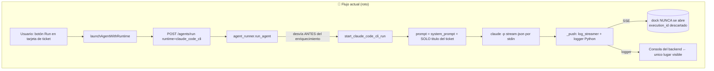
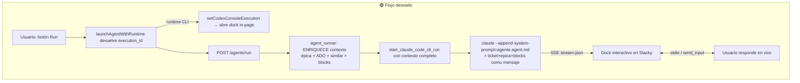

# Plan — Chat interactivo de Claude Code CLI dentro de Stacky Agents

> **Objetivo en una frase:** cuando ejecuto un ticket con el runtime **Claude Code CLI**,
> que el chat con el agente aparezca **dentro de la pantalla de Stacky Agents** (no en una
> consola suelta), que pueda **responderle en vivo**, que **reciba el contexto completo de la
> épica/ticket** y que **adopte el agente de GitHub Copilot Pro configurado** — adaptado a
> como Claude Code CLI espera recibirlo.

- **Autor del diagnóstico:** Claude Code (sesión 2026-05-27)
- **Componente:** `Tools/Stacky/Stacky Agents` (backend Flask + frontend React/Vite)
- **Runtime afectado:** `claude_code_cli` (referencia que funciona: `codex_cli` / `github_copilot`)
- **Estado:** IMPLEMENTADO (2026-05-27) — Fases 0/A/B/C completas. Ver checklist §7 y desvíos §7.1.

---

## 1. Resumen ejecutivo

El backend **ya tiene** casi todo lo necesario: el runner de Claude Code CLI hace streaming por
SSE, acepta respuestas del operador por `stdin` (`send_input`) y el dock interactivo del frontend
(`CodexConsoleDock`) **ya soporta** el label "Claude Code". El problema es que ese cableado está
**incompleto y mal alimentado**. Hay **tres fallas independientes**:

| # | Síntoma que ves | Causa raíz | Severidad |
|---|-----------------|------------|-----------|
| **A** | El chat aparece en la consola del backend, no en la pantalla de Stacky | El botón **Run** de la tarjeta de ticket (y el run funcional del epic) lanzan la ejecución pero **descartan el `execution_id`** y **no abren el dock**. Solo lo abre el modal grande de lanzamiento. | 🔴 Alta |
| **B** | El agente arranca "a ciegas", sin saber de qué va la épica | El dispatcher desvía a Claude **antes** del pipeline de enriquecimiento, y el prompt se arma **solo con el título** del ticket (`ticket_message = ticket.title`), ignorando `context_blocks`, descripción, comentarios ADO y contexto de épica. | 🔴 Alta |
| **C** | No "se comporta" como el agente configurado | El system prompt del `.agent.md` se manda como **mensaje de usuario**, no como **system prompt real** (`--append-system-prompt`). Claude lo lee como información, no adopta la persona. | 🟠 Media |

Ninguna de las tres requiere reescribir el runtime: son **cableado + alimentación de contexto +
forma correcta de pasar el agente**. Bajo riesgo, alto impacto en experiencia.

---

## 2. Cómo funciona hoy vs. cómo debería funcionar





---

## 3. Diagnóstico detallado (con archivos y líneas)

### Problema A — El chat va a la consola y no a la pantalla

**Lo que SÍ funciona ya:**
- `backend/services/claude_code_cli_runner.py` hace `log_streamer.push(...)` (→ SSE) y mantiene
  `stdin` abierto para multi-turno (`send_input`, líneas 202-237).
- `backend/api/executions.py` rutea `POST /executions/<id>/input` y el SSE `.../logs/stream`
  correctamente para `claude_code_cli` (líneas 85-116).
- `frontend/.../CodexConsoleDock.tsx` ya detecta `runtime === "claude_code_cli"`, muestra el
  label "Claude Code" y habilita el textarea para responder (líneas 31-37, 114-150).
- `frontend/.../AgentLaunchModal.tsx` **sí** abre el dock tras lanzar
  (`setCodexConsoleExecution(...)`, línea 247).

**Lo que está roto:**
- En `frontend/src/pages/TicketBoard.tsx`:
  - `handleRunConfirm` (botón **Run** de cada tarjeta, líneas 270-295) hace
    `await launchAgentWithRuntime(...)` pero **descarta el resultado** y nunca llama a
    `setCodexConsoleExecution`. → El dock no abre.
  - `handleRunFunctional` (run funcional del epic, líneas 476-499) tiene el mismo defecto.
- Como `_push` (runner, líneas 896-911) escribe **a la vez** en `log_streamer` **y** en el
  `logger` de Python, cuando el dock no abre, la **única evidencia visible** para vos queda en
  la **consola/terminal del backend**. De ahí el síntoma "se muestra en la consola".

> **Conclusión A:** el problema NO es que el chat "sea de consola"; es que el dock que ya existe
> **no se está abriendo** desde los botones que usás a diario. El `execution_id` se tira a la basura.

**(Verificación pendiente, riesgo conocido):** confirmar que `claude -p --input-format stream-json`
en la versión instalada del CLI emite eventos JSONL al enviar el prompt como user-message por
`stdin`. Si no emitiera, el dock abriría pero quedaría en "Esperando salida...". Ver Fase 0.

### Problema B — No inyecta el contexto de la épica

- `backend/agent_runner.py` desvía a `start_claude_code_cli_run` en las **líneas 179-231**,
  que están **antes** del thread `_run_in_background` donde vive TODO el enriquecimiento:
  - inyección `ado-epic-structured` (líneas 421-444),
  - `artifact_context` (451-483),
  - `similar_tickets` (489-514),
  - `ado_context.enrich` comentarios/adjuntos ADO (519-537),
  - PII masking (540-542).
  → Para `claude_code_cli` **nada de eso corre**.
- El runner recibe `context_blocks` y los guarda en `input_context` (línea 95) pero
  `_build_claude_code_prompt` (líneas 686-751) **los ignora**: arma el prompt solo con
  `selected_agent.system_prompt`, el inventario de agentes y `ticket_message`.
- `ticket_message` se setea en `agent_runner.py:204` como `_ct.title` → **solo el título**.
  Ni descripción, ni épica, ni comentarios, ni el "Mensaje adicional" del modal.

> **Conclusión B:** Claude arranca sabiendo únicamente el título del ticket. Es esperable que
> "no entienda la épica": literalmente no la recibe.

### Problema C — No usa/adopta el agente de GitHub Copilot Pro configurado

- El runner **sí carga** el `.agent.md` correcto (`vscode_agents.get_agent_by_filename`,
  líneas 275-283) e incluye su `system_prompt` en el texto.
- **Pero** ese texto se envía como **mensaje de usuario** (`_user_message_line(prompt)`,
  línea 340), no como **system prompt** real. Claude Code CLI tiene su propio system prompt por
  defecto; el `.agent.md` queda como "información de contexto", no como su **persona/rol**.
- Claude Code CLI soporta `--append-system-prompt "<texto>"` (y `--system-prompt`) y subagentes
  en `.claude/agents/`. Hoy **no se usa ninguno** → el agente no se "convierte" en el agente
  Copilot configurado, solo lee sus instrucciones de pasada.
- Falta además **garantizar** que el `vscode_agent_filename` que llega sea el agente
  **pinneado/configurado** para el tipo (functional/technical/dev) y no un fallback por nombre.

> **Conclusión C:** "adaptar el agente de GitHub Copilot Pro a Claude Code" = inyectar su
> `.agent.md` por el canal de **system prompt** del CLI, no embebido en un turno de usuario.

---

## 4. Plan de implementación por fases

> Cada fase es **entregable e independiente**. Se puede mergear y validar por separado.
> Orden recomendado: **A → B → C** (A da feedback visual inmediato para validar B y C).

### Fase 0 — Verificación del CLI (media hora, sin código de producción)

Antes de tocar nada, confirmar el contrato real del CLI instalado en la máquina del operador.

- [ ] `claude --version` y anotar versión.
- [ ] Probar el modo que usa el runner, en una carpeta de prueba:
  ```powershell
  '{"type":"user","message":{"role":"user","content":[{"type":"text","text":"decime hola y listá los archivos"}]}}' |
    claude -p --input-format stream-json --output-format stream-json --verbose --permission-mode acceptEdits
  ```
- [ ] Verificar que **emite eventos JSONL** (`type: system/assistant/result/tool_use`).
- [ ] Confirmar que existen los flags: `--append-system-prompt`, `--permission-mode`,
      `--input-format stream-json`, `--model`.
- [ ] Documentar hallazgos en este archivo (sección 8). Si el contrato difiere, ajustar Fases B/C.

**Criterio de salida:** sabemos exactamente qué flags y qué forma de stdin funcionan.

---

### Fase A — Abrir el dock interactivo desde TODOS los puntos de lanzamiento

**Meta:** que al lanzar un runtime CLI (Codex o Claude) desde cualquier botón, se abra el dock
in-page automáticamente y la actividad se vea en Stacky, no en la consola.

**Archivos:**
- `frontend/src/pages/TicketBoard.tsx`
- (referencia) `frontend/src/components/AgentLaunchModal.tsx:234-248`

**Tareas:**
- [ ] En `handleRunConfirm` (líneas ~277-283): capturar el retorno de `launchAgentWithRuntime`
      y, si `agentRuntime` es CLI (`codex_cli` | `claude_code_cli`) y hay `execution_id`, llamar
      `setCodexConsoleExecution(execution_id, false)`. Importar el setter del store `useWorkbench`.
- [ ] Mismo cambio en `handleRunFunctional` (líneas ~482-488).
- [ ] Extraer un helper común, p.ej. `openConsoleIfCliRuntime(runtime, result)`, para no repetir
      la lógica en 3 lugares (los 2 de TicketBoard + el modal).
- [ ] (UX) Renombrar el componente y los labels de `CodexConsoleDock` a algo neutral
      (p.ej. **"Consola del agente"** / `AgentConsoleDock`) ya que sirve a Codex **y** Claude.
      Cambio cosmético, opcional pero recomendado para no confundir.
- [ ] (UX) Si el dock ya está abierto con otra ejecución viva, avisar antes de reemplazarla
      (evita matar una sesión interactiva por accidente).

**Criterio de aceptación:**
1. Lanzar un ticket con runtime Claude Code desde el botón Run → el dock aparece abajo,
   muestra eventos en vivo y el textarea permite responder.
2. La consola del backend deja de ser el único lugar donde se ve la actividad.

---

### Fase B — Inyectar el contexto completo (épica + ticket + blocks + ADO)

**Meta:** que Claude reciba lo mismo que recibiría el flujo `github_copilot`: descripción del
ticket, contexto de épica, comentarios/adjuntos ADO, tickets similares y el mensaje del modal.

**Problema de diseño a resolver:** hoy el enriquecimiento vive **inline** dentro de
`agent_runner._run_in_background` (solo para github_copilot). Hay que **extraerlo a un servicio
reutilizable** para que los runtimes CLI lo usen también, sin duplicar lógica.

**Archivos:**
- `backend/agent_runner.py` (líneas 179-231 dispatch; 415-542 enriquecimiento)
- `backend/services/claude_code_cli_runner.py` (`_build_claude_code_prompt`, líneas 686-751)
- **Nuevo:** `backend/services/context_enrichment.py` (extracción del pipeline)

**Tareas:**
- [ ] Crear `services/context_enrichment.py` con una función pura, p.ej.:
      ```python
      def enrich_blocks(*, ticket_id, agent_type, raw_blocks, ticket, project_ctx, log) -> list[dict]
      ```
      Mover ahí: `ado-epic-structured`, `artifact_context`, `similar_tickets`, `ado_context.enrich`.
      Que `_run_in_background` (github_copilot) la **siga usando** (sin cambio de comportamiento).
- [ ] En el dispatch de `claude_code_cli` (agent_runner.py:179-231): **antes** de llamar a
      `start_claude_code_cli_run`, ejecutar `enrich_blocks(...)` y pasar el resultado.
- [ ] Construir un `ticket_message` rico (helper `build_ticket_context_text(ticket, blocks)`):
      incluir `ADO-<id>`, **título + descripción**, work item type, y un render legible de los
      `context_blocks` enriquecidos (épica, comentarios, similares, "Mensaje adicional").
      Reutilizar el patrón de `prompt_builder` si aplica.
- [ ] Cambiar la firma de `start_claude_code_cli_run` para aceptar los `enriched_blocks`
      (o el `ticket_message` ya armado) y que `_build_claude_code_prompt` los **renderice** en la
      sección "## Ticket y contexto" en lugar de solo el título.
- [ ] Aplicar **PII masking** sobre el contexto antes de mandarlo al CLI (paridad con
      github_copilot, agent_runner.py:540-542) y re-hidratar en el output mostrado.
- [ ] Hacer lo mismo para `codex_cli_runner` (tiene el **mismo gap**), para no dejar Codex atrás.

**Criterio de aceptación:**
1. Lanzar el agente `functional` sobre un **Epic** con runtime Claude → en el `prompt.md`
   generado (`data/claude_code_runs/<id>/prompt.md`) aparecen título, descripción y bloque
   `ado-epic-structured`.
2. El "Mensaje adicional" escrito en el modal llega al prompt.
3. Los comentarios ADO del ticket aparecen en el contexto (si el ticket tiene `ado_id`).

---

### Fase C — Que Claude adopte el agente Copilot Pro configurado

**Meta:** que el `.agent.md` se inyecte como **system prompt** del CLI (no como turno de
usuario), de modo que Claude "sea" ese agente; y garantizar que se use el agente correcto.

**Archivos:**
- `backend/services/claude_code_cli_runner.py` (`_build_command` 579-620; `_build_claude_code_prompt`)
- `backend/config.py` (flags `CLAUDE_CODE_CLI_*`)
- (verificación) `frontend` resolución de `vscode_agent_filename` por tipo de agente

**Tareas:**
- [ ] En `_build_command`: agregar `--append-system-prompt <persona>` (o `--system-prompt`,
      según Fase 0) con el `system_prompt` del `.agent.md` seleccionado **+** las reglas duras de
      Stacky (no tocar ADO, generar `comment.html`/`pending-task.json`, etc.).
      > Nota: si el system prompt es muy largo para la línea de comando en Windows, materializarlo
      > como **subagente** en un `.claude/agents/<agente>.md` temporal dentro del workspace y
      > referenciarlo, o pasarlo por archivo. Definir en Fase 0 cuál soporta el CLI instalado.
- [ ] Separar responsabilidades en el prompt:
      - **System prompt** = persona del agente + reglas Stacky (lo que define *cómo* actúa).
      - **Primer mensaje de usuario** = ticket + épica + contexto (lo que define *qué* hacer).
- [ ] Confirmar que `vscode_agent_filename` corresponde al **agente pinneado/configurado** para
      el `agent_type` (functional/technical/dev). Si la resolución actual cae a un fallback por
      nombre de archivo, corregir para respetar el pin del proyecto.
- [ ] Log explícito al inicio del run: `"adoptando agente <name> (<filename>) vía system prompt"`
      para que en el dock se vea qué agente se está usando.

**Criterio de aceptación:**
1. En `data/claude_code_runs/<id>/` se puede inspeccionar que la persona fue al canal de system
   prompt (no embebida en el user message).
2. Lanzar dos tickets con dos agentes distintos (functional vs technical) produce
   comportamientos/outputs alineados a cada `.agent.md`.
3. El dock muestra al inicio qué agente adoptó.

---

## 5. Plan de pruebas

| Caso | Cómo | Resultado esperado |
|------|------|--------------------|
| Dock abre desde botón Run | Lanzar ticket con Claude desde la tarjeta | Dock visible, streaming en vivo |
| Interacción en vivo | Escribir una respuesta en el dock | Claude la recibe (`operator → claude` en el log) y continúa |
| Contexto de épica | `functional` sobre un Epic | `prompt.md` contiene `ado-epic-structured` + descripción |
| Mensaje del modal | Escribir nota y lanzar | La nota aparece en el prompt |
| Adopción de agente | Inspeccionar run dir + comparar 2 agentes | Persona en system prompt; outputs distintos por agente |
| Paridad Codex | Repetir contexto/épica con `codex_cli` | Mismo contexto inyectado |
| Sin regresión github_copilot | Lanzar con runtime Copilot | Comportamiento idéntico al actual |
| CLI no instalado | Quitar `claude` del PATH | Error claro en el dock, sin fallback silencioso |

**Tests automatizados sugeridos** (en `backend/tests/`):
- `test_context_enrichment.py` — la función extraída produce los mismos bloques que hoy.
- `test_claude_code_cli_prompt.py` — `_build_claude_code_prompt` incluye descripción + épica + blocks.
- Frontend: extender `useExecutionStream.test.tsx` / agregar test de que Run abre el dock para CLI.

---

## 6. Riesgos, flags y rollback

- **Todo detrás de comportamiento existente, sin breaking changes para `github_copilot`.**
- **Flags de control (env, ya existen o agregar):**
  - `CLAUDE_CODE_CLI_PERMISSION_MODE` (default `acceptEdits`) — ya existe.
  - `CLAUDE_CODE_CLI_SKIP_PERMISSIONS` — ya existe; mantener `false` por defecto.
  - **Nuevo sugerido:** `CLAUDE_CODE_CLI_SYSTEM_PROMPT_MODE` = `append` | `user_message`
    para poder volver al comportamiento viejo si `--append-system-prompt` diera problemas.
- **Rollback:** cada fase es un commit/PR aislado y reversible. Fase A es puramente frontend;
  Fase B/C son aditivas (el flujo Copilot no cambia).
- **Riesgo principal:** que el contrato real del CLI difiera de lo asumido (de ahí la **Fase 0**
  obligatoria antes de B/C).

---

## 7. Checklist de entrega

- [x] Fase 0 documentada (versión CLI 2.1.143 + flags confirmados) en sección 8.
- [x] Fase A: dock abre desde Run y run funcional (Codex + Claude). Helper
      `openConsoleIfCliRuntime` centralizado en `agentLaunch.ts`; usado en
      `TicketBoard.handleRunConfirm`, `EpicGroup.handleRunFunctional` y `AgentLaunchModal`.
- [x] Fase B: `context_enrichment.py` extraído; prompt rico (`build_ticket_context_text`);
      PII masking; paridad Codex.
- [x] Fase C: persona vía system prompt (`--append-system-prompt-file`); modo configurable
      (`CLAUDE_CODE_CLI_SYSTEM_PROMPT_MODE`); log de adopción; trazabilidad en metadata.
- [x] Tests backend (`test_context_enrichment`, `test_claude_code_cli_prompt`) + frontend
      typecheck en verde; sin regresión en `test_runtime_dispatch`, `test_functional_epic_context_injection`.
- [x] Sin regresión en `github_copilot` (el pipeline inline ahora llama a la función
      extraída con comportamiento idéntico).
- [ ] PR(s) con evidencia (capturas del dock, `prompt.md` + `system_prompt.md` de ejemplo).

### 7.1. Desvíos del plan original (decisiones de implementación)

1. **Enriquecimiento en el thread del runner, no en el dispatch.** El plan (Fase B)
   proponía correr `enrich_blocks` en `agent_runner` *antes* de llamar al runner. Pero
   `run_agent` corre **sincrónico en el thread del request HTTP**; enriquecer ahí
   (con llamadas de red a ADO) **bloquearía la apertura del dock**. Se movió el
   enriquecimiento al `_run_in_background` de cada runner CLI: el `execution_id` y el
   dock se devuelven al instante, y el enriquecimiento + masking corren en background
   (el dock muestra "enriqueciendo contexto…"). Mismo objetivo, mejor UX. El dispatch
   quedó **sin cambios**.
2. **Agente pinneado:** la resolución del agente correcto por tipo ya la hace el
   frontend (`findAgentFilenameByType` prioriza `pinnedAgents`), así que no hubo cambio
   backend; el runner solo loguea qué agente adopta.
3. **UX opcionales no implementadas:** renombrar `CodexConsoleDock`→`AgentConsoleDock`
   (toca muchos archivos + keys del store) y confirmar antes de reemplazar una sesión
   viva (cambiar el dock no mata la sesión backend, solo cambia qué se muestra). Se
   dejaron fuera por costo/riesgo vs. valor.

---

## 8. Bitácora de verificación del CLI (Fase 0 — COMPLETADA 2026-05-27)

Verificado en la máquina del operador (`claude.exe` instalado vía WinGet:
`...\Anthropic.ClaudeCode_..._8wekyb3d8bbwe\claude.exe`).

```
claude --version → 2.1.143 (Claude Code)

Flags OK (todos confirmados en --help y probados):
  --append-system-prompt <prompt>        ✓  persona inline (límite cmdline en Windows)
  --append-system-prompt-file <path>     ✓  persona por archivo  ← ELEGIDO para la persona
  --system-prompt <prompt>               ✓  reemplaza el system prompt por defecto
  --system-prompt-file <path>            ✓
  --permission-mode <mode>               ✓  choices: acceptEdits|auto|bypassPermissions|default|dontAsk|plan
  --input-format stream-json             ✓  lee user-messages JSONL por stdin
  --output-format stream-json            ✓  (requiere --verbose con --print)
  --model <model>                        ✓
  --dangerously-skip-permissions         ✓  (ya usado opcionalmente)

Forma de stdin que emite stream-json (PROBADA, funciona):
  {"type":"user","message":{"role":"user","content":[{"type":"text","text":"..."}]}}
  → emite eventos: system/init, rate_limit_event, assistant (thinking+text), result

Notas:
- PRUEBA DE PERSONA: con --append-system-prompt-file persona.txt (persona = "sos un
  pirata..."), Claude respondió "Arrr, soy Claude Code, tu pirata programador...".
  → CONFIRMADO: la persona vía system-prompt-file SÍ se adopta. Camino de Fase C.
- DECISIÓN Fase C: usar --append-system-prompt-file (no inline) para evitar el límite
  de longitud de línea en Windows con .agent.md largos. El archivo se materializa en el
  run_dir (data/claude_code_runs/<id>/system_prompt.md).
- --output-format stream-json EXIGE --verbose en modo --print (ya está en _build_command).
- El stream incluye un evento "thinking" vacío antes del "text" del assistant; el parser
  actual ya lo ignora (solo extrae items con type=="text").
```
