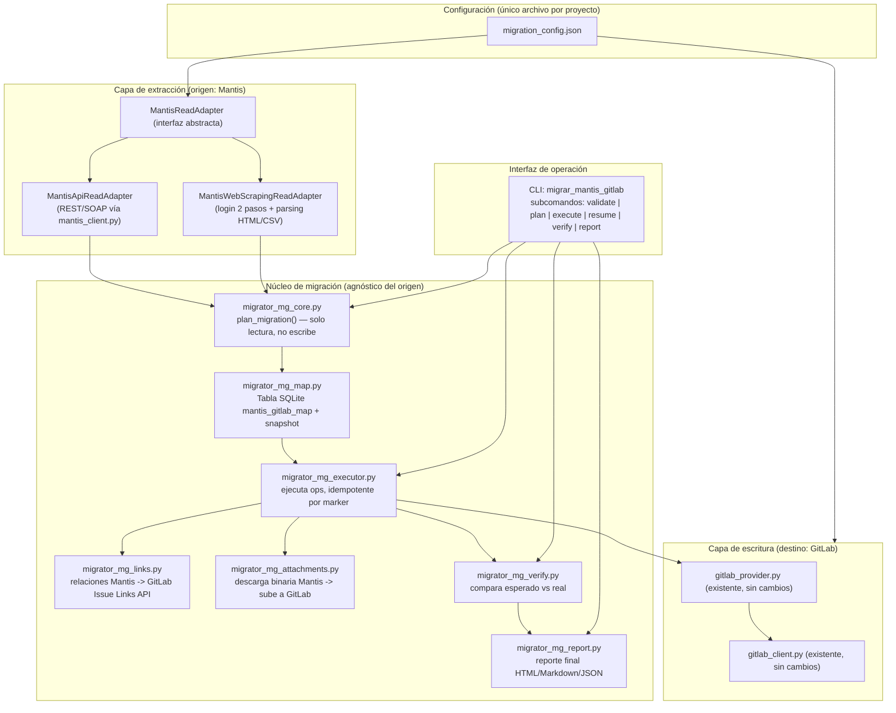
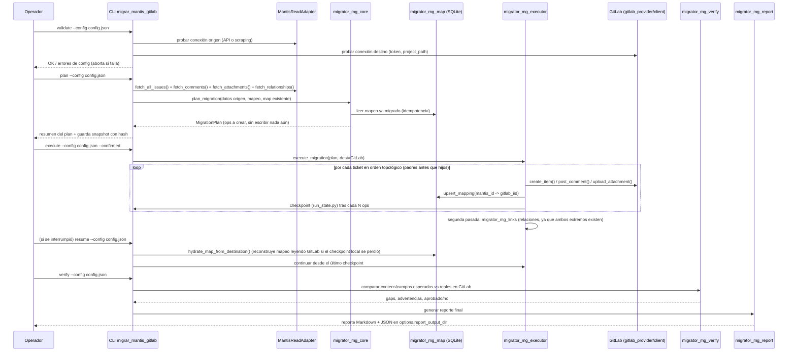

# Plan 217 — Migrador Mantis → GitLab (herramienta reutilizable, multi-proyecto)

**Estado:** v2 — CRITICADO (juez adversarial) — VEREDICTO v1: **RECHAZADO** (1 bloqueante) → v2 corrige y queda **APROBADO-CON-CAMBIOS**, listo para `implementar-plan-stacky`.

### Changelog v1 → v2 (qué se corrigió, por C#)
- **C1 (BLOQUEANTE)** — Premisa central falsa en §2.1: los métodos de escritura (`create_item`/`post_comment`/`upload_attachment`/`link_attachment`/`_link_parent`/`fetch_states`) NO están en `gitlab_client.py`; son métodos de `GitLabTrackerProvider` (`gitlab_provider.py:102,212,250,295,311,323`), cuyo `__init__` (`:33-39`) toma el destino de `config.GITLAB_URL`/`config.GITLAB_PROJECT` (globales de módulo), **no** de parámetros. "Reusar el provider sin cambios como librería apuntando al `destination.base_url` del config.json" es irrealizable tal cual: apuntaría al GitLab equivocado o vacío. **Fix:** §2.1 ahora define `destination_writer.py` (wrapper del tool) que, en el proceso CLI aislado (sin Flask), fija `config.GITLAB_URL/GITLAB_PROJECT/GITLAB_TOKEN` desde el config.json y recién ahí instancia `GitLabTrackerProvider(project=...)` **directo (sin la factory `get_tracker_provider`)** → evita `STACKY_GITLAB_ENABLED` y NO modifica código compartido. + [ADICIÓN ARQUITECTO] gate anti-destino-equivocado (§8.1.8).
- **C2 (IMPORTANTE)** — §9 afirmaba que `gitlab_client._request` "debe extenderse para leer Retry-After": **ya lo hace** (`gitlab_client.py:146` lee `Retry-After` y reintenta en 429). Fix: §9 corregido — NO se toca el cliente compartido; la pausa adicional por `rate_limit_pause_on_429_seconds` vive en el `retry.py` del tool (envuelve, no modifica).
- **C3 (IMPORTANTE)** — DPAPI es **Windows-only** (`secrets_store.py:71` aborta fuera de Windows) pero el plan promete herramienta "reutilizable" y fuerza `token_format:dpapi`. Fix: §4 define backend de secretos **enchufable** (`dpapi` en Windows, `env`/`prompt-no-persistente` como fallback portable) con warning explícito; comportamiento Windows idéntico (backward-compat).
- **C4 (IMPORTANTE)** — Ambigüedad "generaliza `migrator_core.py`": riesgo de tocar el migrador ADO en producción (Plan 74/153). Fix: §2 y §16 aclaran **NO se edita ningún `migrator_*.py`**; se crean `migrator_mg_*.py` nuevos que **importan solo helpers puros** (`_TYPE_ORDER`, patrón `_MARKER_TEMPLATE` de `migrator_core.py:24`, `resolve_epic_strategy` de `migrator_epics.py:24`, `compute_sha256` de `migrator_attachments.py:16`). `hydrate_map_from_destination` vive en `migrator_executor.py:154` (no en `migrator_map.py`) y está acoplado a `db`+`stacky_project`: el tool implementa su propia rehidratación por marker (no reusa la firma ADO).
- **C5 (IMPORTANTE)** — Tests: sin comando exacto por fase y sin registro en el ratchet. Fix: §16 da el comando pytest literal con venv; tests **planos** en `backend/tests/` con prefijo `test_mg_*` (convención del repo, ej. `test_plan74_*`) y **registrados en `HARNESS_TEST_FILES`** (regla dura: `test_harness_ratchet_meta.py` falla si no).
- **C6 (IMPORTANTE)** — F2a (API) antes de F2b (scraping) pese a que el único camino viable HOY es scraping. Fix: reordenado → **F2b (scraping) primero**, F2a (API) después como camino robusto opcional. `fetch_all_issues()`/`download_attachment_binary()` en `mantis_client.py` son **código NUEVO aditivo** (hoy solo existe `fetch_open_issues` :269/:837 y `fetch_attachments` metadata :371), backward-compat, con test propio.
- **C7 (IMPORTANTE)** — Scraping: sesión que expira, re-login, y cookie para descargar adjuntos no contemplados. Fix: §9 + adapter exponen re-login automático y la sesión/cookie a `migrator_mg_attachments`.
- **C8 (IMPORTANTE)** — HITL: incremental §13 invitaba a cron. Fix: §13 prohíbe `--confirmed` desatendido; cron solo `plan`/dry-run + digest, la escritura real siempre pasa por humano.
- **C9 (IMPORTANTE)** — Frases vagas ("pydantic-lite propio", "o mock de gitlab_client", "o carpeta raíz del tool", "etc."): resueltas a decisiones únicas y literales.
- **C10 (MENOR)** — §8.1.5 validaba `user_mapping` contra "todos los usuarios de la instancia" (restringido a admin en GitLab self-managed). Fix: valida contra **miembros del proyecto** (`GET /projects/:id/members/all`), degrada a advertencia.
- **C11 (MENOR)** — Faltaba declarar que la **paridad de 3 runtimes NO aplica** (es CLI operada por humano, no agente bajo runtime IA). Declarado en §2.1.
- **C12 (MENOR)** — Orden IID vs incremental (insertar un ticket viejo en una corrida posterior rompe la cronología aproximada): documentado como limitación en §20.
- **[ADICIÓN ARQUITECTO 1]** — Gate anti-destino-equivocado (§8.1.8): `validate`/`execute` exigen que el destino efectivo del writer haga echo-back del `destination.base_url`+`project_path` del config y que el operador lo confirme, blindando el fallo latente de C1.
- **[ADICIÓN ARQUITECTO 2]** — Datos personales operacionalizados (§15): reporte con `--redact-pii` (default ON) que enmascara emails/nombres completos, y test `test_mg_fixtures_no_pii.py` que **falla** si un fixture contiene patrones de PII real (garantiza la anonimización, no la deja en promesa).

**Estado previo (v1):** PROPUESTO (sin criticar todavía; pasar por `criticar-y-mejorar-plan` antes de implementar)
**Autor:** generado con Claude Code a pedido del operador (Juan Luca Santoliquido), 2026-07-24
**Proyecto destino de referencia:** `https://srvcgit01.imsolutions.local/juanluca.santoliquido/ripley/` (ruta GitLab `juanluca.santoliquido/ripley`)
**Proyecto origen de referencia:** `https://soporte.ais-int.net/mantis` (proyectos Mantis 310 y/o 311, a confirmar cuál es el correcto en F0)

---

## 0. Resumen ejecutivo

Se pide una herramienta de migración **completa y reutilizable** de tickets Mantis → GitLab, configurable 100% por archivo (sin volver a pedir nada que ya se haya provisto), con paridad funcional lo más fiel posible: tickets, comentarios/historial, adjuntos, relaciones, prioridades/severidades/categorías/etiquetas/versiones, mapeo de estados y usuarios, dry-run, reanudación, rollback, migración incremental, reintentos/rate-limit, y reporte final.

**Decisión de arquitectura central de este plan:** en Stacky ya existe un migrador ADO→GitLab completo y probado (Plan 74, módulos `migrator_*.py` + `backend/api/migrator.py`). Este plan **no reinventa esa maquinaria** — la generaliza. El migrador ADO→GitLab está anclado al puerto `TrackerProvider` (`tracker_provider.py`), pero Mantis fue **excluido explícitamente** de ese puerto (Plan 65 §2.bis, y `tracker_provider.py:122-124` lo rechaza en runtime con `TrackerConfigError`). Por lo tanto Mantis necesita un **adaptador de lectura propio**, no un provider formal — sin tocar esa decisión ya tomada.

**Segunda decisión de arquitectura, motivada por evidencia real de esta sesión:** contra la instancia de referencia (`soporte.ais-int.net`) verificamos en vivo que:
- El plugin MantisConnect (SOAP) **no está habilitado** (el WSDL devuelve HTML).
- La sección de Tokens de API **no está disponible** en la cuenta del operador (REST API no accesible por ese camino).
- El **login web en dos pasos** (usuario → contraseña) sí funciona, y ya se construyó y validó un script que lo automatiza.

Como la herramienta debe ser **reutilizable para migrar otros proyectos** (posiblemente contra otras instancias Mantis que sí tengan API habilitada), el plan define una **interfaz de extracción abstracta** (`MantisReadAdapter`) con dos implementaciones intercambiables — API (REST/SOAP, cuando esté disponible) y Web-scraping (siempre disponible, ya validado) — seleccionable por configuración, sin cambiar una línea del resto del pipeline.

---

## 1. Contexto y evidencia reutilizada (qué ya existe, con archivo:línea)

| Pieza | Ubicación | Qué aporta | Reutilización |
|---|---|---|---|
| Cliente Mantis REST/SOAP | `backend/services/mantis_client.py` | `MantisClient`, `MantisSOAPClient`, `_PRIORITY_MAP`, `_RESOLVED_STATUS_IDS`, `_STANDARD_STATUS_IDS` | Base del extractor **API** (F2) |
| Cliente GitLab (bajo nivel) | `backend/services/gitlab_client.py` | `GitLabClient(base_url, project)` (`__init__` toma params explícitos), `_request` con **retry 429/Retry-After ya implementado** (`:146`) | Reuso directo como transporte; **NO se toca** (C2) |
| Provider GitLab (alto nivel) | `backend/services/gitlab_provider.py` | `create_item` (`:250`), `post_comment` (`:295`), `upload_attachment` (`:311`), `link_attachment` (`:323`), `_link_parent` (`:102`, ya usa `POST /issues/:iid/links` en `:124`), `fetch_states` (`:212`). **OJO (C1):** `__init__` (`:33-39`) lee el destino de `config.GITLAB_URL`/`config.GITLAB_PROJECT`, NO de parámetros | Reuso vía wrapper `destination_writer.py` que inyecta config en proceso (§2.1); **sin modificar el provider** |
| Puerto de trackers | `backend/services/tracker_provider.py:56-124` | Protocol `TrackerProvider`, factory que **rechaza** `mantis`/`jira` (líneas 122-124) | Confirma que Mantis necesita adaptador propio, no provider |
| Migrador ADO→GitLab (Plan 74) | `backend/services/migrator_core.py`, `migrator_map.py`, `migrator_executor.py`, `migrator_epics.py`, `migrator_attachments.py`, `migrator_verify.py`, `backend/api/migrator.py` | Patrón completo: plan-sin-escribir → tabla de mapeo SQLite → ejecución idempotente por marker → verificación → HITL gate por `confirmed=true` | **Generalizado** (F3-F9 de este plan), no reescrito desde cero |
| Cifrado de secretos | `backend/services/secrets_store.py` | DPAPI (`CryptProtectData`/`CryptUnprotectData`), migración automática de texto plano a cifrado | Reuso directo para credenciales Mantis **y** para elevar a DPAPI las credenciales GitLab (hoy en texto plano, gap detectado) |
| Perfil de cliente Mantis | `backend/services/client_profile_defaults/mantis.json:52-69` | `tracker_state_machine` (functional/technical/developer) | Insumo de referencia para el mapeo de estados por defecto |
| Inventario de endpoints | `docs/_roadmap/API_ENDPOINTS_MANTIS_GITLAB.md` | Endpoints Mantis/GitLab ya mapeados uno a uno, gaps ya identificados | Base de la tabla de mapeo de campos (§5) |
| Script de login web (esta sesión) | entregado como `Get-UltimoTicketMantis.ps1` | Login Mantis en 2 pasos (`login_page.php` → `login_password_page.php`), navegación autenticada, parsing de `view_all_bug_page.php`/`view.php` | **Portado a Python** como `MantisWebScrapingReadAdapter` (F2b) |

**Modelo de datos:** `Ticket` (`backend/models.py:38-98`) es la tabla **local** de Stacky (usada por el orquestador de agentes) — no es el destino de la migración ni tiene campos de autor/adjuntos/comentarios/relaciones. La migración lee de Mantis y escribe **directo a GitLab**; el `Ticket` local de Stacky no interviene en este flujo (ver §2, la migración es un proceso independiente, no pasa por el ciclo de agentes).

---

## 2. Arquitectura propuesta



### 2.1 Por qué es una herramienta **standalone**, no un endpoint Flask de Stacky

El migrador ADO→GitLab (Plan 74) vive dentro de la app Flask porque ambos extremos ya son "proyecto activo de Stacky" (vía `project_manager`/`ctx.tracker_type`). Este plan es distinto: el pedido explícito es que sea **reutilizable para cualquier proyecto Mantis/GitLab con solo cambiar un archivo de config**, sin depender de qué proyecto esté "activo" en Stacky en ese momento, y ejecutable en modo batch/CLI (potencialmente contra un Mantis que ni siquiera está registrado como proyecto Stacky). Por eso:

- Vive en `backend/tools/migrar_mantis_gitlab/` (nuevo paquete Python, **no** en `backend/api/`).
- Importa y reusa las clases de `services/mantis_client.py`, `services/gitlab_client.py`, `services/gitlab_provider.py` y `services/secrets_store.py` **como librerías**, sin pasar por Flask ni por `project_manager`.
- Se ejecuta por CLI (`python -m tools.migrar_mantis_gitlab <subcomando> --config <archivo>`), con un `.bat`/`.ps1` de conveniencia para Windows, igual que ya se hizo en esta sesión para la consulta de tickets.
- **No modifica** `tracker_provider.py` ni la exclusión de Mantis del puerto formal — respeta la decisión del Plan 65 al 100%.

**Paridad de 3 runtimes: NO aplica (C11).** Esta es una herramienta CLI **operada por un humano**, no un agente que corre bajo Codex/Claude Code/GitHub Copilot. No toca `agent_runner`, `llm_router`, ni ningún runtime de IA. El riel de "paridad de 3 runtimes" es para features del pipeline de agentes; aquí no corresponde. Lo que SÍ aplica es **portabilidad de plataforma** (ver backend de secretos enchufable, §4, C3).

**Cableado exacto de la capa de escritura GitLab (C1 — decisión única, no ambigua):**
El tool NO usa la factory `tracker_provider.get_tracker_provider` (que exige `STACKY_GITLAB_ENABLED`, `tracker_provider.py:111-113`) ni instancia el provider "a secas". Crea `destination_writer.py` con esta secuencia, dentro del proceso CLI aislado (sin app Flask cargada):
1. Lee `destination.base_url`, `destination.project_path` y el token (resuelto por el backend de secretos, §4) del `migration_config.json`.
2. Fija **en el proceso** `config.GITLAB_URL`, `config.GITLAB_PROJECT` y `config.GITLAB_TOKEN` con esos valores (el `__init__` del provider, `gitlab_provider.py:33-39`, y `GitLabClient` los leen de ahí). Como el proceso CLI no tiene Flask ni estado compartido vivo, mutar el módulo `config` es local y seguro.
3. Instancia `GitLabTrackerProvider(project=destination.project_path)` **directo** (no vía factory) → así **no** requiere `STACKY_GITLAB_ENABLED` y **no** modifica una sola línea de `gitlab_provider.py`/`gitlab_client.py`/`tracker_provider.py`.
4. Antes de cualquier escritura corre el **gate anti-destino-equivocado** (§8.1.8): hace echo-back del `base_url`+`project_path` que el writer resolvió y aborta si no coincide con el config o si el operador no lo confirma en `execute`.

Regla dura de este cableado: `destination_writer.py` es el **único** punto que conoce el provider GitLab; el resto del núcleo (`migrator_mg_*`) habla contra una interfaz `DestinationWriter` mínima (`create_item/post_comment/upload_attachment/link_attachment/create_issue_link/fetch_states`), igual que el origen habla contra `MantisReadAdapter`. Esto permite el `DryRunGitLabWriter` (§10) como implementación alternativa sin tocar el resto.

---

## 3. Estructura del proyecto

```
backend/tools/migrar_mantis_gitlab/
├── __init__.py
├── __main__.py                    # entrypoint CLI (argparse: validate|plan|execute|resume|verify|report)
├── config_schema.py                # dataclasses (stdlib) + validación manual explícita del JSON (C9: sin "pydantic-lite"; solo dataclasses + funciones validate_*; el repo NO depende de pydantic)
├── config_loader.py                 # carga config.json, resuelve secretos vía secret_backend.py
├── secret_backend.py                # C3: backend de secretos enchufable (dpapi | env | prompt); envuelve secrets_store.py en Windows
├── destination_writer.py            # C1: único punto que instancia GitLabTrackerProvider (ver §2.1); expone interfaz DestinationWriter + DryRunGitLabWriter
├── adapters/
│   ├── __init__.py
│   ├── base.py                     # clase abstracta MantisReadAdapter (interfaz mínima, ver §2)
│   ├── api_adapter.py               # MantisApiReadAdapter (envuelve MantisClient/MantisSOAPClient)
│   └── scraping_adapter.py          # MantisWebScrapingReadAdapter (login 2 pasos + parsing)
├── mapping/
│   ├── __init__.py
│   ├── status_map.py                # Mantis status -> GitLab state + label
│   ├── priority_severity_map.py     # reusa _PRIORITY_MAP de mantis_client.py + severity
│   ├── category_map.py              # categoría -> label `category::X`
│   ├── version_map.py               # target_version -> milestone; fixed/affects -> label
│   ├── tag_map.py                   # tags Mantis -> labels GitLab
│   ├── user_map.py                  # username Mantis -> user/asignación GitLab (o metadata)
│   └── custom_field_map.py          # campos custom -> bloque de metadata en descripción
├── migrator_mg_core.py              # generaliza migrator_core.py: plan_migration(origin_adapter, dest, ...)
├── migrator_mg_map.py                # generaliza migrator_map.py: tabla mantis_gitlab_map (SQLite propio, portable)
├── migrator_mg_executor.py           # generaliza migrator_executor.py: ejecuta ops, idempotencia por marker
├── migrator_mg_links.py              # NUEVO: relaciones Mantis (parent/child/related/duplicate) -> GitLab Issue Links API
├── migrator_mg_attachments.py        # adapta migrator_attachments.py: descarga binaria Mantis -> sube GitLab
├── migrator_mg_verify.py             # generaliza migrator_verify.py: valida conteos y campos clave
├── migrator_mg_report.py             # NUEVO: genera reporte final (Markdown + JSON) con diffs y pendientes
├── retry.py                          # backoff exponencial + rate-limit awareness (Retry-After, 429/403)
├── logging_setup.py                  # logging estructurado a archivo + consola, niveles por sección
└── run_state.py                      # persistencia del estado de la corrida para reanudación (checkpoint)

# C5: tests PLANOS en backend/tests/ con prefijo test_mg_ (convención del repo, ej. test_plan74_*).
# CADA UNO debe registrarse en HARNESS_TEST_FILES o test_harness_ratchet_meta.py falla (regla dura).
backend/tests/
├── test_mg_config_schema.py
├── test_mg_secret_backend.py          # C3: dpapi en Windows, fallback env/prompt (skip DPAPI si no-Windows)
├── test_mg_destination_writer.py      # C1: writer apunta a destination.base_url del config, NO a config global; gate echo-back
├── test_mg_adapters_scraping.py       # F2b (primero): fixtures HTML reales anonimizados
├── test_mg_adapters_api.py            # F2a: mocks HTTP de mantis_client
├── test_mg_mantis_client_ext.py       # fetch_all_issues/download_attachment_binary NUEVOS (aditivos, backward-compat)
├── test_mg_mapping_status.py
├── test_mg_mapping_priority_severity.py
├── test_mg_mapping_users.py
├── test_mg_core.py                    # plan_migration no debe escribir nada (dry-run real)
├── test_mg_executor.py                # idempotencia: re-ejecutar no duplica + resume tras corte
├── test_mg_links.py
├── test_mg_attachments.py
├── test_mg_verify.py
├── test_mg_retry.py                   # C5: 429/5xx/Retry-After/circuit breaker con mocks
├── test_mg_report.py
├── test_mg_fixtures_no_pii.py         # [ADICIÓN ARQUITECTO 2]: falla si un fixture contiene PII real
└── fixtures/mg/
    ├── mantis_issue_sample.json
    ├── mantis_view_all_bug_page_sample.html
    └── gitlab_issue_response_sample.json

deployment/
├── migrar_mantis_gitlab.ps1          # wrapper Windows (equivalente al Get-UltimoTicketMantis ya construido)
├── migrar_mantis_gitlab.bat
└── migration_config.example.json     # plantilla comentada del archivo de config (§4)
```

---

## 4. Archivo de configuración (único punto de variabilidad)

Un solo JSON por proyecto a migrar. Todo lo que cambia entre proyectos vive acá — el código no cambia nunca.

```jsonc
{
  "$schema_version": "1.0",

  "origin": {
    "type": "mantis",
    "base_url": "https://soporte.ais-int.net/mantis",
    "project_ids": [310],                       // puede ser [310, 311] si hay que unificar sub-proyectos
    "extraction_mode": "auto",                   // "api" | "scraping" | "auto" (auto: intenta API, cae a scraping)
    "auth": {
      // Resuelto por secrets_store.py (DPAPI). Si no existe, se pide interactivo la 1ra vez y se persiste cifrado.
      "auth_file": "auth/mantis_auth.json",
      "protocol": "rest"                         // "rest" | "soap" — usado solo si extraction_mode=api
    },
    "include_resolved_closed": true,              // migrar TODO, no solo issues abiertos (mantis_client filtra por defecto)
    "csv_export_fallback": true                   // si scraping: intentar csv_export.php antes que HTML paginado
  },

  "destination": {
    "type": "gitlab",
    "base_url": "https://srvcgit01.imsolutions.local",
    "project_path": "juanluca.santoliquido/ripley",
    "auth": {
      "auth_file": "auth/gitlab_auth.json",
      "secret_backend": "auto"                    // C3: "auto" | "dpapi" | "env" | "prompt". auto = dpapi en Windows, env/prompt fuera. NO "fuerza" DPAPI (rompía portabilidad)
    },
    "preserve_authorship_mode": "metadata_only",   // "sudo" (requiere PAT admin con scope sudo) | "metadata_only"
    "epics_strategy": "auto"                       // reusa migrator_epics.resolve_epic_strategy: auto|premium_native|free_degrade
  },

  "user_mapping": {
    "default_fallback": "unassigned",              // "unassigned" | "assign_to:<gitlab_username>" | "fail"
    "map": {
      "jsantoliquido": "juanluca.santoliquido",
      "mgomez": "maria.gomez",
      "_comment": "clave = username Mantis, valor = username GitLab. No mapeados -> default_fallback"
    }
  },

  "field_mapping": {
    "status": {
      "new": { "gitlab_state": "opened", "label": "status::new" },
      "feedback": { "gitlab_state": "opened", "label": "status::feedback" },
      "acknowledged": { "gitlab_state": "opened", "label": "status::acknowledged" },
      "confirmed": { "gitlab_state": "opened", "label": "status::confirmed" },
      "assigned": { "gitlab_state": "opened", "label": "status::assigned" },
      "resolved": { "gitlab_state": "closed", "label": "status::resolved" },
      "closed": { "gitlab_state": "closed", "label": "status::closed" },
      "_unmapped_fallback": { "gitlab_state": "opened", "label": "status::sin_mapear" }
    },
    "priority": {
      "_reuse": "mantis_client._PRIORITY_MAP",
      "label_prefix": "priority::",
      "scale": { "1": "P1-critica", "2": "P2-alta", "3": "P3-normal", "4": "P4-baja", "5": "P5-trivial" }
    },
    "severity": { "label_prefix": "severity::" },
    "category": { "label_prefix": "category::" },
    "tags": { "label_prefix": "tag::" },
    "version": {
      "target_version_as": "milestone",
      "fixed_in_version_as": "label:fixed_in::",
      "affects_version_as": "label:affects::"
    },
    "relationships": {
      "parent_child": "gitlab_epic_issue_link",
      "related_to": "relates_to",
      "duplicate_of": "relates_to",
      "has_duplicate": "relates_to",
      "depends_on": "blocks",
      "blocks": "blocks"
    },
    "custom_fields": { "mode": "metadata_block" }
  },

  "options": {
    "dry_run": true,
    "batch_size": 25,
    "max_retries": 5,
    "retry_backoff_seconds": [2, 5, 15, 30, 60],
    "rate_limit_pause_on_429_seconds": 60,
    "attachments": { "max_size_mb": 50, "skip_if_over_limit": true, "download_temp_dir": null },
    "incremental": { "enabled": true, "since_field": "last_updated", "checkpoint_file": "run_state/ripley_checkpoint.json" },
    "verify_after_execute": true,
    "report_formats": ["markdown", "json"],
    "report_output_dir": "reports/"
  },

  "logging": {
    "level": "INFO",
    "file": "logs/migrar_mantis_gitlab_{run_id}.log",
    "redact_secrets": true
  }
}
```

**Reglas duras del archivo de config:**
- Ningún secreto en texto plano dentro del JSON de config — solo *rutas* a `auth_file`, cuyo contenido resuelve `secret_backend.py`.
- **Backend de secretos enchufable (C3 — portabilidad):** `secrets_store.py` cifra con DPAPI pero **aborta fuera de Windows** (`secrets_store.py:71`). Como la herramienta se promete "reutilizable", `secret_backend.py` abstrae:
  - `dpapi` → envuelve `secrets_store.encrypt_secret/decrypt_secret` (comportamiento Windows **idéntico** al de hoy, backward-compat).
  - `env` → lee el secreto de una variable de entorno nombrada (ej. `MG_GITLAB_TOKEN`), sin persistir a disco (Linux/Mac/CI).
  - `prompt` → pide interactivo y mantiene en memoria solo durante la corrida, sin persistir.
  - `auto` → `dpapi` si `sys.platform=='win32'`, si no `env` (y si falta la env, `prompt`). Al elegir un backend no-DPAPI, **loguea un warning explícito** de que el secreto no queda cifrado en reposo por DPAPI.
- Si `auth_file` no existe y el backend es `dpapi`, el CLI **pide interactivamente** usuario/token una única vez y los persiste cifrados — nunca los vuelve a pedir (mismo patrón del script PS de esta sesión).
- `field_mapping._unmapped_fallback` es **obligatorio**: ningún valor de Mantis sin mapeo explícito puede causar un abort silencioso; siempre cae a un estado/label conocido y queda registrado como advertencia.

---

## 5. Estrategia de mapeo (fidelidad Mantis → GitLab)

| Campo Mantis | Destino GitLab | Mecanismo | Config relevante |
|---|---|---|---|
| `id` | — (no existe en GitLab) | Se preserva en marker oculto `<!-- stacky-migrated:mantis:{project_id}:{issue_id} -->` al final de la descripción (mismo patrón que `migrator_core.py:24` para ADO) | — |
| `summary` | `title` | 1:1 | — |
| `description` + `steps_to_reproduce` + `additional_information` | `description` | Concatenados con encabezados Markdown (`## Descripción`, `## Pasos para reproducir`, `## Información adicional`) | — |
| `reporter.name` | Autor real si `preserve_authorship_mode=sudo` (PAT admin, header `Sudo`); si no, texto en bloque de metadata | `destination.preserve_authorship_mode` | §6 |
| `handler.name` (asignado) | `assignee` GitLab si mapeado en `user_mapping.map`; si no, `default_fallback` | `user_mapping` | |
| `status` | `state` (opened/closed) + label `status::X` | `field_mapping.status` | |
| `priority` | Label `priority::PX` (reusa `_PRIORITY_MAP` de `mantis_client.py`) | `field_mapping.priority` | |
| `severity` | Label `severity::X` | `field_mapping.severity` | |
| `category` | Label `category::X` | `field_mapping.category` | |
| `tags[]` | Labels `tag::X` (uno por tag) | `field_mapping.tags` | |
| `target_version` | Milestone GitLab (se crea si no existe) | `field_mapping.version.target_version_as` | |
| `fixed_in_version` / `version` (afectada) | Labels `fixed_in::X` / `affects::X` | `field_mapping.version` | |
| `date_submitted` | No hay campo nativo de "fecha de creación" seteable vía API GitLab → se preserva en bloque de metadata + se usa como criterio de orden en la migración (issues más viejos primero) | — | |
| `last_updated` | Igual que arriba, en metadata | — | |
| `relationships[]` (parent/child, related, duplicate, depends) | GitLab Issue Links API (`POST /issues/:iid/links`) tras migrar ambos extremos (segunda pasada, `migrator_mg_links.py`) | `field_mapping.relationships` | |
| `notes[]` (bugnotes/comentarios) | Notas GitLab (`post_comment`), con encabezado `**{reporter} — {fecha}:**` prefijado en el cuerpo (mismo gap de autoría que el issue) | — | |
| `attachments[]` | Adjuntos GitLab (descarga binaria de Mantis → `upload_attachment` → `link_attachment`, patrón de `migrator_attachments.py`) | `options.attachments` | |
| `custom_fields[]` | Tabla Markdown en bloque de metadata al final de la descripción (`## Campos personalizados (Mantis)`) | `field_mapping.custom_fields.mode` | |
| `history` (bugnote de cambios de estado/campo) | **Ver limitación explícita en §6** — se preserva lo que las notas del propio Mantis ya narran; el log de auditoría completo no siempre está expuesto por la API/scraping | — | |

---

## 6. Qué NO es representable nativamente en GitLab, y cómo se conserva

Esta tabla es un entregable obligatorio del plan (pedido explícito del operador):

| Información Mantis | Por qué no es nativa en GitLab | Mecanismo de conservación elegido |
|---|---|---|
| Autoría real de issues/comentarios (creado/comentado por otro usuario) | La API de GitLab siempre asigna el `author` al dueño del token, salvo `sudo` (solo PAT admin) | Modo `sudo` si hay PAT admin disponible (fiel al 100%); si no, `metadata_only`: bloque `> Autor original (Mantis): {nombre} — {fecha}` al inicio de la descripción/nota |
| Fecha de creación real (`date_submitted`) | GitLab no permite setear `created_at` vía API pública estándar (existe `created_at` en la API pero requiere permisos de administrador de instancia; no garantizado en todas las instancias) | Se intenta setear si el token lo permite; si falla, se conserva en el bloque de metadata y se usa para ordenar la migración (issues viejos primero, para que el ID de GitLab siga aproximadamente el orden cronológico real) |
| Múltiples estados granulares (Mantis tiene 7+ estados; GitLab solo opened/closed) | GitLab no tiene máquina de estados nativa | Label `status::X` (mismo patrón ya usado en Stacky para ADO/otros trackers, ver Plan 216 "centralización de config de estados") |
| Severidad como campo propio (separado de prioridad) | GitLab no tiene campo "severity" nativo (solo Premium tiene "severity" en incident/issue, y es otro concepto) | Label `severity::X` |
| Categoría de proyecto (Mantis) | No hay equivalente 1:1 en GitLab (los "tipos de issue" de GitLab son otra cosa) | Label `category::X` |
| Versión afectada / versión de corrección (`version`, `fixed_in_version`) distintas del hito objetivo | GitLab Milestones son un único campo de "hito", no dos versiones (afectada/corregida) por separado | `target_version` → Milestone; `version`/`fixed_in_version` → labels `affects::X` / `fixed_in::X` |
| Relaciones tipadas (duplicate of, related to, parent of, child of, depends on) | GitLab Issue Links API soporta tipos limitados (`relates_to`, `blocks`, `is_blocked_by`) — no tiene "duplicate of" nativo salvo GitLab Premium ("marcado como duplicado") | Se mapea a `relates_to` + se anota el tipo original de Mantis en el cuerpo del link (comentario automático: "Relación original en Mantis: duplicate of") |
| Campos personalizados (`custom_fields`) definidos por instalación | GitLab no tiene campos custom por proyecto para issues estándar (salvo Premium con "custom fields" de reciente introducción, no garantizado en toda instancia) | Tabla Markdown en bloque `## Campos personalizados (Mantis)` al final de la descripción |
| Historial de auditoría completo (quién cambió qué campo y cuándo, tabla `bug_history` de Mantis) | Ni REST ni SOAP estándar de Mantis exponen ese historial sin plugin adicional; GitLab tampoco tiene forma de "inyectar" un historial de auditoría ajeno | Se preserva lo que ya narran las notas/bugnotes existentes (muchas instalaciones de Mantis auto-generan una nota de texto en cada cambio de estado); si la instancia no expone historial estructurado, el reporte final (§14) lo declara explícitamente como **NO MIGRADO — limitación de origen**, no se inventa información |
| Adjuntos que excedan `options.attachments.max_size_mb` | Límite operativo de tamaño de subida por API/tiempo de ejecución | Se registran como advertencia en el reporte con el link directo al adjunto original en Mantis (para descarga manual post-migración) |

**Principio rector:** ninguna de estas conservaciones es "mejor esfuerzo silencioso" — todo lo que se degrada, aproxima o no se puede migrar queda **explícitamente registrado** en el log y en el reporte final (§14), nunca se pierde información sin dejar rastro de que se perdió.

---

## 7. Flujo de migración end-to-end



**Orden topológico de migración** (reusa `_TYPE_ORDER` de `migrator_core.py`, adaptado a Mantis): primero issues sin padre (o con jerarquía Epic-like si la categoría lo amerita), luego hijos — así `_link_parent`/Issue Links pueden resolver el `gitlab_iid` del padre porque ya fue creado.

---

## 8. Validaciones

### 8.1 Pre-migración (`validate`, y automático al inicio de `plan`)
1. Conectividad y autenticación contra origen (Mantis) — vía el adapter seleccionado.
2. Conectividad y autenticación contra destino (GitLab) — `GET /user` con el token.
3. El `project_path` de destino existe y el token tiene permiso de escritura (Developer+).
4. `field_mapping.status/priority/severity/category` cubren **todos** los valores realmente presentes en los tickets a migrar (se hace un barrido previo de valores distintos encontrados vs. mapeados; los faltantes se listan y usan `_unmapped_fallback`, pero se avisa antes de ejecutar).
5. `user_mapping.map` se valida contra **los miembros del proyecto destino** (`GET /projects/:id/members/all`), **no** contra "todos los usuarios de la instancia" (C10: en GitLab self-managed listar todos los usuarios suele requerir admin de instancia; `srvcgit01.imsolutions.local` es self-managed). Usuarios mapeados que no son miembros → advertencia, no aborta, cae a `default_fallback`.
6. Si `options.incremental.enabled`, se valida que el `checkpoint_file` sea legible y consistente (o se crea vacío si es la primera corrida).
7. Se verifica que no exista ya una migración completa para este `project_path` con el mismo `origin.project_ids` (evita re-migrar todo un proyecto por error — requiere `--force` explícito).
8. **[ADICIÓN ARQUITECTO 1] Gate anti-destino-equivocado (blinda C1):** `destination_writer` expone `effective_target()` que devuelve el `base_url`+`project_path` que el provider REALMENTE resolvió (de `config.GITLAB_URL`/`GITLAB_PROJECT` ya inyectados). `validate` **aborta** si ese target no coincide exactamente con `destination.base_url`+`destination.project_path` del config.json (detecta el fallo silencioso de que el provider haya leído un `config` global viejo/vacío). Además, `execute --confirmed` imprime el target efectivo y exige que el operador lo re-confirme escribiendo el `project_path` (defensa contra migrar al repo equivocado).

### 8.2 Post-migración (`verify`)
1. Conteo de issues migrados == conteo de issues leídos de Mantis (menos los explícitamente excluidos por config, todos declarados).
2. Cada issue migrado tiene su marker `<!-- stacky-migrated:mantis:... -->` único (sin duplicados).
3. Conteo de comentarios/adjuntos/relaciones migrados vs. esperados, con gap explícito si difieren.
4. Muestreo aleatorio (configurable, default 10% o mín. 20 tickets) de comparación campo a campo título/estado/prioridad para detectar corrupción silenciosa de mapeo.
5. Reporta cualquier adjunto saltado por tamaño, cualquier usuario caído a `default_fallback`, cualquier valor de status/priority/category que haya usado `_unmapped_fallback`.

---

## 9. Manejo de errores, reintentos y límites de API

- **Reintentos con backoff exponencial** (`retry.py`, en el tool), parametrizado por `options.max_retries` y `options.retry_backoff_seconds`. Aplica a: timeouts de red, `5xx` de Mantis o GitLab, `429 Too Many Requests`.
- **Rate limit GitLab (C2 — corregido):** `gitlab_client._request` **YA** lee `Retry-After` y reintenta en 429 (`gitlab_client.py:146`). **NO se toca el cliente compartido.** La pausa adicional configurable `options.rate_limit_pause_on_429_seconds` (más conservadora que el `Retry-After` del server, para corridas largas) se aplica en la capa `retry.py` del tool que **envuelve** las llamadas del writer — envolver, no modificar.
- **Scraping — expiración de sesión y re-login (C7):** el `MantisWebScrapingReadAdapter` detecta la caída de sesión (redirección a `login_page.php` o 302 a login en mitad de una corrida larga) y ejecuta **re-login automático** de 2 pasos reusando las credenciales ya resueltas, reintentando la request fallida. La sesión/cookie autenticada se expone al `migrator_mg_attachments` para poder descargar los binarios de adjuntos (requieren cookie de sesión, no hay endpoint anónimo).
- **Errores no recuperables** (401/403 de auth, 404 de proyecto inexistente): abortan la corrida completa inmediatamente con mensaje claro — no tiene sentido reintentar.
- **Errores por-ticket** (ej. un adjunto corrupto, un campo con encoding inválido): **no abortan la corrida completa** — se registra el error, se marca ese ticket como `PARTIAL` en `migrator_mg_map`, se continúa con el resto, y queda listado en el reporte final para revisión manual.
- **Circuit breaker simple:** si más de N ops consecutivas fallan (configurable, default 10), la corrida se pausa y pide confirmación al operador antes de seguir (evita quemar rate-limit completo en un loop de fallos).

---

## 10. Modo dry-run

`options.dry_run: true` (default) o flag `--dry-run` en el CLI:
- `plan` **siempre** es dry-run por diseño (nunca escribe — mismo contrato que `migrator_core.plan_migration` existente).
- `execute --dry-run` corre exactamente el mismo camino de código que `execute` real, pero todas las llamadas de escritura a GitLab (`create_item`, `post_comment`, `upload_attachment`, links) se interceptan en una capa `DryRunGitLabWriter` que loguea "habría creado X" y devuelve IDs simulados, permitiendo detectar errores de mapeo/transformación sin tocar el proyecto real.
- El reporte de un dry-run se marca explícitamente como `[SIMULACRO]` en el encabezado para que nunca se confunda con un resultado real.

---

## 11. Reanudación e idempotencia

- **Tabla de mapeo persistente** `mantis_gitlab_map` (SQLite local, generalización de `migrator_map.py`): PK `(project_path, mantis_project_id, mantis_issue_id)` → `gitlab_iid`, `status` (`pending|done|partial|failed`), `last_attempt_at`.
- **Marker en GitLab como fuente de verdad secundaria:** si el archivo SQLite local se pierde o la corrida continúa en otra máquina, `hydrate_map_from_destination()` (igual patrón que el migrador ADO) relee todos los issues de destino, busca el marker `<!-- stacky-migrated:mantis:{project_id}:{issue_id} -->` y reconstruye el mapeo completo antes de continuar.
- **Checkpoint de corrida** (`run_state.py`): cada N operaciones (configurable) se persiste el último `mantis_issue_id` procesado exitosamente; `resume` retoma desde ahí sin re-leer todo desde cero.
- **Prevención de duplicados:** antes de crear cualquier issue/comentario/adjunto, se verifica el marker/mapeo existente — si ya está `done`, se **saltea** (no se crea dos veces), aunque se vuelva a correr `execute` sobre el mismo config.

---

## 12. Rollback / recuperación ante errores

GitLab no ofrece "transacciones" — el rollback es **lógico**, no atómico:
1. **Antes de ejecutar:** el `plan` generado se guarda como snapshot con hash (mismo patrón que `api/migrator.py` líneas 191-198) — si el operador detecta un problema en el plan, simplemente no ejecuta, sin efecto alguno (dry-run real).
2. **Durante la ejecución:** cada op exitosa queda registrada en `mantis_gitlab_map` con el `gitlab_iid` creado — esto habilita un modo `rollback --run-id <id>` que **cierra** (no borra, GitLab no expone delete masivo seguro vía API estándar sin permisos de owner) todos los issues creados en esa corrida y les agrega el label `migracion::revertida` + un comentario explicando el motivo. El borrado físico queda como acción manual del operador vía UI/API con permisos de owner, documentada pero no automatizada (evita borrados irreversibles accidentales — alineado con el principio de "nunca automatizar lo destructivo sin confirmación explícita").
3. **Ante fallo parcial:** no hace falta rollback — el diseño de reanudación (§11) permite simplemente corregir el problema (mapeo, credenciales, config) y volver a correr `resume`; los tickets ya migrados se saltean, los `partial`/`failed` se reintentan.

---

## 13. Migración incremental (corridas futuras)

Para reflejar tickets nuevos/actualizados en Mantis **después** de la migración inicial completa:
- `options.incremental.enabled: true` + `since_field: "last_updated"`.
- El extractor (API o scraping) filtra solo issues con `last_updated > checkpoint` guardado en `run_state/<proyecto>_checkpoint.json`.
- Issues ya migrados (presentes en `mantis_gitlab_map` con status `done`) que tuvieron cambios posteriores (nuevo comentario, cambio de estado) se **actualizan** en GitLab (nuevo comentario + label de estado actualizado) en vez de crear un issue duplicado.
- **Human-in-the-loop innegociable en corridas programadas (C8):** un scheduler/cron **NUNCA** debe invocar `execute --confirmed` desatendido — eso sería autonomía que escribe masivamente en un GitLab real sin revisión, y roza la excepción dura de Stacky. Lo único apto para programar sin humano es `plan` (dry-run puro, no escribe) que produce un **digest** ("hay N tickets nuevos/actualizados en Mantis para migrar"); la escritura real (`execute --confirmed`) siempre la dispara el operador tras revisar ese digest. El CLI se deja listo para ser invocado por cualquier scheduler externo **solo en modo `plan`/dry-run**; implementar el cron en sí queda fuera de alcance de este plan.

---

## 14. Reporte final

`migrator_mg_report.py` genera, al terminar `execute` o `verify`:
- **Markdown** (`reports/<proyecto>_<run_id>.md`): resumen ejecutivo (N issues migrados, N comentarios, N adjuntos, N relaciones, N advertencias, N errores), tabla de tickets con `_unmapped_fallback` usado, tabla de usuarios caídos a `default_fallback`, tabla de adjuntos saltados por tamaño, tabla de información NO migrada por limitación de origen (§6), y el detalle campo-a-campo de cualquier diferencia detectada en `verify`.
- **JSON** (`reports/<proyecto>_<run_id>.json`): mismo contenido machine-readable, para integrarlo en otro pipeline si hace falta.
- Ambos formatos declarados en `options.report_formats`.

---

## 15. Riesgos al tratar datos personales (cumplimiento de instrucción organizacional)

Esta herramienta mueve **datos personales reales** entre dos sistemas (nombres de usuario, correos si están disponibles, autoría de comentarios, y contenido textual que puede incluir información personal de terceros mencionada en descripciones/adjuntos). Riesgos identificados y mitigación obligatoria en la implementación:

1. **Credenciales de acceso:** usuario/contraseña de Mantis y token de GitLab son datos sensibles. Mitigación: cifrado DPAPI obligatorio (§4), nunca se registran en logs (`logging.redact_secrets: true`), nunca se imprimen en pantalla ni se incluyen en el reporte final.
2. **Identidad de usuarios (reporter/handler/comentaristas):** se transfieren nombres de usuario Mantis y, potencialmente, se exponen en texto plano en los bloques de metadata de GitLab (§6) para preservar autoría. Esto constituye tratamiento de datos personales de terceros (empleados/usuarios que reportaron o comentaron tickets, no solo del operador). Antes de ejecutar una migración real, el operador debe:
   - Confirmar que existe base legal/autorización interna para mover estos datos de un sistema a otro (p. ej. ambos sistemas son internos de la misma organización y ya están bajo la misma política de tratamiento de datos del personal).
   - Minimizar lo transferido: si no es necesario preservar el nombre completo del autor original, considerar seudonimizar (usar solo usuario, no nombre completo/correo) — configurable en una futura extensión de `user_mapping`.
3. **Contenido de adjuntos:** los adjuntos migrados pueden contener información personal de clientes/usuarios finales (capturas de pantalla, logs con datos reales). La herramienta los transporta tal cual — no aplica ningún enmascaramiento de contenido (fuera de alcance de este plan; si se requiere, ver el mecanismo de *masking* ya existente en Stacky para DB Compare, planes 178-183, como precedente reutilizable en un plan futuro).
4. **Registro y trazabilidad:** todo acceso (login Mantis, lectura de issues, escritura en GitLab) debe quedar en el log de la corrida (`logging.file`) con timestamp y usuario operador, para auditoría — sin registrar contraseñas/tokens.
5. **Retención:** los archivos temporales de adjuntos descargados (`options.attachments.download_temp_dir`) deben eliminarse inmediatamente después de subirse a GitLab (ya es el patrón de `migrator_attachments.download_attachment_to_temp` — "siempre limpia el temp file"), para no dejar copias de datos personales dispersas en disco.

**[ADICIÓN ARQUITECTO 2] — Operacionalización (no dejar §15 en prosa):**
- **`--redact-pii` en el reporte final (§14), default ON:** el reporte que queda en disco (`reports/`) enmascara emails (`a***@dominio`) y colapsa nombres completos a solo el username Mantis en las tablas de "usuarios caídos a fallback" y "autoría preservada". El operador puede desactivarlo (`--no-redact-pii`) si necesita el detalle, pero el default protege el artefacto que más fácilmente se comparte/adjunta. (La migración a GitLab en sí NO se enmascara — eso es fidelidad de datos requerida; el redact aplica al **reporte**, que es un subproducto.)
- **Garantía de anonimización de fixtures (test que falla):** `test_mg_fixtures_no_pii.py` escanea `backend/tests/fixtures/mg/*` y **falla** si detecta patrones de PII real (regex de email corporativo `@ais-int` / `@imsolutions` / `@ripley`, y una allowlist de nombres-placeholder permitidos). Convierte "fixtures reales anonimizadas" de promesa a invariante verificable en CI, y evita commitear datos personales reales al repo.

**Recomendación:** antes de ejecutar la primera migración real (no dry-run) contra datos de producción, el operador debe validar con quien corresponda en la organización (responsable de datos/compliance) que el traslado de esta información entre Mantis y GitLab está cubierto por la política de tratamiento de datos vigente.

---

## 16. Fases de implementación (F0..F9, TDD)

| Fase | Alcance | Entregable | Tests que la validan |
|---|---|---|---|
| **F0** | Confirmar `project_id` correcto (310 vs 311) contra `soporte.ais-int.net`; decidir con el operador cuántos migrar | Config inicial `migration_config.json` para Ripley | Validación manual (HITL) |
| **F1** | `config_schema.py` + `config_loader.py` + `secret_backend.py` (C3): parseo/validación estricta del JSON (`_unmapped_fallback` ausente = error), resolución de secretos por backend enchufable | Config cargable/validable por CLI (`validate`) | `test_mg_config_schema.py`, `test_mg_secret_backend.py` |
| **F2b** *(PRIMERO — C6)* | `adapters/scraping_adapter.py`: portar a Python el login 2 pasos + parsing de `view_all_bug_page.php`/`view.php`/`csv_export.php` ya validado en PS; re-login automático (C7) | Extractor scraping funcional (**único camino viable HOY** contra `soporte.ais-int.net`) | `test_mg_adapters_scraping.py` con fixtures HTML anonimizados |
| **F2a** *(después)* | `adapters/api_adapter.py`: `MantisApiReadAdapter` envolviendo `MantisClient`/`MantisSOAPClient`; **agregar (código NUEVO aditivo, C6)** a `mantis_client.py` `fetch_all_issues()` (hoy solo hay `fetch_open_issues` :269/:837) y `download_attachment_binary(file_id)` (hoy solo `fetch_attachments` metadata :371). Aditivo, no toca métodos existentes → backward-compat | Extractor API robusto para instancias con REST/SOAP habilitado | `test_mg_adapters_api.py` (mocks HTTP), `test_mg_mantis_client_ext.py` (los 2 métodos nuevos) |
| **F3** | `mapping/*.py`: status, priority/severity (importa `_PRIORITY_MAP` de `mantis_client.py:57`), category, tags, version→milestone, custom_fields→metadata | Transformación Mantis→GitLab testeada campo por campo | `test_mg_mapping_status.py`, `test_mg_mapping_priority_severity.py`, `test_mg_mapping_users.py` |
| **F4** | `migrator_mg_core.py` + `migrator_mg_map.py` + `destination_writer.py` (C1). **NO edita** `migrator_core.py`/`migrator_map.py` (C4): importa solo helpers puros (`_TYPE_ORDER`, patrón `_MARKER_TEMPLATE`, `resolve_epic_strategy`). Interfaz `MantisReadAdapter` (origen) + `DestinationWriter` (destino) | `plan_migration()` propio que no escribe nada + snapshot con hash (patrón `api/migrator.py:191-198`) | `test_mg_core.py` (dry-run real: cero escrituras), `test_mg_destination_writer.py` (apunta al destino del config, gate echo-back) |
| **F5** | `migrator_mg_executor.py`: ejecución idempotente por marker, checkpoint (`run_state.py`), rehidratación propia por marker (NO reusa `hydrate_map_from_destination` de `migrator_executor.py:154`, acoplada a `db`/`stacky_project`), `DryRunGitLabWriter` | `execute`/`resume` con reanudación probada | `test_mg_executor.py` (simular corte, idempotencia doble-run) |
| **F6** | `migrator_mg_attachments.py` (usa el patrón de `migrator_attachments.py:16` `compute_sha256`; descarga con la cookie de sesión del adapter, C7 — la firma existente `download_attachment_to_temp(...,*,ado_pat)` :25 NO sirve, es ADO-only) + `migrator_mg_links.py` (relaciones tipadas → Issue Links API) | Adjuntos y relaciones en 2ª pasada | `test_mg_attachments.py`, `test_mg_links.py` |
| **F7** | `migrator_mg_verify.py` + `migrator_mg_report.py` (con `--redact-pii`, ADICIÓN 2) | `verify` + reporte MD/JSON | `test_mg_verify.py`, `test_mg_report.py`, `test_mg_fixtures_no_pii.py` |
| **F8** | `retry.py` (envuelve, no toca `gitlab_client`, C2) + circuit breaker | Reintentos/pausas verificados con mocks 429/5xx | `test_mg_retry.py` |
| **F9** | CLI (`__main__.py`) + wrappers `.ps1`/`.bat` + `migration_config.example.json` | Herramienta E2E documentada | Smoke manual dry-run completo contra Ripley (HITL) |

**Regla dura de esta fase (C5 — comando de test literal):** cada fase se implementa test-first. El repo usa venv py3.13 y se corre **por archivo** (nunca la suite completa, por contaminación cross-run conocida). Comando exacto desde la raíz del repo:
```powershell
& "Stacky Agents/backend/.venv/Scripts/python.exe" -m pytest "Stacky Agents/backend/tests/test_mg_<nombre>.py" -q
```
(en Bash/CI Linux: `"Stacky Agents/backend/.venv/bin/python" -m pytest "Stacky Agents/backend/tests/test_mg_<nombre>.py" -q`; el `cwd` para imports debe ser `Stacky Agents/backend` o tener ese dir en `PYTHONPATH`, igual que el resto de la suite).
**Registro obligatorio en el ratchet:** cada `test_mg_*.py` nuevo se agrega a `HARNESS_TEST_FILES` o `test_harness_ratchet_meta.py` falla (regla dura de Stacky). Es parte del entregable de cada fase, no un extra.
Ninguna fase que escriba a GitLab se prueba contra producción sin dry-run previo revisado por el operador (HITL innegociable).

---

## 17. Estrategia de pruebas

- **Unitarias:** cada módulo de `mapping/` y cada adapter con mocks (sin red real).
- **Fixtures reales anonimizadas:** capturar un `view_all_bug_page.php`/issue REST real de Mantis (con datos sensibles reemplazados) para que los tests de scraping no dependan de la disponibilidad del servidor real.
- **Integración dry-run:** correr `plan` + `execute --dry-run` contra un proyecto GitLab de prueba (no Ripley) o contra un mock de `gitlab_client`, verificando que el plan generado sea determinístico y completo.
- **Prueba de reanudación:** matar el proceso de `execute` a mitad de camino (kill -9 simulado) y verificar que `resume` retoma sin duplicar ni perder tickets.
- **Prueba de idempotencia:** correr `execute` dos veces seguidas sobre el mismo config sin `resume` — el segundo run debe detectar todo como `done` y no crear nada nuevo.
- **Smoke E2E manual (HITL):** una corrida real completa contra Ripley, revisada manualmente por el operador antes de considerar el plan "implementado".

---

## 18. Criterios de aceptación (binarios)

- [ ] `validate` detecta y reporta claramente cualquier config inválida o credencial faltante, sin excepciones no controladas.
- [ ] `plan --dry-run` genera un plan completo (100% de los issues del proyecto Mantis configurado) sin realizar ninguna escritura en GitLab, verificable por logs/mocks.
- [ ] `execute --confirmed` migra el 100% de los issues, preservando título/descripción/fechas(en metadata)/prioridad/severidad/categoría/tags/versión, con marker de idempotencia.
- [ ] Comentarios e historial disponible migrados con autoría preservada (real si `sudo`, en metadata si no).
- [ ] Adjuntos migrados dentro del límite de tamaño configurado; los excluidos quedan listados con link al original.
- [ ] Relaciones entre tickets (parent/child, related, duplicate, depends) recreadas correctamente en la segunda pasada.
- [ ] Re-ejecutar `execute` sobre una migración ya completa no crea duplicados (idempotencia verificada por test).
- [ ] Matar el proceso a mitad de una corrida y ejecutar `resume` completa la migración sin pérdida ni duplicación.
- [ ] `verify` reporta con precisión cualquier gap entre lo esperado y lo real, sin falsos positivos ni falsos negativos en la muestra probada.
- [ ] El reporte final documenta explícitamente toda la información no migrable nativamente (§6), sin omisiones silenciosas.
- [ ] Ningún secreto (contraseña Mantis, token GitLab) aparece en logs, reportes, ni en el archivo de configuración en texto plano.
- [ ] La misma herramienta, cambiando únicamente `migration_config.json`, migra un segundo proyecto Mantis→GitLab distinto sin tocar código.

---

## 19. Procedimiento de ejecución (para el operador)

1. Copiar `migration_config.example.json` → `migration_config_ripley.json` y completar `origin`/`destination`/`project_path`/mapeos específicos del proyecto.
2. Correr `migrar_mantis_gitlab.bat validate --config migration_config_ripley.json`. Corregir cualquier error antes de seguir.
3. Correr `migrar_mantis_gitlab.bat plan --config migration_config_ripley.json`. Revisar el resumen del plan (cuántos issues, qué campos quedaron con `_unmapped_fallback`) **antes** de ejecutar.
4. Ajustar `field_mapping`/`user_mapping` en el config si el plan reveló mapeos faltantes. Volver al paso 3 hasta que el plan esté limpio.
5. Correr `migrar_mantis_gitlab.bat execute --config migration_config_ripley.json --dry-run` como último chequeo sin efectos reales.
6. Recién entonces: `migrar_mantis_gitlab.bat execute --config migration_config_ripley.json --confirmed`.
7. Si se corta a mitad de camino: `migrar_mantis_gitlab.bat resume --config migration_config_ripley.json`.
8. Al terminar: `migrar_mantis_gitlab.bat verify --config migration_config_ripley.json` y revisar el reporte en `reports/`.
9. Para corridas futuras (tickets nuevos en Mantis): repetir `plan`/`execute` con `options.incremental.enabled=true` — solo trae lo nuevo/actualizado.

---

## 20. Riesgos y limitaciones conocidas (declarados, no ocultos)

- El extractor **scraping** es inherentemente frágil ante cambios de tema/versión de Mantis — cualquier actualización del servidor Mantis puede romperlo; el extractor **API** es la opción robusta pero requiere que el admin de esa instancia habilite REST o SOAP (fuera del control de esta herramienta).
- El historial de auditoría completo de Mantis puede no estar disponible según la instalación — se documenta como limitación de origen, no se inventa.
- La preservación exacta de autoría/fecha de creación depende de contar con un PAT de administrador de GitLab (`sudo`); sin eso, se degrada a metadata en el cuerpo (fiel en contenido, no en el campo nativo `author`/`created_at`).
- GitLab Free no tiene Epics nativos a nivel de grupo con la misma semántica que Mantis "proyecto padre" — se resuelve vía `migrator_epics.resolve_epic_strategy` ya existente (`auto|premium_native|free_degrade`).
- Este plan **no** modifica `tracker_provider.py` ni agrega Mantis como provider formal — si en el futuro se decide que Mantis SÍ merece un provider de lectura formal (para otros usos más allá de la migración), eso es un plan aparte, explícitamente fuera de alcance acá (igual que lo dejó fuera de alcance el Plan 65).
- **Orden IID vs incremental (C12):** la migración inicial ordena "issues viejos primero" para que el IID de GitLab aproxime la cronología real. Una corrida incremental posterior que traiga un ticket Mantis viejo (creado hace tiempo pero recién ahora migrado) recibirá un IID nuevo/alto, **rompiendo** esa aproximación cronológica. Es una limitación aceptada e inevitable (GitLab asigna IID monotónico, no seteable): la fecha real siempre queda fiel en el bloque de metadata; el orden por IID es solo una aproximación "mejor esfuerzo" de la corrida inicial, no una garantía.
- **DPAPI Windows-only (C3):** con `secret_backend=dpapi` (default en Windows) el `auth_file` cifrado NO es portable a otra máquina/OS (DPAPI ata la clave al usuario/host). En Linux/Mac se usa `env`/`prompt` sin cifrado en reposo — documentado, con warning en runtime.

---

## Changelog de este documento

- v1 (2026-07-24): primera versión, generada a partir de: (a) exploración de código existente (`mantis_client.py`, `tracker_provider.py`, `gitlab_client.py`, `gitlab_provider.py`, `migrator_*.py`, `secrets_store.py`, `models.py`), (b) evidencia obtenida en vivo en esta sesión contra `soporte.ais-int.net` (SOAP deshabilitado, REST tokens no disponibles, login web en 2 pasos validado y ya scriptado en PowerShell). Pendiente de pasar por `criticar-y-mejorar-plan` antes de implementar.
- v2 (2026-07-24): CRITICADO por juez adversarial contra evidencia real del repo (grep + lectura de `gitlab_provider.py:33-124,212-323`, `gitlab_client.py:107-177`, `tracker_provider.py:105-124`, `secrets_store.py:71`, `migrator_core.py:14-145`, `migrator_epics.py:24`, `migrator_attachments.py:16-25`, `migrator_executor.py:154`, `api/migrator.py:186-198`, `mantis.json:52-69`, `mantis_client.py:46-57,185,269,371,751,837`). Veredicto v1 **RECHAZADO** (1 bloqueante C1). v2 resuelve C1..C12 + agrega [ADICIÓN ARQUITECTO 1] gate anti-destino-equivocado y [ADICIÓN ARQUITECTO 2] operacionalización de datos personales (redact + test de fixtures sin PII). Verificación anti-alucinación: reales → `MantisClient`/`MantisSOAPClient`(zeep, real)/`_PRIORITY_MAP`/`_RESOLVED_STATUS_IDS`/`_STANDARD_STATUS_IDS`, `_TYPE_ORDER`, `_MARKER_TEMPLATE`(:24, formato ADO `stacky-migrated:ado:{id}`), `resolve_epic_strategy`(auto/premium_native/free_degrade), `compute_sha256`, snapshot-hash+409(api/migrator.py), `tracker_state_machine`(mantis.json). Imprecisos/falsos corregidos → `create_item`&co. viven en el **provider** no en el client (C1); `Retry-After` **ya** implementado en `gitlab_client._request:146` (C2); `fetch_all_issues`/`download_attachment_binary` **no existen**, son código nuevo (C6); `hydrate_map_from_destination` está en `migrator_executor.py` acoplado a `db`, no reusable tal cual (C4/C5); DPAPI Windows-only sin fallback (C3). Estado: **APROBADO-CON-CAMBIOS**, listo para `implementar-plan-stacky`.
