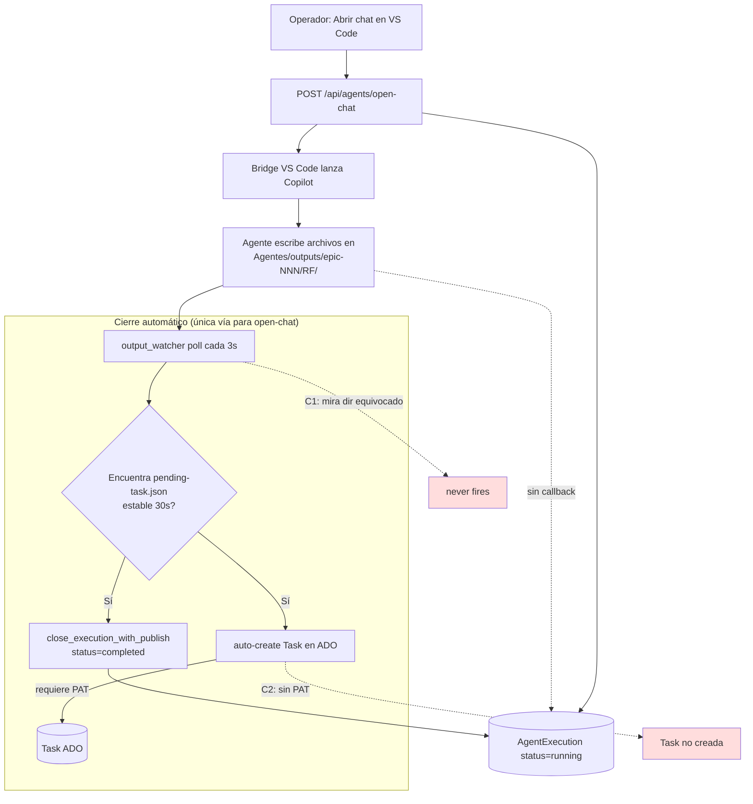
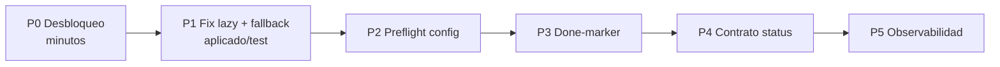

# Plan — Registro de finalización de tareas (flujo open-chat / GitHub Copilot)

> **Síntoma reportado:** Cuando un Analista Funcional corre desde el deployado (`.exe`),
> genera todos los archivos (`analisis-funcional.md`, `plan-de-pruebas.md`,
> `pending-task.json`) pero la ejecución **sigue `running` para siempre** en Stacky
> Agents y **no se crea la Task** del análisis en ADO.
> Caso testigo: **EP-20 / ADO-206 / RF-021** (deploy 1.0.3).

> **Estado:** diagnóstico cerrado con evidencia. Fix parcial ya aplicado en fuente
> (resolución lazy del `outputs_dir`). Este plan cubre **todas** las capas para que el
> registro de finalización sea confiable y observable, no solo el caso testigo.

---

## 1. Por qué pasa — causas raíz confirmadas

El flujo `open-chat` (GitHub Copilot en VS Code) **no tiene callback fiable**: el agente
sólo escribe archivos en disco. El único mecanismo automático que cierra esas ejecuciones
es el **`output_watcher`** (Modo A para Epics). Ese watcher falló por tres motivos
encadenados:

### C1 — El watcher vigila el directorio equivocado (CONFIRMADO, raíz del bug)
Log del deploy 1.0.3:
```
output watcher started (dir=C:\Desarrollo\GIT\RS\RSPACIFICO\Tools\Stacky\Agentes\outputs ...)
```
Los archivos están en `C:\Desarrollo\GIT\RS\RSPACIFICO\Agentes\outputs\epic-206\...`
(raíz del repo), **no** bajo `Tools\Stacky`.

**Mecanismo:** `AdoOutputWatcher.__init__` resolvía `outputs_dir` **una sola vez al
arranque del proceso** (00:59:27). En ese instante todavía no había proyecto activo (el
operador lo activó a las 01:00:38). Sin proyecto activo, `repo_root()` cae al fallback
`Path(__file__).parents[4]`; como el deploy vive **dentro** del repo
(`<repo>/Tools/Stacky/Stacky Agents/DeployStackyAgents/backend/_internal/`), `parents[4]`
da `<repo>/Tools/Stacky`. Ese path malo quedó congelado toda la vida del proceso, aunque
después se activara RSPACIFICO (cuyo `workspace_root` sí es correcto).

> Es una segunda faceta del bug histórico de `repo_root()` frozen documentado en
> `runtime_paths.py` (antes `parents[5]`). Esta vez no fue `repo_root()` en sí, sino el
> **momento** en que el watcher lo evaluó.

### C2 — Falta el PAT de ADO en el deploy (CONFIRMADO, segunda causa de "no crea la Task")
Log del deploy:
```
WARNING sync ADO saltado: ADO PAT no encontrado. Setea ADO_PAT en backend/.env o llena Tools/PAT-ADO.
```
Aunque el watcher encuentre los archivos y dispare el auto-create
(`POST /api/tickets/by-ado/{epic}/create-child-task`), ese endpoint usa `AdoClient` y
**requiere PAT**. Sin PAT, la Task no se crea. (El cierre de la ejecución sí ocurre igual,
porque `_auto_create_pending_tasks` no aborta el `close_execution_with_publish`.)

### C3 — Inconsistencia de `status` en el contrato `pending-task.json` (menor)
- El prompt del Analista Funcional (`agents/functional.py`) instruye `status="pending"`.
- El archivo real y el endpoint de listado (`api/tickets.py`, "solo los que tienen
  `status=pending_manual_creation`") usan `pending_manual_creation`.
- El auto-create del watcher sólo skipea si `status == "consumed"`, así que hoy no rompe,
  pero la divergencia es una bomba de tiempo si alguien endurece el filtro.

### C4 — Fragilidad de fondo: el flujo open-chat no emite señal de "done"
A diferencia de los runtimes CLI (`codex_cli` / `claude_code_cli`) que escriben un
`MANIFEST.json` terminal consumido por `manifest_watcher` (mecanismo **determinista**),
el flujo Copilot depende 100% de detección de artifacts por heurística (mtime estable +
debounce). Si el agente no escribe exactamente los nombres esperados, o tarda, el cierre
nunca ocurre. Esto es lo que hay que robustecer para que "registrar al terminar" deje de
ser best-effort.

---

## 2. Arquitectura actual del cierre (estado AS-IS)



**Conclusión:** el cierre del open-chat cuelga de un solo hilo (output_watcher) que tenía
dos puntos de falla (C1, C2) y ninguna señal determinista de respaldo (C4).

---

## 3. Plan de solución por fases

### Fase P0 — Desbloqueo inmediato del deploy actual (sin rebuild) ⏱️ minutos
Objetivo: cerrar el run colgado de epic-206 y dejar el deploy operativo ya.

1. **Forzar `repo_root` correcto vía env (puentea C1):**
   Crear/editar `DeployStackyAgents/backend/.env`:
   ```
   STACKY_REPO_ROOT=C:/Desarrollo/GIT/RS/RSPACIFICO
   ```
   `repo_root()` chequea `STACKY_REPO_ROOT` **antes** de la rama frozen, así que ignora la
   resolución rota aunque el `.exe` sea el viejo.
2. **Cargar el PAT de ADO (puentea C2):** setear `ADO_PAT` en el mismo `.env` o llenar
   `Tools/PAT-ADO` (según mensaje de warning del backend).
3. **Reiniciar** el backend (lee `.env` y re-arma watchers al startup).
4. **Disparar scan manual** para no esperar el polling:
   `POST http://localhost:5050/api/diag/output-watcher/scan-now`
   Verificar en el `round` del response que `mode_a_closes ≥ 1`.
5. Confirmar en la UI que ADO-206 deja de estar `running` y que la Task aparece en ADO.

> **Criterio de salida P0:** ejecución de epic-206 en `completed` + Task RF-021 creada (o,
> si se decide flujo manual, `pending-task` consumible desde la UI sin error).

---

### Fase P1 — Fix de raíz del watcher (resolución lazy) ✅ aplicado en fuente
`backend/services/output_watcher.py`:
- `outputs_dir` pasó de atributo cacheado en `__init__` a **property que resuelve lazy en
  cada `scan_once()`** (respeta override explícito para tests/diag).
- Se agregó log "dir vigilado → … (existe=…)" cuando cambia el directorio, para que este
  diagnóstico sea trivial a futuro.

Pendiente de esta fase:
- [ ] **Endurecer el fallback frozen de `repo_root()`** en `runtime_paths.py`: cuando
  `is_frozen()` y `_active_workspace_root()` devuelve `None`, **no** caer a `parents[4]`
  (que apunta dentro del repo en deploys embebidos). Opciones: (a) loguear `WARNING` y
  devolver un sentinel inexistente para que el watcher no escanee basura; (b) reintentar
  resolución diferida hasta que haya proyecto activo. Recomendado: (a) + log explícito.
- [ ] Tests: caso "watcher construido sin proyecto activo, luego se activa → re-resuelve"
  (ver `tests/test_output_watcher.py`). Ya validado manualmente; falta el test
  automatizado.

---

### Fase P2 — Validación de configuración al arranque (preflight) ⏱️ 0.5 día
Que el deploy **grite temprano** en vez de fallar silencioso.

- [ ] Al startup, loguear (nivel INFO) el `repo_root()` resuelto y el `outputs_dir` que
  vigilará el watcher, **con check de existencia**. Si no existe → `WARNING` visible.
- [ ] Si `STACKY_OUTPUT_WATCHER_AUTO_CREATE_TASKS != false` y **no hay PAT de ADO**,
  loguear `WARNING`: "auto-create de Tasks habilitado pero ADO PAT ausente → las Tasks no
  se crearán".
- [ ] Endpoint/diag `GET /api/diag/health` que devuelva: `repo_root`, `outputs_dir`,
  `outputs_dir_exists`, `active_project`, `ado_pat_present`, watchers activos.

---

### Fase P3 — Señal de finalización determinista para open-chat (robustez real) ⏱️ 1–2 días
Eliminar la dependencia 100% heurística (C4). Elegir **una** de estas dos y dejarla como
mecanismo primario, manteniendo el output_watcher como fallback:

**Opción A (recomendada) — `done-marker` escrito por el propio agente.**
- El contrato del `.agent.md` del Analista Funcional pide, como **último paso**, escribir
  `Agentes/outputs/epic-<id>/<RF>/.stacky-done.json` con `{ "status": "completed",
  "rf_id", "finished_at" }`.
- El output_watcher Modo A pasa a disparar ante el `done-marker` (señal explícita) en vez
  de inferir por estabilidad de mtime; el debounce queda solo como respaldo.
- Ventaja: cero dependencia de tooling externo; el agente declara que terminó.

**Opción B — el bridge VS Code emite completion.**
- La extensión Stacky detecta fin de turno de Copilot y hace
  `POST /api/tickets/by-ado/{ado_id}/agent-completion`.
- Más fiable pero acopla al ciclo de vida de Copilot Chat (difícil de interceptar).

- [ ] Decidir A vs B (recomendado A).
- [ ] Implementar detección por marker + mantener fallback por artifacts.
- [ ] Documentar el contrato en `README_PARA_AGENTES.md` y en el `.agent.md`.

---

### Fase P4 — Consistencia del contrato `pending-task.json` (C3) ⏱️ 0.5 día
- [ ] Unificar el `status` en **un solo valor canónico** (`pending_manual_creation`) en:
  prompt de `agents/functional.py`, validador del endpoint y auto-create del watcher.
- [ ] Agregar validación de schema del `pending-task.json` (campos mínimos del plan §
  contrato) con mensaje claro si falta alguno.

---

### Fase P5 — Observabilidad y red de seguridad ⏱️ 0.5 día
- [ ] Surface en la UI (workbench): si hay una ejecución `running` con artifacts en disco
  pero el watcher mira otro dir → banner "posible run huérfano, ver diag".
- [ ] El **stale recovery reaper** (ya existe, `interval=120s`) debe cubrir el caso límite:
  ejecución `running` sin actividad + artifacts presentes → cerrar. Verificar que aplica
  al flujo open-chat, no solo a CLI.
- [ ] Métrica/alerta: ejecuciones `running` con antigüedad > N min.

---

## 4. Criterios de aceptación (Definition of Done)

| # | Criterio | Cómo se verifica |
|---|----------|------------------|
| CA-01 | Un análisis funcional desde el `.exe` cierra la ejecución al terminar | Ejecución pasa a `completed` sin intervención manual |
| CA-02 | La Task del RF se crea en ADO (o se habilita su creación manual sin error) | Task visible en ADO con link Hierarchy-Reverse al Epic |
| CA-03 | El watcher vigila siempre `<workspace_root>/Agentes/outputs` | Log "dir vigilado → …" coincide con `workspace_root` del proyecto activo |
| CA-04 | El deploy avisa al arranque si falta PAT o el dir no existe | `WARNING` visible en log + `/api/diag/health` |
| CA-05 | Existe señal determinista de done (P3) y el fallback sigue activo | Test: borrar marker → fallback cierra; con marker → cierra inmediato |
| CA-06 | `status` del `pending-task.json` es único y consistente | Grep en prompt + endpoint + watcher → un solo valor |

---

## 5. Verificación del caso testigo (epic-206)

1. Aplicar P0 (env `STACKY_REPO_ROOT` + PAT) y reiniciar.
2. `POST /api/diag/output-watcher/scan-now` → esperar `mode_a_closes: 1`.
3. DB: `agent_executions.status` de la ejecución de ticket 53 (ADO-206) = `completed`.
4. ADO: Task RF-021 creada bajo el Epic 206.
5. `pending-task.json` marcado `consumed` (o `consumed_at` presente).

---

## 6. Rollback

- P0: borrar las líneas del `.env` y reiniciar (vuelve al estado previo, sin pérdida).
- P1: revertir `output_watcher.py` (property → atributo cacheado). Bajo riesgo: el cambio
  es path-resolution puro y tiene cobertura de tests.
- P3/P4: cambios aditivos; el fallback por artifacts garantiza que no se regrese al estado
  "cuelga para siempre".

---

## 7. Orden de ejecución sugerido



P0 destraba HOY. P1 evita la recurrencia tras el próximo rebuild. P2–P5 convierten el
"registrar al terminar" de best-effort heurístico a comportamiento determinista y
observable.

---

_Generado 2026-05-27 · caso testigo EP-20 / ADO-206 / RF-021 · deploy 1.0.3_
