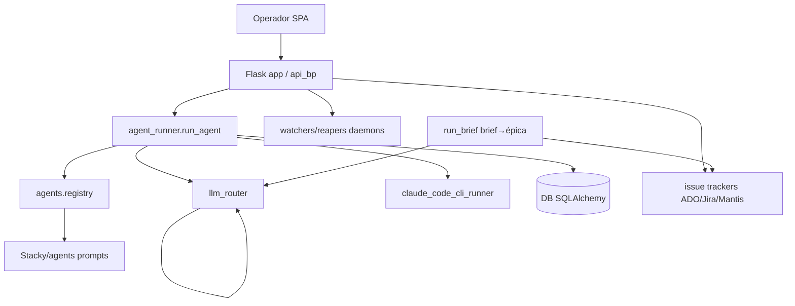

# Stacky Agents — Documentación base + grafo

> Generado por `doc-graph-architect` (foco RECONSTRUIR) el 2026-06-18. Documento índice canónico.
> Marcas de confianza: `[V: evidencia]` verificado · `[INF: base]` inferido · `[NV]` no verificado.

## 0. Estado
- Foco: RECONSTRUIR (existe doc previa abundante, pero el pedido es reconstruir el mínimo verificado; no audito doc línea por línea salvo contradicciones).
- Confianza global: MEDIA (mayoría de claims estructurales [V]; flujos internos profundos y runtime CLI con tramos [INF]/[NV]).
- Evidencia usada: `backend/app.py` (completo), `backend/api/__init__.py`, `backend/agent_runner.py` (1-94 + grep), `backend/services/llm_router.py` (1-70), `backend/services/claude_code_cli_runner.py` (1-60), `backend/models.py` (grep tablas), `backend/agents/__init__.py`, `backend/config.py` (grep), `backend/api/agents.py` (grep run_brief), `frontend/src/App.tsx` (1-60), `frontend/package.json`, `backend/requirements.txt`, listados de carpetas, `CLAUDE.md`.
- Evidencia faltante: cuerpos completos de los runners CLI y `run_brief`, esquema real de tablas (campos), contratos de los ~40 blueprints API, comportamiento end-to-end del runtime `claude_code_cli`, integraciones ADO/Jira/Mantis a nivel request.
- Veredicto: monolito FastAPI-style sobre Flask (no FastAPI) + SPA React/Vite, orquestador mono-operador de agentes LLM que generan artefactos y sincronizan con issue trackers; documento la arquitectura troncal verificada y dejo marcados los huecos.

## 1. Índice
2. Resumen ejecutivo · 3. Contexto funcional · 4. Contexto técnico · 5. Contratos y límites · 6. Grafo (6.1-6.4) · 7. Riesgos y huecos · 8. Reglas de actualización · 9. Próximas acciones

## 2. Resumen ejecutivo
Stacky Agents es una app local mono-operador que orquesta agentes LLM (Business, Functional, Technical, Developer, QA, Debug, PRReview, Custom) sobre tickets, y sincroniza con issue trackers (Azure DevOps, Jira, Mantis) [V: backend/agents/__init__.py:10-22; backend/app.py:71-139]. Backend = Flask (no FastAPI) servido en `0.0.0.0:PORT` (default 5050), que además sirve el SPA compilado desde `frontend/dist` [V: backend/app.py:30,182-188,508-512; config.py:55]. La ejecución de agentes se despacha en threads y soporta varios runtimes: `github_copilot` (default), `codex_cli` y `claude_code_cli` [V: backend/agent_runner.py:94,141-216]. Existe un cap duro de modelos Claude (máx Sonnet 4.6) con allowlist de Opus solo para brief→épica [V: llm_router.py:27-54; api/agents.py:589-592]. Antes de tocar: hay muchos daemons de fondo (watchers, reapers, sync) que arrancan en `create_app` y asumen rutas/PAT presentes [V: app.py:247-406].

## 3. Contexto funcional
- Propósito: amplificar a un operador para gestionar tickets y ejecutar agentes que producen artefactos (épicas, análisis, código) y los reflejan en el tracker [INF: agents/__init__.py + app.py:_startup_sync + memoria human-in-the-loop].
- Consumidores: humano operador (SPA con tabs team/tickets/review/unblocker/pm/logs/settings/docs/memory/diagnostics/history) [V: frontend/src/App.tsx:28-42] y otros agentes vía runtimes CLI [V: agent_runner.py:141].
- Casos de uso principales: ejecutar agente sobre ticket [V: agent_runner.run_agent]; generar épica desde brief (auto-publica en ADO) [V: api/agents.py:565 run_brief; memoria human-in-the-loop EXCEPCIÓN]; sincronizar tickets al arranque [V: app.py:55-139].
- Fuera de alcance: autenticación/RBAC real — `X-User-Email` es un header sin validar [V: app.py:422; INF memoria no-auth-substrate].
- Supuestos: mono-operador; entorno Windows; CLI `claude`/`codex` instalados localmente [INF: app.py mimetypes/truststore Windows; claude_code_cli_runner:24-33].

## 4. Contexto técnico
- Backend: Flask 3 + SQLAlchemy 2 + alembic + pydantic + PyYAML + pywin32 [V: requirements.txt]. App factory `create_app()` registra `api_bp` (url_prefix `/api`) con ~40 blueprints [V: app.py:187; api/__init__.py:43-83]. Punto de entrada: `app = create_app()`; `app.run(port=config.PORT)` [V: app.py:508-512].
- Datos: SQLite vía SQLAlchemy; tablas `tickets, users, ticket_state_history, pack_runs, agent_executions, pipeline_runs, execution_logs, system_logs, agent_prompt_versions, eval_runs` [V: models.py grep]. `init_db()` en boot [V: app.py:193]. DB viva fuera del repo [INF: memoria runtime-data-locations].
- Servicios: 137 módulos en `backend/services` [V: ls]. Clave: `llm_router` (routing+cap modelos), `claude_code_cli_runner`/codex runner, `*_sync` (ado/jira/mantis), watchers (manifest/output), reapers, `stacky_agents` (materializa agentes) [V: app.py imports; ls services].
- Agentes: registry en `backend/agents/__init__.py`; prompts canónicos versionados en `backend/Stacky/agents` + `*.agent.md` + `manifest.json` [V: ls backend/Stacky; agents/__init__.py]. Materialización en boot vía `materialize_agents()` [V: app.py:204].
- Frontend: React 18 + Vite 5 + TS + zustand + react-query + mermaid + react-markdown [V: package.json]. Entrada `main.tsx`→`App.tsx` (SPA por tabs, ruteo por pathname) [V: App.tsx]. Build `tsc --noEmit && vite build` [V: package.json:8].
- Configuración: `config.py` lee env + runtime config. Vars clave: `PORT` (5050), `LLM_BACKEND` (default `vscode_bridge`; opciones copilot/vscode_bridge/mock — sin anthropic directo), `ADO_PROJECT`, decenas de flags `STACKY_*` para watchers/reapers/perfil de arnés [V: config.py:55,75,436; app.py:171-347; INF memoria llm-backend-vs-runtime]. Secretos (PAT ADO) fuera de doc → `<REDACTADO>` (R5).
- Puntos de entrada HTTP: `/api/*` (blueprints) + `/api/health` + SPA `/` y `/<asset>` [V: api/__init__.py:85; app.py:486-503].
- Puntos de salida: trackers (ADO/Jira/Mantis), webhooks, notificaciones desktop, filesystem outputs [V: app.py:38-44,369-381; agent_runner imports].

## 5. Contratos y límites
- `run_agent(agent_type, ticket_id, context_blocks, user, runtime=..., model_override=...)`: crea fila `AgentExecution`, despacha thread; sin fallback silencioso entre runtimes; `claude_code_cli` puede bloquearse con HTTP 501 en endpoint [V: agent_runner.py:77-94,210-216]. Efecto colateral: persiste ejecución + escribe artefactos en outputs [V: agent_runner _collect_produced_files].
- `clamp_model(model, allow_opus=False) -> str`: invariante — ningún modelo Claude supera Sonnet 4.6 salvo `claude-opus-4-8` con `allow_opus=True`; tier `fable` siempre capado [V: llm_router.py:35-54].
- `POST /api/agents/run_brief`: lee `model_override` del body, lo capea con `allow_opus=True`, ajusta effort según modelo, lanza agente; loguea solicitado vs efectivo [V: api/agents.py:565-666].
- `/api/health` → `{ok: True}` (y `{"ok": True}` en api/__init__) [V: app.py:52 skip-log; api/__init__.py:85-87].
- Middleware: cada request recibe `X-Request-ID`; loguea body salvo en `/api/logs/frontend`; 500s no-HTTPException se capturan y loguean [V: app.py:410-467].
- Contratos por blueprint individual (40 archivos): Omitido: sin lectura por archivo; requiere expandir cada `api/*.py` [NV].

## 6. Grafo

### 6.1 Tabla de nodos
| ID | Nodo | Tipo | Responsabilidad | Fuente de verdad | Criticidad | Conf. |
|----|------|------|-----------------|------------------|-----------|-------|
| N1 | Operador (SPA) | actor_externo | Usa la UI por tabs | frontend/src/App.tsx | ALTA | V |
| N2 | Flask app / api_bp | api | Sirve `/api/*` + SPA | backend/app.py:182-505 | ALTA | V |
| N3 | agent_runner.run_agent | servicio | Despacha ejecución de agentes | backend/agent_runner.py:77 | ALTA | V |
| N4 | agents.registry | componente | Catálogo de agentes | backend/agents/__init__.py:10 | ALTA | V |
| N5 | llm_router | servicio | Routing + cap de modelos | backend/services/llm_router.py | ALTA | V |
| N6 | claude_code_cli_runner | herramienta | Runtime CLI `claude` | services/claude_code_cli_runner.py | ALTA | V |
| N7 | DB (SQLAlchemy) | datos | Tickets/ejecuciones/logs | backend/models.py | ALTA | V |
| N8 | issue trackers (ADO/Jira/Mantis) | actor_externo | Sync de tickets | backend/app.py:71-139 | ALTA | V |
| N9 | watchers/reapers daemons | workflow | Cierre de runs huérfanos/stale | backend/app.py:299-333 | MEDIA | V |
| N10 | run_brief (brief→épica) | workflow | Genera y auto-publica épica | backend/api/agents.py:565 | ALTA | V |
| N11 | Stacky/agents (prompts) | documento | Prompts canónicos versionados | backend/Stacky/agents | MEDIA | V |

### 6.2 Tabla de aristas
| Desde | Hacia | Relación | Condición | Datos/Contrato | Riesgo | Conf. |
|-------|-------|----------|-----------|----------------|--------|-------|
| N1 | N2 | llama_a | siempre | HTTP `/api/*` | CORS/headers | V |
| N2 | N3 | delega_a | run de agente | agent_type, ticket_id, runtime | sin fallback runtime | V |
| N3 | N4 | consume | siempre | registry[agent_type] | UnknownAgentError | V |
| N3 | N5 | depende_de | runtime copilot | model_override | cap de modelo | V |
| N3 | N6 | delega_a | runtime=claude_code_cli | flags CLI | flag/permisos [NV] | V |
| N3 | N7 | actualiza | siempre | AgentExecution | — | V |
| N5 | N5 | valida | clamp_model | allow_opus | bypass cap | V |
| N2 | N8 | produce | en boot/sync | tickets | PAT ausente | V |
| N2 | N9 | delega_a | flags STACKY_* | poll dirs | rutas inexistentes | V |
| N10 | N8 | produce | brief válido | épica HTML | narración vs HTML | V |
| N10 | N5 | depende_de | model override | allow_opus=True | — | V |
| N4 | N11 | consume | en boot | manifest.json | materialize vacío | V |

### 6.3 Grafo Mermaid


### 6.4 Vista para agentes
```yaml
graph:
  generated_from: working tree (branch codex/subida-cambios-pendientes)
  nodes:
    - {id: N1, name: Operador SPA, type: actor_externo, source_of_truth: frontend/src/App.tsx, criticality: ALTA, confidence: V}
    - {id: N2, name: Flask app/api_bp, type: api, source_of_truth: backend/app.py, criticality: ALTA, confidence: V}
    - {id: N3, name: agent_runner.run_agent, type: servicio, source_of_truth: backend/agent_runner.py, criticality: ALTA, confidence: V}
    - {id: N4, name: agents.registry, type: componente, source_of_truth: backend/agents/__init__.py, criticality: ALTA, confidence: V}
    - {id: N5, name: llm_router, type: servicio, source_of_truth: backend/services/llm_router.py, criticality: ALTA, confidence: V}
    - {id: N6, name: claude_code_cli_runner, type: herramienta, source_of_truth: backend/services/claude_code_cli_runner.py, criticality: ALTA, confidence: V}
    - {id: N7, name: DB, type: datos, source_of_truth: backend/models.py, criticality: ALTA, confidence: V}
    - {id: N8, name: issue trackers, type: actor_externo, source_of_truth: backend/app.py, criticality: ALTA, confidence: V}
    - {id: N9, name: watchers/reapers, type: workflow, source_of_truth: backend/app.py, criticality: MEDIA, confidence: V}
    - {id: N10, name: run_brief, type: workflow, source_of_truth: backend/api/agents.py, criticality: ALTA, confidence: V}
    - {id: N11, name: Stacky/agents prompts, type: documento, source_of_truth: backend/Stacky/agents, criticality: MEDIA, confidence: V}
  edges:
    - {from: N1, to: N2, rel: llama_a, condition: siempre, confidence: V}
    - {from: N2, to: N3, rel: delega_a, condition: run de agente, confidence: V}
    - {from: N3, to: N4, rel: consume, condition: siempre, confidence: V}
    - {from: N3, to: N5, rel: depende_de, condition: runtime copilot, confidence: V}
    - {from: N3, to: N6, rel: delega_a, condition: runtime=claude_code_cli, confidence: V}
    - {from: N3, to: N7, rel: actualiza, condition: siempre, confidence: V}
    - {from: N5, to: N5, rel: valida, condition: clamp_model, confidence: V}
    - {from: N2, to: N8, rel: produce, condition: boot/sync, confidence: V}
    - {from: N2, to: N9, rel: delega_a, condition: flags STACKY_*, confidence: V}
    - {from: N10, to: N8, rel: produce, condition: brief válido, confidence: V}
    - {from: N10, to: N5, rel: depende_de, condition: model override, confidence: V}
    - {from: N4, to: N11, rel: consume, condition: en boot, confidence: V}
  invariants:
    - "Ningún modelo Claude > Sonnet 4.6 salvo claude-opus-4-8 con allow_opus=True (llm_router.clamp_model)."
    - "No hay fallback silencioso entre runtimes (github_copilot/codex_cli/claude_code_cli)."
    - "Nunca persistir secretos/PAT ni PII en DB/logs/artefactos."
    - "human-in-the-loop salvo excepción brief→épica que auto-publica en ADO."
  staleness_check:
    - "git diff en backend/app.py, backend/agent_runner.py, backend/services/llm_router.py, backend/api/__init__.py"
    - "cambia el set de blueprints en api/__init__.py o el registry en agents/__init__.py"
```
Uso por agentes: navegar por `nodes`/`edges`; respetar `invariants`; si `staleness_check` da positivo, regenerar el grafo.

## 7. Riesgos y huecos
| # | Riesgo/Hueco | Tipo | Severidad | Evidencia/Conf. | Acción sugerida |
|---|--------------|------|-----------|-----------------|-----------------|
| 1 | Sin auth real: `X-User-Email` sin validar | riesgo | ALTA | [V: app.py:422] + [INF memoria no-auth] | Documentar como mono-operador local; no exponer a red |
| 2 | Flag `--dangerously-skip-permissions` del CLI claude no verificada | hueco | MEDIA | [V: claude_code_cli_runner:16-22] | Verificar versión CLI del operador antes de habilitar |
| 3 | Daemons asumen rutas/PAT presentes (preflight solo advierte) | riesgo | MEDIA | [V: app.py:142-179,247-333] | Mantener preflight ruidoso; validar en deploy |
| 4 | Doc previa masiva y posiblemente stale (README 17KB, STACKY_COMPLETE 74KB del 04-Jun) | deuda doc | MEDIA | [V: ls fechas] | Marcar legado; este doc como índice canónico |
| 5 | Contratos de ~40 blueprints no verificados | hueco | MEDIA | [NV] | Generar contrato por blueprint bajo demanda |
| 6 | `claude_code_cli` puede dar 501 / sesiones zombie | riesgo | ALTA | [V: agent_runner:216] + [INF memoria zombie-sessions] | Confirmar timeout finito desplegado |

## 8. Reglas de actualización
| Si cambiás… | Actualizá… |
|-------------|------------|
| Comportamiento observable / lógica de negocio | §2, §3 |
| Entradas/salidas/errores de un componente | §5 |
| Dependencias / integraciones / config (requirements, blueprints, trackers) | §4 (+ §6 si cambia el grafo) |
| Permisos / efectos colaterales (auth, PAT, runtime CLI) | §5, §7 |
| Se agrega/elimina/renombra nodo o relación (blueprint, agente, runner) | §6.1, §6.2, §6.3, §6.4 |
| Datos / esquema / tablas (models.py) | §4, §5, §6 si afecta grafo |
| Decisión arquitectónica (cap modelos, runtimes, human-in-the-loop) | §2, sección afectada, §6.4 invariants |

## 9. Próximas acciones
1. Verificar end-to-end el runtime `claude_code_cli` (501, timeout, flags) — desbloquea debugging; hoy [NV] sin correr el binario.
2. Generar contratos por blueprint API bajo demanda (empezar por `tickets.py`, `executions.py`, `agents.py`) — desbloquea agentes; [NV].
3. Documentar esquema real de las 10 tablas (campos/relaciones) — desbloquea cambios de datos; requiere leer `models.py` completo.
4. Marcar como legado los docs grandes del 04-Jun y enlazarlos desde este índice — reduce deuda doc.
