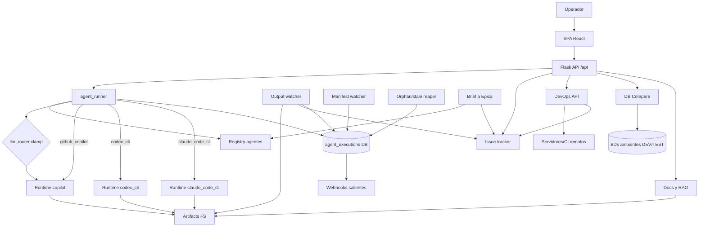

# 10 — Grafo del sistema

← [INDEX](INDEX.md) · hermanos: [02-arquitectura](02-arquitectura.md) · [05-agentes-runtimes](05-agentes-runtimes.md) · subsistemas: [12-devops](12-devops.md) · [13-docs-rag-grafo](13-docs-rag-grafo.md) · [14-db-compare](14-db-compare.md)

Grafo del flujo central: operador → API → runner → runtimes → tracker, con los daemons de cierre y los
subsistemas conectados a la API (DevOps, DB Compare, Docs/RAG).
R7: los nodos del Mermaid (6.3) coinciden con la tabla (6.1) y toda arista (6.2) referencia IDs existentes.
Nota: este es un grafo de COMPONENTES; el grafo de LINKS entre notas `.md` es otro (endpoint `/api/docs/graph`, ver [13](13-docs-rag-grafo.md)).

## 6.1 Tabla de nodos
| ID | Nodo | Tipo | Responsabilidad | Fuente de verdad | Criticidad | Conf. |
|----|------|------|-----------------|------------------|-----------|-------|
| N1 | Operador | actor_externo | Lanza/revisa/aprueba runs | (humano) | ALTA | V: app.py:422 |
| N2 | SPA React | componente | UI, tabs, consola en vivo | frontend/src/App.tsx | MEDIA | V: App.tsx:1-239 |
| N3 | Flask API `/api` | api | REST + sirve SPA | backend/app.py, api/__init__.py | ALTA | V: api/__init__.py:43 |
| N4 | agent_runner | servicio | Despacha agente al runtime, sin fallback | backend/agent_runner.py | ALTA | V: agent_runner.py:77-364 |
| N5 | Registry de agentes | componente | business/functional/.../custom | backend/agents/__init__.py | ALTA | V: agents/__init__.py:10-22 |
| N6 | llm_router | policy | Cap de modelos (clamp_model) + routing | services/llm_router.py | ALTA | V: llm_router.py:35-297 |
| N7 | Runtime github_copilot | herramienta | copilot_bridge + LLM router | copilot_bridge.py | ALTA | V: agent_runner.py:366-369 |
| N8 | Runtime codex_cli | herramienta | Codex CLI runner | services/codex_cli_runner.py | MEDIA | V: agent_runner.py:218-271 |
| N9 | Runtime claude_code_cli | herramienta | Claude Code CLI runner | services/claude_code_cli_runner.py | ALTA | V: agent_runner.py:293-345 |
| N10 | agent_executions (DB) | datos | Persistencia de runs/logs/estado | models.py, db.py | ALTA | V: models.py:207-302 |
| N11 | Issue tracker | actor_externo | ADO/Jira/Mantis | services/ado_sync, jira_sync, mantis_sync | ALTA | V: app.py:62-139 |
| N12 | Output watcher | workflow | Detecta artifacts, cierra runs, crea Tasks | services/output_watcher.py | ALTA | V: app.py:326-331 |
| N13 | Manifest watcher | workflow | Cierra runs por MANIFEST.json terminal | services/manifest_watcher.py | MEDIA | V: app.py:312-317 |
| N14 | Orphan/stale reaper | workflow | Reconcilia runs colgados | orphan_reaper.py, ticket_status.py | ALTA | V: app.py:251-306 |
| N15 | Artifacts en FS | datos | Agentes/outputs, codex_runs/MANIFEST | runtime_paths.py | ALTA | V: runtime_paths.py:99-136 |
| N16 | Webhooks salientes | evento | exec.completed / digest.ready | services/webhooks.py | BAJA | V: webhooks.py docstring |
| N17 | Brief→Épica | workflow | run-brief → BusinessAgent → publica épica | api/agents.py, api/tickets.py | ALTA | V: agents.py:564-669 |
| N18 | DevOps API/orquestación | servicio | Pipelines/servidores/migración/consola remota | api/devops*.py, services/remote_exec.py | ALTA | V: api/__init__.py:98-111 |
| N19 | DB Compare | componente | Diff de esquema/datos entre ambientes | api/db_compare.py, services/dbcompare_* | MEDIA | V: db_compare.py:24 |
| N20 | Docs & RAG | componente | Index/grafo/retrieval de `.md` | services/doc_indexer,doc_graph,docs_rag,rag_retriever | MEDIA | V: doc_graph.py:1-6 |
| N21 | Servidores/CI remotos | actor_externo | GitLab CI + servidores WinRM | (externo) | MEDIA | V: remote_exec.py:1-4 |
| N22 | BDs de ambientes (DEV/TEST) | actor_externo | Fuentes read-only comparadas | (externo) | MEDIA | V: db_compare.py:4-6 |

## 6.2 Tabla de aristas
| Desde | Hacia | Relación | Condición | Datos/Contrato | Riesgo | Conf. |
|-------|-------|----------|-----------|----------------|--------|-------|
| N1 | N2 | llama_a | siempre | clicks/forms | — | V: App.tsx |
| N2 | N3 | llama_a | siempre | REST /api/* | CORS si no hay dist | V: endpoints.ts:1 |
| N3 | N4 | delega_a | POST /agents/run, /run-brief | RunContext+blocks | — | V: agents.py:339,638 |
| N4 | N5 | llama_a | siempre | agent_type→agent | UnknownAgentError | V: agent_runner.py:98-100 |
| N4 | N6 | requiere_permiso | runtime anthropic/copilot | clamp_model | cap §5.2 | V: llm_router.py:296 |
| N6 | N7 | decide | modelo final | modelo capado | — | V: llm_router.py:38-57 |
| N4 | N7 | enruta | runtime=github_copilot/ausente | system+user prompt | — | V: agent_runner.py:366 |
| N4 | N8 | enruta | runtime=codex_cli | vscode_agent_filename | sin fallback→error | V: agent_runner.py:218-282 |
| N4 | N9 | enruta | runtime=claude_code_cli | vscode_agent_filename | sin fallback→error | V: agent_runner.py:293-355 |
| N4 | N10 | actualiza | siempre | AgentExecution row | — | V: agent_runner.py:260-271 |
| N7 | N15 | produce | agente escribe | archivos output | — | V: runtime_paths.py:99 |
| N8 | N15 | produce | agente escribe | MANIFEST.json+files | — | V: manifest_watcher.py |
| N9 | N15 | produce | agente escribe | comment.html/files | narración vs HTML | V: agents.py:566; MEMORY epic-brief |
| N12 | N15 | consume | poll 3s | scan artifacts | outputs_dir inexistente | V: app.py:326-331 |
| N12 | N11 | produce | auto_create+PAT | crea Task/comentario | PAT ausente | V: app.py:170-177 |
| N12 | N10 | actualiza | run huérfano | status terminal | — | V: output_watcher.py |
| N13 | N10 | actualiza | MANIFEST terminal | cierra run | — | V: manifest_watcher.py |
| N14 | N10 | actualiza | sin heartbeat | reconciliar running | — | V: app.py:251-306 |
| N3 | N11 | consume | boot/on-demand | sync_tickets | API tracker caída | V: app.py:62-139 |
| N17 | N5 | delega_a | brief presente | agent_type=business | — | V: agents.py:638-650 |
| N17 | N11 | produce | autopublish | Épica en ADO | doble post | V: tickets.py:5699 |
| N10 | N16 | notifica | exec aprobada | evento JSON | — | V: webhooks.py docstring |
| N3 | N18 | delega_a | /api/devops·ci·migrator | flags DevOps default ON | credencial servidor | V: api/__init__.py:98-111 |
| N18 | N21 | llama_a | run remoto / GitLab API | credencial por env del hijo | secreto en logs | V: remote_exec.py:1-4 |
| N18 | N11 | produce | plan 95: MR/PR paridad ADO | — | — | V: api/__init__.py:106 |
| N3 | N19 | delega_a | /api/db-compare/* | gate STACKY_DB_COMPARE_ENABLED | 403 si OFF | V: db_compare.py:27-30 |
| N19 | N22 | consume | SELECT read-only; password write-only | — | password en logs | V: db_compare.py:4-6 |
| N3 | N20 | delega_a | /api/docs·docs-rag | — | — | V: docs.py:28; docs_rag.py:30 |
| N20 | N15 | consume | lee `.md` de docs sources | — | path traversal | V: doc_graph.py:1-6 |

## 6.3 Grafo Mermaid


## 6.4 Vista para agentes
```yaml
graph:
  generated_from: working tree (branch plans-138-141-serie-ux-ui)
  nodes:
    - {id: N1, name: Operador, type: actor_externo, source_of_truth: n/a, criticality: ALTA, confidence: V}
    - {id: N2, name: SPA React, type: componente, source_of_truth: frontend/src/App.tsx, criticality: MEDIA, confidence: V}
    - {id: N3, name: Flask API, type: api, source_of_truth: backend/app.py, criticality: ALTA, confidence: V}
    - {id: N4, name: agent_runner, type: servicio, source_of_truth: backend/agent_runner.py, criticality: ALTA, confidence: V}
    - {id: N5, name: Registry agentes, type: componente, source_of_truth: backend/agents/__init__.py, criticality: ALTA, confidence: V}
    - {id: N6, name: llm_router, type: policy, source_of_truth: backend/services/llm_router.py, criticality: ALTA, confidence: V}
    - {id: N7, name: runtime github_copilot, type: herramienta, source_of_truth: backend/copilot_bridge.py, criticality: ALTA, confidence: V}
    - {id: N8, name: runtime codex_cli, type: herramienta, source_of_truth: backend/services/codex_cli_runner.py, criticality: MEDIA, confidence: V}
    - {id: N9, name: runtime claude_code_cli, type: herramienta, source_of_truth: backend/services/claude_code_cli_runner.py, criticality: ALTA, confidence: V}
    - {id: N10, name: agent_executions DB, type: datos, source_of_truth: backend/models.py, criticality: ALTA, confidence: V}
    - {id: N11, name: issue tracker, type: actor_externo, source_of_truth: backend/services/ado_sync.py, criticality: ALTA, confidence: V}
    - {id: N12, name: output watcher, type: workflow, source_of_truth: backend/services/output_watcher.py, criticality: ALTA, confidence: V}
    - {id: N13, name: manifest watcher, type: workflow, source_of_truth: backend/services/manifest_watcher.py, criticality: MEDIA, confidence: V}
    - {id: N14, name: orphan/stale reaper, type: workflow, source_of_truth: backend/services/orphan_reaper.py, criticality: ALTA, confidence: V}
    - {id: N15, name: artifacts FS, type: datos, source_of_truth: backend/runtime_paths.py, criticality: ALTA, confidence: V}
    - {id: N16, name: webhooks salientes, type: evento, source_of_truth: backend/services/webhooks.py, criticality: BAJA, confidence: V}
    - {id: N17, name: brief->epica, type: workflow, source_of_truth: backend/api/agents.py, criticality: ALTA, confidence: V}
    - {id: N18, name: devops api/orquestacion, type: servicio, source_of_truth: backend/api/devops.py, criticality: ALTA, confidence: V}
    - {id: N19, name: db compare, type: componente, source_of_truth: backend/api/db_compare.py, criticality: MEDIA, confidence: V}
    - {id: N20, name: docs & rag, type: componente, source_of_truth: backend/services/doc_graph.py, criticality: MEDIA, confidence: V}
    - {id: N21, name: servidores/CI remotos, type: actor_externo, source_of_truth: backend/services/remote_exec.py, criticality: MEDIA, confidence: V}
    - {id: N22, name: BDs de ambientes DEV/TEST, type: actor_externo, source_of_truth: n/a, criticality: MEDIA, confidence: V}
  edges:
    - {from: N1, to: N2, rel: llama_a, condition: siempre, confidence: V}
    - {from: N2, to: N3, rel: llama_a, condition: siempre, confidence: V}
    - {from: N3, to: N4, rel: delega_a, condition: "POST /agents/run|/run-brief", confidence: V}
    - {from: N4, to: N5, rel: llama_a, condition: siempre, confidence: V}
    - {from: N4, to: N6, rel: requiere_permiso, condition: "backend anthropic/copilot", confidence: V}
    - {from: N4, to: N7, rel: enruta, condition: "runtime=github_copilot", confidence: V}
    - {from: N4, to: N8, rel: enruta, condition: "runtime=codex_cli", confidence: V}
    - {from: N4, to: N9, rel: enruta, condition: "runtime=claude_code_cli", confidence: V}
    - {from: N4, to: N10, rel: actualiza, condition: siempre, confidence: V}
    - {from: N6, to: N7, rel: decide, condition: "modelo final", confidence: V}
    - {from: N7, to: N15, rel: produce, condition: "agente escribe", confidence: V}
    - {from: N8, to: N15, rel: produce, condition: "agente escribe", confidence: V}
    - {from: N9, to: N15, rel: produce, condition: "agente escribe", confidence: V}
    - {from: N12, to: N15, rel: consume, condition: "poll 3s", confidence: V}
    - {from: N12, to: N11, rel: produce, condition: "auto_create + PAT", confidence: V}
    - {from: N12, to: N10, rel: actualiza, condition: "run huerfano", confidence: V}
    - {from: N13, to: N10, rel: actualiza, condition: "MANIFEST terminal", confidence: V}
    - {from: N14, to: N10, rel: actualiza, condition: "sin heartbeat", confidence: V}
    - {from: N3, to: N11, rel: consume, condition: "boot/on-demand sync", confidence: V}
    - {from: N17, to: N5, rel: delega_a, condition: "brief presente", confidence: V}
    - {from: N17, to: N11, rel: produce, condition: "autopublish epica", confidence: V}
    - {from: N10, to: N16, rel: notifica, condition: "exec aprobada", confidence: V}
    - {from: N3, to: N18, rel: delega_a, condition: "/api/devops|ci|migrator", confidence: V}
    - {from: N18, to: N21, rel: llama_a, condition: "run remoto / gitlab api", confidence: V}
    - {from: N18, to: N11, rel: produce, condition: "MR/PR paridad ADO (plan 95)", confidence: V}
    - {from: N3, to: N19, rel: delega_a, condition: "/api/db-compare (gate STACKY_DB_COMPARE_ENABLED)", confidence: V}
    - {from: N19, to: N22, rel: consume, condition: "SELECT read-only; password write-only", confidence: V}
    - {from: N3, to: N20, rel: delega_a, condition: "/api/docs|docs-rag", confidence: V}
    - {from: N20, to: N15, rel: consume, condition: "lee .md de docs sources", confidence: V}
  invariants:
    - "Runtime sin fallback: error de codex_cli/claude_code_cli es error real, nunca cae a github_copilot."
    - "Todo modelo Claude pasa por clamp_model; solo brief->epica con allow_opus permite claude-opus-4-8."
    - "Stacky/agents es la fuente canonica de los .agent.md; otras fuentes se ignoran con warning."
    - "Los runners CLI crean su propia fila; la original queda cancelled con replaced_by."
    - "El watcher no escanea si repo_root() devuelve el sentinel inexistente (sin proyecto activo en frozen)."
    - "DB Compare: el password entra solo por POST .../password (write-only) y jamas sale en respuestas ni logs."
    - "DevOps: remote_exec es el unico modulo que ejecuta comandos remotos; la credencial viaja solo por env del hijo y siempre audita."
  staleness_check:
    - "Cambio en agent_runner.py bloque runtime dispatch (lineas ~210-366) -> regenerar 10-grafo y 05."
    - "Cambio en llm_router.clamp_model / _OPUS_ALLOWLIST -> regenerar invariants."
    - "Nuevo daemon/watcher en app.py create_app() -> agregar nodo/arista."
    - "Nuevo runtime soportado en run_agent -> agregar nodo Nx + aristas."
    - "Nuevo blueprint en api/__init__.py o subsistema en services/ -> agregar nodo Nx (revisar 12/13/14)."
    - "generated_from != rama actual (git branch --show-current) -> el grafo puede estar viejo; regenerar."
```
