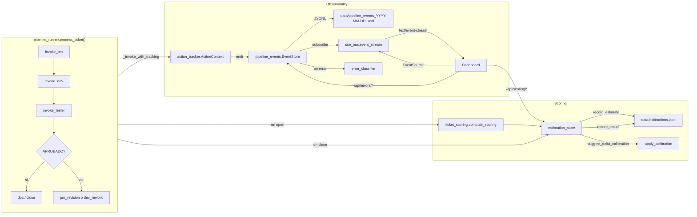

# Stacky — Scoring & Observability

Este documento describe el sistema de **scoring de tickets**, **estimación
vs. realidad** y **observabilidad en vivo** del pipeline Stacky, introducido
en la rama `feature/stacky-scoring-observability`.

## Visión general



## Módulos

| Archivo | Responsabilidad |
|---|---|
| `pipeline_events.py` | Bus de eventos. `PipelineEvent` (pydantic) + `EventStore` (queue + JSONL async writer). |
| `action_tracker.py` | `ActionContext` context manager + `@track_action` decorator. Emite `action_started/progress/done/error`. Hereda `parent_execution_id` vía `contextvars`. |
| `error_classifier.py` | Clasifica excepciones en `auth / network / technical / functional / data / user` + genera `user_friendly`. |
| `sse_bus.py` | `event_stream()` — generator SSE con heartbeats cada 15 s y replay desde JSONL cuando el cliente envía `Last-Event-ID`. |
| `ticket_scoring.py` | `compute_scoring(inc_content, ...)` → score 0-100, complexity, factors, estimated_minutes por stage. Wrappea `DynamicComplexityScorer`. |
| `estimation_store.py` | Persistencia `data/estimations.json` (v1): estimate, actual, accuracy, calibration. |
| `stacky_log.py` | Métodos `slog.action()` y `slog.error_classified()` — logging estructurado con `execution_id`. |
| `metrics_collector.py` | `get_pipeline_performance_metrics(days)` — métricas para sub-tab Performance. |

## Catálogo de eventos

Todos los eventos viven en JSONL y se broadcastean por SSE.

| kind | Cuándo | Campos clave |
|---|---|---|
| `action_started` | Al entrar a una `ActionContext` | `action`, `phase`, `execution_id`, `parent_execution_id` |
| `action_progress` | Durante la acción (p.ej. bridge probe, UI paste) | `pct`, `subaction`, `detail` |
| `action_done` | Al salir sin excepción | `duration_ms` |
| `action_error` | Al salir con excepción | `error_kind`, `message`, `user_friendly`, `stack` (DEBUG) |
| `notification` | Emitido por `notifier.notify()` hooked | `message`, `user_friendly` |
| `state_transition` | (reservado) cambios de `pipeline_state.estado` | `detail` |
| `estimation_recorded` | Tras `POST /api/scoring/.../recompute` | `action="scoring.compute"` |
| `estimation_actualized` | Tras `POST /api/scoring/.../actual` | `action="scoring.actualize"` |

## Endpoints HTTP

| Método | Ruta | Descripción |
|---|---|---|
| GET | `/api/events/stream` | SSE live. Soporta `?ticket=`, `?kind=` y header `Last-Event-ID`. |
| GET | `/api/events` | Query JSONL con `ticket`, `kind`, `since`, `limit`, `days_back`. |
| GET | `/api/errors/ticket/<ticket_id>` | Últimos `action_error` del ticket (30 días). |
| GET | `/api/scoring/<ticket_id>` | Lee/computa estimación. Auto-cierra si ticket está `completado`. |
| POST | `/api/scoring/<ticket_id>/recompute` | Fuerza recálculo del score. |
| POST | `/api/scoring/<ticket_id>/actual` | Registra `actual_minutes`, `rework_cycles`, etc. |
| GET | `/api/scoring/history?project=&days=&closed_only=` | Lista entries. |
| GET | `/api/scoring/calibration?project=` | Calibración actual + sugerencias + accuracy. |
| POST | `/api/scoring/calibration/apply` | Body `{scope: "global"\|"project", project?, delta_pct?}`. |
| GET | `/api/pipeline/performance?days=&project=` | Métricas para sub-tab Performance. |
| GET | `/api/config/scoring?project=` | Config resuelta (global ← project). |
| PATCH | `/api/config/scoring` | Patch parcial sobre `projects/<NAME>/config.json → scoring`. |

## Correlación por `execution_id`

Cada acción del pipeline recibe un UUID4. Para ver toda la traza de un ticket:

```bash
# 1. buscar el execution_id en el log (truncado a 8 chars en la salida humana)
grep '#0027698' logs/stacky_pipeline_2026-04-21.log | grep ACTION
# Ej:
# 2026-04-21 12:30:42 [INFO ] [#0027698] [ACTION ] [e3a1c2d8] dev/invoke_dev (25%) prompt_built

# 2. Leer el JSONL filtrando por ticket
python -c "
import json
for line in open('data/pipeline_events_2026-04-21.jsonl'):
    ev = json.loads(line)
    if ev.get('ticket_id') == '0027698':
        print(ev['ts'], ev['kind'], ev.get('action'), ev.get('execution_id')[:8], ev.get('detail',''))
"

# 3. Consulta HTTP directa
curl 'http://localhost:5050/api/events?ticket=0027698&limit=100'
```

## Scoring: fórmula

Score 0-100 = `Σ (factor_value * weight) / Σ weights`, donde:

| Factor | Default weight | Fuente |
|---|---|---|
| `tech_complexity` | 25 | `DynamicComplexityScorer.complexity` → {25, 55, 85} |
| `uncertainty` | 20 | `1/similar_tickets_count` (más similares → menos incertidumbre) |
| `impact` | 15 | Keywords (producción/fiscal/multi-empresa) + módulos BD/Batch |
| `files_affected` | 15 | Cantidad de módulos detectados |
| `functional_risk` | 15 | Keywords (seguridad/migración/drop) |
| `external_dep` | 10 | Menciones de APIs externas, webhooks |

Complexity label por score:
- `simple` ≤ 35
- `medio` ≤ 65
- `complejo` > 65

Estimación en minutos = `DynamicComplexityScorer.estimated_total_minutes × (1 + delta_pct/100)`.

`delta_pct` se resuelve con la precedencia **ticket_type → project → global**.

## Calibración de delta

- Requiere ≥ `min_samples_for_calibration` samples (default 20) para que la
  UI muestre una sugerencia.
- La sugerencia = `mean(signed_deviation_pct)` de los últimos 90 días cerrados.
- Si tickets reales tardaron +18% respecto de lo estimado, sugerirá
  `delta_pct = 18.0`.
- Aplicar es idempotente: persiste en `data/estimations.json → calibration`.
  Al crear una nueva estimación, `ticket_scoring.resolve_delta_pct()` lee esa
  calibración automáticamente.

## Troubleshooting

### "No veo el overlay de sprite en el dashboard"
- Abrir DevTools y verificar que haya un request abierto a
  `/api/events/stream`. Si está rojo, hay un proxy filtrando SSE
  (mirar `X-Accel-Buffering: no`).
- Chequear que `EventSource` no haya caído: el JS cae a polling cada 4 s.

### "Las estimaciones nunca se cierran"
- El auto-close solo ocurre al abrir `GET /api/scoring/<ticket_id>` mientras
  el ticket está en `completado`. Si el frontend no pregunta por scoring, la
  entry queda abierta. Alternativa: llamar explícito a
  `POST /api/scoring/<id>/actual` desde el dashboard al cerrar.

### "Los execution_id en el log cambian para la misma acción"
- Cada `ActionContext` tiene su propio UUID. Si ves dos UUIDs distintos en
  la misma acción, probablemente hay dos invocaciones paralelas (ver logs
  `[GATE]` del dashboard_server).

### "La calibración sugerida siempre dice `None`"
- `samples < min_samples_for_calibration` (default 20). Bajar el mínimo
  vía `PATCH /api/config/scoring` con `{"min_samples_for_calibration": 5}`
  si se acepta ruido inicial.

## Rollback

Todos los cambios son aditivos. Para revertir:

```bash
git checkout main
# opcional: restaurar backups si se requiere
cp Tools/Stacky/pipeline/state.json.bak.20260421 Tools/Stacky/pipeline/state.json
cp Tools/Stacky/NOTIFICATIONS.json.bak.20260421 Tools/Stacky/NOTIFICATIONS.json
# los JSONL de data/ pueden quedar — no los lee código legacy
```
