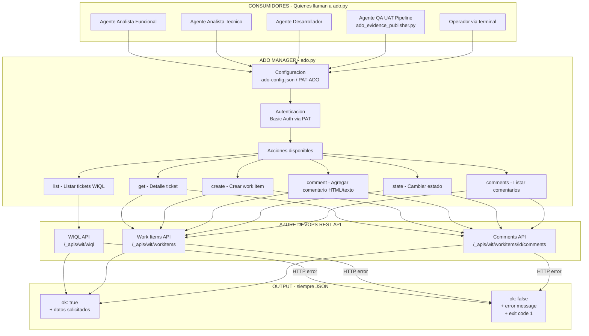
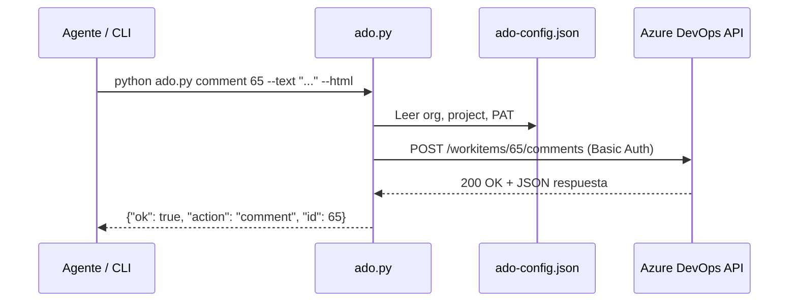

# ADO Manager

Herramienta CLI para gestionar tickets de **Azure DevOps** desde un coding agent o terminal.

- Sin servidor, sin dependencias externas
- Solo Python 3.8+ stdlib
- Salida siempre en **JSON** → fácil de parsear desde cualquier agente
- Un único archivo: `ado.py`

---

## Configuración (una sola vez)

Edita `ado-config.json` en esta carpeta con tus credenciales:

```json
{
  "org": "UbimiaPacifico",
  "project": "Strategist_Pacifico",
  "pat": "TU_PAT_DE_ADO_AQUI"
}
```

> El PAT se genera en **ADO → User Settings → Personal access tokens**.  
> Permisos mínimos necesarios: `Work Items — Read & Write`.

Si el PAT ya está en `Tools/PAT-ADO`, la herramienta lo toma automáticamente como fallback.

---

## Uso rápido

```bash
python ado.py <accion> [argumentos]
```

### Listar tickets

```bash
# Todos los tickets activos
python ado.py list

# Filtrar por estado
python ado.py list --state "Technical review"

# Buscar en el título
python ado.py list --search "factura" --limit 50

# Incluir cerrados
python ado.py list --all
```

### Ver un ticket

```bash
python ado.py get 1234
```

### Crear un ticket

```bash
# Texto plano
python ado.py create --title "Bug en validación de email" --desc "El campo no valida correctamente"

# Con HTML
python ado.py create \
  --title "Análisis técnico pendiente" \
  --desc "<h2>Problema</h2><p>El módulo de facturación falla con nulos.</p>" \
  --html \
  --type "Task" \
  --priority 2 \
  --assigned "juan@empresa.com"

# Tipos disponibles: Task | Bug | User Story | Feature | Epic
# Prioridades: 1=crítica  2=alta  3=media  4=baja
```

### Agregar un comentario

```bash
# Texto plano
python ado.py comment 1234 --text "Análisis completado. Ver sección 2 del documento."

# HTML (admite Markdown-style HTML, tablas, código, etc.)
python ado.py comment 1234 \
  --text "<h2>Análisis Técnico</h2><p>El problema está en <code>ClaseBus.GetDetalle()</code> línea ~89.</p>" \
  --html
```

### Cambiar estado

```bash
python ado.py state 1234 "To Do"
python ado.py state 1234 "Blocked"
python ado.py state 1234 "Technical review"
python ado.py state 1234 "Done"
```

### Ver comentarios

```bash
python ado.py comments 1234
```

### Estados y tipos disponibles

```bash
python ado.py states
python ado.py types
```

---

## Salida JSON

Toda respuesta exitosa tiene la forma:

```json
{
  "ok": true,
  "action": "get",
  "result": {
    "id": 1234,
    "title": "Bug en login",
    "state": "Technical review",
    "type": "Task",
    "priority": 2,
    "assigned_to": "juan@empresa.com",
    "url": "https://dev.azure.com/UbimiaPacifico/Strategist_Pacifico/_workitems/edit/1234",
    ...
  }
}
```

Toda respuesta de error:

```json
{
  "ok": false,
  "action": "comment",
  "error": "ado_api_404",
  "message": "HTTP 404 ..."
}
```

---

## Override de credenciales por llamada

Podés pasar `--org`, `--project` y `--pat` directamente en el comando para sobrescribir el `ado-config.json`:

```bash
python ado.py list --org "OtraOrg" --project "OtroProyecto" --pat "otro-pat"
```

Prioridad: **args CLI > ado-config.json > Tools/PAT-ADO**

---

## Para coding agents (TechnicalAnalyst, etc.)

El agente puede llamar directamente al script. Ejemplos de llamadas que hace el `TechnicalAnalyst`:

```bash
# 1. Ver tickets en Technical review
python ado.py list --state "Technical review"

# 2. Publicar análisis técnico como comentario HTML en el ticket
python ado.py comment 1234 --text "<h1>Análisis Técnico — ADO-1234</h1>..." --html

# 3. Cambiar estado a To Do (análisis completo) o Blocked
python ado.py state 1234 "To Do"
python ado.py state 1234 "Blocked"

# 4. Ver historial de comentarios previos
python ado.py comments 1234
```

El JSON de salida se puede parsear directamente con `json.loads()` en Python o con `| ConvertFrom-Json` en PowerShell.

---

## Estructura de archivos

```
Tools/ADO Manager/
├── ado.py           ← herramienta completa (único archivo)
├── ado-config.json  ← tus credenciales (NO commitear al repo)
└── README.md
```

> `ado-config.json` está en `.gitignore` — nunca commitear el PAT.


---

## Arquitectura



---

## Flujo de una llamada tipica



---

## Input / Output

| Accion | Input | Output |
|---|---|---|
| `list` | filtros opcionales (estado, texto, limite) | Array de work items resumidos |
| `get` | ID del ticket | Detalle completo del work item |
| `create` | titulo, descripcion, tipo, prioridad | Work item creado con ID |
| `comment` | ID + texto/HTML | Confirmacion de comentario creado |
| `state` | ID + nuevo estado | Confirmacion de transicion |
| `comments` | ID | Lista de comentarios con fecha y autor |
