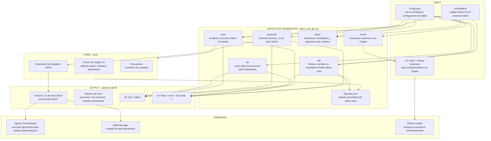

# Batch Test Generator

Herramienta CLI para generar, escanear y mantener tests unitarios NUnit para los procesos Batch de RS Pacifico. Forma parte del ecosistema **Stacky Tools**.

---

## Arquitectura



---

## Uso rapido

```bash
# Listar procesos batch detectados
python batch_test_gen.py list --pretty

# Analizar un proceso especifico
python batch_test_gen.py scan RSProcIN --pretty

# Generar tests NUnit para todos los procesos
python batch_test_gen.py generate --all

# Ver cambios en trunk/Batch desde el ultimo scan
python batch_test_gen.py diff

# Monitorear cambios y regenerar automaticamente
python batch_test_gen.py watch
```

---

## Input / Output

| Accion | Input | Output clave |
|---|---|---|
| `list` | — | Array de procesos batch con sub-procesos detectados |
| `scan` | nombre del proceso | Analisis detallado: clases, metodos, dependencias |
| `generate` | proceso o `--all` | Archivos `.cs` con tests NUnit por proceso |
| `diff` | — | Lista de archivos cambiados vs ultimo scan guardado |
| `watch` | — | Modo continuo: regenera tests ante cualquier cambio |
| `enrich` | — | Tests enriquecidos con assertions semanticas via Copilot |

---

## Configuracion

Editar `config.json`:

```json
{
    "workspace_root": "N:/GIT/RS/RSPacifico/trunk",
    "batch_path": "Batch",
    "output_path": "tests/batch_generated",
    "test_project": "RSPacifico.Tests"
}
```
