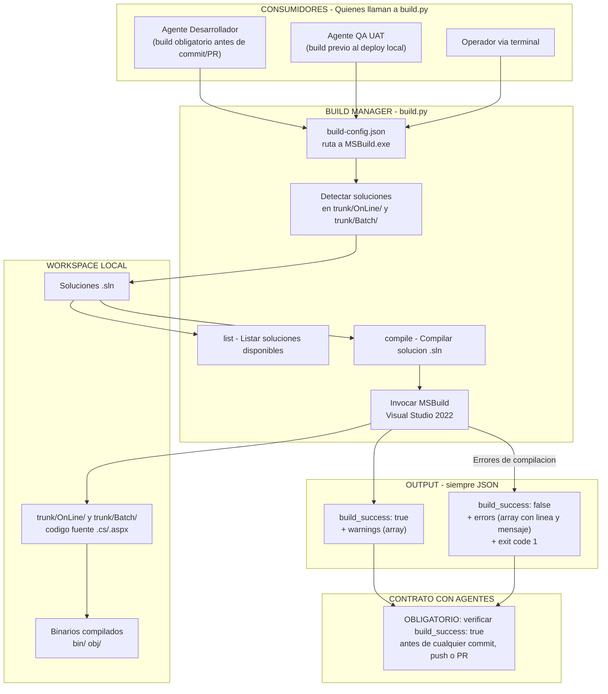
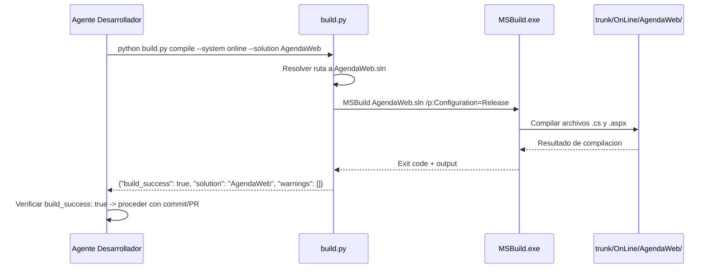
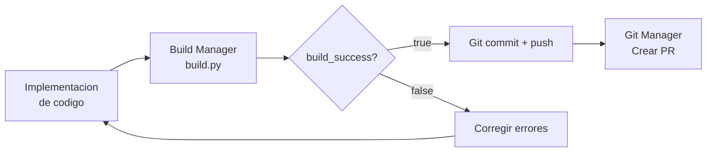

# Build Manager

CLI Python para compilar soluciones RS Pacífico con MSBuild. Forma parte del ecosistema **Stacky Tools**.

## Requisitos

- Python 3.8+
- Visual Studio 2022 (Community, Professional o Enterprise) instalado
- Acceso de lectura/escritura al repositorio local

## Uso

```powershell
# Ver soluciones disponibles
python build.py list
python build.py list --system online
python build.py list --system batch

# Compilar por nombre
python build.py compile --system online --solution AgendaWeb
python build.py compile --system batch  --solution Motor

# Compilar en Debug
python build.py compile --system online --solution AgendaWeb --config Debug

# Compilar por ruta completa
python build.py compile --solution "N:\GIT\RS\RSPacifico\trunk\OnLine\Soluciones\AgendaWeb.sln"
```

## Salida

Siempre JSON a stdout. Exit code `0` = build exitoso, `1` = build fallido o error.

Campo clave: `build_success` (bool) — los agentes deben verificar este campo antes de hacer commit/push/PR.

## Configuración

Editar `build-config.json` si MSBuild no está en la ruta predeterminada:

```json
{
  "msbuild": "C:\\ruta\\a\\MSBuild.exe"
}
```

## Contrato con agentes

Los agentes que modifican código **DEBEN** llamar esta tool y verificar `build_success: true` antes de cualquier commit, push o PR. Si `build_success` es `false`, deben corregir los errores listados en el campo `errors` y volver a compilar.

Ver [SPEC.md](SPEC.md) para el contrato completo y ejemplos de output JSON.


---

## Arquitectura



---

## Flujo de compilacion tipico



---

## Input / Output

| Accion | Input | Output clave |
|---|---|---|
| `list` | sistema opcional (online/batch) | Array de soluciones disponibles con rutas |
| `compile` | sistema + nombre de solucion | `build_success`, `errors`, `warnings` |

---

## Sinergia con el pipeline de desarrollo


