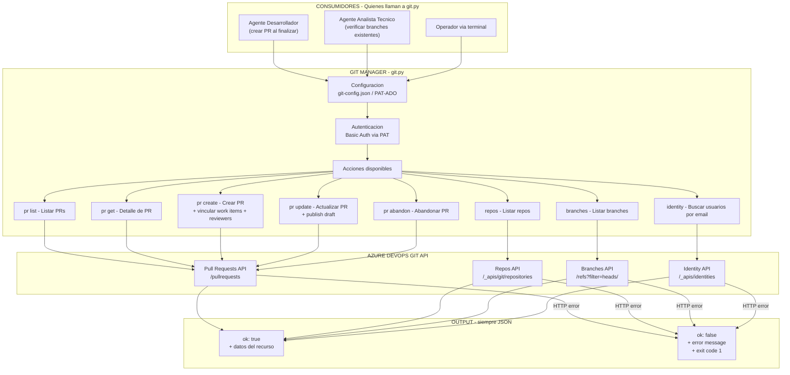
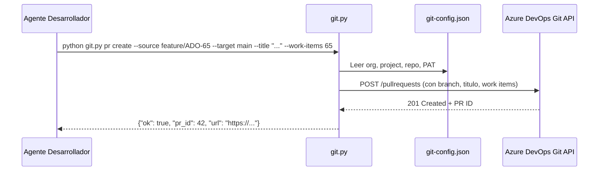
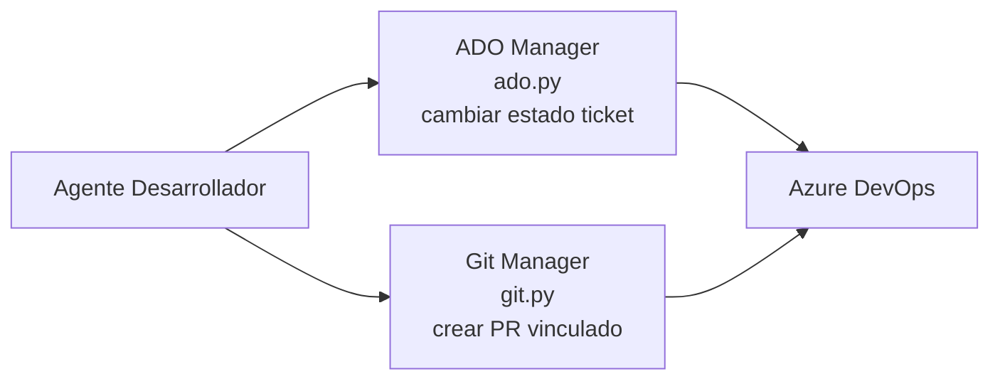

# Git Manager

Herramienta CLI para gestionar repositorios Git de **Azure DevOps** desde un coding agent o terminal.

- Sin servidor, sin dependencias externas
- Solo Python 3.8+ stdlib
- Salida siempre en **JSON** → fácil de parsear desde cualquier agente
- Un único archivo: `git.py`

---

## Configuración (una sola vez)

Edita `git-config.json` con tus credenciales:

```json
{
  "org": "UbimiaPacifico",
  "project": "Strategist_Pacifico",
  "repo": "Strategist_Pacifico",
  "pat": "TU_PAT_AQUI"
}
```

> El PAT se genera en **ADO → User Settings → Personal access tokens**.  
> Permisos mínimos necesarios: `Code — Read & Write` (para PRs), `Identity — Read` (para identity lookup).

Si el PAT ya está en `Tools/PAT-ADO`, la herramienta lo toma automáticamente como fallback.

---

## Acciones disponibles

| Acción | Descripción |
|--------|-------------|
| `repos` | Lista todos los repositorios del proyecto |
| `branches` | Lista branches de un repo |
| `pr list` | Lista pull requests (filtrable por status, branch) |
| `pr get` | Detalle completo de un PR |
| `pr create` | Crea un pull request |
| `pr update` | Actualiza título, descripción o publica un draft |
| `pr abandon` | Abandona un PR |
| `identity` | Busca usuarios por email/nombre (para GUIDs de reviewers) |

---

## Ejemplos

### Listar repos y branches

```bash
python git.py repos

python git.py branches --repo Strategist_Pacifico
python git.py branches --repo Strategist_Pacifico --filter feature
```

### Pull Requests

```bash
# Listar PRs activos
python git.py pr list --repo Strategist_Pacifico

# Listar PRs completados
python git.py pr list --repo Strategist_Pacifico --status completed

# Filtrar por branch origen
python git.py pr list --repo Strategist_Pacifico --source feature/login

# Detalle de un PR
python git.py pr get 42 --repo Strategist_Pacifico

# Crear PR básico
python git.py pr create \
  --repo Strategist_Pacifico \
  --source feature/mi-feature \
  --target main \
  --title "Agrega nueva funcionalidad X"

# Crear PR con descripción, revisores y work items vinculados
python git.py pr create \
  --repo Strategist_Pacifico \
  --source feature/mi-feature \
  --target main \
  --title "Fix validacion de formulario" \
  --desc "Corrige el bug reportado en ADO #1234" \
  --reviewer <guid-revisor-1> <guid-revisor-2> \
  --work-items 1234 5678

# Crear como borrador
python git.py pr create \
  --repo Strategist_Pacifico \
  --source feature/mi-feature \
  --target main \
  --title "WIP: refactor modulo X" \
  --draft

# Publicar borrador (draft → active)
python git.py pr update 42 --repo Strategist_Pacifico --publish

# Actualizar título
python git.py pr update 42 --repo Strategist_Pacifico --title "Nuevo titulo definitivo"

# Abandonar PR
python git.py pr abandon 42 --repo Strategist_Pacifico
```

### Buscar revisores

Para obtener el GUID de un revisor antes de crear el PR:

```bash
python git.py identity --search "juan.perez@empresa.com"
```

Retorna algo como:
```json
{
  "ok": true,
  "action": "identity",
  "result": [
    {
      "id": "a1b2c3d4-...",
      "display_name": "Juan Perez",
      "unique_name": "juan.perez@empresa.com"
    }
  ]
}
```

Luego usás el `id` como `--reviewer a1b2c3d4-...`.

---

## Override de credenciales por CLI

Todos los comandos aceptan `--org`, `--project`, `--repo` y `--pat` para sobrescribir lo que está en `git-config.json`:

```bash
python git.py pr list --repo OtroRepo --org OtraOrg --project OtroProject --pat MI_PAT
```

---

## Formato de salida

Éxito:
```json
{
  "ok": true,
  "action": "pr create",
  "result": { ... }
}
```

Error:
```json
{
  "ok": false,
  "action": "pr create",
  "error": "http_422",
  "message": "El branch 'feature/x' no existe en el repositorio."
}
```

Exit code `0` en éxito, `1` en error.


---

## Arquitectura



---

## Flujo de creacion de PR tipico



---

## Input / Output

| Accion | Input | Output |
|---|---|---|
| `repos` | — | Lista de repositorios del proyecto |
| `branches` | repo | Lista de branches con hash de ultimo commit |
| `pr list` | repo, status opcional, branch origen | Array de PRs con estado y titulo |
| `pr get` | PR ID, repo | Detalle completo del PR |
| `pr create` | repo, source, target, titulo | PR creado con ID y URL |
| `pr update` | PR ID, repo | PR actualizado |
| `pr abandon` | PR ID, repo | Confirmacion de PR abandonado |
| `identity` | email o nombre | GUID del usuario para usar como reviewer |

---

## Sinergia con ADO Manager


