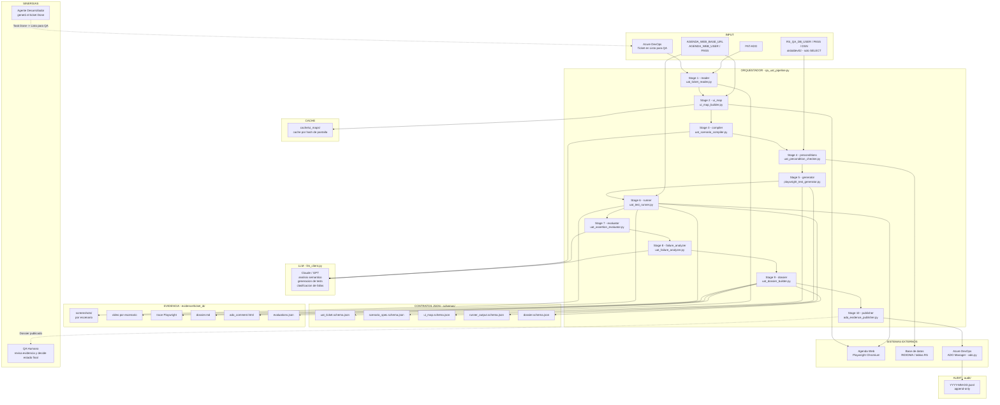
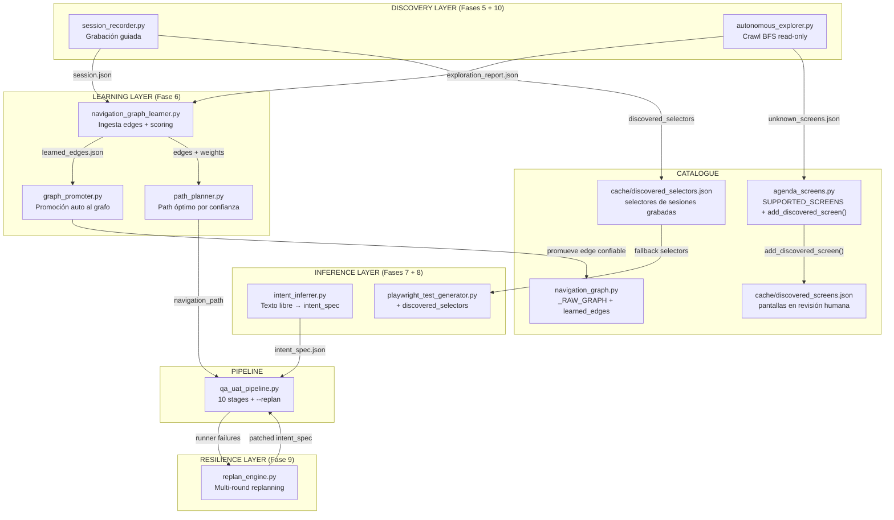

# QA UAT Agent — Tools Físicas

> Carpeta de herramientas CLI del agente QA UAT. Cada tool es un script Python autocontenido que corre suelto o como parte del pipeline orquestado por `qa_uat_pipeline.py`.

---

## Estructura de la carpeta

```
QA UAT Agent/
├── README.md                    ← este archivo
├── qa-uat-config.json           ← config de runtime (timeouts, flags Playwright, etc.)
├── qa_uat_pipeline.py           ← orquestador CLI: corre todas las tools en orden
│
├── ── MVP (Fase 3.A) ─────────────────────────────────────────
├── uat_ticket_reader.py         ← Lee ticket ADO y devuelve JSON normalizado
├── uat_scenario_compiler.py     ← Compila plan de pruebas en ScenarioSpecs ejecutables
├── ui_map_builder.py            ← Inspecciona pantalla en vivo y produce UI map con selectores
├── selector_discovery.py        ← Helper interno: elige el selector más robusto por elemento
├── playwright_test_generator.py ← Genera .spec.ts por escenario desde ScenarioSpec + UI map
├── uat_test_runner.py           ← Ejecuta .spec.ts y captura evidencia (trace, video, screenshots)
├── uat_dossier_builder.py       ← Ensambla dossier final: JSON + Markdown + HTML para ADO
├── ado_evidence_publisher.py    ← Publica dossier como comentario único e idempotente en ADO
│
├── ── Fase 3.B — Herramientas de calidad ──────────────────────
├── uat_precondition_checker.py  ← Verifica RIDIOMA y datos requeridos en BD (SELECT only)
├── uat_assertion_evaluator.py   ← Evalúa assertions (literales + semánticas via LLM)
├── uat_failure_analyzer.py      ← Clasifica FAILs en taxonomía con hipótesis (heurística + LLM)
│
├── ── Orquestador ─────────────────────────────────────────────
├── qa_uat_pipeline.py           ← Pipeline completo de 10 stages en un solo comando
│
├── ── Fase 3.C / Post-MVP ─────────────────────────────────────
├── uat_report_summarizer.py
├── uat_flakiness_detector.py
├── uat_golden_path_validator.py
├── uat_test_data_finder.py
├── uat_action_recorder.py
│
├── schemas/                     ← JSON schemas para validación de contratos
│   ├── uat_ticket.schema.json
│   ├── scenario_spec.schema.json
│   ├── ui_map.schema.json
│   ├── runner_output.schema.json
│   └── dossier.schema.json
│
├── templates/                   ← Plantillas Jinja2 para generación de archivos
│   ├── playwright_test.spec.ts.j2
│   ├── dossier.md.j2
│   └── ado_comment.html.j2
│
├── prompt_cards/                ← Documentación de cada uso de LLM
│   ├── ticket_context_classifier.md
│   ├── scenario_compiler.md
│   ├── ui_map_alias_namer.md
│   ├── assertion_semantic_oracle.md
│   ├── failure_explainer.md
│   └── executive_summary.md
│
├── cache/
│   └── ui_maps/                 ← Cache de inspección DOM por hash (borrable sin riesgo)
│
├── evidence/
│   └── <ticket_id>/             ← Screenshots, video, trace, dossier, ado_comment.html
│
├── audit/
│   └── <YYYY-MM-DD>.jsonl       ← Audit log de publicaciones a ADO (append-only)
│
├── tests/unit/                  ← Tests unitarios por tool
│   ├── test_uat_ticket_reader.py
│   ├── test_uat_scenario_compiler.py
│   ├── test_uat_precondition_checker.py
│   ├── test_ui_map_builder.py
│   ├── test_selector_discovery.py
│   ├── test_playwright_test_generator.py
│   ├── test_uat_test_runner.py
│   ├── test_uat_assertion_evaluator.py
│   ├── test_uat_failure_analyzer.py
│   ├── test_uat_cleanup_tool.py
│   ├── test_uat_dossier_builder.py
│   └── test_ado_evidence_publisher.py
│
└── requirements.txt
```

---

## Instalación

```bash
cd "Tools/Stacky/Stacky tools/QA UAT Agent"
pip install -r requirements.txt
playwright install chromium
```

---

## Credenciales

**Nunca en el repo.** Crear localmente:

```
Tools/Stacky/.secrets/qa_db.env
Tools/Stacky/.secrets/agenda_web.env
```

Ver `Tools/Stacky/.secrets/*.env.example` para el formato.

Cargar antes de correr cualquier tool:

```powershell
# PowerShell (Windows)
Get-Content "..\..\..\.secrets\qa_db.env" | ForEach-Object {
    if ($_ -match '^([^#][^=]+)=(.+)$') {
        [System.Environment]::SetEnvironmentVariable($Matches[1].Trim(), $Matches[2].Trim(), 'Process')
    }
}
Get-Content "..\..\..\.secrets\agenda_web.env" | ForEach-Object {
    if ($_ -match '^([^#][^=]+)=(.+)$') {
        [System.Environment]::SetEnvironmentVariable($Matches[1].Trim(), $Matches[2].Trim(), 'Process')
    }
}
```

```bash
# bash/zsh (Linux/Mac)
export $(grep -v '^#' ../../.secrets/qa_db.env | xargs)
export $(grep -v '^#' ../../.secrets/agenda_web.env | xargs)
```

---

## Pipeline completo (10 stages)

El orquestador corre los 10 stages en orden:

```
reader → ui_map → compiler → preconditions → generator → runner → evaluator → failure_analyzer → dossier → publisher
```

| Stage | Tool | Descripción |
|---|---|---|
| `reader` | `uat_ticket_reader.py` | Lee ticket ADO, extrae plan de pruebas |
| `ui_map` | `ui_map_builder.py` | Inspecciona DOM de la pantalla con Playwright |
| `compiler` | `uat_scenario_compiler.py` | Compila ScenarioSpecs ejecutables |
| `preconditions` | `uat_precondition_checker.py` | Verifica RIDIOMA y datos en BD (no-fatal si BD no disponible) |
| `generator` | `playwright_test_generator.py` | Genera `.spec.ts` por escenario |
| `runner` | `uat_test_runner.py` | Ejecuta tests, captura evidencia |
| `evaluator` | `uat_assertion_evaluator.py` | Evalúa assertions y produce `evaluations.json` |
| `failure_analyzer` | `uat_failure_analyzer.py` | Clasifica fallas (solo si hay FAILs) |
| `dossier` | `uat_dossier_builder.py` | Ensambla dossier final |
| `publisher` | `ado_evidence_publisher.py` | Publica en ADO (dry-run por defecto) |

### Comando unificado

```bash
# Dry-run completo (sin tocar ADO)
python qa_uat_pipeline.py --ticket 70 --mode dry-run --verbose

# Publicar resultado en ADO
python qa_uat_pipeline.py --ticket 70 --mode publish

# Con navegador visible (útil para debug)
python qa_uat_pipeline.py --ticket 70 --headed --verbose

# Saltear hasta un stage específico (usa cache del run anterior)
python qa_uat_pipeline.py --ticket 70 --skip-to runner --verbose
```

### Comandos individuales por tool

```bash
# 1. Leer ticket
python uat_ticket_reader.py --ticket 70

# 2. Compilar escenarios
python uat_scenario_compiler.py < evidence/70/ticket.json

# 3. Verificar precondiciones BD
python uat_precondition_checker.py --scenarios evidence/70/scenarios.json

# 4. Construir UI map
python ui_map_builder.py --screen FrmAgenda.aspx

# 5. Generar tests
python playwright_test_generator.py \
  --scenarios evidence/70/scenarios.json \
  --ui-maps cache/ui_maps/ \
  --out evidence/70/tests/

# 6. Ejecutar
python uat_test_runner.py \
  --tests-dir evidence/70/tests/ \
  --evidence-out evidence/70/

# 7. Evaluar assertions
python uat_assertion_evaluator.py \
  --scenarios evidence/70/scenarios.json \
  --runner-output evidence/70/runner_output.json

# 8. Analizar fallas
python uat_failure_analyzer.py \
  --evaluations evidence/70/evaluations.json \
  --runner-output evidence/70/runner_output.json

# 9. Construir dossier
python uat_dossier_builder.py \
  --runner-output evidence/70/runner_output.json \
  --ticket evidence/70/ticket.json

# 10a. Preview sin tocar ADO
python ado_evidence_publisher.py --ticket 70 --mode dry-run

# 10b. Publicar cuando el operador confirma
python ado_evidence_publisher.py --ticket 70 --mode publish
```

---

## Convenciones de cada tool

- **Salida JSON a stdout.** Errores en formato `{"ok": false, "error": "<code>", "message": "..."}` con exit code 1.
- **Falla rápido** si las env vars requeridas no están seteadas.
- **Sin side effects inesperados**: ninguna tool escribe fuera de `evidence/`, `cache/` o `audit/` salvo `ado_evidence_publisher.py` (que escribe en ADO solo con `--mode publish`).
- **NUNCA se llama `python ado.py state ...`** desde ninguna tool. Hay un test estático (`tests/unit/test_ado_evidence_publisher.py`) que verifica esto en tiempo de CI.

---

## Tests

```bash
# Correr todos los tests unitarios
pytest tests/unit/ -v

# Test estático de seguridad (verifica que ningún módulo invoque `ado.py state`)
pytest tests/unit/test_ado_evidence_publisher.py::test_no_state_subcommand_in_codebase -v
```

---

## Audit log

Cada invocación de `ado_evidence_publisher.py` — incluso `--mode dry-run` y los fallos — escribe una línea en `audit/<YYYY-MM-DD>.jsonl`:

```json
{"ts": "2026-05-02T14:32:00Z", "ticket_id": 70, "run_id": "uuid", "mode": "publish", "action": "created", "user": "juan@empresa.com", "comment_hash": "sha256:...", "ado_response_status": 200}
```

Este log es append-only. No se versiona (gitignored). Retener localmente para auditoría.


---

## Arquitectura



---

## Flujo de stages del pipeline

```mermaid
flowchart LR
    S1["reader\nTicket -> JSON"] --> S2["ui_map\nDOM -> UI map"]
    S2 --> S3["compiler\nUI map -> ScenarioSpecs"]
    S3 --> S4["preconditions\nBD verification"]
    S4 --> S5["generator\nScenarioSpecs -> .spec.ts"]
    S5 --> S6["runner\n.spec.ts -> evidencia"]
    S6 --> S7["evaluator\nevaluations.json"]
    S7 --> S8["failure_analyzer\nhipotesis de falla"]
    S8 --> S9["dossier\nJSON+MD+HTML"]
    S9 --> S10["publisher\nADO comment"]
```



---

## Input / Output de cada stage

| Stage | Tool | Input | Output |
|---|---|---|---|
| reader | `uat_ticket_reader.py` | ID ticket ADO | `uat_ticket.json` normalizado |
| ui_map | `ui_map_builder.py` | URL pantalla + credenciales | `ui_map.json` con selectores |
| compiler | `uat_scenario_compiler.py` | ticket JSON + UI map | `scenario_specs.json` |
| preconditions | `uat_precondition_checker.py` | scenario specs + BD | `preconditions_report.json` |
| generator | `playwright_test_generator.py` | scenario specs + UI map | archivos `.spec.ts` |
| runner | `uat_test_runner.py` | `.spec.ts` | screenshots, video, trace, `runner_output.json` |
| evaluator | `uat_assertion_evaluator.py` | runner output | `evaluations.json` |
| failure_analyzer | `uat_failure_analyzer.py` | evaluations con FAILs | `failure_analysis.json` |
| dossier | `uat_dossier_builder.py` | todos los outputs anteriores | `dossier.md` + `ado_comment.html` |
| publisher | `ado_evidence_publisher.py` | `ado_comment.html` | Comentario publicado en ADO |

---

## Autonomía agéntica — Fases 5–10

El QA UAT Agent incorpora una capa de autonomía progresiva sobre el pipeline base. Las siguientes fases fueron implementadas incrementalmente para reducir la intervención manual del operador.

### Estado actual

| Fase | Nombre | Tool principal | Estado |
|---|---|---|---|
| 5 | Demo-Driven Learning | `session_recorder.py` | ✅ Completada |
| 6 | Confidence Scoring & Auto-Promotion | `navigation_graph_learner.py`, `path_planner.py`, `graph_promoter.py` | ✅ Completada |
| 7 | Intent Inference | `intent_inferrer.py` | ✅ Completada |
| 8 | UI Map Selector Learning | `playwright_test_generator.py` (discovered selectors) | ✅ Completada |
| 9 | Multi-Round Replanning | `replan_engine.py` | ✅ Completada |
| 10 | Exploración Autónoma | `autonomous_explorer.py`, `agenda_screens.py` (add_discovered_screen) | ✅ Completada |

---

### Fase 5 — Demo-Driven Learning (`session_recorder.py`)

**Problema:** El operador tenía que describir manualmente los pasos de navegación en el `intent_spec`. Para pantallas nuevas, era imposible saber los selectores exactos sin abrir el browser.

**Solución:** `session_recorder.py` graba una sesión real del operador en Agenda Web (Playwright headed), capturando cada click con su selector y label. La grabación se persiste como `session.json` en `evidence/recordings/<timestamp>/`.

**CLI:**
```bash
python session_recorder.py \
  --goal "registrar pago de cuota" \
  [--headed]      # siempre headed para grabación
  [--verbose]
```

**Variables de entorno:** `AGENDA_WEB_BASE_URL`, `AGENDA_WEB_USER`, `AGENDA_WEB_PASS`

**Output:** `evidence/recordings/<timestamp>/session.json`

```json
{
  "schema_version": "1.0",
  "goal": "registrar pago de cuota",
  "navigation_path": ["FrmAgenda.aspx", "FrmDetalleCuota.aspx"],
  "transitions": [{"from": "...", "to": "...", "trigger_selector": "#btnPago"}],
  "discovered_selectors": {"FrmAgenda.aspx": {"confirmar": "#btnConfirmar"}},
  "form_fields": {"FrmDetalleCuota.aspx": {"monto": "#txtMonto"}}
}
```

---

### Fase 6 — Confidence Scoring & Auto-Promotion

**Problema:** El grafo de navegación era estático. No había forma de promover automáticamente edges confiables sin editar código fuente.

**Solución:** Tres herramientas coordinadas:

#### `navigation_graph_learner.py`
Ingiere sesiones grabadas o `exploration_report.json` y actualiza `learned_edges.json` con contadores y pesos de confianza.

```bash
python navigation_graph_learner.py \
  --session evidence/recordings/20260502-120000/ \
  [--apply]       # aplica al grafo activo
  [--verbose]
```

#### `path_planner.py`
Calcula el path óptimo entre dos pantallas usando pesos de confianza del grafo.

```bash
python path_planner.py \
  --from FrmAgenda.aspx \
  --to FrmDetalleCuota.aspx
```

#### `graph_promoter.py`
Promueve edges desde `learned_edges.json` a `navigation_graph.py` cuando superan el umbral de confianza configurable.

```bash
python graph_promoter.py \
  [--dry-run]     # preview sin escribir
  [--threshold 0.85]
```

**Output de learner:** `cache/learned_edges.json`

---

### Fase 7 — Intent Inference (`intent_inferrer.py`)

**Problema:** El operador tenía que redactar manualmente el `intent_spec` en JSON. Para operadores no técnicos, esto era una barrera.

**Solución:** `intent_inferrer.py` recibe un texto libre (descripción del caso de uso) y produce un `intent_spec.json` válido usando el LLM + el glosario de Pacífico (`shared/glossary_pacifico.md`).

```bash
python intent_inferrer.py \
  --intent "verificar que el cliente 12345 tiene cuota vencida en Agenda" \
  [--screen FrmAgenda.aspx]   # pista de pantalla de entrada
  [--verbose]
```

**Input:** Texto libre  
**Output:** `intent_spec.json` con `screen`, `action`, `expected_result`, `test_cases[]`, `resolved_data{}`

**También invocado por `qa_uat_pipeline.py --intent-file`** en el modo free-form.

---

### Fase 8 — UI Map Selector Learning

**Problema:** Los selectores de `playwright_test_generator.py` venían solo del UI map. Si la UI cambiaba, los selectores hardcodeados fallaban sin alternativa.

**Solución:** `playwright_test_generator.py` carga adicionalmente `cache/discovered_selectors.json` (generado por `selector_discovery.py` a partir de sesiones grabadas) y usa los selectores descubiertos como fallback cuando el UI map no tiene cobertura.

```bash
python playwright_test_generator.py \
  --scenarios evidence/70/scenarios.json \
  --ui-maps cache/ui_maps/ \
  --out evidence/70/tests/ \
  [--discovered-selectors cache/discovered_selectors.json]
```

**Schema de `discovered_selectors.json`:** Ver `cache/discovered_selectors.json.schema`

**Nuevo campo en output:** `discovered_selectors_used: []` por escenario generado.

---

### Fase 9 — Multi-Round Replanning (`replan_engine.py`)

**Problema:** Cuando el runner fallaba por datos faltantes, selectores rotos o pantallas no alcanzables, el operador tenía que analizar el error manualmente, editar el `intent_spec` y volver a lanzar.

**Solución:** `replan_engine.py` analiza el output del runner + evaluaciones, clasifica el tipo de falla y genera un patch al `intent_spec` para reintentar automáticamente. El pipeline puede hacer hasta `MAX_REPLAN_ROUNDS = 3` rondas antes de escalar al operador.

```bash
python replan_engine.py \
  --runner-output evidence/70/runner_output.json \
  --evaluations evidence/70/evaluations.json \
  --intent-spec evidence/70/intent_spec.json \
  --evidence-dir evidence/70/ \
  [--round 1] \
  [--dry-run] \
  [--verbose]
```

**Tipos de replan:**

| Tipo | Trigger | Acción |
|---|---|---|
| `add_field` | "campo requerido" / "obligatorio" / "required field" | Agrega placeholder a `resolved_data` |
| `fix_navigation` | "navegación falló" / "navigation failed" | Limpia `navigation_path` para recalcular |
| `fix_selector` | `SELECTOR_NOT_FOUND` | Activa `use_discovered_selectors = True` |
| `dismiss_modal` | "modal" / "popup" / "dialog" | Agrega pantalla a `missing_preconditions` |
| `escalate` | Supera `MAX_REPLAN_ROUNDS` | Escala al operador con diagnóstico |

**Activación en pipeline:**
```bash
python qa_uat_pipeline.py --ticket 70 --replan --verbose
```

**Output:** `replan_log.json` en el directorio de evidencia (append por ronda).

---

### Fase 10 — Exploración Autónoma

**Problema:** Pantallas nuevas no existentes en `SUPPORTED_SCREENS` ni en el grafo de navegación no podían ser alcanzadas por el pipeline. El operador tenía que agregarlas manualmente a `agenda_screens.py` y `navigation_graph.py`.

**Solución:** Dos herramientas coordinadas:

#### `autonomous_explorer.py`
BFS read-only sobre Agenda Web. Hace click en links y botones seguros, descubre edges de navegación y detecta pantallas desconocidas.

```bash
python autonomous_explorer.py \
  --entry Default.aspx \
  --max-depth 3 \
  [--max-clicks 10] \
  [--read-only]       # siempre activo — incluido para explicitness
  [--apply]           # pasa el reporte a navigation_graph_learner --apply
  [--verbose]
```

**Variables de entorno:** `AGENDA_WEB_BASE_URL`, `AGENDA_WEB_USER`, `AGENDA_WEB_PASS`, `STACKY_QA_UAT_HEADLESS` (default `1`)

**Guardrails de seguridad:**
- `SAFE_ACTIONS_ONLY = True` — nunca rellena formularios ni hace submit
- `MAX_CLICKS_PER_SCREEN = 10` — límite de clicks por pantalla
- `BLACKLIST_SELECTORS`: `button[id*='Delete']`, `button[id*='Eliminar']`, `button[type='submit']`, `a[href*='logout']`, etc.

**Output:**
```
evidence/explorations/<timestamp>/
├── exploration_report.json    ← edges descubiertos + unknown_screens
└── unknown_screens.json       ← pantallas no en SUPPORTED_SCREENS (requieren revisión humana)
```

**Schema `exploration_report.json`:**
```json
{
  "schema_version": "1.0",
  "entry_screen": "Default.aspx",
  "summary": {
    "edges_discovered": 12,
    "known_screens_reached": 8,
    "unknown_screens_found": 2
  },
  "learned_edges": [
    {
      "source": "Default.aspx",
      "target": "FrmAgenda.aspx",
      "trigger_selector": "a[href*='FrmAgenda.aspx']",
      "confidence": "tentative",
      "source_type": "autonomous_explorer"
    }
  ],
  "unknown_screens": ["FrmNueva.aspx", "FrmOtraDesconocida.aspx"]
}
```

#### `agenda_screens.add_discovered_screen()`
Agrega una pantalla descubierta al catálogo en tiempo de ejecución. **No modifica el código fuente** — persiste en `cache/discovered_screens.json` para revisión humana.

```bash
# CLI
python agenda_screens.py --add-screen FrmNueva.aspx \
  [--from-exploration evidence/explorations/20260502-120000/exploration_report.json]

# API Python
from agenda_screens import add_discovered_screen
added = add_discovered_screen("FrmNueva.aspx", from_exploration="path/to/report.json")
```

**Flujo de promoción recomendado:**
1. `autonomous_explorer.py` descubre `FrmNueva.aspx`
2. Operador revisa `unknown_screens.json`
3. Operador ejecuta `python agenda_screens.py --add-screen FrmNueva.aspx`
4. Pantalla disponible en el catálogo (cargada desde `cache/discovered_screens.json` en import)
5. Cuando hay suficiente confianza: operador mueve la pantalla al array estático `SUPPORTED_SCREENS` en `agenda_screens.py` y la agrega a `navigation_graph._RAW_GRAPH`

---

### Arquitectura de autonomía (Fases 5–10)



---

## Variables de entorno — resumen completo

| Variable | Requerida por | Descripción |
|---|---|---|
| `AGENDA_WEB_BASE_URL` | session_recorder, autonomous_explorer, ui_map_builder, uat_test_runner | URL base de Agenda Web (ej: `https://app/AgendaWeb`) |
| `AGENDA_WEB_USER` | session_recorder, autonomous_explorer, ui_map_builder, uat_test_runner | Usuario de Agenda Web |
| `AGENDA_WEB_PASS` | session_recorder, autonomous_explorer, ui_map_builder, uat_test_runner | Contraseña de Agenda Web |
| `RS_QA_DB_USER` | uat_precondition_checker | Usuario BD RIDIOMA (solo SELECT) |
| `RS_QA_DB_PASS` | uat_precondition_checker | Contraseña BD |
| `RS_QA_DB_DSN` | uat_precondition_checker | DSN ODBC o connection string |
| `ADO_PAT` | uat_ticket_reader, ado_evidence_publisher | Personal Access Token de Azure DevOps |
| `ADO_ORG` | uat_ticket_reader, ado_evidence_publisher | Organización ADO (ej: `UbimiaPacifico`) |
| `ADO_PROJECT` | uat_ticket_reader, ado_evidence_publisher | Proyecto ADO |
| `STACKY_LLM_BACKEND` | intent_inferrer, uat_scenario_compiler, uat_assertion_evaluator, uat_failure_analyzer | `openai` / `anthropic` / `mock` |
| `OPENAI_API_KEY` | LLM layer | Clave OpenAI (si `STACKY_LLM_BACKEND=openai`) |
| `ANTHROPIC_API_KEY` | LLM layer | Clave Anthropic (si `STACKY_LLM_BACKEND=anthropic`) |
| `STACKY_QA_UAT_HEADLESS` | autonomous_explorer | `1` = headless (default), `0` = headed |
