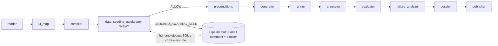

# SPEC — `data_seeding_gatekeeper` — Nueva etapa pre-test de Sembrado de Datos con Human-in-the-Loop

> **Resumen ejecutivo.** Insertar una **nueva etapa explícita** en el pipeline QA UAT que, antes de generar y ejecutar tests Playwright, verifique que la base de datos QA contiene los datos requeridos por cada escenario. Si **falta data**, la herramienta genera **scripts SQL `INSERT` / `UPDATE`** alineados al **schema real** de la BD (DDL introspectado, no hardcodeado), **detiene el pipeline**, **pide al humano** que ejecute los scripts (porque el agente corre con cuenta READ-ONLY), y **espera** una confirmación explícita. Tras la confirmación, **re-verifica** la data y, sólo si efectivamente quedó sembrada, continúa con el testing.

---

## 1. Motivación y problema

### 1.1 Estado actual

El pipeline QA UAT actual (`qa_uat_pipeline.py`, `_STAGE_NAMES`) ya tiene la etapa `preconditions` (`uat_precondition_checker.py`):

- ✅ Verifica que existen RIDIOMA aplicados.
- ✅ Verifica que existen filas en tablas listadas en `datos_requeridos`.
- ✅ Hace `check_data_readiness()` (grid/record/permission/api) para algunos casos.
- ✅ Cuando falla emite `data_readiness.json` y un `seed_sql_suggestion.sql` muy genérico (sólo 2 entidades hardcodeadas: `ROBLG`, `CLCLIE`).

**Brechas:**

1. La generación de SQL es **template-based y limitada** — no introspecta el schema real (`INFORMATION_SCHEMA.COLUMNS`, FKs, NOT NULL, defaults), por lo que los `INSERTs` que sugiere fallan o son incompletos en entidades reales (`RAGEN`, `ROBLG`, `RCLIE`, `RACOMI`, etc.).
2. **No bloquea el pipeline** de forma efectiva: hoy el `preconditions` retorna `BLOCKED` y el pipeline termina con error. **No abre un blocker resoluble por humano** ni provee mecanismo de `--resume`.
3. **No diferencia INSERT vs UPDATE**: si la fila existe pero le faltan flags (p. ej. `ACTIVO=1`, `RESELL=1`), el pipeline no propone parches.
4. **No re-verifica** que la data fue efectivamente sembrada tras la intervención humana.
5. Componentes existentes (`sql_seed_generator.py`, `seed_executor.py`, `sql_safety_validator.py`, `human_unlock.py`, `blocker_registry.py`, `schema_explorer.py`, `data_resolution_broker.py`) **están sueltos**: no hay una etapa orquestada que los conecte en el flujo `verify → propose → block → wait → re-verify → resume`.

### 1.2 Resultado esperado

Una nueva etapa **`data_seeding_gatekeeper`** que:

- Se ubica entre `compiler` y `preconditions` (o reemplaza/extiende `preconditions`).
- Lee `scenarios.json` y `data_contract.json`.
- Verifica readiness por escenario.
- Si todo OK → emite `ALLOW`, continúa.
- Si falta data → genera SQL **schema-aware**, escribe artefactos, **registra blocker via `HumanUnlock`**, **detiene el pipeline con exit code de blocker (no error)**, y deja un comentario en ADO con instrucciones.
- El humano ejecuta los scripts. Reanuda con `--resume --blocker <id> --answer applied`.
- Al reanudar: re-corre la verificación. Si pasa → ALLOW; si no → reabre blocker (hasta `max_attempts`).

---

## 2. Alcance

### 2.1 Hace

- Verificar precondiciones de datos por escenario (read-only, cuenta `RSPACIFICOREAD`).
- Inferir entidades requeridas desde `scenarios.json::precondiciones`, `datos_requeridos`, `intent_spec.inputs`, `playbook.steps[*].requires_data`.
- Introspectar el schema de las tablas afectadas (`INFORMATION_SCHEMA.COLUMNS`, `KEY_COLUMN_USAGE`, defaults) via `schema_explorer.py`.
- Generar SQL `INSERT` idempotente (`IF NOT EXISTS … INSERT`) o `UPDATE` parcial cuando la fila existe pero algún flag no cumple.
- Etiquetar todo registro con `QA_UAT_SEED_<scenario_id>_<seed_run_id>` (columna `QA_LABEL` o tabla auxiliar `RSPACIFICO.QA_SEED_LEDGER` si la tabla destino no tiene esa columna).
- Generar contrapartes `cleanup_proposal_<scenario_id>.sql` para rollback post-test.
- Pasar el SQL por `sql_safety_validator.py` (anti-PROD, anti-DROP/TRUNCATE/DELETE-sin-WHERE).
- Registrar blocker con `HumanUnlock.block(...)`.
- Detener el pipeline retornando `verdict=BLOCKED_AWAITING_SEED`, `exit_code=2` (no 1: no es error).
- Publicar en ADO un comentario "🛑 QA UAT bloqueado — falta data" con resumen, paths a los `.sql` y la respuesta esperada.
- Al `--resume`: re-correr la verificación; sólo continuar si readiness=ALLOW.
- Emitir eventos forenses: `data_seed_check_started`, `data_seed_proposal_generated`, `data_seed_blocker_registered`, `data_seed_resume_received`, `data_seed_reverification_passed|failed`.

### 2.2 NO hace

- ❌ NO ejecuta DDL/DML automáticamente. **El humano ejecuta**. (`seed_executor.py` queda como tool opcional separada, requiere `QA_UAT_SEED_WRITER_DB_URL` + flag explícito `--auto-seed` que está **fuera de scope** de este SPEC).
- ❌ NO modifica `RIDIOMA`. Los textos siguen el flujo del developer.
- ❌ NO toca PROD (validado por `sql_safety_validator` + `DB_NAME() LIKE '%PROD%'` guard en cada script).
- ❌ NO genera datos sintéticos arbitrarios: usa **valores observados** del análisis técnico, `datos_requeridos`, defaults del schema y catálogos existentes.
- ❌ NO reemplaza `uat_precondition_checker.py` por completo en V1 — coexisten; en V2 se podrá deprecar la parte de seed templates hardcodeada.

---

## 3. Posición en el pipeline



Actualización a `_STAGE_NAMES` en `qa_uat_pipeline.py`:

```python
_STAGE_NAMES = [
    "reader",
    "ui_map",
    "compiler",
    "data_seeding_gatekeeper",   # ← NUEVO
    "preconditions",
    "generator",
    "runner",
    "annotator",
    "evaluator",
    "failure_analyzer",
    "dossier",
    "publisher",
]
```

**Por qué antes de `preconditions`** y no reemplazándolo: `preconditions` valida muchas cosas además de data (RIDIOMA aplicados, env vars, alcance funcional). Mantenemos separación de responsabilidades.

---

## 4. Componentes — nuevos y reutilizados

### 4.1 Nuevos

| Módulo | Responsabilidad |
|---|---|
| `data_seeding_gatekeeper.py` | Orquestador de la nueva etapa. CLI + función `run()` invocable desde el pipeline. |
| `schema_aware_seed_builder.py` | Genera `INSERT`/`UPDATE` introspectando schema real (FKs, NOT NULL, defaults, identity). |
| `data_gap_classifier.py` | Clasifica gap por escenario: `MISSING_ROW`, `STALE_ROW`, `WRONG_FLAG`, `MISSING_FK_PARENT`, `MISSING_CATALOG_ENTRY`. |
| `seed_human_handshake.py` | Capa thin sobre `HumanUnlock` con preguntas/answers estandarizadas (`applied`, `applied_with_modifications`, `cannot_apply`, `skip_scenario`). |
| `seed_ledger.py` | Lectura/escritura de `RSPACIFICO.QA_SEED_LEDGER` (creada por DDL versionado en migrations/) para auditoría de seeds aplicados. |

### 4.2 Reutilizados (existentes, sin cambios o con extensión menor)

| Módulo | Uso |
|---|---|
| `schema_explorer.py` | `get_columns(table)`, `get_pk(table)`, `get_fks(table)`, `get_defaults(table)`. **Extender** si hace falta para devolver tipos SQL Server completos. |
| `sql_safety_validator.py` | Valida que el SQL generado cumple invariantes (BEGIN TRAN, ROLLBACK por defecto, PROD guard, no DDL destructivo). |
| `sql_seed_generator.py` | **Será refactorizado** para delegar la construcción concreta a `schema_aware_seed_builder.py`. Mantiene su contrato público. |
| `human_unlock.py` + `blocker_registry.py` | Lifecycle del blocker: `register → present → resolve`. |
| `uat_precondition_checker.check_data_readiness()` | Reutilizado como verificador read-only en pre y post seeding. |
| `execution_logger.py` / `forensic_event_logger.py` | Emisión de eventos. |
| `ado_evidence_publisher.py` | **Pequeño cambio**: aceptar `mode=blocker_notification` para publicar el comentario "bloqueado" con paths a los `.sql`. |

---

## 5. Contratos (inputs / outputs / artefactos)

### 5.1 Input principal

`evidence/<ticket_id>/<run_id>/scenarios.json` (de `uat_scenario_compiler.py`):

Cada `scenario` debe traer:

```jsonc
{
  "scenario_id": "RF-008-CA-03",
  "precondiciones": ["Existe cliente CLCOD=12345 con ACTIVO=1", "RIDIOMA 9301-9303 aplicados"],
  "datos_requeridos": [
    {"tabla": "RCLIE", "filtro": "CLCOD=12345 AND ACTIVO=1"},
    {"tabla": "ROBLG", "filtro": "CLCOD=12345 AND ESTADO='V'"}
  ],
  "data_contract": {                // Opcional — si el compiler lo emite explícito
    "entities": [
      {"table": "RCLIE", "pk": {"CLCOD": 12345}, "must_exist": true, "expected_columns": {"ACTIVO": 1, "CLNOMB": "TEST QA"}},
      {"table": "ROBLG", "filter": {"CLCOD": 12345, "ESTADO": "V"}, "min_rows": 3}
    ]
  }
}
```

> **Nota**: si `data_contract` no existe, `data_gap_classifier` lo **infiere** a partir de `datos_requeridos` + parseo de `precondiciones` con `precondition_parser.py`.

### 5.2 Output principal — `data_seeding_gatekeeper_result.json`

```jsonc
{
  "schema_version": "data_seeding_gatekeeper/1.0",
  "ticket_id": 70,
  "run_id": "uat-70-2026-05-14T12-30-00Z",
  "seed_run_id": "seed-uat-70-2026-05-14T12-30-00Z",
  "verdict": "ALLOW | BLOCKED_AWAITING_SEED | BLOCKED_UNSAFE_SQL | ERROR",
  "summary": {
    "scenarios_total": 6,
    "scenarios_ready": 4,
    "scenarios_blocked": 2,
    "gaps_total": 5,
    "scripts_generated": 2,
    "scripts_passed_safety": 2,
    "blocker_id": "blk-...."
  },
  "scenarios": {
    "RF-008-CA-03": {
      "ready": false,
      "gaps": [
        {"table": "RCLIE", "type": "MISSING_ROW", "filter": {"CLCOD": 12345}, "suggested_action": "INSERT"},
        {"table": "ROBLG", "type": "MISSING_ROW", "filter": {"CLCOD": 12345, "ESTADO": "V"}, "min_rows": 3, "actual_rows": 0, "suggested_action": "INSERT_BULK"}
      ],
      "seed_script_path": "evidence/70/<run>/seed/seed_RF-008-CA-03.sql",
      "cleanup_script_path": "evidence/70/<run>/seed/cleanup_RF-008-CA-03.sql",
      "safety_passed": true,
      "blocker_id": "blk-xxx"
    },
    "RF-008-CA-01": { "ready": true, "gaps": [] }
  },
  "human_instructions": "Ver evidence/70/<run>/seed/INSTRUCCIONES_SEED.md",
  "elapsed_ms": 4321
}
```

### 5.3 Artefactos en evidence

```
evidence/<ticket_id>/<run_id>/
├── data_seeding_gatekeeper_result.json
├── seed/
│   ├── INSTRUCCIONES_SEED.md              ← humano lee esto primero
│   ├── seed_RF-008-CA-03.sql               ← INSERT/UPDATE schema-aware, ROLLBACK por defecto
│   ├── cleanup_RF-008-CA-03.sql            ← DELETEs por QA_LABEL
│   ├── seed_RF-008-CA-04.sql
│   ├── cleanup_RF-008-CA-04.sql
│   ├── safety_validation.json              ← reportes de sql_safety_validator
│   └── seed_ledger_entries.json            ← qué QA_LABEL se espera tras aplicación
├── blockers/
│   └── blk-xxx.json                        ← creado por HumanUnlock
└── execution.jsonl                         ← eventos forenses
```

### 5.4 Estructura del script seed (template invariante)

```sql
/* ============================================================
 * QA_UAT_SEED_PROPOSAL — Ticket: 70, Scenario: RF-008-CA-03
 * Generated: 2026-05-14T12:30:00Z by data_seeding_gatekeeper v1.0
 * Seed Run Id: seed-uat-70-2026-05-14T12-30-00Z
 * IMPORTANTE:
 *   - Por defecto este script termina con ROLLBACK.
 *   - Para aplicar definitivamente, descomentar la línea "COMMIT TRANSACTION;"
 *     al final, AL CONFIRMAR que es el ambiente QA correcto.
 *   - El cleanup correspondiente está en cleanup_RF-008-CA-03.sql.
 * ============================================================ */
SET XACT_ABORT ON;
SET NOCOUNT ON;
BEGIN TRANSACTION;

DECLARE @SeedRunId VARCHAR(64) = 'seed-uat-70-2026-05-14T12-30-00Z';
DECLARE @ScenarioId VARCHAR(64) = 'RF-008-CA-03';
DECLARE @QALabel VARCHAR(128) = 'QA_UAT_SEED_' + @ScenarioId + '_' + @SeedRunId;

-- ── PROD GUARD (no remover) ──
IF DB_NAME() LIKE '%PROD%' OR DB_NAME() LIKE '%PRD%'
BEGIN
    RAISERROR('ABORT: data_seeding_gatekeeper detected PROD database. Refusing to run.', 16, 1);
    ROLLBACK TRANSACTION; RETURN;
END

-- ── Entidad 1: RCLIE (CLCOD=12345) — schema-aware INSERT idempotente ──
IF NOT EXISTS (SELECT 1 FROM RSPACIFICO.RCLIE WHERE CLCOD = 12345)
BEGIN
    INSERT INTO RSPACIFICO.RCLIE (CLCOD, CLNOMB, ACTIVO, FECALT /*, ... columnas NOT NULL ... */)
    VALUES (12345, 'TEST QA - SEED', 1, SYSUTCDATETIME());
END
ELSE
BEGIN
    -- WRONG_FLAG: si existe pero ACTIVO != 1, actualizar
    UPDATE RSPACIFICO.RCLIE SET ACTIVO = 1 WHERE CLCOD = 12345 AND ACTIVO <> 1;
END

-- ── Entidad 2: ROBLG (3 obligaciones para CLCOD=12345, ESTADO='V') ──
DECLARE @rows_existing INT = (SELECT COUNT(*) FROM RSPACIFICO.ROBLG WHERE CLCOD = 12345 AND ESTADO = 'V');
WHILE @rows_existing < 3
BEGIN
    INSERT INTO RSPACIFICO.ROBLG (CLCOD, ESTADO, FECVTO, QA_LABEL /*, defaults ... */)
    VALUES (12345, 'V', DATEADD(DAY, 7, SYSUTCDATETIME()), @QALabel);
    SET @rows_existing = @rows_existing + 1;
END

-- ── Ledger ──
INSERT INTO RSPACIFICO.QA_SEED_LEDGER (SeedRunId, ScenarioId, AppliedAt, AppliedBy, Tables)
VALUES (@SeedRunId, @ScenarioId, SYSUTCDATETIME(), SUSER_SNAME(), 'RCLIE,ROBLG');

-- ── Verificación post-INSERT (debe ir antes de ROLLBACK/COMMIT) ──
SELECT 'RCLIE' AS Tabla, COUNT(*) AS Filas FROM RSPACIFICO.RCLIE WHERE CLCOD = 12345
UNION ALL
SELECT 'ROBLG', COUNT(*) FROM RSPACIFICO.ROBLG WHERE CLCOD = 12345 AND ESTADO = 'V';

-- ── Cierre de transacción ──
-- Por defecto, NO persistir:
ROLLBACK TRANSACTION;
-- Para aplicar definitivamente, COMENTAR el ROLLBACK de arriba y DESCOMENTAR:
-- COMMIT TRANSACTION;
```

> **Por qué `ROLLBACK` por defecto y no `COMMIT`**: garantiza que un humano que ejecute el script "para mirar" no escriba sin querer. El humano debe **intencionalmente** invertir esas dos líneas para persistir. Esto está validado por `sql_safety_validator`.

### 5.5 Estructura del cleanup

```sql
/* CLEANUP — Ticket 70, Scenario RF-008-CA-03 — seed-uat-70-... */
BEGIN TRANSACTION;
DECLARE @QALabel VARCHAR(128) = 'QA_UAT_SEED_RF-008-CA-03_seed-uat-70-...';

DELETE FROM RSPACIFICO.ROBLG WHERE QA_LABEL = @QALabel;
-- RCLIE: solo borrar si fue creado por seed (no si ya existía)
DELETE FROM RSPACIFICO.RCLIE
WHERE CLCOD = 12345
  AND EXISTS (SELECT 1 FROM RSPACIFICO.QA_SEED_LEDGER WHERE SeedRunId = 'seed-uat-70-...');

DELETE FROM RSPACIFICO.QA_SEED_LEDGER WHERE SeedRunId = 'seed-uat-70-...';

-- Idem: ROLLBACK por defecto, COMMIT manual.
ROLLBACK TRANSACTION;
-- COMMIT TRANSACTION;
```

### 5.6 `INSTRUCCIONES_SEED.md` (lo que el humano lee)

```markdown
# 🛑 QA UAT bloqueado — falta data en BD QA

**Ticket:** 70 — RF-008 Alta de cliente y obligaciones
**Run:** uat-70-2026-05-14T12-30-00Z
**Blocker ID:** blk-xxx

## Qué pasó
2 de 6 escenarios no pueden ejecutarse porque falta data en BD QA:

- `RF-008-CA-03` → faltan: cliente CLCOD=12345 ACTIVO=1; 3 obligaciones vigentes.
- `RF-008-CA-04` → falta: ...

## Qué tenés que hacer
1. Abrir SSMS conectado a **aisbddev02** (no PROD).
2. Abrir y **revisar** `seed/seed_RF-008-CA-03.sql` y `seed/seed_RF-008-CA-04.sql`.
3. En cada uno: comentá la línea `ROLLBACK TRANSACTION;` y descomentá `COMMIT TRANSACTION;`.
4. Ejecutalos.
5. Confirmá en el run del agente:

   ```bash
   python qa_uat_pipeline.py --ticket 70 --resume --blocker blk-xxx --answer applied
   ```

## Si no podés aplicar (data sensible, schema cambió, etc.)
Respondé `cannot_apply` y el run quedará BLOCKED en ADO con tu motivo.

## Cleanup (después del test)
Cuando el run termine, ejecutá los scripts en `seed/cleanup_*.sql` para limpiar los datos sembrados.
```

---

## 6. Algoritmo detallado

### 6.1 `run(ticket_id, run_id, scenarios_path, evidence_dir, exec_logger, ...)`

```
1. Cargar scenarios.json (validar `ok=true`).
2. Para cada scenario:
   2.1 data_gap_classifier.classify(scenario) → List[Gap]
       - usa precondition_parser sobre `precondiciones`
       - usa `datos_requeridos`
       - merge con data_contract si existe
       - normaliza a Gap: {table, type, filter, expected_columns, min_rows, fk_chain}
   2.2 Para cada Gap, decidir acción:
       - MISSING_ROW            → INSERT
       - STALE_ROW (fila ok pero algún flag/valor difiere) → UPDATE
       - WRONG_FLAG             → UPDATE (subconjunto de STALE_ROW)
       - MISSING_FK_PARENT      → INSERT padre primero (recursión limitada con detector de ciclos)
       - MISSING_CATALOG_ENTRY  → INSERT en tabla de catálogo (RAGTIP, RAGMOT, …)
       - GRID_EMPTY (min_rows>0)→ INSERT_BULK (loop INSERT en script)
   2.3 schema_aware_seed_builder.build(gaps) → seed_sql, cleanup_sql
       - introspecta schema_explorer.get_columns/pk/fks/defaults/identity
       - rellena NOT NULLs con defaults conocidos del schema o valores observados
       - usa pyodbc parameter binding NO — esto es un script para humano, no execute
3. Si scripts_generated > 0:
   3.1 Para cada script: sql_safety_validator.validate(sql) → si falla, ABORTAR con verdict=BLOCKED_UNSAFE_SQL.
   3.2 Escribir scripts + cleanup + INSTRUCCIONES_SEED.md + result.json.
   3.3 Llamar a ado_evidence_publisher.publish_blocker_comment(ticket_id, blocker_id, summary).
   3.4 human_unlock.block(stage='data_seeding_gatekeeper', reason='missing_seed_data', question=..., options=[applied|applied_with_modifications|cannot_apply|skip_scenario], extra={scripts: [...]}) → blocker_id
   3.5 Emitir eventos forenses.
   3.6 Retornar verdict=BLOCKED_AWAITING_SEED. exit_code=2.
4. Si scripts_generated == 0:
   4.1 Verdict=ALLOW. Pipeline sigue.
```

### 6.2 `resume(blocker_id, answer)` (modo `--resume`)

```
1. Cargar blocker desde blocker_registry.
2. Validar que stage == 'data_seeding_gatekeeper' y status == 'open'.
3. Switch answer:
   - 'applied' / 'applied_with_modifications':
       a. Re-correr verificación read-only sobre los scenarios bloqueados.
       b. Si readiness=ALLOW → marcar blocker resolved, emitir data_seed_reverification_passed,
          retornar control al pipeline para continuar con preconditions.
       c. Si readiness=BLOCKED y reattempts < MAX_REATTEMPTS (=3):
          - Re-generar scripts (puede haber cambiado el estado parcial), reabrir blocker.
          - Emitir data_seed_reverification_failed.
       d. Si reattempts >= MAX_REATTEMPTS → escalar: verdict=BLOCKED_REATTEMPTS_EXHAUSTED.
   - 'cannot_apply':
       a. Marcar todos los escenarios bloqueados como SKIPPED_DUE_TO_SEED.
       b. Si quedan escenarios ALLOW, continuar pipeline sólo con esos.
       c. Si no queda ninguno, verdict=BLOCKED_HUMAN_DECLINED + cerrar run.
   - 'skip_scenario':
       a. Requiere extra={scenario_ids: [...]}. Marcar esos SKIPPED, continuar con el resto.
4. Persistir resolución, escribir resume_audit.json.
```

### 6.3 Resiliencia y guardrails

- **Idempotencia**: `seed_run_id` es determinístico por `(ticket_id, run_id)` salvo que `--force-new-seed` se pase. Re-correr la etapa sobre el mismo run no genera scripts duplicados — sobreescribe los `seed_*.sql`.
- **Anti-ciclo en FKs**: `schema_aware_seed_builder` mantiene un set `visited_tables` y aborta con `verdict=ERROR reason=FK_CYCLE_DETECTED` si detecta ciclo (esto **nunca** debería pasar en la BD real pero hay tablas auto-referenciales).
- **Profundidad máxima de FK**: `MAX_FK_DEPTH=4`. Si el grafo requiere más, abrir blocker con `reason=DEEP_FK_CHAIN_REQUIRES_HUMAN`.
- **Tablas safe-list**: solo se generan scripts contra tablas devueltas por `schema_explorer.get_tables_for_guard()` + lista estática. Si la entidad no está, emitir `reason=TABLE_NOT_IN_SAFELIST` y NO generar SQL.
- **Validación de safety**: si `sql_safety_validator` falla, no se entrega el script al humano — se publica el reporte de fallo y verdict=BLOCKED_UNSAFE_SQL (bug en el builder, debe investigarse).
- **Sin credenciales en el script**: nunca embebido `UID/PWD`. El humano usa su sesión SSMS.

---

## 7. Eventos forenses (execution.jsonl)

| Evento | Cuándo | Campos clave |
|---|---|---|
| `data_seed_check_started` | inicio de `run()` | ticket_id, run_id, scenarios_total |
| `data_seed_gap_detected` | por cada Gap | scenario_id, table, type, filter |
| `data_seed_proposal_generated` | tras escribir cada `seed_*.sql` | scenario_id, script_path, sha256, safety_passed |
| `data_seed_safety_validation_failed` | falló safety | scenario_id, script_path, violations[] |
| `data_seed_blocker_registered` | abrir blocker | blocker_id, scenarios_blocked[] |
| `data_seed_ado_comment_published` | comentario en ADO | ticket_id, blocker_id, comment_id |
| `data_seed_resume_received` | `--resume` | blocker_id, answer, reattempt_count |
| `data_seed_reverification_passed` | re-check OK | scenarios_now_ready[] |
| `data_seed_reverification_failed` | re-check sigue blocked | scenarios_still_blocked[], reattempt_count |
| `data_seed_reattempts_exhausted` | >MAX_REATTEMPTS | ticket_id, blocker_id |
| `data_seed_check_completed` | fin de `run()`/`resume()` | verdict, elapsed_ms |

---

## 8. CLI

```bash
# Modo normal — corre como parte del pipeline
python qa_uat_pipeline.py --ticket 70

# Si bloquea, el pipeline imprime:
#   verdict=BLOCKED_AWAITING_SEED blocker_id=blk-xxx
#   Ver evidence/70/<run>/seed/INSTRUCCIONES_SEED.md
#   exit code: 2

# Reanudar tras seed manual
python qa_uat_pipeline.py --ticket 70 --resume --blocker blk-xxx --answer applied

# Standalone (debug)
python data_seeding_gatekeeper.py \
  --ticket 70 \
  --scenarios evidence/70/<run>/scenarios.json \
  --evidence-dir evidence/70/<run>/ \
  [--dry-run]                  # no escribe scripts, solo informa gaps
  [--no-block]                 # genera scripts pero no abre blocker (uso CI)
  [--max-reattempts 3]
  [--verbose]
```

`exit codes`:

| Code | Significado |
|---|---|
| 0 | ALLOW — todo listo |
| 2 | BLOCKED_AWAITING_SEED (no es error, es pausa esperando humano) |
| 3 | BLOCKED_UNSAFE_SQL (bug del builder) |
| 4 | BLOCKED_REATTEMPTS_EXHAUSTED |
| 1 | ERROR genérico (env vars faltantes, BD caída, scenarios.json inválido, FK cycle) |

---

## 9. Cambios concretos en archivos existentes

| Archivo | Cambio |
|---|---|
| `qa_uat_pipeline.py` | Agregar `data_seeding_gatekeeper` a `_STAGE_NAMES`. Implementar handler de stage que invoca `data_seeding_gatekeeper.run()`. Soportar `--resume --blocker --answer`. Mapear `verdict=BLOCKED_AWAITING_SEED` a `exit code 2` y a `_finalize_run_manifest(status="blocked")`. Re-routing: si el answer fue `cannot_apply` o `skip_scenario`, filtrar `scenarios.json` antes de pasar a `preconditions`. |
| `uat_scenario_compiler.py` | Asegurar que `scenarios.json` emite `data_contract` cuando el technical analysis lo provee (campo nuevo opcional, backward-compat). |
| `sql_seed_generator.py` | Refactor: delegar la construcción concreta a `schema_aware_seed_builder.build()`. Mantener contrato público. Deprecar `_SEED_SQL_TEMPLATES` hardcodeado (warning + fallback solo si introspección falla). |
| `uat_precondition_checker.py` | Conservar la verificación read-only. Marcar `generate_seed_sql()` como **DEPRECATED, use data_seeding_gatekeeper**. |
| `ado_evidence_publisher.py` | Nuevo modo `blocker_notification`: publica comentario con instrucciones de seeding + idempotencia (marker `<!-- stacky-qa-uat:blocker id="blk-xxx" -->`). |
| `schema_explorer.py` | Asegurar exporta `get_columns(table)`, `get_pk(table)`, `get_fks(table, depth)`, `get_defaults(table)`, `get_identity_columns(table)`. Extender si falta. |
| `human_unlock.py` | Sin cambios (API ya cubre el caso). |
| `blocker_registry.py` | Asegurar que persiste `extra.scripts[]` y `extra.scenarios_blocked[]`. |

---

## 10. DDL nuevo — `QA_SEED_LEDGER`

Archivo: `Tools/Stacky/Stacky tools/QA UAT Agent/migrations/001_qa_seed_ledger.sql`

```sql
IF NOT EXISTS (SELECT 1 FROM sys.objects WHERE name = 'QA_SEED_LEDGER' AND type = 'U')
BEGIN
    CREATE TABLE RSPACIFICO.QA_SEED_LEDGER (
        SeedLedgerId BIGINT IDENTITY(1,1) PRIMARY KEY,
        SeedRunId    VARCHAR(64)  NOT NULL,
        ScenarioId   VARCHAR(64)  NOT NULL,
        TicketId     INT          NULL,
        AppliedAt    DATETIME2    NOT NULL DEFAULT SYSUTCDATETIME(),
        AppliedBy    NVARCHAR(128) NOT NULL DEFAULT SUSER_SNAME(),
        Tables       NVARCHAR(512) NULL,
        CleanedUpAt  DATETIME2    NULL,
        CONSTRAINT UQ_QA_SEED_LEDGER UNIQUE (SeedRunId, ScenarioId)
    );
    CREATE INDEX IX_QA_SEED_LEDGER_SeedRunId ON RSPACIFICO.QA_SEED_LEDGER(SeedRunId);
END
```

Solo se aplica en ambientes QA/DEV. Esta tabla es **observabilidad de seeds** — no es funcional para la app.

---

## 11. Seguridad

| Riesgo | Mitigación |
|---|---|
| Ejecutar SQL en PROD por error | `DB_NAME() LIKE '%PROD%'` guard en cada script + `sql_safety_validator` rechaza scripts sin guard + nombre de DSN en `RS_QA_DB_DSN` ≠ PROD chequeado por `environment_preflight`. |
| SQL injection vía `filter` malicioso | `scenarios.json` viene del pipeline interno (compiler), no de input externo. Aún así: `schema_aware_seed_builder` escapa identificadores con `QUOTENAME()` y rechaza nombres de columna no `^[A-Za-z_][A-Za-z0-9_]*$`. |
| Sembrar PII | Valores `expected_columns` provienen de `analisis_tecnico` (revisado por humano). Si una columna marcada como PII en `data_policy.yml` no tiene valor sintético, generar `reason=PII_NEEDS_HUMAN_VALUE` y dejar `__REEMPLAZAR__` con comentario. |
| Borrar data de otros tests con cleanup | `cleanup_*.sql` solo borra por `QA_LABEL = QA_UAT_SEED_<scenario>_<seed_run_id>`. **Nunca** por filtros funcionales sueltos. |
| Resume falsamente reportando "applied" sin haber ejecutado | La re-verificación read-only es **autoritativa**: si readiness sigue blocked, se rechaza el resume. |
| El humano edita el script y rompe la idempotencia | El blocker registra `script_sha256`. Si al re-verificar la BD no coincide con lo esperado, se loguea pero no falla — la verdad la tiene la verificación read-only. |

---

## 12. Tests

### 12.1 Unit

| Test | Archivo | Caso |
|---|---|---|
| `test_data_gap_classifier.py` | nuevo | clasifica MISSING_ROW vs STALE_ROW vs MISSING_FK_PARENT correctamente |
| `test_schema_aware_seed_builder.py` | nuevo | genera INSERT con columnas NOT NULL pobladas; respeta identity; valida PROD guard |
| `test_data_seeding_gatekeeper.py` | nuevo | run() retorna ALLOW cuando readiness OK; BLOCKED_AWAITING_SEED + scripts cuando falta data |
| `test_seed_human_handshake.py` | nuevo | resume con answer=applied + readiness OK desbloquea; con applied + readiness still blocked reabre |
| `test_sql_safety_validator.py` | extender | rechaza script sin PROD guard; rechaza DROP/TRUNCATE; acepta el template canónico |
| `test_pipeline_stage_wiring.py` | extender | pipeline halt en stage data_seeding_gatekeeper retorna exit code 2; --resume reanuda en preconditions |

### 12.2 Integration (smoke)

- `smoke_phase5_seeding.py` nuevo: corre el pipeline contra un ticket sintético con `RCLIE` faltante; valida que genera script y abre blocker; ejecuta el script via `seed_executor.py` en una BD local de test; corre `--resume`; valida que el pipeline continúa hasta dossier.

### 12.3 Evals (LLM)

- `evals/qa_uat_triage/ticket_NNN_seed_required.json` — fixture donde el técnico declara precondición "Existe cliente CLCOD=X" y la BD está vacía: el triage debe clasificar la causa como `DATA/MISSING_SEED` y el agente debe proponer la nueva etapa.

---

## 13. Migración y rollout

### Fase A — landing (1 sprint)
- Implementar módulos nuevos detrás de feature flag `QA_UAT_ENABLE_SEEDING_GATEKEEPER=true`.
- Aplicar DDL `QA_SEED_LEDGER` en aisbddev02.
- Tests unitarios + smoke contra ticket 70 (sin tocar PROD).

### Fase B — adopción gradual (1 sprint)
- Activar el flag por defecto en `agent_config.json`.
- Mantener `uat_precondition_checker.generate_seed_sql()` como fallback con warning.
- Capturar métricas: % de runs bloqueados por seed, tiempo medio de resolución humana, tasa de reattempts.

### Fase C — consolidación
- Deprecar el código legacy en `uat_precondition_checker.py` (mantener API pública intacta, vaciar implementación).
- Optionally habilitar `seed_executor.py --auto-seed` para tickets de muy bajo riesgo (flag explícito por ticket, fuera de scope V1).

### Rollback
- Desactivar `QA_UAT_ENABLE_SEEDING_GATEKEEPER=false` en `agent_config.json`.
- Pipeline vuelve a comportamiento legacy.
- Scripts ya escritos en evidence no se ejecutan retroactivamente.
- DDL `QA_SEED_LEDGER` se deja (no estorba).

---

## 14. KPIs y observabilidad

Agregar a `kpi_builder.py` / `dashboard_builder.py`:

- `qa_uat_seed_block_rate` — % de runs bloqueados por falta de data.
- `qa_uat_seed_resolution_time_p50/p95` — tiempo desde `data_seed_blocker_registered` → `data_seed_resume_received`.
- `qa_uat_seed_reattempts_avg` — promedio de re-intentos antes de ALLOW.
- `qa_uat_seed_human_declined_rate` — % de blockers cerrados con `cannot_apply`.
- `qa_uat_seed_unsafe_sql_rate` — % de scripts rechazados por safety (señal de bug en builder).

---

## 15. Checklist de implementación

- [ ] DDL `QA_SEED_LEDGER` aplicado en aisbddev02 (revisado por DBA).
- [ ] `schema_explorer.py` expone `get_columns/get_pk/get_fks/get_defaults/get_identity_columns`.
- [ ] `data_gap_classifier.py` + tests unitarios.
- [ ] `schema_aware_seed_builder.py` + tests unitarios + golden samples para RCLIE/ROBLG/RAGEN.
- [ ] `data_seeding_gatekeeper.py` orquestador + tests.
- [ ] `seed_human_handshake.py` + tests.
- [ ] `seed_ledger.py` (read/write QA_SEED_LEDGER) + tests.
- [ ] Refactor `sql_seed_generator.py` para delegar al builder.
- [ ] Marcar deprecado `uat_precondition_checker.generate_seed_sql()`.
- [ ] Pipeline `qa_uat_pipeline.py`: agregar stage, manejo de `--resume`, exit codes.
- [ ] `ado_evidence_publisher.py`: modo `blocker_notification` con marker idempotente.
- [ ] `sql_safety_validator.py`: extender invariantes para reconocer template canónico (BEGIN TRAN + PROD guard + QA_LABEL + ROLLBACK por defecto).
- [ ] Eventos forenses en `event_schema.py`.
- [ ] Smoke `smoke_phase5_seeding.py`.
- [ ] Documentación: actualizar `Agentes/qa-uat-agent/README.md` + diagrama mermaid.
- [ ] Feature flag `QA_UAT_ENABLE_SEEDING_GATEKEEPER` en `agent_config.json`.
- [ ] Métricas en `kpi_builder.py` + panel en `dashboard_builder.py`.
- [ ] PR review con `stacky-tool-architect` antes de merge.

---

## 16. Decisiones abiertas (requieren confirmación)

1. **¿Auto-aplicar seeds opcionalmente?** V1 = no. V2 podría usar `seed_executor.py` con `QA_UAT_SEED_WRITER_DB_URL` (cuenta `RSPACIFICOWRITE` solo en QA) si el ticket está marcado `auto_seed_allowed=true`. Decisión: posponer a SPEC separado.
2. **¿Bloquear UI map / generator si seeding aún no se resolvió?** Sí — pipeline halt limpio. Confirmado en §6.1 paso 3.6.
3. **¿Permitir `--answer skip_scenario` parcial?** Sí — corre los scenarios que estén ALLOW, marca el resto como `SKIPPED_DUE_TO_SEED` en dossier.
4. **¿Cómo manejar precondiciones funcionales no mapeables a tablas (ej. "usuario con rol Supervisor logueado")?** → fuera de scope de seeding gatekeeper, queda en `uat_precondition_checker` con `precondition_parser` resolviendo via `RASIST`/`RPERFIL`.

---

## 17. Referencias

- Pipeline orquestador: `qa_uat_pipeline.py` (`_STAGE_NAMES`)
- Verificación read-only actual: `uat_precondition_checker.py::check_data_readiness()`
- Generador legacy (a reemplazar): `uat_precondition_checker.py::generate_seed_sql()` y `sql_seed_generator.py`
- Validador SQL: `sql_safety_validator.py`
- Human-in-the-loop: `human_unlock.py`, `blocker_registry.py`
- Schema introspection: `schema_explorer.py`
- Publicación ADO: `ado_evidence_publisher.py`
- Reglas globales: `Agentes/shared/core_rules.md`
- SPEC hermanas: `SPEC/uat_scenario_compiler.md`, `SPEC/playwright_test_generator.md`
