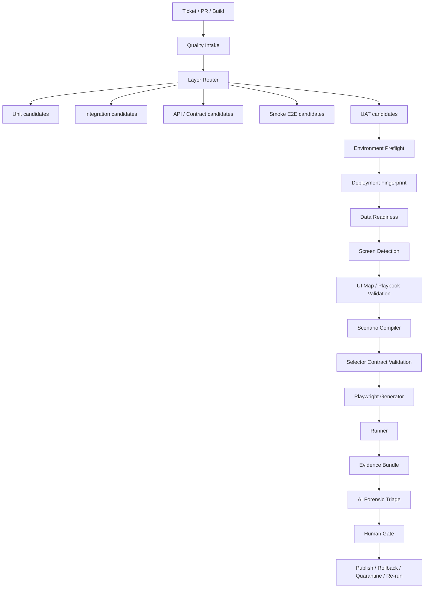

# Roadmap estratégico y técnico — QA UAT Agent estilo Big Tech

**Producto:** Stacky / Stacky Agents — QA UAT Agent  
**Área:** QA Automation, UAT, Playwright, agentes de IA, trazabilidad forense  
**Versión del roadmap:** v1.0  
**Fecha:** 2026-05-09  
**Autoría:** propuesta técnica para evolución del flujo actual hacia prácticas de automatización comparables con equipos de alta escala  
**Audiencia:** Tech Lead, QA Automation, SDET, Backend, Frontend, DevOps/SRE, Producto, líderes funcionales y operadores de Stacky Agents

---

## 0. Lectura ejecutiva

Este documento propone convertir el **QA UAT Agent** en una plataforma de calidad estratificada, observable, gobernada y asistida por IA. La meta no es simplemente “tener más tests Playwright”, sino construir un sistema que se comporte como los equipos de ingeniería maduros: ejecutar menos E2E innecesarios, validar ambiente y datos antes del navegador, producir evidencia forense completa, clasificar fallos con precisión, priorizar por riesgo y mantener al humano en el loop para decisiones de impacto.

El cambio de espíritu es este:

> Pasar de un agente que intenta generar y correr UAT desde un ticket, a un **orquestador de calidad por capas** que decide qué validar en unit, integración, API/contrato, smoke E2E o UAT; bloquea temprano cuando el ambiente o los datos no están listos; y deja evidencia suficiente para que cualquier persona entienda qué ocurrió sin leer todo el código.

La práctica de equipos tipo big tech no consiste en empujar todo a UI automation. Consiste en:

1. **Estratificar pruebas**: unit e integración cargan la mayor parte del volumen; API/contrato validan integración sin navegador; E2E/UAT queda pequeño, crítico y trazable.
2. **Fallar temprano**: deployment fingerprint, data readiness y validación de contratos antes de abrir Playwright.
3. **Tener evidencia rica**: `execution.jsonl`, JUnit, HTML report, traces, screenshots, console/network logs, UI map usado, fingerprint activo y datos de preflight.
4. **Usar IA con contratos**: generación, triage, priorización y auto-healing asistido con JSON schemas, evals y aprobación humana.
5. **Medir señal, no solo verde/rojo**: flake rate, unknown verdicts, blocked rate, time to actionable failure, cache hit rate, deployment mismatch, grid empty, selector not found.
6. **Gobernar la operación**: humanos aprueban publicación, cuarentena explícita, rollback, budgets, controles de egress y auditoría inmutable.

---

## 1. Estado actual y problema a resolver

### 1.1. Situación actual del QA UAT Agent

El QA UAT Agent actual ya tiene una base valiosa:

- Ejecuta Playwright desde Stacky Agents.
- Se integra con tickets y evidencia.
- Maneja `dry-run` y `publish`.
- Tiene un flujo de dossier/evidencia.
- Usa UI maps y generación de escenarios.
- Tiene una orientación clara a veredictos `PASS`, `FAIL`, `BLOCKED`, `MIXED`.
- Está integrado en el universo Stacky Agents, donde el humano decide cuándo ejecutar, revisar y publicar.

Sin embargo, el forense reciente mostró problemas estructurales:

| Categoría | Problema observado | Riesgo |
|---|---|---|
| **PIP** | Contrato entre stages inconsistente, `compiled=0` mal tratado, detección de pantalla incorrecta | Falsos BLOCKED, runs sin diagnóstico, `UNKNOWN` |
| **ENV** | Sin fingerprint de deploy | Ejecutar contra build incorrecto y culpar a NAV/APP |
| **OBS** | `execution.jsonl` ausente o incompleto en runs viejos/tempranos | Forense incompleto, sesiones invisibles |
| **NAV** | Timeouts genéricos y hardcodeados | Grid vacío, selector roto y ambiente mal deployado se ven igual |
| **GEN** | Aliases inventados por UI map faltante | Specs plausibles pero inválidos |
| **DATA** | No existe categoría separada para datos de prueba no listos | Se confunde dato faltante con navegación fallida |
| **AI/GOV** | Learnings registrados pero no siempre verificables como runtime behavior | Falsa sensación de aprendizaje aplicado |

### 1.2. Error conceptual a evitar

El error sería interpretar el objetivo como:

```text
“Hay que mejorar el generador Playwright para que genere más tests y falle menos.”
```

El objetivo correcto es:

```text
“Hay que rediseñar el flujo para que Playwright sea una capa final, controlada y forense, no el primer lugar donde se descubren problemas de ambiente, datos, contratos o scope.”
```

### 1.3. North Star

**North Star del QA UAT Agent:**

> Para cualquier ticket, el sistema debe decir qué se debe validar, en qué capa, contra qué ambiente/build, con qué datos, usando qué contrato de UI/API, qué evidencia produjo, cuál fue el veredicto, por qué, con qué confianza y quién debe actuar después.

---

## 2. Principios de diseño estilo Big Tech

### Principio 1 — No todo criterio de aceptación merece navegador

Cada criterio de aceptación debe pasar por un **Layer Router**:

- `unit`: reglas puras, cálculos, validaciones de dominio.
- `integration`: componentes internos, servicios, repositorios, acceso a BD controlado.
- `api_contract`: endpoints, DTOs, contratos, persistencia, respuestas.
- `component`: UI aislada, sin navegación completa.
- `smoke_e2e`: flujo mínimo crítico.
- `uat`: recorrido de negocio crítico, visible para negocio/producto.
- `manual_review`: validación que requiere juicio humano, datos productivos o ambigüedad.

Regla:

```text
Solo va a UAT automatizado lo que no pueda validarse con suficiente confianza en capas inferiores.
```

### Principio 2 — Falla temprano, falla con causa

Antes de ejecutar Playwright:

1. Validar que la URL responde.
2. Validar login o estado autenticado.
3. Validar deployment fingerprint.
4. Validar datos mínimos.
5. Validar UI map/playbook.
6. Validar scope de pantalla.
7. Validar aliases/selectores.

Si falla cualquiera de esos checks, el resultado debe ser `BLOCKED` con categoría precisa:

```text
ENV / DATA / PIP / GEN / NAV / OBS
```

No se debe llegar al runner para descubrir que no había build correcto, datos o mapa.

### Principio 3 — Evidencia o no ocurrió

Todo run debe producir evidencia, incluso si falla en el primer segundo. El mínimo obligatorio:

```text
evidence/<ticket_id>/<run_id>/
  execution.jsonl
  result.json
  effective_config.json
```

Si llegó a Playwright:

```text
  junit.xml
  playwright-report/
  trace.zip
  screenshots/
  console.log
  network.har
```

Si usó UI map:

```text
  ui_map_used.json
  selector_contract.json
```

Si hizo preflight:

```text
  deployment_fingerprint.json
  data_readiness.json
  environment_preflight.json
```

### Principio 4 — IA con contratos, no IA libre

La IA puede ayudar a:

- Extraer criterios de aceptación.
- Clasificar capas.
- Compilar escenarios.
- Generar steps Playwright.
- Hacer triage forense.
- Sugerir auto-healing.
- Priorizar ejecución.

Pero debe estar limitada por:

- JSON schemas.
- UI maps.
- playbooks aprobados.
- contracts de selectors.
- evals con fixtures.
- aprobación humana para cambios persistentes.

Regla:

```text
La IA puede proponer. El contrato valida. El humano aprueba impacto externo.
```

### Principio 5 — El humano vuelve al loop, pero con mejor señal

Stacky Agents ya tiene una filosofía correcta: el humano elige, ejecuta, revisa y publica. Este roadmap no busca volver al pipeline autónomo opaco. Busca que el operador reciba mejor diagnóstico:

- “No ejecuté porque el build activo no corresponde.”
- “No ejecuté porque el UI map de FrmDetalleClie no existe.”
- “No ejecuté porque el cliente de prueba no tiene obligaciones.”
- “Ejecuté y falló producto en AISMenu.cs con evidencia X.”
- “El fallo parece flake de selector con confianza 0.82; sugiero cuarentena temporal y fix de locator.”

### Principio 6 — Flake es deuda, no normalidad

Los retries son contención, no solución. Cada retry debe quedar registrado:

```json
{
  "event": "retry_decision",
  "reason": "PLAYWRIGHT_TIMEOUT",
  "attempt": 2,
  "max_attempts": 2,
  "trace_enabled": true
}
```

Y cada test flaky debe terminar en:

- Fix del test.
- Fix del ambiente.
- Fix de datos.
- Cuarentena con TTL y dueño.

### Principio 7 — Métricas accionables por encima de cobertura cosmética

La pregunta no es “cuántos tests tenemos”, sino:

- ¿Cuánto tarda la primera falla accionable?
- ¿Cuántos `UNKNOWN` quedan?
- ¿Cuántos BLOCKED son por ENV, DATA, NAV, GEN?
- ¿Qué porcentaje de UAT era evitable en capas inferiores?
- ¿Qué pantalla tiene más selector drift?
- ¿Qué UI maps están vencidos?
- ¿Qué tickets se ejecutaron contra build incorrecto?

### Principio 8 — Todo cambio debe tener definición de terminado

Ninguna mejora entra como “mejorar logs” o “agregar tests”. Cada mejora debe tener:

- Evento exacto.
- Campos exactos.
- Archivo/módulo a tocar.
- Test concreto.
- Criterio de aceptación.
- Métrica que debería mejorar.

---

## 3. Arquitectura objetivo

### 3.1. Diagrama de flujo objetivo



### 3.2. Capas de responsabilidad

| Capa | Responsabilidad | Ejemplos |
|---|---|---|
| **Quality Intake** | Interpretar ticket y dividir criterios | RF, CA, riesgo, layer recomendado |
| **Preflight** | Verificar si tiene sentido ejecutar | URL, login, deploy, datos, screen, UI map |
| **Compilation** | Convertir criterios UAT en escenarios ejecutables | escenarios, out_of_scope, selector aliases |
| **Generation** | Emitir Playwright válido y trazable | spec.ts, helpers, fixtures |
| **Execution** | Ejecutar con aislamiento y evidencia | traces, junit, screenshots, console, network |
| **Forensic Triage** | Clasificar causa y siguiente acción | APP, ENV, DATA, NAV, GEN, PIP, OBS |
| **Governance** | Aprobación, publicación, rollback, cuarentena | ADO/Jira/Mantis, audit chain, budgets |

### 3.3. Categorías oficiales de resultado

| Categoría | Significado | Owner primario | Ejemplo |
|---|---|---|---|
| **APP** | Bug real del producto | Dev/Product | AISMenu.cs no cumple RF |
| **ENV** | Ambiente/build/config incorrecto | DevOps/SRE | build activo no coincide con ticket |
| **DATA** | Datos de prueba insuficientes o inconsistentes | QA/Data owner | CLCOD sin obligaciones |
| **PIP** | Pipeline/contrato entre stages roto | QA Automation | compiled=0 tratado como no_tests_found |
| **GEN** | Generación inválida o contrato UI map fallido | QA Automation | alias inventado no existe |
| **NAV** | Navegación/selector/timeout real | QA Automation + Frontend | selector no visible, frame incorrecto |
| **OBS** | Observabilidad o evidencia incompleta | QA Automation/Platform | falta execution.jsonl |
| **SEC** | Seguridad/compliance/egress | Security/Platform | PII en trace o prompt |
| **OPS** | Infraestructura de runners/CI | SRE/Platform | runner sin browser deps |
| **UNKNOWN** | Estado no clasificable | Tech Lead | solo permitido como error de herramienta |

Regla dura:

```text
UNKNOWN no es un veredicto aceptable para runs nuevos. Si aparece, se abre bug P0 de la tool.
```

---

## 4. Roadmap por fases

## Fase 0 — Alineación, baseline y contratos de cambio

### Objetivo

Fijar la dirección de producto y técnica antes de tocar código. Evitar que el equipo implemente mejoras aisladas sin una arquitectura común.

### Decisiones que deben quedar aprobadas

1. `execution.jsonl` es fuente única de verdad para runs QA UAT.
2. Todo run debe tener `verdict`, `category`, `reason` y `failed_stage` cuando aplique.
3. `UNKNOWN` queda prohibido en runs nuevos.
4. `ENV`, `DATA`, `PIP`, `GEN`, `NAV`, `OBS` son categorías oficiales.
5. `deployment_fingerprint_check` será obligatorio para runs UAT reales.
6. `quality_intake` será obligatorio antes del compiler.
7. El generator no puede usar aliases no presentes en UI map/playbook aprobado.
8. La publicación a tracker requiere aprobación humana.
9. Auto-healing puede sugerir cambios, pero no commitear ni publicar sin revisión.
10. La cuarentena tiene TTL, owner y razón; no es un basurero infinito.

### Artefactos de fase

```text
docs/qa_uat_big_tech_roadmap.md
docs/qa_uat_event_contracts.md
docs/qa_uat_verdict_taxonomy.md
docs/qa_uat_operating_model.md
```

### Criterios de aceptación

- El equipo puede explicar en menos de 5 minutos cuándo un CA va a UAT y cuándo no.
- Todo PR posterior cita qué categoría mejora: OBS, ENV, DATA, PIP, GEN, NAV, OPS, SEC o AI.
- Las fases P0/P1 quedan priorizadas y no se mezclan con features cosméticas.

---

## Fase 1 — Estabilización inmediata y observabilidad mínima obligatoria

### Objetivo

Eliminar falsos `UNKNOWN`, asegurar trazabilidad de todo run y cortar los falsos BLOCKED que nacen por contratos rotos entre stages.

### Cambios P0

#### 1.1. Inicializar `ExecutionLogger` al comienzo del pipeline

**Problema:** si el pipeline falla en preflight o smoke antes de inicializar el logger, no queda `execution.jsonl`.

**Cambio:** mover la inicialización del logger al inicio absoluto de `qa_uat_pipeline.run()`.

**Contrato:** el primer evento de todo run debe ser:

```json
{
  "event": "session_start",
  "run_id": "2026-05-09T...",
  "ticket_id": 122,
  "mode": "dry-run",
  "tool": "qa_uat_agent",
  "tool_version": "qa-uat/next",
  "started_at": "2026-05-09T14:12:33.123Z",
  "operator": "...",
  "project": "..."
}
```

**Archivos a tocar:**

```text
qa_uat_pipeline.py
execution_logger.py
backend/api/qa_uat.py
```

**Tests:**

```text
test_execution_log_exists_when_environment_preflight_fails
test_execution_log_exists_when_smoke_path_fails
test_execution_log_session_start_is_first_event
test_execution_log_has_session_end_for_exception
```

**Criterio de aceptación:**

- Cualquier run, incluso si falla en el primer preflight, deja `execution.jsonl`.
- `log_analyzer` no ignora ningún ticket por ausencia de log.

---

#### 1.2. Veredictos obligatorios en toda salida

**Problema:** algunos early exits devuelven `ok=false` y `error=...` pero no `verdict`, lo que luego se convierte en `UNKNOWN`.

**Cambio:** `_build_output()` debe requerir o inferir de forma determinística:

```json
{
  "ok": false,
  "verdict": "BLOCKED",
  "category": "PIP",
  "reason": "NO_EXECUTABLE_SCENARIOS",
  "failed_stage": "compiler"
}
```

**Reglas de inferencia:**

| Condición | Verdict | Category | Reason |
|---|---|---|---|
| `compiled=0` y `out_of_scope>0` | BLOCKED | PIP | NO_EXECUTABLE_SCENARIOS |
| UI map faltante | BLOCKED | GEN | UI_MAP_MISSING |
| alias no existe | BLOCKED | GEN | SELECTOR_ALIAS_NOT_IN_UI_MAP |
| deploy mismatch | BLOCKED | ENV | DEPLOYMENT_MISMATCH |
| grid sin filas | BLOCKED | DATA | GRID_EMPTY |
| Timeout esperando selector existente | BLOCKED | NAV | SELECTOR_TIMEOUT |
| Test assert falla por comportamiento esperado | FAIL | APP | ASSERTION_FAILED |
| Todos los tests pasan | PASS | null | null |

**Archivos a tocar:**

```text
qa_uat_pipeline.py
log_analyzer.py
uat_test_runner.py
qa_dossier_builder.py
```

**Tests:**

```text
test_build_output_never_returns_null_verdict
test_pipeline_exception_returns_blocked_obs_or_pip
test_no_executable_scenarios_returns_blocked_pip
test_session_end_contains_verdict_category_reason
```

**Criterio de aceptación:**

- `grep '"verdict": null' execution.jsonl` no encuentra nada en runs nuevos.
- `log_analyzer` muestra `UNKNOWN=0` para runs nuevos.

---

#### 1.3. Evento `pipeline_verdict_decision`

**Problema:** hoy el resultado aparece, pero no siempre se entiende cómo se decidió.

**Cambio:** antes de `session_end`, registrar:

```json
{
  "event": "pipeline_verdict_decision",
  "ticket_id": 122,
  "verdict": "BLOCKED",
  "category": "GEN",
  "reason": "UI_MAP_MISSING",
  "failed_stage": "ui_map",
  "confidence": 1.0,
  "evidence_refs": [
    "ui_map_cache_result",
    "screen_detection_result"
  ],
  "human_action_required": "run ui_map_builder.py --screen FrmDetalleClie.aspx --rebuild"
}
```

**Tests:**

```text
test_verdict_decision_event_precedes_session_end
test_verdict_decision_has_evidence_refs
test_verdict_decision_has_human_action_for_blocked
```

---

#### 1.4. Corregir detección de pantalla y hacerla auditable

**Problema:** la extracción de pantallas puede caer a `FrmAgenda.aspx` aunque el ticket hable de una pantalla hija.

**Cambio:** separar `_extract_screens()` en un módulo propio:

```text
screen_detector.py
```

**Entrada:**

```json
{
  "ticket_id": 122,
  "title": "RF-008 Provincia/Dpto",
  "description_md": "...",
  "analisis_tecnico": "...",
  "plan_pruebas": "...",
  "navigation_path": "..."
}
```

**Salida:**

```json
{
  "selected_screens": ["FrmDetalleClie.aspx"],
  "matches": [
    {
      "screen": "FrmDetalleClie.aspx",
      "source": "analisis_tecnico",
      "match_type": "exact",
      "confidence": 0.95
    }
  ],
  "fallback_used": false,
  "ambiguous": false,
  "supported_screens_version": "agenda_screens.py"
}
```

**Reglas:**

- Si hay match exacto técnico, usarlo.
- Si hay alias funcional, usarlo con menor confianza.
- Si hay múltiples pantallas con confianza similar, bloquear `PIP SCREEN_AMBIGUOUS`.
- Si no hay match, bloquear `PIP LOW_CONFIDENCE_SCREEN_DETECTION`, salvo que el operador fuerce scope.
- Nunca caer silenciosamente a `FrmAgenda.aspx`.

**Archivo de alias recomendado:**

```text
screen_aliases.yml
```

Ejemplo:

```yaml
FrmDetalleClie.aspx:
  aliases:
    - detalle cliente
    - detalle de cliente
    - vista relaciones
    - mantenedor de domicilios
    - domicilio cliente
    - provincia departamento
FrmAgenda.aspx:
  aliases:
    - agenda
    - agenda principal
```

**Tests:**

```text
test_screen_detector_exact_aspx_from_analisis_tecnico
test_screen_detector_alias_detalle_cliente
test_screen_detector_description_md_is_used_even_when_description_exists
test_screen_detector_no_silent_frmagenda_fallback
test_screen_detector_ambiguous_returns_blocked
```

---

### Deliverables de Fase 1

```text
execution.jsonl siempre presente
result.json con verdict/category/reason
screen_detection.json
pipeline_verdict_decision en execution.jsonl
log_analyzer reportando UNKNOWN separado
suite regression de tickets 116, 119, 120, 122 en modo fixture
```

### Métricas esperadas

| Métrica | Antes | Después objetivo |
|---|---:|---:|
| `UNKNOWN verdict` en runs nuevos | >0 posible | 0 |
| Runs sin `execution.jsonl` | posible | 0 |
| Early-exit sin reason | posible | 0 |
| Fallback silencioso a `FrmAgenda.aspx` | posible | 0 |

---

## Fase 2 — Preflight fuerte: ambiente, deployment fingerprint y datos

### Objetivo

Evitar que Playwright descubra problemas que deberían detectarse antes: build incorrecto, ambiente caído, configuración equivocada, datos inexistentes o usuario sin permisos.

### 2.1. `deployment_fingerprint_check`

**Problema:** ticket 120 se ejecutó contra un ambiente aparentemente vivo, pero con el build equivocado.

**Cambio:** agregar un stage obligatorio antes de UI map/compiler/runner.

**Módulo nuevo:**

```text
deployment_fingerprint.py
```

**Contrato:**

```json
{
  "event": "deployment_fingerprint_check",
  "ticket_id": 120,
  "expected": {
    "build_id": "Task-120-RF-007-v2",
    "commit": "abc123",
    "branch": "feature/RF-007",
    "artifact": "AISMenu.dll",
    "artifact_sha256": "..."
  },
  "active": {
    "build_id": "Task-119",
    "commit": "def456",
    "branch": "feature/RF-006",
    "artifact": "AISMenu.dll",
    "artifact_sha256": "..."
  },
  "source": "health_endpoint|file_manifest|page_meta|manual_config",
  "matched": false,
  "decision": "BLOCKED",
  "category": "ENV",
  "reason": "DEPLOYMENT_MISMATCH",
  "elapsed_ms": 841
}
```

**Fuentes posibles de fingerprint, de mejor a peor:**

1. Endpoint `/health/version` del sistema bajo prueba.
2. Archivo `build-manifest.json` deployado junto a la app.
3. Meta tag HTML o comentario generado en la página.
4. Hash/mtime de DLLs o bundles.
5. Config manual de build activo.

**Regla:**

```text
Si no hay fuente de fingerprint y el modo es publish, bloquear.
Si no hay fuente de fingerprint y el modo es dry-run, permitir solo con warning explícito si el operador lo acepta.
```

**Archivos a tocar:**

```text
environment_preflight.py
qa_uat_pipeline.py
execution_logger.py
effective_config.json writer
backend/api/qa_uat.py
```

**Tests:**

```text
test_fingerprint_match_allows_pipeline
test_fingerprint_mismatch_blocks_before_playwright
test_fingerprint_missing_blocks_publish_mode
test_fingerprint_missing_warns_dry_run_mode
test_fingerprint_event_written_to_execution_jsonl
```

**Criterio de aceptación para ticket 120:**

Si el build activo no corresponde:

```json
{
  "verdict": "BLOCKED",
  "category": "ENV",
  "reason": "DEPLOYMENT_MISMATCH",
  "runner_started": false
}
```

---

### 2.2. `data_readiness_check`

**Problema:** un grid vacío o un cliente sin datos se confunde con navegación fallida.

**Cambio:** agregar una fase explícita de datos antes del runner.

**Módulo nuevo o ampliado:**

```text
uat_precondition_checker.py
```

**Contrato:**

```json
{
  "event": "data_readiness_check",
  "ticket_id": 120,
  "scenario_id": "RF-007-CA-01",
  "entity": "GridObligaciones",
  "input_data": {
    "CLCOD": "12345"
  },
  "expected": {
    "min_rows": 1,
    "required_columns": ["Obligacion", "Riesgo", "Corredor"]
  },
  "actual": {
    "row_count": 0,
    "columns_found": []
  },
  "decision": "BLOCKED",
  "category": "DATA",
  "reason": "GRID_EMPTY",
  "human_action_required": "seed_cliente_con_obligaciones_o_cambiar_CLCOD"
}
```

**Cómo implementarlo:**

- Preferir API/BD read-only si existe.
- Si no existe, hacer precheck UI rápido y granular.
- El precheck UI no debe ser el mismo step del test; debe ser un stage con reason propio.
- El dato de prueba debe quedar registrado en `data_readiness.json`.

**Archivos a tocar:**

```text
uat_precondition_checker.py
qa_uat_pipeline.py
playwright_test_generator.py
playwright/helpers/nav_helper.ts o helper generado equivalente
```

**Tests:**

```text
test_data_readiness_grid_empty_blocks_data_category
test_data_readiness_rows_present_allows_runner
test_data_readiness_records_clcod_and_grid_alias
test_data_readiness_no_dml_only_select_or_ui_read
```

---

### 2.3. Separar categorías DATA y NAV

**Regla nueva:**

| Caso | Categoría | Reason |
|---|---|---|
| Grid existe pero sin filas | DATA | GRID_EMPTY |
| Cliente no existe | DATA | TEST_ENTITY_NOT_FOUND |
| Usuario sin permisos para ver datos | DATA o ENV | TEST_USER_PERMISSION_MISSING |
| Selector no existe en DOM | NAV | SELECTOR_NOT_FOUND |
| Selector existe pero nunca visible | NAV | SELECTOR_TIMEOUT |
| URL/pantalla no carga | ENV/NAV | PAGE_LOAD_FAILED |
| Build incorrecto | ENV | DEPLOYMENT_MISMATCH |

**Criterio de aceptación:**

`NAVIGATION_TIMEOUT` deja de ser un diagnóstico final salvo como fallback técnico con evidencia suficiente.

---

### Deliverables de Fase 2

```text
deployment_fingerprint.py
deployment_fingerprint.json
data_readiness.json
nueva categoría DATA
preflight_summary event
bloqueo temprano antes de Playwright para ENV/DATA obvios
```

### Métricas esperadas

| Métrica | Objetivo |
|---|---:|
| `NAVIGATION_TIMEOUT` como reason final | bajar >70% |
| Runs contra build incorrecto que llegan a runner | 0 |
| BLOCKED ENV detectado antes de Playwright | 100% |
| BLOCKED DATA con causa granular | >90% de casos de datos faltantes |

---

## Fase 3 — Quality Intake y Test Portfolio por ticket

### Objetivo

Imitar la práctica madura de no mandar todo a E2E/UAT. Cada criterio de aceptación se clasifica por capa, criticidad, coste, dependencia y evidencia requerida.

### 3.1. Nuevo stage `quality_intake`

**Módulo nuevo:**

```text
quality_intake.py
```

**Entrada:** ticket, análisis funcional, análisis técnico, plan de pruebas, diffs/commits si existen.

**Salida:**

```json
{
  "ticket_id": 122,
  "feature": "RF-008 Provincia/Dpto",
  "items_total": 6,
  "items": [
    {
      "item_id": "RF-008-CA-01",
      "description": "Validar que al seleccionar provincia se filtren departamentos",
      "business_risk": "high",
      "layer_recommended": "uat",
      "needs_browser": true,
      "needs_ui_map": "FrmDetalleClie.aspx",
      "needs_data_seed": true,
      "reason": "validación visible de interacción en pantalla hija"
    },
    {
      "item_id": "RF-008-CA-02",
      "description": "Validar regla de mapeo Provincia→Departamento",
      "business_risk": "medium",
      "layer_recommended": "unit",
      "needs_browser": false,
      "reason": "regla pura validable sin UI"
    }
  ],
  "uat_required": true,
  "manual_review_required": false
}
```

**Reglas de layer routing:**

| Señal | Capa preferida |
|---|---|
| Cálculo puro, validación de campo, regla de negocio determinística | unit |
| Repositorio, servicio, BD controlada | integration |
| Endpoint, request/response, persistencia visible por API | api_contract |
| Componente UI aislable | component |
| Flujo feliz crítico con login/navegación mínima | smoke_e2e |
| Aceptación visible de negocio end-to-end | uat |
| Ambigüedad funcional o datos sensibles | manual_review |

**Evento:**

```json
{
  "event": "quality_intake_result",
  "ticket_id": 122,
  "items_total": 6,
  "layers": {
    "unit": 2,
    "integration": 1,
    "api_contract": 1,
    "uat": 2
  },
  "uat_required": true,
  "manual_review_required": false
}
```

---

### 3.2. Artefacto `test_portfolio.json`

**Propósito:** dejar documentado qué se prueba, dónde y por qué.

```json
{
  "ticket_id": 122,
  "generated_at": "2026-05-09T...Z",
  "strategy": "layered_quality_portfolio",
  "items": [
    {
      "id": "RF-008-CA-01",
      "layer": "uat",
      "priority": "P0",
      "business_risk": "high",
      "estimated_seconds": 45,
      "required_artifacts": ["trace", "screenshot", "junit", "execution_jsonl"],
      "owner": "qa_automation"
    },
    {
      "id": "RF-008-CA-02",
      "layer": "unit",
      "priority": "P1",
      "owner": "developer",
      "handoff": "crear TU en Developer Agent"
    }
  ]
}
```

**Beneficio:** el QA UAT Agent deja de fingir que todo se valida en browser y empieza a generar una estrategia de calidad completa.

---

### 3.3. Integración con Stacky Agents

Agregar al frontend:

- Panel “Quality Portfolio”.
- Chips por capa: Unit, Integration, API, Smoke, UAT, Manual.
- Botón “Generate UAT only”.
- Botón “Send unit candidates to Developer Agent”.
- Botón “Send API candidates to Technical Agent”.
- Advertencia cuando un ticket tiene demasiados CAs en UAT.

**Endpoint propuesto:**

```http
POST /api/qa-uat/intake
GET  /api/qa-uat/intake/<execution_id>
```

**Respuesta:**

```json
{
  "execution_id": 42,
  "ticket_id": 122,
  "portfolio_path": "evidence/122/run-.../test_portfolio.json",
  "uat_count": 2,
  "non_uat_count": 4
}
```

---

### Tests

```text
test_quality_intake_splits_unit_and_uat_items
test_quality_intake_ticket_122_marks_browser_items_uat
test_quality_intake_ticket_120_marks_grid_data_dependency
test_quality_intake_no_uat_items_returns_blocked_or_skipped_with_reason
test_test_portfolio_written_to_evidence
```

### Criterios de aceptación

- Todo ticket QA UAT genera `test_portfolio.json`.
- El compiler solo recibe items `layer=uat` o `layer=smoke_e2e`.
- El dossier muestra qué quedó fuera de UAT y por qué.
- Un ticket sin UAT ejecutable no termina como error, sino como `SKIPPED` o `BLOCKED PIP NO_UAT_ITEMS`, según corresponda.

---

## Fase 4 — UI map, playbooks y generación Playwright con contratos duros

### Objetivo

Eliminar specs inválidos por aliases inventados, UI maps faltantes o contratos ambiguos entre compiler y generator.

### 4.1. UI map como contrato versionado

Cada pantalla soportada debe tener un UI map versionado o un playbook aprobado. El UI map no es un cache casual: es un contrato.

**Archivo esperado:**

```text
cache/ui_maps/FrmDetalleClie.aspx.json
```

**Schema recomendado:**

```json
{
  "schema_version": "ui_map/1.1",
  "screen": "FrmDetalleClie.aspx",
  "built_at": "2026-05-09T...Z",
  "builder_version": "ui_map_builder/next",
  "source_url": "...",
  "dom_hash": "sha256:...",
  "auth_profile": "qa_uat_default",
  "elements": [
    {
      "alias_semantic": "cmbProvincia",
      "role": "combobox",
      "selector": "#cmbProvincia",
      "text": "Provincia",
      "is_visible": true,
      "is_interactive": true,
      "is_decorative": false,
      "confidence": 0.96,
      "locator_strategy": "id"
    }
  ],
  "grids": [
    {
      "alias_semantic": "GridObligaciones",
      "selector": "#GridObligaciones",
      "row_selector": "tbody tr",
      "empty_state_selectors": ["text=No hay datos", ".empty"]
    }
  ]
}
```

**Reglas:**

- Si `schema_version` no coincide, cache miss.
- Si `dom_hash` cambió mucho, warning o rebuild requerido.
- Si el selector no es interactivo y se usa en action, bloquear.
- Si el alias pedido no existe, bloquear GEN.

---

### 4.2. `selector_contract_validation`

Antes de escribir TypeScript:

```json
{
  "event": "selector_contract_validation",
  "screen": "FrmDetalleClie.aspx",
  "scenario_id": "RF-008-CA-01",
  "aliases_requested": ["ddl_provincia", "link_agregar_domicilio"],
  "aliases_available": ["cmbProvincia", "cmbDepartamento", "btnGuardar"],
  "missing_aliases": ["ddl_provincia", "link_agregar_domicilio"],
  "decision": "BLOCKED",
  "category": "GEN",
  "reason": "SELECTOR_ALIAS_NOT_IN_UI_MAP"
}
```

**Regla:**

```text
El generator no puede emitir Playwright si hay missing_aliases no resueltos.
```

**Archivos a tocar:**

```text
playwright_test_generator.py
uat_scenario_compiler.py
ui_map_builder.py
qa_uat_pipeline.py
```

**Tests:**

```text
test_generator_blocks_alias_not_in_ui_map
test_generator_lists_missing_aliases_in_result
test_generator_does_not_write_spec_when_selector_contract_fails
test_generator_allows_aliases_from_playbook_when_declared
test_generator_blocks_decorative_element_action
```

---

### 4.3. Playbooks aprobados

Hay pantallas donde el UI map no alcanza porque la navegación tiene lógica específica. Para eso se propone un repositorio de playbooks:

```text
playbooks/
  FrmDetalleClie.aspx.yml
  FrmAgenda.aspx.yml
```

Ejemplo:

```yaml
screen: FrmDetalleClie.aspx
version: 1
owner: qa_automation
approved_by: tech_lead
steps:
  open_detalle_cliente:
    description: "Abrir detalle de cliente desde agenda"
    requires:
      - alias: txtCliente
      - alias: btnBuscar
      - alias: linkDetalleCliente
    emits:
      - screen: FrmDetalleClie.aspx
  open_mantenedor_domicilios:
    description: "Abrir mantenedor de domicilios"
    requires:
      - alias: tabRelaciones
      - alias: btnDomicilios
    emits:
      - component: MantenedorDirecciones
```

**Regla:**

- Playbook puede complementar UI map.
- Si se decide que playbook puede reemplazar UI map, debe declararse explícitamente: `ui_map_required: false`.
- El generator debe validar el orden correcto: playbook primero o UI map primero, pero sin contradicción.

---

### 4.4. Rebuild obligatorio de pantallas críticas

Pantallas mínimas a cachear:

| Pantalla | Motivo | Prioridad |
|---|---|---|
| `FrmAgenda.aspx` | pantalla base actual | P0 |
| `FrmDetalleClie.aspx` | ticket 122 / RF-008 | P0 |
| `FrmDetalleCliente.aspx` | alias/canonicalización posible | P1 |
| pantallas de obligaciones/RF-007 | ticket 120 | P1 |

**Comando:**

```bash
python ui_map_builder.py --screen FrmDetalleClie.aspx --rebuild
```

**Evento:**

```json
{
  "event": "ui_map_cache_result",
  "screen": "FrmDetalleClie.aspx",
  "cache_hit": true,
  "schema_version": "ui_map/1.1",
  "dom_hash": "sha256:...",
  "elements_count": 84,
  "interactive_count": 31,
  "grids_count": 2
}
```

---

### Criterios de aceptación

- Ticket 122 selecciona `FrmDetalleClie.aspx`, no `FrmAgenda.aspx`.
- Si falta UI map, bloquea `GEN UI_MAP_MISSING` antes de compilar/generar specs inválidos.
- Si el LLM inventa alias, bloquea `GEN SELECTOR_ALIAS_NOT_IN_UI_MAP`.
- No se genera ningún `.spec.ts` cuando el contrato de selectores falla.
- `ui_map_used.json` queda en evidencia.

---

## Fase 5 — Runner Playwright industrial: evidencia, retries controlados, timeouts configurables

### Objetivo

Hacer que Playwright produzca señal confiable y evidencia diagnóstica, no solo PASS/FAIL.

### 5.1. Configuración Playwright estándar

**Config recomendada:**

```ts
export default defineConfig({
  timeout: Number(process.env.QA_UAT_TEST_TIMEOUT_MS ?? 60000),
  expect: {
    timeout: Number(process.env.QA_UAT_EXPECT_TIMEOUT_MS ?? 10000)
  },
  retries: process.env.CI ? 1 : 0,
  workers: process.env.CI ? 2 : 1,
  reporter: [
    ['html', { outputFolder: 'playwright-report' }],
    ['junit', { outputFile: 'reports/junit.xml' }],
    ['json', { outputFile: 'reports/playwright-results.json' }]
  ],
  use: {
    trace: 'on-first-retry',
    screenshot: 'only-on-failure',
    video: 'retain-on-failure',
    actionTimeout: Number(process.env.QA_UAT_ACTION_TIMEOUT_MS ?? 15000),
    navigationTimeout: Number(process.env.QA_UAT_NAV_TIMEOUT_MS ?? 30000)
  }
});
```

**Regla:** no hardcodear timeouts en helpers o specs generados.

Variables:

```env
QA_UAT_TEST_TIMEOUT_MS=60000
QA_UAT_EXPECT_TIMEOUT_MS=10000
QA_UAT_ACTION_TIMEOUT_MS=15000
QA_UAT_NAV_TIMEOUT_MS=30000
QA_UAT_GRID_TIMEOUT_MS=5000
QA_UAT_RETRIES=1
QA_UAT_TRACE=on-first-retry
```

---

### 5.2. `nav_precheck_result`

Antes de esperar un grid o link crítico:

```json
{
  "event": "nav_precheck_result",
  "ticket_id": 120,
  "scenario_id": "RF-007-CA-01",
  "screen": "FrmDetalleClie.aspx",
  "target_alias": "GridObligaciones",
  "selector": "#GridObligaciones",
  "visible": true,
  "row_count": 0,
  "timeout_ms": 5000,
  "decision": "BLOCKED",
  "category": "DATA",
  "reason": "GRID_EMPTY"
}
```

Si selector no existe:

```json
{
  "decision": "BLOCKED",
  "category": "NAV",
  "reason": "SELECTOR_NOT_FOUND"
}
```

---

### 5.3. Clasificación post-run

El runner debe traducir fallos técnicos a categorías:

| Patrón Playwright | Clasificación |
|---|---|
| assertion de negocio falla | APP / FAIL |
| selector no encontrado | NAV / BLOCKED |
| timeout page load | ENV o NAV / BLOCKED |
| grid empty precheck | DATA / BLOCKED |
| test file no existe | PIP / BLOCKED |
| total tests = 0 | PIP / BLOCKED |
| worker crash | OPS / BLOCKED |
| trace missing | OBS / BLOCKED o warning |

**Evento:**

```json
{
  "event": "runner_summary",
  "total": 4,
  "passed": 3,
  "failed": 1,
  "blocked": 0,
  "skipped": 0,
  "retries": 1,
  "duration_ms": 98231,
  "artifacts": {
    "junit": "reports/junit.xml",
    "html_report": "playwright-report/index.html",
    "trace_count": 1,
    "screenshots_count": 1
  }
}
```

---

### 5.4. Evidencia estándar por test

Cada escenario debe producir:

```json
{
  "scenario_id": "RF-008-CA-01",
  "title": "Provincia filtra departamentos",
  "layer": "uat",
  "screen": "FrmDetalleClie.aspx",
  "status": "passed|failed|blocked|skipped",
  "duration_ms": 43122,
  "attempts": 1,
  "artifacts": {
    "trace": "test-results/.../trace.zip",
    "screenshot": "test-results/.../failure.png",
    "console": "console.log",
    "network": "network.har"
  },
  "classification": {
    "verdict": "FAIL",
    "category": "APP",
    "reason": "ASSERTION_FAILED"
  }
}
```

---

### Tests

```text
test_runner_generates_junit_html_trace_on_failure
test_runner_total_zero_is_blocked_pip_not_pass
test_runner_selector_timeout_classified_nav
test_runner_assertion_failure_classified_app
test_runner_worker_crash_classified_ops
test_timeout_values_are_read_from_env
```

---

## Fase 6 — Triage forense con IA, evals y LearningStore verificable

### Objetivo

Usar IA para explicar fallos y acelerar diagnóstico, pero con salidas estructuradas y validación. El sistema debe aprender de runs anteriores de forma verificable.

### 6.1. `failure_triage.py`

**Entrada:**

- `execution.jsonl`
- `junit.xml`
- resumen de trace
- screenshots metadata
- console/network logs resumidos
- UI map usado
- deployment fingerprint
- data readiness
- result.json

**Salida:**

```json
{
  "triage_version": "1.0",
  "ticket_id": 122,
  "run_id": "...",
  "verdict": "BLOCKED",
  "category": "GEN",
  "reason": "UI_MAP_MISSING",
  "confidence": 0.96,
  "evidence": [
    "screen_detection selected FrmDetalleClie.aspx",
    "cache/ui_maps/FrmDetalleClie.aspx.json not found",
    "generator did not run"
  ],
  "owner": "qa_automation",
  "next_action": "run ui_map_builder.py --screen FrmDetalleClie.aspx --rebuild",
  "rerun_recommended": false,
  "publish_recommended": false,
  "human_approval_required": true
}
```

**Schema:**

```json
{
  "required": ["verdict", "category", "reason", "confidence", "evidence", "owner", "next_action"],
  "properties": {
    "verdict": {"enum": ["PASS", "FAIL", "BLOCKED", "MIXED", "SKIPPED"]},
    "category": {"enum": ["APP", "ENV", "DATA", "PIP", "GEN", "NAV", "OBS", "SEC", "OPS"]},
    "confidence": {"type": "number", "minimum": 0, "maximum": 1}
  }
}
```

---

### 6.2. Evals para triage

Crear dataset:

```text
evals/qa_uat_triage/
  ticket_116_app_fail.json
  ticket_119_pass.json
  ticket_120_env_mismatch.json
  ticket_120_grid_empty.json
  ticket_122_wrong_screen.json
  ticket_122_ui_map_missing.json
  unknown_null_verdict_regression.json
  selector_alias_missing.json
```

Cada eval define:

```json
{
  "input_artifacts": "fixtures/ticket_122_ui_map_missing/",
  "expected": {
    "verdict": "BLOCKED",
    "category": "GEN",
    "reason": "UI_MAP_MISSING"
  },
  "min_confidence": 0.85
}
```

**Criterio:** el triage IA no puede entrar en modo publish si no pasa evals.

---

### 6.3. LearningStore verificable

El LearningStore no debe solo registrar learnings. Debe demostrar aplicación.

**Nuevo evento:**

```json
{
  "event": "learning_applied",
  "learning_id": "lrn-5f4bbe6f28b3",
  "category": "PIP",
  "title": "_extract_screens escanea analisis_tecnico",
  "applied_to_stage": "screen_detection",
  "input_hash": "sha256:...",
  "effect": {
    "before": "FrmAgenda.aspx",
    "after": "FrmDetalleClie.aspx"
  }
}
```

**Regla:** si un learning dice `applied=1`, debe existir una de estas evidencias:

- test que lo cubre;
- feature flag que lo activa;
- evento `learning_applied`;
- cambio versionado en contrato/schema;
- referencia en el prompt/template usado.

**Tests:**

```text
test_approved_learning_has_runtime_application_or_test_reference
test_learning_applied_event_contains_effect
test_learning_store_does_not_mark_applied_without_evidence
```

---

### 6.4. Auto-healing asistido

**No hacer:** cambiar selectores automáticamente en repo.

**Sí hacer:** sugerir cambios con evidencia.

```json
{
  "event": "selector_healing_suggestion",
  "screen": "FrmDetalleClie.aspx",
  "missing_alias": "ddl_provincia",
  "candidate_alias": "cmbProvincia",
  "candidate_selector": "#cmbProvincia",
  "confidence": 0.82,
  "basis": ["label similarity", "role=combobox", "near text Provincia"],
  "requires_human_approval": true
}
```

Estados:

```text
suggested → approved → applied → verified
          ↘ rejected
```

---

### Criterios de aceptación

- Cada run no PASS tiene `triage.json`.
- El triage produce owner y next_action.
- El triage IA se evalúa contra fixtures antes de habilitarse.
- LearningStore no puede afirmar aplicación sin evidencia.
- Auto-healing no modifica selectores sin aprobación.

---

## Fase 7 — CI/CD por carriles, Review Apps, sharding y presupuesto de ejecución

### Objetivo

Pasar de ejecuciones aisladas por operador a un sistema que puede correr en lanes adecuados: rápido en PR, completo en release y profundo en forense.

### 7.1. Carriles oficiales

| Carril | Cuándo corre | Qué valida | Timeout objetivo | Gate |
|---|---|---|---:|---|
| `preflight` | siempre | ENV, fingerprint, datos mínimos, UI map | < 20s | bloqueante |
| `compile-only` | QA UAT dry-run | intake, screen, compiler, selector contract | < 45s | bloqueante |
| `smoke-uat` | PR listo / ticket listo | 1-3 recorridos críticos | < 3 min | bloqueante configurable |
| `full-uat` | pre-release / manual | UAT crítico completo | variable | humano |
| `nightly-regression` | nightly | regresión priorizada | variable | reporte |
| `forensic-rerun` | post-falla | traces, HAR, headed opcional, retries controlados | variable | diagnóstico |

### 7.2. Presupuesto por capa

| Capa | Presupuesto PR | Presupuesto nightly | Política |
|---|---:|---:|---|
| Unit | alto | alto | siempre |
| Integration | medio | alto | siempre si afectado |
| API/contract | medio | alto | siempre si afectado |
| Smoke E2E | bajo | medio | recorridos P0 |
| UAT | muy bajo | medio | solo negocio crítico |
| Full E2E/UAT | no | alto | pre-release/manual |

### 7.3. Integración con Stacky Agents

Agregar opciones al modal QA UAT:

```json
{
  "ticket_id": 122,
  "mode": "dry-run",
  "lane": "compile-only|smoke-uat|full-uat|forensic-rerun",
  "headed": false,
  "publish": false,
  "force_fingerprint": true,
  "allow_ui_discovery": false,
  "trace_policy": "on-first-retry"
}
```

### 7.4. Sharding y paralelización

Solo después de estabilizar observabilidad. No tiene sentido paralelizar falsos BLOCKED.

**Reglas:**

- Sharding solo para `nightly-regression` y `full-uat`.
- `compile-only` y `preflight` deben ser rápidos sin sharding.
- Toda shard debe escribir su propio `execution.jsonl` parcial y luego mergearse.

**Evento:**

```json
{
  "event": "shard_start",
  "run_id": "...",
  "shard": "2/4",
  "tests_assigned": 12
}
```

**Merge:**

```json
{
  "event": "shard_merge_summary",
  "shards_total": 4,
  "shards_completed": 4,
  "tests_total": 48,
  "passed": 46,
  "failed": 1,
  "blocked": 1
}
```

### 7.5. Review Apps / entornos efímeros

Objetivo big tech: no depender de un ambiente compartido mutable.

**Modelo ideal:**

```text
PR o branch → build → deploy efímero → seed data → smoke → evidencia → destroy
```

**Contrato de entorno efímero:**

```json
{
  "event": "ephemeral_env_provisioned",
  "env_id": "review-rf008-pr123",
  "base_url": "https://review-rf008-pr123.example.test",
  "build_id": "Task-122-RF-008",
  "ttl_minutes": 240,
  "seed_profile": "qa_uat_rf008"
}
```

**Criterios:**

- Si existe Review App, el fingerprint es casi trivial porque el entorno nace del build.
- Si no existe, fingerprint obligatorio contra ambiente compartido.

---

### Criterios de aceptación

- El operador puede elegir lane desde UI/API.
- `compile-only` no abre browser salvo para UI map rebuild explícito.
- `smoke-uat` corre solo escenarios P0.
- `forensic-rerun` siempre captura trace/HAR/screenshots.
- Las ejecuciones en CI publican JUnit y artifacts.

---

## Fase 8 — Métricas, dashboards, gobernanza y seguridad

### Objetivo

Operar QA UAT Agent como plataforma de ingeniería, no como script. Medir salud, costo, confiabilidad, flake, seguridad y productividad.

### 8.1. Métricas obligatorias

#### Métricas de señal

```json
{
  "unknown_verdict_count": 0,
  "blocked_without_reason_count": 0,
  "blocked_by_category": {
    "ENV": 3,
    "DATA": 5,
    "GEN": 2,
    "NAV": 1,
    "PIP": 0,
    "OBS": 0
  },
  "fail_app_count": 1,
  "false_blocked_count": 0
}
```

#### Métricas de tiempo

```json
{
  "time_to_first_actionable_failure_ms_p50": 42000,
  "time_to_first_actionable_failure_ms_p95": 180000,
  "preflight_duration_ms_p95": 15000,
  "compile_duration_ms_p95": 30000,
  "runner_duration_ms_p95": 240000
}
```

#### Métricas de flake

```json
{
  "flake_rate_7d": 0.03,
  "flake_rate_30d": 0.05,
  "retry_pass_rate": 0.61,
  "quarantined_tests": 4,
  "quarantine_expired_count": 1
}
```

#### Métricas de UI map/generation

```json
{
  "ui_map_cache_hit_rate": 0.91,
  "ui_map_stale_rate": 0.07,
  "selector_alias_missing_rate": 0.02,
  "generator_block_rate": 0.04,
  "screens_without_ui_map": ["FrmDetalleClie.aspx"]
}
```

#### Métricas de priorización

```json
{
  "uat_items_total": 120,
  "items_shifted_to_unit": 48,
  "items_shifted_to_api_contract": 23,
  "e2e_reduction_rate": 0.37,
  "defects_found_by_layer": {
    "unit": 12,
    "integration": 8,
    "api_contract": 5,
    "uat": 3
  }
}
```

### 8.2. Dashboard recomendado

Paneles:

1. **Run Health**
   - PASS/FAIL/BLOCKED/MIXED por día.
   - UNKNOWN count.
   - Categorías de BLOCKED.

2. **Preflight Health**
   - deployment mismatch.
   - environment unreachable.
   - fingerprint missing.
   - data readiness failures.

3. **Generation Health**
   - UI map cache hit.
   - stale maps.
   - missing aliases.
   - screens sin map.

4. **Navigation Health**
   - selector timeout.
   - page load failure.
   - grid empty.
   - flaky locators.

5. **Business Coverage**
   - RF/CA cubiertos por capa.
   - UAT P0 ejecutados.
   - manual review pending.

6. **Cost & Throughput**
   - duración p50/p95.
   - costo por run.
   - costo por fallo accionable.
   - retries.

### 8.3. Gobernanza de cuarentena

**Tabla propuesta:**

```text
qa_quarantine
  id
  test_id
  scenario_id
  screen
  reason
  category
  owner
  created_at
  expires_at
  status
  evidence_path
  linked_ticket
```

**Reglas:**

- Toda cuarentena tiene TTL máximo 14 días.
- Toda cuarentena tiene owner.
- Una cuarentena vencida vuelve a fallar el gate.
- No se permite cuarentena de bugs APP reales sin aprobación de producto.

**Evento:**

```json
{
  "event": "test_quarantined",
  "test_id": "RF-008-CA-01",
  "reason": "FLAKY_SELECTOR",
  "owner": "qa_automation",
  "expires_at": "2026-05-23T00:00:00Z"
}
```

### 8.4. Seguridad y compliance

Mejoras:

- PII masking en artifacts y prompts.
- Redacción de tokens/secrets en console/network logs.
- Política de retención de traces.
- Control de egress para enviar evidencia a LLM.
- Prompt injection detection para texto de tickets, comentarios y HTML externo.
- Clasificación de artifacts: público interno, sensible, PII, producción.

**Prompt injection detection debe cubrir:**

- Texto del ticket.
- Comentarios de ADO/Jira/Mantis.
- HTML de descripción.
- Logs pegados por usuarios.
- Resultados de OCR o navegador.
- Documentación externa enviada vía bookmarklet.

**Evento:**

```json
{
  "event": "prompt_injection_check",
  "source": "ticket_description",
  "risk": "medium",
  "patterns": ["ignore previous instructions"],
  "decision": "sanitize_and_continue"
}
```

### 8.5. Budgets y costo

Stacky Agents ya tiene backlog de budget enforcement. Para QA UAT se recomienda:

```json
{
  "event": "qa_budget_check",
  "scope": "project:RSPACIFICO",
  "period": "2026-05",
  "budget_usd": 200,
  "used_usd": 143.22,
  "estimated_run_usd": 2.31,
  "decision": "allow|warn|block"
}
```

Políticas:

- `compile-only`: bajo costo, siempre permitido salvo abuso.
- `forensic-rerun`: costo alto, requiere justificación.
- `full-uat`: requiere ventana/lane aprobada.
- IA Opus/alta capacidad: solo para triage complejo o tickets XL.

---

### Criterios de aceptación

- Dashboard muestra `UNKNOWN=0` o alerta crítica.
- Se puede filtrar BLOCKED por categoría y reason.
- Cuarentena no puede quedar sin owner/TTL.
- Traces con PII quedan redaccionados o marcados como sensibles.
- Budget check visible antes de runs costosos.

---

## Fase 9 — Priorización inteligente, aprendizaje continuo y evolución ML

### Objetivo

Ejecutar primero lo que más valor aporta, usando historial real: fallos previos, duración, flake, área de código, criticidad, cambios recientes y riesgo de negocio.

### 9.1. `test_prioritizer.py`

**Entrada:**

```json
{
  "candidate_tests": [...],
  "changed_files": [...],
  "history_90d": [...],
  "business_criticality": {...},
  "time_budget_seconds": 720
}
```

**Salida:**

```json
{
  "time_budget_seconds": 720,
  "selected": [
    {
      "test_id": "RF-008-CA-01",
      "score": 0.93,
      "estimated_seconds": 42,
      "reason": [
        "business_risk=high",
        "screen_changed_recently",
        "failed_in_last_30d"
      ]
    }
  ],
  "excluded": [
    {
      "test_id": "RF-010-CA-04",
      "reason": "low_score_outside_time_budget"
    }
  ]
}
```

### 9.2. Heurísticas iniciales antes de ML

No empezar con modelo complejo. Empezar con scoring interpretable:

```text
score =
  0.30 * business_risk +
  0.20 * recent_failures +
  0.15 * changed_area_overlap +
  0.10 * low_flake_bonus +
  0.10 * fast_test_bonus +
  0.10 * historical_bug_density +
  0.05 * manual_priority
```

### 9.3. Evolución a ML

Solo cuando existan suficientes datos:

- ≥ 1.000 runs.
- ≥ 100 fallos reales clasificados.
- ≥ 60 días de historial.
- Flake y ENV/DATA separados de APP.

Modelo recomendado inicial:

- Logistic regression / gradient boosting simple.
- Features interpretables.
- Validación offline.
- No gate automático sin explicación.

### 9.4. Métrica clave

```text
Time to first actionable failure
```

El objetivo no es solo bajar duración total. Es encontrar antes el primer fallo útil.

---

## 5. Backlog priorizado

| Prioridad | Acción | Categoría | Motivo | Riesgo que reduce | Esfuerzo | Dependencias | Resultado esperado |
|---|---|---|---|---|---:|---|---|
| P0 | `execution.jsonl` desde inicio | OBS | Sin logs no hay forense | sesiones invisibles, UNKNOWN | S | ninguna | 100% runs con evidencia |
| P0 | `verdict/category/reason` obligatorio | PIP/OBS | Evita null verdict | UNKNOWN, diagnósticos ambiguos | S | logger | session_end siempre explícito |
| P0 | `screen_detector.py` auditable | PIP | Evita fallback incorrecto | ticket 122, scope errado | M | agenda_screens | screen_detection.json |
| P0 | UI map `FrmDetalleClie.aspx` | GEN | Desbloquea RF-008 | aliases inventados | S/M | ambiente accesible | cache hit y generator válido |
| P0 | deployment fingerprint | ENV | Evita correr build equivocado | falsos NAV/BLOCKED | M | fuente de versión | ticket 120 bloquea temprano |
| P0 | selector contract validation | GEN | IA no inventa aliases | specs inválidos | M | UI map | no spec si alias falta |
| P1 | data readiness | DATA/NAV | Grid vacío no es timeout | NAVIGATION_TIMEOUT masivo | M | datos/BD/API | DATA GRID_EMPTY |
| P1 | quality intake + layer router | PIP/GEN | No todo va a UAT | exceso E2E/flakiness | M/L | schema CA | test_portfolio.json |
| P1 | runner artifacts estándar | OBS/NAV | Diagnóstico rico | fallos opacos | M | Playwright config | JUnit/trace/HAR/screenshots |
| P1 | triage IA estructurado | AI/OBS | Causa y owner claros | MTTR alto | M | artifacts | triage.json |
| P1 | LearningStore verificable | OBS/AI | Evita memoria decorativa | falsa confianza | M | event contracts | learning_applied |
| P2 | lanes CI/CD | OPS | Escalar sin ruido | feedback lento | M/L | estabilización P0 | preflight/smoke/full/nightly |
| P2 | quarantine registry | NAV/OPS | Gestionar flake | retry infinito | M | metrics | TTL/owner/status |
| P2 | dashboards | OPS/OBS | Operar por métricas | gestión reactiva | M | logs normalizados | run health visible |
| P2 | prompt injection detection | SEC/AI | Seguridad de contexto | instrucciones maliciosas | M | FA-38 | sanitize/block |
| P2 | budget enforcement | COST/OPS | Control de costo | consumo no gobernado | M | FA-34 | allow/warn/block |
| P3 | ML prioritization | AI/OPS | Optimizar a escala | suites largas | L | historial suficiente | ranking predictivo |
| P3 | auto-healing asistido avanzado | GEN/NAV | Reducir mantenimiento | selector drift | L | evals + approvals | sugerencias seguras |

---

## 6. Contratos técnicos que deben quedar estables

### 6.1. `execution.jsonl` — eventos mínimos

Todo run debe tener estos eventos, aunque algunos aparezcan con `skipped=true`.

```json
{"event":"session_start"}
{"event":"effective_config"}
{"event":"environment_preflight_result"}
{"event":"deployment_fingerprint_check"}
{"event":"quality_intake_result"}
{"event":"screen_detection_result"}
{"event":"ui_map_cache_result"}
{"event":"compiler_summary"}
{"event":"selector_contract_validation"}
{"event":"generator_summary"}
{"event":"runner_summary"}
{"event":"triage_result"}
{"event":"pipeline_verdict_decision"}
{"event":"session_end"}
```

Si un stage no corre porque uno anterior bloqueó:

```json
{
  "event": "generator_summary",
  "skipped": true,
  "skip_reason": "UI_MAP_MISSING"
}
```

### 6.2. `result.json`

```json
{
  "run_id": "...",
  "ticket_id": 122,
  "mode": "dry-run",
  "lane": "compile-only",
  "ok": false,
  "verdict": "BLOCKED",
  "category": "GEN",
  "reason": "UI_MAP_MISSING",
  "failed_stage": "ui_map",
  "confidence": 1.0,
  "summary": {
    "compiled": 0,
    "out_of_scope": 0,
    "generated": 0,
    "executed": 0,
    "passed": 0,
    "failed": 0,
    "blocked": 1
  },
  "artifacts": {
    "execution_jsonl": "execution.jsonl",
    "screen_detection": "screen_detection.json",
    "ui_map_used": null,
    "triage": "triage.json"
  },
  "human_action_required": "run ui_map_builder.py --screen FrmDetalleClie.aspx --rebuild"
}
```

### 6.3. `compiler_result.json`

```json
{
  "compiled": 2,
  "out_of_scope": 1,
  "scenarios": [
    {
      "scenario_id": "RF-008-CA-01",
      "screen": "FrmDetalleClie.aspx",
      "layer": "uat",
      "steps": [...],
      "selectors_requested": ["cmbProvincia", "cmbDepartamento"]
    }
  ],
  "out_of_scope_items": [
    {
      "item_id": "RF-008-CA-03",
      "razon": "LAYER_NOT_UAT",
      "details": {
        "layer_recommended": "unit"
      }
    }
  ],
  "warnings": []
}
```

### 6.4. `selector_contract.json`

```json
{
  "screen": "FrmDetalleClie.aspx",
  "scenarios_checked": 2,
  "valid": true,
  "missing_aliases": [],
  "decorative_action_attempts": [],
  "available_aliases_hash": "sha256:..."
}
```

### 6.5. `triage.json`

```json
{
  "verdict": "FAIL",
  "category": "APP",
  "reason": "ASSERTION_FAILED",
  "confidence": 0.91,
  "evidence": [
    "scenario RF-116-CA-02 failed assertion",
    "expected counter=3 actual=2",
    "trace captured"
  ],
  "owner": "developer",
  "next_action": "revisar AISMenu.cs y reproducir con trace adjunto",
  "publish_recommended": true,
  "human_approval_required": true
}
```

---

## 7. Modelo de datos recomendado

### 7.1. Nuevas tablas o entidades

#### `qa_uat_runs`

```text
id
run_id
ticket_id
project
mode
lane
verdict
category
reason
failed_stage
started_at
completed_at
duration_ms
artifact_root
operator
build_expected
build_active
runner_started
created_at
```

#### `qa_uat_scenarios`

```text
id
run_id
scenario_id
ticket_id
rf_id
ca_id
layer
priority
business_risk
screen
status
verdict
category
reason
duration_ms
attempts
artifact_path
```

#### `qa_ui_maps`

```text
id
screen
schema_version
dom_hash
built_at
builder_version
elements_count
interactive_count
grids_count
cache_path
status
```

#### `qa_deployment_fingerprints`

```text
id
run_id
ticket_id
expected_build_id
expected_commit
active_build_id
active_commit
source
matched
reason
raw_path
```

#### `qa_quarantine`

```text
id
test_id
scenario_id
screen
category
reason
owner
created_at
expires_at
status
evidence_path
linked_ticket
```

#### `qa_learning_applications`

```text
id
learning_id
run_id
stage
input_hash
effect_json
created_at
```

### 7.2. Compatibilidad con Stacky Agents

El QA UAT run debe seguir apareciendo como una `AgentExecution` o entidad equivalente en Stacky Agents para conservar:

- historial por ticket;
- logs SSE;
- aprobación/descarte;
- publicación a tracker;
- rollback;
- audit chain;
- output exportable;
- comparación con runs anteriores.

Pero el detalle técnico debe vivir en entidades QA específicas para no sobrecargar `agent_executions.metadata_json`.

---

## 8. Cambios de UX en Stacky Agents

### 8.1. Nuevo modal QA UAT Run

Campos:

```text
Ticket
Proyecto
Lane: preflight / compile-only / smoke-uat / full-uat / forensic-rerun
Modo: dry-run / publish
Headed: sí/no
Fingerprint required: sí/no
Allow UI discovery: sí/no
Trace policy: off / on-failure / on-first-retry / always
Timeout profile: fast / default / forensic
```

Warnings:

- “Este ticket no tiene UI map para FrmDetalleClie.aspx.”
- “No se detectó fingerprint source. Publish quedará bloqueado.”
- “Hay 6 criterios; 4 serán enviados a capas inferiores, 2 a UAT.”
- “Este run puede costar más por forensic trace/HAR.”

### 8.2. Panel Quality Portfolio

Debe mostrar:

| CA | Capa | Riesgo | Motivo | Acción |
|---|---|---|---|---|
| RF-008-CA-01 | UAT | High | interacción visible | ejecutar |
| RF-008-CA-02 | Unit | Medium | regla pura | enviar a Developer |
| RF-008-CA-03 | API | Medium | persistencia | enviar a Technical |

### 8.3. Panel Forensic Summary

Debe mostrar:

```text
Verdict: BLOCKED
Category: GEN
Reason: UI_MAP_MISSING
Failed stage: ui_map
Confidence: 1.00
Next action: run ui_map_builder.py --screen FrmDetalleClie.aspx --rebuild
Runner started: no
Artifacts: execution.jsonl, screen_detection.json, triage.json
```

### 8.4. Timeline visual de stages

```text
[PASS] environment_preflight
[PASS] deployment_fingerprint
[PASS] quality_intake
[PASS] screen_detection
[FAIL] ui_map_cache_result — UI_MAP_MISSING
[SKIP] compiler
[SKIP] generator
[SKIP] runner
[PASS] triage
```

### 8.5. Botones de acción contextual

Según reason:

| Reason | Acción primaria |
|---|---|
| `UI_MAP_MISSING` | “Rebuild UI map” |
| `DEPLOYMENT_MISMATCH` | “Copiar expected vs active” / “Solicitar deploy” |
| `GRID_EMPTY` | “Ver datos requeridos” / “Cambiar CLCOD” |
| `SELECTOR_ALIAS_NOT_IN_UI_MAP` | “Ver aliases faltantes” |
| `SCREEN_AMBIGUOUS` | “Elegir pantalla manualmente” |
| `ASSERTION_FAILED` | “Publicar bug” |
| `FLAKY_SELECTOR` | “Sugerir healing” / “Cuarentena con TTL” |

---

## 9. Plan de implementación detallado por sprints

### Sprint 1 — OBS/PIP Hardening

**Objetivo:** todo run deja evidencia y veredicto explícito.

**Tareas:**

1. Mover inicialización de logger.
2. Cambiar `_build_output()` para verdict obligatorio.
3. Agregar `pipeline_verdict_decision`.
4. Separar `UNKNOWN` en `log_analyzer`.
5. Agregar tests negativos de null verdict.
6. Crear fixtures 116/119/120/122 mínimos.

**DoD:**

- `UNKNOWN=0` en nuevos runs.
- `execution.jsonl` siempre creado.
- Ticket 122 viejo se analiza como legacy, no desaparece.

---

### Sprint 2 — Screen Detection + UI Map Contract

**Objetivo:** ticket 122 deja de caer en pantalla incorrecta y no se generan aliases libres.

**Tareas:**

1. Crear `screen_detector.py`.
2. Crear `screen_aliases.yml`.
3. Agregar `screen_detection.json`.
4. Rebuild `FrmDetalleClie.aspx`.
5. Agregar `selector_contract_validation`.
6. Bloquear generator si hay aliases faltantes.

**DoD:**

- Ticket 122 selecciona `FrmDetalleClie.aspx`.
- Si falta el mapa, bloquea GEN con acción concreta.
- Si alias inventado, no genera spec.

---

### Sprint 3 — ENV/DATA Preflight

**Objetivo:** ticket 120 no llega al runner si el build o los datos no están listos.

**Tareas:**

1. Crear `deployment_fingerprint.py`.
2. Definir fuente de fingerprint.
3. Persistir `deployment_fingerprint.json`.
4. Implementar `data_readiness_check` para grids críticos.
5. Agregar categoría DATA.
6. Configurar timeouts por env.

**DoD:**

- Build incorrecto => `BLOCKED ENV DEPLOYMENT_MISMATCH`.
- Grid vacío => `BLOCKED DATA GRID_EMPTY`.
- `NAVIGATION_TIMEOUT` deja de ser diagnóstico para esos casos.

---

### Sprint 4 — Quality Intake y Portfolio

**Objetivo:** QA UAT solo ejecuta UAT real.

**Tareas:**

1. Crear `quality_intake.py`.
2. Crear schema `quality_intake.schema.json`.
3. Generar `test_portfolio.json`.
4. Filtrar compiler a items UAT/smoke.
5. Mostrar portfolio en UI.
6. Enviar candidatos unit/API a otros agentes.

**DoD:**

- Cada ticket produce portfolio.
- UAT count explícito.
- Out-of-UAT no desaparece: queda con razón.

---

### Sprint 5 — Runner industrial y artifacts

**Objetivo:** Playwright como fuente de evidencia rica.

**Tareas:**

1. Config Playwright estándar.
2. JUnit/HTML/JSON reporter.
3. Trace/screenshot/video policies.
4. Console/network capture.
5. Clasificación runner de fallos.
6. `runner_summary` completo.

**DoD:**

- Todo fallo Playwright tiene artifact.
- `total=0` nunca es PASS.
- Assertions APP separadas de NAV/ENV/DATA.

---

### Sprint 6 — Triage IA y LearningStore verificable

**Objetivo:** reducir MTTR y evitar aprender solo de palabra.

**Tareas:**

1. Crear `failure_triage.py`.
2. Crear schema de triage.
3. Crear evals fixtures.
4. Integrar triage en dossier.
5. Agregar `learning_applied`.
6. Agregar sugerencias de selector healing.

**DoD:**

- Runs no PASS tienen `triage.json`.
- Triage pasa evals 116/119/120/122.
- Learnings aprobados tienen evidencia de aplicación.

---

### Sprint 7 — Lanes, CI y dashboards

**Objetivo:** operar a escala y medir salud.

**Tareas:**

1. Agregar `lane` a API/UI.
2. Configurar lanes preflight/compile/smoke/full/forensic.
3. Agregar dashboard de métricas.
4. Agregar quarantine registry.
5. Publicar JUnit/artifacts en CI.
6. Primer job nightly priorizado.

**DoD:**

- Lanes visibles y auditables.
- Dashboard muestra BLOCKED por categoría.
- Quarantine tiene owner/TTL.

---

## 10. Tests y validaciones obligatorias

### 10.1. Unit tests por categoría

#### OBS

```text
test_execution_log_created_before_preflight
test_session_end_always_written
test_session_end_never_null_verdict
test_log_analyzer_reports_unknown_separately
test_legacy_evidence_import_marks_legacy_true
```

#### PIP

```text
test_compiled_zero_out_scope_blocks_no_executable
test_compiled_zero_out_scope_zero_blocks_compiler_empty
test_scope_mismatch_preserved_in_out_of_scope_items
test_screen_detection_no_silent_fallback
test_stage_contracts_use_compiled_not_scenario_count
```

#### ENV

```text
test_preflight_base_url_unreachable_blocks_env
test_fingerprint_mismatch_blocks_env
test_fingerprint_missing_blocks_publish
test_fingerprint_match_allows_next_stage
```

#### DATA

```text
test_grid_empty_returns_data_grid_empty
test_test_entity_missing_returns_data_entity_not_found
test_data_readiness_no_dml_allowed
test_data_readiness_artifact_written
```

#### GEN

```text
test_ui_map_missing_blocks_gen
test_alias_not_in_ui_map_blocks_gen
test_decorative_element_action_blocks_gen
test_playbook_alias_allowed_when_approved
```

#### NAV

```text
test_selector_not_found_classified_nav
test_selector_timeout_classified_nav
test_nav_timeout_env_override_used
test_frame_not_found_classified_nav
```

#### APP

```text
test_assertion_failure_classified_app_fail
test_product_bug_not_reclassified_as_nav
test_fail_app_publishes_bug_ready_dossier
```

---

### 10.2. Regression fixtures 116, 119, 120, 122

| Ticket | Fixture | Resultado esperado |
|---:|---|---|
| 116 | bug producto | `FAIL APP ASSERTION_FAILED` o reason producto equivalente |
| 119 | caso feliz | `PASS`, 5/5 si se conserva fixture |
| 120 | build incorrecto | `BLOCKED ENV DEPLOYMENT_MISMATCH`, runner no inicia |
| 120 | build correcto + grid vacío | `BLOCKED DATA GRID_EMPTY`, runner no ejecuta specs |
| 122 | pantalla hija | screen `FrmDetalleClie.aspx`, no `FrmAgenda.aspx` |
| 122 | UI map faltante | `BLOCKED GEN UI_MAP_MISSING` |
| 122 | UI map presente | compiler/generator avanza con aliases reales |

### 10.3. Smoke tests nuevos

```text
smoke_execution_log_preflight.py
smoke_verdict_contract.py
smoke_screen_detection_ticket_122.py
smoke_ui_map_frm_detalle_clie.py
smoke_deployment_fingerprint.py
smoke_data_readiness_grid_empty.py
smoke_selector_contract_validation.py
smoke_triage_schema.py
```

### 10.4. Negative tests

```text
unknown_verdict_forbidden
missing_execution_jsonl_forbidden
compiled_zero_without_reason_forbidden
ui_map_missing_does_not_generate_spec
alias_invented_does_not_generate_spec
env_mismatch_does_not_start_runner
grid_empty_does_not_return_navigation_timeout
fallback_to_frmagenda_for_child_screen_forbidden
publish_without_fingerprint_forbidden
quarantine_without_ttl_forbidden
```

---

## 11. Política de publicación y aprobación humana

### 11.1. Regla general

El sistema puede ejecutar, analizar y sugerir. La publicación a ADO/Jira/Mantis requiere aprobación humana salvo eventos de bajo riesgo explícitamente autorizados.

### 11.2. Matriz de aprobación

| Acción | Puede automatizarse | Requiere humano | Motivo |
|---|---:|---:|---|
| `dry-run compile-only` | sí | no | no impacta tracker |
| `preflight` | sí | no | diagnóstico interno |
| `publish PASS` | no | sí | afecta evidencia formal |
| `publish FAIL APP` | no | sí | puede crear bug/product impact |
| `publish BLOCKED ENV/DATA` | no | sí | puede imputar responsabilidad a otro equipo |
| `rebuild UI map` | parcial | sí | toca contrato de UI |
| `apply selector healing` | no | sí | cambia comportamiento de tests |
| `quarantine test` | no | sí | puede ocultar señal |
| `rollback publication` | no | sí | acción destructiva externa |
| `budget override` | no | sí | control de costo |

### 11.3. Estados recomendados de run

```text
created
running
completed
failed
cancelled
awaiting_human_approval
approved
published
rolled_back
quarantined
```

### 11.4. Auditoría

Cada decisión humana debe registrar:

```json
{
  "event": "human_decision",
  "operator": "...",
  "decision": "approve_publish|discard|quarantine|rollback|rerun",
  "reason": "...",
  "timestamp": "...",
  "previous_verdict": "BLOCKED",
  "category": "ENV"
}
```

---

## 12. RACI operativo

| Área | Responsabilidades |
|---|---|
| **Tech Lead** | aprobar taxonomía, gates, cambios de contrato, auto-healing, fingerprint source |
| **QA Automation / SDET** | pipeline, Playwright, UI maps, selector contracts, triage, flake, quarantine |
| **Developers** | unit/integration/API tests, bugs APP, contratos técnicos, build manifest |
| **DevOps/SRE** | runners, entornos, Review Apps, fingerprint endpoint, secretos, artifacts |
| **Producto/Negocio** | definir recorridos UAT críticos, aceptar cobertura funcional, aprobar bugs relevantes |
| **Security/Compliance** | egress, PII, retención de evidence, prompt injection policy |
| **Operador Stacky** | elegir agente/lane, revisar output, aprobar publicación, pedir rerun |

---

## 13. Cómo se verían los tickets problemáticos después del cambio

### 13.1. Ticket 120 — RF-007 Lista Obligaciones

#### Caso A: build incorrecto

Flujo:

```text
session_start
environment_preflight_result: PASS
deployment_fingerprint_check: FAIL
pipeline_verdict_decision: BLOCKED ENV DEPLOYMENT_MISMATCH
session_end
```

Resultado:

```json
{
  "ticket_id": 120,
  "verdict": "BLOCKED",
  "category": "ENV",
  "reason": "DEPLOYMENT_MISMATCH",
  "failed_stage": "deployment_fingerprint",
  "runner_started": false,
  "expected_build_id": "Task-120-RF-007-v2",
  "active_build_id": "Task-119"
}
```

Lo que ya no debe pasar:

```text
8 specs → NAVIGATION_TIMEOUT → BLOCKED genérico
```

#### Caso B: build correcto pero CLCOD sin obligaciones

Resultado:

```json
{
  "ticket_id": 120,
  "verdict": "BLOCKED",
  "category": "DATA",
  "reason": "GRID_EMPTY",
  "failed_stage": "data_readiness",
  "grid_alias": "GridObligaciones",
  "row_count": 0,
  "runner_started": false
}
```

#### Caso C: build correcto y datos correctos

Resultado esperado:

```json
{
  "ticket_id": 120,
  "verdict": "PASS|FAIL|MIXED",
  "category": "APP|null",
  "runner_started": true,
  "navigation_timeout_count": 0
}
```

---

### 13.2. Ticket 122 — RF-008 Provincia/Dpto

#### Caso A: UI map faltante

Flujo:

```text
quality_intake_result: UAT required
screen_detection_result: FrmDetalleClie.aspx
ui_map_cache_result: cache_hit=false
pipeline_verdict_decision: BLOCKED GEN UI_MAP_MISSING
```

Resultado:

```json
{
  "ticket_id": 122,
  "verdict": "BLOCKED",
  "category": "GEN",
  "reason": "UI_MAP_MISSING",
  "screen": "FrmDetalleClie.aspx",
  "human_action_required": "python ui_map_builder.py --screen FrmDetalleClie.aspx --rebuild",
  "runner_started": false
}
```

#### Caso B: UI map presente pero alias inventado

Resultado:

```json
{
  "ticket_id": 122,
  "verdict": "BLOCKED",
  "category": "GEN",
  "reason": "SELECTOR_ALIAS_NOT_IN_UI_MAP",
  "missing_aliases": ["ddl_provincia", "link_agregar_domicilio"],
  "available_aliases_sample": ["cmbProvincia", "cmbDepartamento", "btnGuardar"]
}
```

#### Caso C: UI map presente y aliases válidos

Resultado esperado:

```json
{
  "ticket_id": 122,
  "screen": "FrmDetalleClie.aspx",
  "compiled": 2,
  "generated": 2,
  "runner_started": true,
  "verdict": "PASS|FAIL|MIXED|BLOCKED",
  "category": "APP|NAV|DATA|null"
}
```

Lo que ya no debe pasar:

```text
selected_screen=FrmAgenda.aspx
compiled=0 sin explicación
session_end.verdict=null
runner no_tests_found
```

---

## 14. Qué NO hacer todavía

### 14.1. No aumentar E2E antes de bajar ruido

No conviene sumar más Playwright specs mientras existan:

- `UNKNOWN`;
- `NAVIGATION_TIMEOUT` genérico;
- UI maps faltantes;
- deploy no verificado;
- datos no verificados;
- aliases inventados.

Primero señal. Después escala.

### 14.2. No comprar plataforma AI testing todavía

Herramientas como mabl/Testim/Functionize pueden ser útiles, pero antes Stacky necesita:

- contratos propios;
- evidence bundle;
- UI map estable;
- triage dataset;
- flake metrics;
- lanes;
- gobernanza de aprobación.

Sin eso, se compra automatización encima de una base ambigua.

### 14.3. No habilitar auto-healing automático

Auto-healing sin aprobación puede ocultar regresiones reales. Primero:

```text
suggestion only → approval → apply → verify → learn
```

### 14.4. No publicar automáticamente a tracker

Incluso un diagnóstico correcto puede ser políticamente delicado: ENV vs APP vs DATA implica equipos distintos. Mantener aprobación humana.

### 14.5. No tratar la IA como QA final

La IA puede clasificar y explicar. El resultado real viene de contratos, tests y evidencia.

---

## 15. Checklist de adopción estilo Big Tech

### Estrategia

- [ ] Taxonomía oficial de capas.
- [ ] Presupuesto por capa.
- [ ] UAT limitado a recorridos críticos.
- [ ] Quality Portfolio por ticket.
- [ ] Definition of Done para QA UAT.

### Preflight

- [ ] Base URL reachable.
- [ ] Login/auth validado.
- [ ] Deployment fingerprint.
- [ ] Data readiness.
- [ ] UI map/playbook presente.
- [ ] Scope de pantalla validado.

### Generación

- [ ] LLM con JSON schema.
- [ ] No aliases libres.
- [ ] Selector contract validation.
- [ ] Playbooks versionados.
- [ ] Specs no se escriben si contrato falla.

### Ejecución

- [ ] Timeouts configurables.
- [ ] Trace on first retry.
- [ ] Screenshots on failure.
- [ ] JUnit report.
- [ ] HTML report.
- [ ] Console/network logs.
- [ ] `total=0` nunca PASS.

### Observabilidad

- [ ] `execution.jsonl` siempre.
- [ ] `result.json` siempre.
- [ ] `triage.json` en no PASS.
- [ ] Dashboard de BLOCKED por categoría.
- [ ] UNKNOWN alerta crítica.

### Operación

- [ ] Lanes definidos.
- [ ] Quarantine con TTL y owner.
- [ ] Rollback disponible.
- [ ] Budget check.
- [ ] Human gate.

### Seguridad

- [ ] PII masking.
- [ ] Secrets redaction.
- [ ] Egress controls.
- [ ] Prompt injection detection.
- [ ] Retención de artifacts.

### Mejora continua

- [ ] LearningStore verificable.
- [ ] Evals de triage.
- [ ] Métricas de flake.
- [ ] Test prioritization.
- [ ] Revisión semanal de false BLOCKED.

---

## 16. Definición de éxito

### A 2 semanas

- No hay `UNKNOWN` en runs nuevos.
- Ticket 122 no cae más en `FrmAgenda.aspx`.
- UI map de `FrmDetalleClie.aspx` existe o bloquea con reason correcto.
- Ticket 120 no llega al runner si el build no corresponde.
- `execution.jsonl` existe para todo run nuevo.

### A 1 mes

- `NAVIGATION_TIMEOUT` baja drásticamente como reason final.
- DATA y ENV están separados de NAV.
- Quality Portfolio existe para cada ticket QA UAT.
- Los candidatos unit/API quedan identificados.
- Triage IA genera `owner` y `next_action` confiables.

### A 3 meses

- UAT automatizado es pequeño, crítico y estable.
- Hay lanes de CI/CD.
- Se mide flake rate y quarantine.
- El equipo puede decir cuántos falsos BLOCKED evitó.
- La priorización reduce tiempo a primera falla accionable.

### A 6 meses

- QA UAT Agent opera como plataforma.
- Review Apps o fingerprint robusto son estándar.
- Auto-healing asistido está gobernado.
- Los dashboards guían inversión técnica.
- La IA está evaluada con fixtures y no decide sin contratos.

---

## 17. Glosario operativo

| Término | Definición |
|---|---|
| **Quality Intake** | Stage que interpreta ticket y clasifica criterios por capa |
| **Layer Router** | Motor que decide unit/integration/API/E2E/UAT/manual |
| **Deployment Fingerprint** | Identidad verificable del build activo en ambiente |
| **Data Readiness** | Validación de que existen datos mínimos para ejecutar |
| **UI Map** | Contrato versionado de elementos interactivos de una pantalla |
| **Playbook** | Receta aprobada de navegación/acciones para pantalla compleja |
| **Selector Contract** | Validación de que los aliases pedidos existen y son accionables |
| **Evidence Bundle** | Carpeta completa de artefactos forenses del run |
| **Triage IA** | Clasificación asistida de causa, owner y siguiente acción |
| **Quarantine** | Exclusión temporal gobernada de test flaky con TTL y owner |
| **UNKNOWN** | Estado prohibido en runs nuevos; indica bug de la tool |
| **False BLOCKED** | Bloqueo que no refleja una imposibilidad real sino falla de herramienta/contrato |

---

## 18. Resumen final del espíritu del cambio

La mejora central no es hacer que el QA UAT Agent “parezca” big tech por tener más automatización. La mejora es que adopte las propiedades que hacen efectivos a esos equipos:

- **Pocas pruebas grandes, muy bien elegidas.**
- **Muchísimas validaciones baratas antes del browser.**
- **Ambientes y datos verificados antes de culpar al producto.**
- **Evidencia forense completa desde el primer evento.**
- **IA usada como acelerador bajo contratos, no como autoridad invisible.**
- **Human gate para decisiones externas.**
- **Métricas que muestran señal, costo y deuda.**
- **Aprendizaje verificable, no decorativo.**

El QA UAT Agent debe convertirse en una herramienta que, ante cualquier ticket, pueda responder con precisión:

```text
Qué voy a probar.
Por qué lo pruebo en esta capa.
Contra qué build lo pruebo.
Con qué datos lo pruebo.
Qué contratos de UI/API uso.
Qué evidencia generé.
Qué resultado obtuve.
Qué falló realmente.
Quién debe actuar.
Qué se puede automatizar y qué requiere aprobación humana.
```

Cuando esas respuestas existan siempre, Stacky no solo tendrá un agente QA. Tendrá una plataforma de calidad operable, auditable y escalable.


---

## 19. Mapa entre prácticas Big Tech y cambios propuestos en Stacky

| Práctica madura | Qué significa | Cambio propuesto en Stacky | Fase |
|---|---|---|---|
| Cartera de pruebas estratificada | No todo va a E2E/UAT | `quality_intake.py`, `Layer Router`, `test_portfolio.json` | Fase 3 |
| E2E/UAT pequeño y crítico | Solo recorridos de negocio importantes | lanes `smoke-uat` y `full-uat`, budget por capa | Fase 7 |
| Falla temprana | Ambiente/datos/contratos antes del browser | `deployment_fingerprint_check`, `data_readiness_check`, UI map validation | Fases 2 y 4 |
| Entornos aislados o efímeros | No depender de ambiente compartido mutable | Review Apps o fingerprint obligatorio | Fase 7 |
| Evidencia rica | JUnit, HTML, traces, screenshots, logs | Evidence Bundle estándar | Fases 1 y 5 |
| Flakiness medible | Retry no es solución permanente | flake registry, quarantine TTL, retry events | Fases 5 y 8 |
| IA bajo contrato | IA propone; schema valida; humano aprueba | triage JSON schema, evals, selector healing asistido | Fase 6 |
| Priorización por datos | Ejecutar primero lo más valioso | `test_prioritizer.py`, heurísticas y luego ML | Fase 9 |
| Seguridad y egress | No filtrar PII/secrets en prompts/artifacts | masking, egress controls, prompt injection detection | Fase 8 |
| Gobernanza operativa | Ownership, auditoría, rollback | human_decision events, RACI, rollback, budgets | Fase 8 |

---

## 20. Referencias internas usadas para este roadmap

Este roadmap fue diseñado tomando como insumos:

1. El informe forense QA UAT de tickets 116, 119, 120 y 122.
2. El reporte comparativo de automatización QA/UAT con Playwright, frameworks afines e IA.
3. La documentación de Stacky Agents y su filosofía de humano en el loop.
4. La documentación operativa de QA UAT dentro de Stacky Agents.
5. El backlog actual de mejoras pendientes, especialmente budgets, prompt injection detection y CLI.
6. El análisis técnico previo del repositorio QA UAT Agent y sus riesgos residuales.

La línea estratégica que une todo el documento es simple:

```text
No se busca automatizar más por automatizar.
Se busca automatizar con mejor señal, menor costo, más trazabilidad y control humano explícito.
```

---

## 21. Estado de implementación — v1.0 completada

| Fase | Sprint | Estado | Archivo principal | Tests |
|---|---|---|---|---|
| Fase 1 — OBS/PIP Hardening | Sprint 1 | Completo | `execution_logger.py`, `screen_detector.py` | 14 |
| Fase 2 — Screen + UI Map | Sprint 2 | Completo | `selector_contract_validator.py`, `screen_detection.json` | 15 |
| Fase 3 — ENV/DATA Preflight | Sprint 3 | Completo | `deployment_fingerprint.py`, `uat_precondition_checker.py` | 21 |
| Fase 4 — Quality Intake | Sprint 4 | Completo | `quality_intake.py`, `test_portfolio.json` | 23 |
| Fase 5 — Runner Industrial | Sprint 5 | Completo | `playwright_config_writer.py`, `playwright_result_classifier.py` | 24 |
| Fase 6 — Triage + Evals | Sprint 6 | Completo | `failure_triage.py`, `learning_verifier.py`, `selector_healing_advisor.py` | 37 |
| Fase 7 — Lanes + Metricas | Sprint 7 | Completo | `lane_dispatcher.py`, `quarantine_registry.py`, `metrics_collector.py`, `dashboard_builder.py`, `ci_artifacts_publisher.py` | 33 |
| Fase 8 — Seguridad + Budget | Sprint 8 | Completo | `artifact_security.py`, `budget_enforcer.py`, `test_prioritizer.py` | 27 |
| Fase 9 — ML Prioritization | Backlog | Pendiente | — | — |

### Sprint 8 — Detalle de implementacion

**Item 8.1 — `artifact_security.py`**
- `mask_pii(text, policy)` — detecta y enmascara: email, RUT, DNI, telefono, tarjeta, cuenta bancaria, direccion
- `redact_secrets(data)` — detecta y redacta: Bearer/JWT, API keys (sk-*, ghp_*, etc.), passwords en query strings, connection strings
- `detect_prompt_injection(text, source)` — 14+ patrones: ignore previous instructions, override system prompt, base64 payload, HTML comments
- `run_security_check(text, source, exec_logger)` — funcion compuesta que emite evento `security_check` a `execution.jsonl`
- Integrado en `qa_uat_pipeline._run_pipeline_stages()` Stage S8-sec: corre sobre description_md, analisis_tecnico y plan_pruebas antes de quality_intake

**Item 8.2 — `budget_enforcer.py`**
- `check_budget(lane, ticket_id, scenario_count, model_tier, exec_logger)` → `BudgetCheckResult`
- Tabla de costos por lane: preflight (0.001), compile-only (0.005), smoke-uat (0.05+0.02/sc), full-uat (0.10+0.05/sc), forensic-rerun (0.20+0.10/sc), nightly-regression (0.15+0.03/sc)
- Variables de entorno: `QA_UAT_BUDGET_MONTHLY_USD`, `QA_UAT_BUDGET_WARN_THRESHOLD`, `QA_UAT_BUDGET_BLOCK_THRESHOLD`, `QA_UAT_BUDGET_PERIOD`
- Reglas: preflight/compile-only siempre allow (salvo >100 runs/dia); forensic-rerun >90% → warn con razon; full-uat/nightly >95% → block
- Ledger persistido en `data/budget_ledger.json`; reset automatico por periodo
- Emite evento `budget_check` a `execution.jsonl`
- Integrado en pipeline Stage S8-budget: antes del runner, bloquea con categoria OPS si decision=block

**Item 8.3 — `test_prioritizer.py`**
- `prioritize_scenarios(scenarios, history, changed_screens, time_budget_seconds, exec_logger)` → `PrioritizationResult`
- Scoring interpretable sin ML (7 factores, pesos fijos):
  - 0.30 × business_risk (high=1.0, medium=0.6, low=0.3)
  - 0.20 × recent_failure (fallo en ultimos 30d = 1.0, decae con distancia)
  - 0.15 × changed_screen (pantalla modificada = 1.0)
  - 0.10 × low_flake_bonus (flake_rate < 0.05 = 1.0)
  - 0.10 × fast_test_bonus (estimated_seconds < 30 = 1.0)
  - 0.10 × historical_bug_density (% runs APP/FAIL)
  - 0.05 × manual_priority (P0=1.0, P1=0.6, P2=0.3)
- Excluye scenarios que excedan `time_budget_seconds` (default: 720s = 12 min)
- Variable de entorno: `QA_UAT_SCENARIO_TIME_BUDGET_S`, `QA_UAT_CHANGED_SCREENS`
- Reescribe `scenarios.json` con orden de prioridad + campo `prioritization` para auditabilidad
- Emite evento `test_prioritization_result` a `execution.jsonl`
- Integrado en pipeline Stage S8-prio: despues del compiler, antes del runner

**Item 8.4 — Endpoints Flask (Stacky Agents)**

Archivo: `Stacky Agents/backend/api/qa_uat.py`

| Endpoint | Metodo | Descripcion |
|---|---|---|
| `/api/qa-uat/lanes` | GET | 6 lanes con metadata (id, label, description, estimated_seconds) |
| `/api/qa-uat/portfolio/<ticket_id>` | GET | `test_portfolio.json` del ultimo run del ticket |
| `/api/qa-uat/dashboard?period=N` | GET | 3 paneles: run_health, generation_health, quarantine_health |
| `/api/qa-uat/budget-check` | POST | Estima costo y retorna decision (allow/warn/block) |
| `/api/qa-uat/quarantine` | GET | Lista entradas de cuarentena (activas + expiradas + resueltas) |
| `/api/qa-uat/quarantine` | POST | Agrega scenario a cuarentena (requiere owner + ttl_days) |
| `/api/qa-uat/quarantine/<id>` | DELETE | Resuelve (cierra) una entrada de cuarentena |

### Metricas acumuladas del roadmap v1.0

| Metrica | Valor |
|---|---|
| Tests acumulados (Sprint 1-8) | 694+ |
| Regresiones nuevas introducidas | 0 |
| Categorias de resultado soportadas | 9 (APP, ENV, DATA, PIP, GEN, NAV, OBS, SEC, OPS) |
| Lanes de ejecucion | 6 |
| Eventos estructurados en execution.jsonl | 20+ |
| Evals verificables | 6 |
| Artefactos de evidencia por run | 10+ |

### Roadmap v2.0 — Backlog Fase 9

Lo que queda para un roadmap v2.0:

- **ML-based prioritization**: requiere >= 1.000 runs historicos para entrenar un modelo ligero (XGBoost o similar). El scoring heuristico de Sprint 8 genera las features correctas.
- **Review Apps / entornos efimeros**: contenedores por PR para eliminar la dependencia de ambiente compartido mutable.
- **Auto-healing con aprobacion de operador integrado en UI**: `selector_healing_advisor.py` ya propone; falta el flujo de aprobacion en Workbench.
- **Integracion ADO/Jira/Mantis para publicacion de bugs automatica**: con aprobacion humana en cada paso. `ado_evidence_publisher.py` ya existe; falta el endpoint de publicacion con confirmacion.
- **Egress controls**: validar que ningun trace/screenshot/log salga de la red corporativa sin mascara de PII aplicada.
