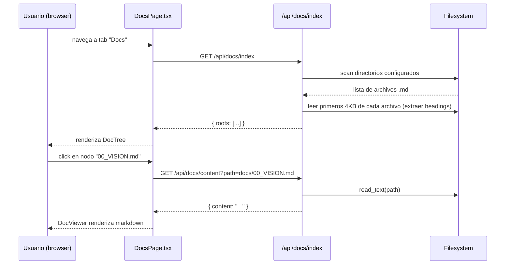
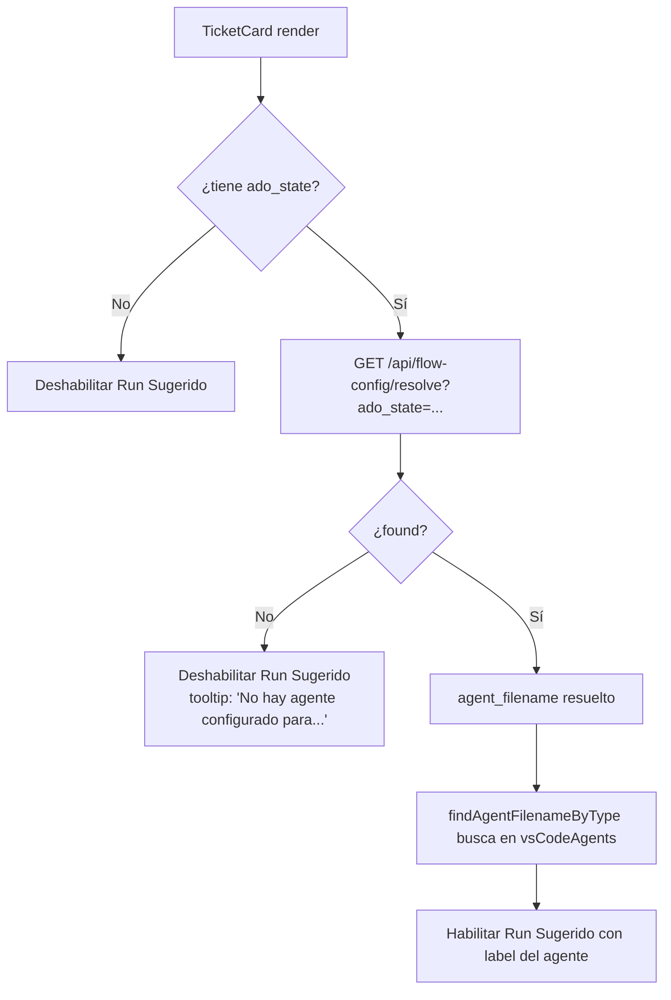
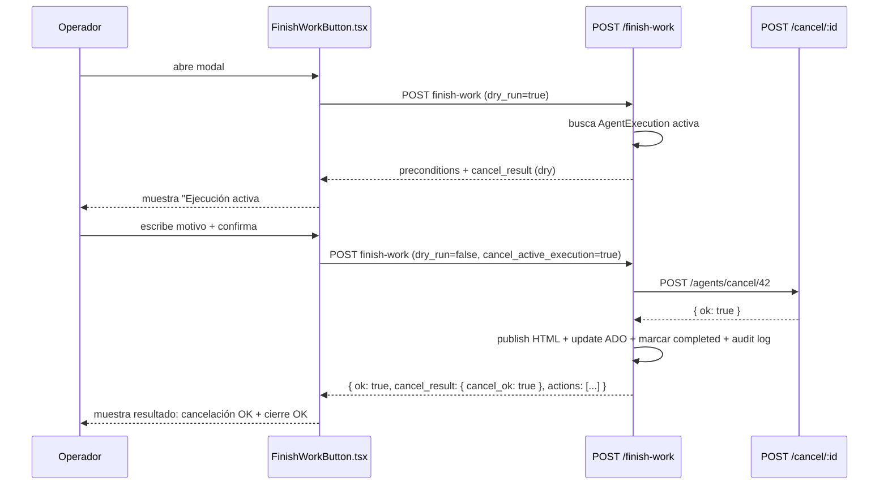

# SDD — Mejoras Stacky Agents: Vista Documentación, Configuración de Flujo y Acción Terminar Trabajo

---

## 1. Metadata

| Campo        | Valor                                              |
|--------------|----------------------------------------------------|
| Título       | Mejoras Stacky Agents: Vista Doc en Árbol, Config de Flujo ADO→Agente, Acción Terminar Trabajo |
| Autor        | juanluca.santoliquido@ubimia.com                   |
| Fecha        | 2026-05-19                                         |
| Branch       | pruebaflujoagentico                                |
| Status       | Draft                                              |
| Features     | #3 DocTree, #4 FlowConfig, #5 TerminarTrabajo       |
| Archivos raíz | `Tools/Stacky/Stacky Agents/`                    |

---

## 2. Resumen ejecutivo

- **Feature #3 (DocTree):** Nueva pestaña en el frontend que indexa y muestra en árbol navegable toda la documentación del proyecto (docs/, README, .agent.md, roadmaps), con filtros y renderizado inline de markdown.
- **Feature #4 (FlowConfig):** Se elimina la inferencia LLM probabilística (`ado_pipeline_inference.py`, `next_agent.py`) que sugiere el próximo agente, y se reemplaza por una tabla de configuración explícita `estado ADO → agente`. La recomendación pasa a ser determinística y configurable por el operador.
- **Feature #5 (TerminarTrabajo):** El botón `FinishWorkButton` ya existe en el frontend (visible cuando `isRunning === true`) pero actualmente sólo ejecuta el flujo de cierre manual (publicar HTML, cambiar estado ADO, marcar `stacky_status=completed`). Falta integrar la cancelación del proceso en ejecución (`POST /api/agents/cancel/:executionId`) antes de ejecutar el cierre, convirtiendo la acción en un flujo atómico: cancelar proceso + terminar trabajo.
- Las tres features son independientes entre sí y pueden implementarse como PRs separados en cualquier orden.
- Ninguna de las tres requiere cambios a la base de datos SQLite excepto #4 (agregar tabla `flow_config_entries` o ampliar `data/preferences.json`).

---

## 3. Problema / Motivación

### Feature #3 — Vista de documentación en árbol

Hoy la documentación del ecosistema Stacky Agents está dispersa en al menos cuatro ubicaciones:
- `Tools/Stacky/Stacky Agents/docs/` (00_VISION.md … 11_PM_INTELLIGENCE_SUITE.md + specs/)
- `Tools/Stacky/Stacky Agents/README.md`, `README_PARA_AGENTES.md`, `STACKY_AGENTS_COMPLETE.md`, `MejorasStackyAgent.md`
- `Tools/Stacky/*.md` (roadmaps en raíz de Stacky)
- `Tools/Stacky/Stacky Agents/backend/README.md`
- Archivos `.agent.md` del equipo

No existe una vista unificada dentro de la app. El operador debe navegar el filesystem o recordar de memoria dónde está cada documento. El objetivo es tener una pestaña "Documentación" dentro de la app que permita navegar, buscar y leer sin salir de Stacky Agents.

### Feature #4 — Recomendación determinística de próximo agente

Hoy coexisten **dos** mecanismos de sugerencia de próximo agente:
1. `services/next_agent.py` (FA-42): cadena de Markov sobre transiciones históricas de `AgentExecution`. Fallback a cadena clásica `DEFAULT_NEXT` codificada en duro.
2. `services/ado_pipeline_inference.py`: inferencia LLM (GPT-4o-mini) sobre comentarios ADO que devuelve `next_suggested`. Cacheable 60 min.

El resultado es no-determinístico (depende de datos históricos y del LLM), costoso (llama al LLM), y no expresa la intención real del operador. Además el componente `PipelineStatus.tsx` muestra `next_suggested` que proviene de la inferencia LLM, lo que puede confundir si el operador ya sabe cuál es el flujo.

La motivación es reemplazar ambos mecanismos de _sugerencia_ por una configuración explícita: el operador define qué agente corresponde a cada estado ADO, y la recomendación es determinística.

**Aclaración de scope:** la inferencia LLM (`ado_pipeline_inference.py`) cumple también otra función: muestra el progreso del pipeline (barra de porcentaje, etapas done/pending) en `PipelineStatus.tsx`. Esa funcionalidad de progreso visual queda **fuera del scope** de esta feature. Solo se elimina `next_suggested` del resultado y su visualización.

### Feature #5 — Acción "Terminar trabajo" completa para ejecuciones en curso

El `FinishWorkButton` ya existe y es visible cuando `isRunning === true` en `TicketBoard.tsx`. Sin embargo, hoy no cancela el proceso en ejecución antes de marcar el ticket como terminado. Si hay un agente activo (thread en `agent_runner.py`, proceso en `copilot_bridge`), el cierre puede producir un estado inconsistente: `stacky_status=completed` pero el proceso sigue corriendo.

Falta un flujo integrado: primero cancelar la ejecución activa (`POST /api/agents/cancel/:executionId`), luego ejecutar el cierre (publish + ADO + audit). El operador necesita evidencia de qué pasó con el proceso cancelado.

---

## 4. Objetivos y No-Objetivos

### Feature #3 — DocTree

**Objetivos:**
- Leer documentos desde `docs/`, archivos `.md` raíz de `Stacky Agents/`, y archivos `.agent.md` del directorio de prompts de VS Code (ruta configurable).
- Mostrar jerarquía en árbol navegable (secciones por headings H1/H2).
- Filtro por texto libre sobre títulos de documentos y contenido.
- Renderizado inline de markdown al seleccionar un nodo.
- Backend expone un endpoint de índice (árbol de documentos + metadatos).
- Nuevo endpoint de lectura de contenido por path relativo seguro (sin path traversal).

**No-Objetivos:**
- No indexa código fuente Python/TypeScript.
- No indexa archivos del `.venv`.
- No permite editar documentos desde la app.
- No versiona ni rastrea cambios de documentación.
- No indexa automáticamente al guardar (no watcher en tiempo real para esta fase).

### Feature #4 — FlowConfig

**Objetivos:**
- Nueva pestaña "Config de Flujo" en `App.tsx`.
- CRUD de reglas `{ ado_state: string, agent_filename: string }` persistidas en archivo JSON.
- Reemplazar la lectura de `next_suggested` de la inferencia LLM en `PipelineStatus.tsx` y `TicketBoard.tsx` por consulta a la tabla de mapping.
- Marcar `next_agent.py` y `ado_pipeline_inference.next_suggested` como deprecated (no borrar, preservar para rollback, con flag).
- Comportamiento sin mapping configurado: botón "Run Sugerido" deshabilitado con tooltip explicativo.

**No-Objetivos:**
- No se elimina la barra de progreso de `PipelineStatus.tsx` (depende del resto de `ado_pipeline_inference`).
- No se elimina `DEFAULT_NEXT` del código hasta que el mapping tenga datos suficientes (la tabla es el override, no el reemplazo total en esta fase).
- No soporta reglas condicionales complejas (ej.: estado ADO + tipo de work item → agente). Queda como decisión abierta.
- No migra historial de transiciones existente.

### Feature #5 — TerminarTrabajo

**Objetivos:**
- El flujo "Terminar trabajo" cancela primero la ejecución activa si existe, luego llama a `/finish-work`.
- El modal muestra en precondiciones: si hay ejecución activa, su ID, y si la cancelación fue exitosa.
- Se registra en `system_logs` un evento estructurado que combine `cancel` + `finish_work`.
- El botón "Terminar trabajo" en `TicketBoard.tsx` cuando `isRunning === true` muestra estado del proceso cancelado.

**No-Objetivos:**
- No interrumpe procesos del sistema operativo de forma forzada (no SIGKILL). Usa el mecanismo de cancelación existente en `agent_runner.cancel()` / `copilot_bridge.cancel()`.
- No implementa nuevo mecanismo de cancellation tokens. Usa el que ya existe.
- No agrega botón "Terminar trabajo" en `TicketGraphView.jsx` (solo `TicketBoard.tsx`).
- No cambia comportamiento de `FinishWorkButton` cuando `isRunning === false` (cierre manual ya funciona).

---

## 5. Especificación funcional

### Feature #3 — DocTree

**User stories:**

US-3.1: Como operador, quiero ver un árbol con todos los documentos del proyecto para saber qué documentación existe sin navegar el filesystem.

US-3.2: Como operador, quiero filtrar documentos por texto libre para encontrar rápidamente el que necesito.

US-3.3: Como operador, quiero seleccionar un nodo del árbol y leer el contenido renderizado inline sin abrir un editor externo.

**Criterios de aceptación:**

```
CA-3.1 — Árbol de documentos
  Given: el operador navega a la pestaña "Docs"
  When: carga inicial
  Then: se muestra árbol con al menos 3 secciones raíz: "Documentación Técnica", "Agentes (.agent.md)", "Roadmaps y Notas"
  And: cada sección tiene los archivos correspondientes con su nombre y cantidad de headings

CA-3.2 — Filtro
  Given: el árbol está cargado
  When: el operador escribe "vision" en el campo de búsqueda
  Then: solo se muestran nodos cuyo título o contenido textual contiene "vision" (case-insensitive)
  And: los nodos no coincidentes quedan ocultos (no solo griseados)

CA-3.3 — Renderizado inline
  Given: el árbol está cargado
  When: el operador hace click en el nodo "00_VISION.md"
  Then: el panel derecho muestra el contenido renderizado en markdown con headings, listas y código
  And: los links internos no navegan fuera de la app (se interceptan o deshabilitan)

CA-3.4 — Seguridad
  Given: el endpoint GET /api/docs/content?path=../../backend/.env
  When: se llama desde el frontend
  Then: el backend retorna 400 con error "path_traversal_blocked"
  And: no se expone ningún contenido fuera de los directorios indexados

CA-3.5 — Vacío gracioso
  Given: no existe ningún archivo .md en el directorio configurado
  When: el árbol carga
  Then: se muestra mensaje "No se encontró documentación. Verificá la ruta configurada."
```

---

### Feature #4 — FlowConfig

**User stories:**

US-4.1: Como operador, quiero definir explícitamente que cuando un ticket ADO está en estado "Active" el agente sugerido sea "AnalistaFuncionlPacifico.agent.md".

US-4.2: Como operador, quiero ver qué agente se sugiere para el ticket actual basándome en su estado ADO real, sin inferencia LLM.

US-4.3: Como operador, quiero editar y eliminar reglas de mapping sin perder las reglas anteriores.

**Criterios de aceptación:**

```
CA-4.1 — CRUD de reglas
  Given: el operador está en la pestaña "Config de Flujo"
  When: crea una regla { ado_state: "Active", agent_filename: "DevPacifico.agent.md" }
  Then: la regla aparece en la tabla de reglas guardada
  And: GET /api/flow-config retorna la regla recién creada

CA-4.2 — Recomendación determinística
  Given: existe regla { ado_state: "Active", agent_filename: "DevPacifico.agent.md" }
  And: el ticket ADO-123 tiene ado_state = "Active"
  When: el operador ve TicketBoard
  Then: el botón "Run Sugerido" muestra "DevPacifico" y queda habilitado
  And: el tooltip NO dice "LLM" ni "Markov"

CA-4.3 — Estado sin mapping
  Given: no existe regla para el estado ADO "In Review"
  And: el ticket tiene ado_state = "In Review"
  When: el operador ve TicketBoard
  Then: el botón "Run Sugerido" está deshabilitado
  And: el tooltip dice "No hay agente configurado para el estado 'In Review'. Configurá el flujo en la pestaña Config de Flujo."

CA-4.4 — Prioridad sobre inferencia
  Given: el mapping tiene una regla para el estado del ticket
  And: la inferencia LLM sugiere un agente diferente
  When: el componente NextAgentSuggestion/PipelineStatus renderiza
  Then: se usa el agente del mapping, no el del LLM

CA-4.5 — Regla duplicada
  Given: ya existe regla para ado_state "Active"
  When: el operador intenta crear otra regla para "Active"
  Then: se muestra error "Ya existe una regla para el estado 'Active'. Editá la existente."
  And: no se persiste la duplicada
```

---

### Feature #5 — TerminarTrabajo

**User stories:**

US-5.1: Como operador, cuando hay un agente en ejecución sobre un ticket, quiero poder terminar ese trabajo completo (cancelar proceso + marcar ticket como completado) desde un solo botón.

US-5.2: Como operador, quiero ver en el modal qué pasó con el proceso cancelado antes de confirmar el cierre definitivo.

US-5.3: Como operador, quiero que quede evidencia en system_logs de que usé "Terminar trabajo" sobre una ejecución activa.

**Criterios de aceptación:**

```
CA-5.1 — Cancelación previa al cierre
  Given: el ticket tiene stacky_status = "running"
  And: existe AgentExecution con status = "running" para ese ticket
  When: el operador abre el modal "Terminar trabajo" (dry-run automático)
  Then: las precondiciones muestran "Ejecución activa: #<id> (agent_type: <tipo>)"
  And: se muestra advertencia "Se cancelará el proceso activo antes del cierre"

CA-5.2 — Flujo completo
  Given: las precondiciones del CA-5.1
  When: el operador ingresa motivo y confirma
  Then: se llama POST /api/agents/cancel/:executionId
  And: se espera respuesta antes de llamar POST /api/tickets/:id/finish-work
  And: el resultado muestra acción "cancel_execution" con ok=true|false antes de las acciones de finish-work

CA-5.3 — Cancelación fallida
  Given: la cancelación de la ejecución falla (ok=false)
  When: el flujo continúa
  Then: el modal muestra advertencia "No se pudo cancelar la ejecución #<id>. El cierre se ejecutó igualmente."
  And: el cierre igualmente se intenta (no aborta el flujo completo)
  And: el log registra el fallo de cancelación

CA-5.4 — Sin ejecución activa
  Given: el ticket tiene stacky_status = "running" pero NO existe AgentExecution activa en BD
  When: el operador abre el modal
  Then: las precondiciones NO muestran sección de cancelación
  And: el flujo es idéntico al cierre manual actual

CA-5.5 — Evidencia en system_logs
  Given: el flujo de CA-5.2 se completó exitosamente
  When: el operador consulta System Logs
  Then: existe entrada con tags ["ticket", "finish_work", "manual", "cancel_active"]
  And: el evento incluye execution_id cancelada y execution_id de cierre

CA-5.6 — Estado final del ticket
  Given: el flujo completó exitosamente
  When: el operador ve TicketBoard
  Then: el ticket ya no muestra banner "EN EJECUCIÓN"
  And: stacky_status = "completed"
  And: el botón "Terminar trabajo" ya no es visible (porque isRunning === false)
```

---

## 6. Diseño técnico

### Feature #3 — DocTree

#### 6.3.1 Componentes afectados

**Backend (nuevo):**
- `Tools/Stacky/Stacky Agents/backend/api/docs.py` — Blueprint Flask `/api/docs`
- `Tools/Stacky/Stacky Agents/backend/services/doc_indexer.py` — servicio que escanea directorios y extrae árbol de headings

**Frontend (nuevo):**
- `Tools/Stacky/Stacky Agents/frontend/src/pages/DocsPage.tsx` — página principal de documentación
- `Tools/Stacky/Stacky Agents/frontend/src/pages/DocsPage.module.css`
- `Tools/Stacky/Stacky Agents/frontend/src/components/DocTree.tsx` — árbol navegable
- `Tools/Stacky/Stacky Agents/frontend/src/components/DocTree.module.css`
- `Tools/Stacky/Stacky Agents/frontend/src/components/DocViewer.tsx` — panel de renderizado markdown
- `Tools/Stacky/Stacky Agents/frontend/src/components/DocViewer.module.css`

**Frontend (modificado):**
- `Tools/Stacky/Stacky Agents/frontend/src/App.tsx` — agregar tab "docs" y `<DocsPage />`
- `Tools/Stacky/Stacky Agents/frontend/src/api/endpoints.ts` — agregar sección `Docs`

**Backend (modificado):**
- `Tools/Stacky/Stacky Agents/backend/app.py` — registrar blueprint `docs`

#### 6.3.2 Contratos de endpoints

```
GET /api/docs/index
  Descripción: Devuelve árbol completo de documentos indexados.
  Query params: (ninguno en v1)
  Response 200:
  {
    "ok": true,
    "indexed_at": "2026-05-19T10:00:00Z",
    "roots": [
      {
        "id": "technical-docs",
        "label": "Documentación Técnica",
        "children": [
          {
            "id": "doc:docs/00_VISION.md",
            "label": "00_VISION.md",
            "path": "docs/00_VISION.md",
            "size_bytes": 8400,
            "headings": [
              { "level": 1, "text": "Visión del Producto", "anchor": "vision-del-producto" },
              { "level": 2, "text": "Filosofía", "anchor": "filosofia" }
            ]
          }
        ]
      },
      {
        "id": "agents",
        "label": "Agentes (.agent.md)",
        "children": [...]
      },
      {
        "id": "roadmaps",
        "label": "Roadmaps y Notas",
        "children": [...]
      }
    ]
  }

GET /api/docs/content
  Descripción: Retorna el contenido raw de un documento validado.
  Query params:
    path: string (ej: "docs/00_VISION.md") — ruta relativa dentro de la raíz indexada
  Response 200:
  {
    "ok": true,
    "path": "docs/00_VISION.md",
    "content": "# Visión del Producto\n...",
    "encoding": "utf-8"
  }
  Response 400:
  {
    "ok": false,
    "error": "path_traversal_blocked",
    "message": "La ruta solicitada está fuera del directorio permitido."
  }
  Response 404:
  {
    "ok": false,
    "error": "not_found",
    "message": "Documento no encontrado."
  }
```

#### 6.3.3 Modelo de datos / persistencia

No hay persistencia en BD. El índice se construye en memoria en cada request a `/api/docs/index` (o con cache en memoria con TTL de 5 minutos para evitar filesystem I/O en cada render).

Directorios indexados (configurables vía `config.py`):
- `{STACKY_AGENTS_ROOT}/docs/` — documentación técnica
- `{STACKY_AGENTS_ROOT}/` — archivos `*.md` en raíz (README, STACKY_AGENTS_COMPLETE, MejorasStackyAgent, etc.)
- `{VSCODE_PROMPTS_DIR}/` — archivos `*.agent.md`
- `{STACKY_ROOT}/` — archivos `*.md` en raíz de Stacky (roadmaps)

Variable `STACKY_AGENTS_ROOT` ya es derivable de `Path(__file__).parents[1]` desde `app.py`.

#### 6.3.4 Diagrama de flujo



---

### Feature #4 — FlowConfig

#### 6.4.1 Componentes afectados

**Backend (nuevo):**
- `Tools/Stacky/Stacky Agents/backend/api/flow_config.py` — Blueprint Flask `/api/flow-config`
- `Tools/Stacky/Stacky Agents/backend/data/flow_config.json` — archivo de persistencia

**Frontend (nuevo):**
- `Tools/Stacky/Stacky Agents/frontend/src/pages/FlowConfigPage.tsx`
- `Tools/Stacky/Stacky Agents/frontend/src/pages/FlowConfigPage.module.css`

**Frontend (modificado):**
- `Tools/Stacky/Stacky Agents/frontend/src/App.tsx` — agregar tab "flow-config"
- `Tools/Stacky/Stacky Agents/frontend/src/api/endpoints.ts` — agregar sección `FlowConfig`
- `Tools/Stacky/Stacky Agents/frontend/src/pages/TicketBoard.tsx` — reemplazar lógica de `nextSuggested` basada en `rawNextSuggested` (líneas ~216-228) por consulta al mapping
- `Tools/Stacky/Stacky Agents/frontend/src/components/PipelineStatus.tsx` — remover renderizado de `next_suggested` del resultado LLM (líneas 40, 74-77)
- `Tools/Stacky/Stacky Agents/frontend/src/components/NextAgentSuggestion.tsx` — convertir a usar FlowConfig en lugar de `/api/agents/next-suggestion` (o deprecar el componente)

**Backend (modificado):**
- `Tools/Stacky/Stacky Agents/backend/app.py` — registrar blueprint `flow_config`
- `Tools/Stacky/Stacky Agents/backend/services/ado_pipeline_inference.py` — marcar campo `next_suggested` como deprecated en docstring; mantener en modelo para rollback pero no usarlo como fuente de recomendación en el frontend

**Backend (deprecated, no borrar en v1):**
- `Tools/Stacky/Stacky Agents/backend/services/next_agent.py` — marcar como `# DEPRECATED: FA-42 reemplazado por FlowConfig`
- `Tools/Stacky/Stacky Agents/backend/api/agents.py` línea 214 (`/next-suggestion`) — mantener endpoint pero agregar header `Deprecation: true` en response

#### 6.4.2 Contratos de endpoints

```
GET /api/flow-config
  Descripción: Retorna todas las reglas de mapping estado ADO → agente.
  Response 200:
  {
    "ok": true,
    "rules": [
      {
        "id": "rule-1",
        "ado_state": "Active",
        "agent_filename": "DevPacifico.agent.md",
        "agent_label": "DevPacifico",
        "created_at": "2026-05-19T10:00:00Z",
        "updated_at": "2026-05-19T10:00:00Z"
      }
    ]
  }

POST /api/flow-config
  Descripción: Crea una nueva regla.
  Body: { "ado_state": "Active", "agent_filename": "DevPacifico.agent.md" }
  Response 201: { "ok": true, "rule": { ...rule object... } }
  Response 409: { "ok": false, "error": "duplicate_state", "message": "Ya existe una regla para el estado 'Active'." }
  Response 400: { "ok": false, "error": "validation_error", "message": "ado_state y agent_filename son requeridos." }

PUT /api/flow-config/:rule_id
  Descripción: Actualiza una regla existente.
  Body: { "ado_state": "Active", "agent_filename": "AnalistaFuncionlPacifico.agent.md" }
  Response 200: { "ok": true, "rule": { ...rule object... } }
  Response 404: { "ok": false, "error": "not_found" }

DELETE /api/flow-config/:rule_id
  Descripción: Elimina una regla.
  Response 200: { "ok": true }
  Response 404: { "ok": false, "error": "not_found" }

GET /api/flow-config/resolve
  Descripción: Dado un estado ADO, retorna el agente mapeado (usado por TicketBoard).
  Query params: ado_state=Active
  Response 200: { "ok": true, "ado_state": "Active", "agent_filename": "DevPacifico.agent.md", "agent_label": "DevPacifico", "found": true }
  Response 200 (sin mapping): { "ok": true, "ado_state": "In Review", "agent_filename": null, "found": false }
```

#### 6.4.3 Modelo de datos / persistencia

Archivo `Tools/Stacky/Stacky Agents/backend/data/flow_config.json`:

```json
{
  "version": "1.0",
  "updated_at": "2026-05-19T10:00:00Z",
  "rules": [
    {
      "id": "rule-uuid-1",
      "ado_state": "Active",
      "agent_filename": "DevPacifico.agent.md",
      "created_at": "2026-05-19T10:00:00Z",
      "updated_at": "2026-05-19T10:00:00Z"
    }
  ]
}
```

Alternativa BD: tabla SQLAlchemy `FlowConfigEntry`. Se prefiere el archivo JSON por consistencia con `preferences.json` y para facilitar backup/diff en git.

**Decisión abierta #4.A:** ver sección 12.

#### 6.4.4 Diagrama de flujo



---

### Feature #5 — TerminarTrabajo

#### 6.5.1 Componentes afectados

**Backend (modificado):**
- `Tools/Stacky/Stacky Agents/backend/api/tickets.py` — endpoint `POST /api/tickets/:id/finish-work` (línea ~940): agregar paso previo de cancelación si existe ejecución activa
- `Tools/Stacky/Stacky Agents/backend/api/agents.py` — endpoint `POST /api/agents/cancel/:execution_id` (línea ~224): ya existe, no requiere cambios

**Frontend (modificado):**
- `Tools/Stacky/Stacky Agents/frontend/src/components/FinishWorkButton.tsx` — agregar precondición de "ejecución activa" al dry-run, mostrar advertencia de cancelación
- `Tools/Stacky/Stacky Agents/frontend/src/api/endpoints.ts` — actualizar tipo `FinishWorkResponse` para incluir `cancel_result`

#### 6.5.2 Contratos de endpoints

El endpoint `POST /api/tickets/:id/finish-work` ya existe. Se extiende su request y response:

```
POST /api/tickets/:id/finish-work
  Body (sin cambios en campos existentes, se agrega):
  {
    "operator_reason": "string (min 5 chars)",
    "publish_to_ado": true,
    "target_ado_state": "Done" | null,
    "force_publish": false,
    "dry_run": false,
    "cancel_active_execution": true   // NUEVO campo — default: true
  }

  Response 200 (extendido):
  {
    "ok": true,
    "dry_run": false,
    "ticket_id": 1,
    "ado_id": 123,
    "cancel_result": {               // NUEVO campo — null si no había ejecución activa
      "execution_id": 42,
      "agent_type": "developer",
      "cancel_ok": true,
      "cancel_reason": null          // presente si cancel_ok = false
    },
    "preconditions": { ... },        // sin cambios
    "actions": [ ... ],              // sin cambios
    "current_status": "completed",
    "operator": "juanluca"
  }
```

**Contrato de prop React actualizado para `FinishWorkButton`:**

```typescript
// En endpoints.ts — extender FinishWorkResponse
export interface FinishWorkResponse {
  // ... campos existentes ...
  cancel_result: {
    execution_id: number;
    agent_type: string;
    cancel_ok: boolean;
    cancel_reason: string | null;
  } | null;
}
```

#### 6.5.3 Modelo de datos / persistencia

No se requiere nueva tabla. El evento en `system_logs` ya existe. Se extiende el `metadata` del registro `manual_finish_work` para incluir `cancel_result`.

La lógica de detección de ejecución activa usa la misma consulta que `useRunningStatus.ts` hace en el frontend, pero en el backend:
```python
session.query(AgentExecution).filter(
    AgentExecution.ticket_id == ticket_id,
    AgentExecution.status == "running"
).first()
```

#### 6.5.4 Diagrama de flujo



---

## 7. Plan de implementación por fases

Cada fase es un PR independiente y reversible. El orden dentro de cada feature es sugerido; las tres features pueden correr en paralelo.

### Feature #3 — DocTree

| Fase | Contenido | Criterio de done |
|------|-----------|-----------------|
| 3.A | Backend: `doc_indexer.py` + `api/docs.py` (index + content endpoints) con tests unitarios | `GET /api/docs/index` retorna árbol con >= 10 documentos reales. Path traversal bloqueado. Tests pasan. |
| 3.B | Frontend: `DocTree.tsx` + `DocViewer.tsx` (sin filtro). Tab "Docs" en App.tsx | El árbol se muestra y el click en un nodo renderiza markdown. Sin regresión en otras tabs. |
| 3.C | Frontend: filtro por texto libre en DocTree | Búsqueda "vision" retorna solo nodos relevantes. Búsqueda vacía muestra todo el árbol. |

### Feature #4 — FlowConfig

| Fase | Contenido | Criterio de done |
|------|-----------|-----------------|
| 4.A | Backend: `flow_config.py` (CRUD + resolve endpoint) + `data/flow_config.json` vacío | Todos los endpoints responden correctamente. Duplicate state retorna 409. Tests unitarios pasan. |
| 4.B | Frontend: `FlowConfigPage.tsx` (tabla + formulario CRUD). Tab "Config de Flujo" en App.tsx | El operador puede crear, editar y borrar reglas. Sin regresión. |
| 4.C | Frontend: `TicketBoard.tsx` — reemplazar `rawNextSuggested` por `GET /api/flow-config/resolve`. Deprecar `NextAgentSuggestion.tsx` (o convertirlo). Quitar `next_suggested` de `PipelineStatus.tsx` | "Run Sugerido" usa el mapping. Botón deshabilitado si no hay regla. Tooltip correcto. |
| 4.D | Backend: marcar `next_agent.py` y `GET /api/agents/next-suggestion` como deprecated | Header `Deprecation: true` en response. Docstring actualizado. Sin borrado de código. |

### Feature #5 — TerminarTrabajo

| Fase | Contenido | Criterio de done |
|------|-----------|-----------------|
| 5.A | Backend: extender `POST /finish-work` para detectar ejecución activa y cancelarla antes del cierre (dry_run y real). Extender respuesta con `cancel_result`. Tests unitarios. | Dry-run muestra `cancel_result` con `execution_id` cuando hay ejecución activa. Sin regresión en flujo normal (sin ejecución activa). |
| 5.B | Frontend: extender `FinishWorkButton.tsx` para mostrar precondición de cancelación y resultado. Actualizar tipo `FinishWorkResponse`. | Modal muestra advertencia de cancelación cuando corresponde. Resultado diferencia cancel_ok: true/false. |

---

## 8. Estrategia de testing

### Feature #3 — DocTree

**Unit (backend):**
- `test_doc_indexer.py`: fixture de directorio temporal con 3 archivos .md; verificar que el árbol tiene la jerarquía correcta.
- `test_docs_api.py`: path traversal con `../../secrets.env` retorna 400. Archivo inexistente retorna 404. Archivo válido retorna contenido correcto.

**Integration:**
- Test contra el filesystem real de `Stacky Agents/docs/`: verificar que los 14 archivos .md existentes están en el índice.

**Manual UAT (checklist):**
- [ ] Tab "Docs" aparece en la barra de navegación de App.tsx.
- [ ] Árbol carga en menos de 2 segundos con los 14+ documentos reales.
- [ ] Click en "00_VISION.md" muestra contenido renderizado (headings visibles como H1/H2).
- [ ] Búsqueda "arquitectura" filtra correctamente.
- [ ] Búsqueda vacía restaura el árbol completo.
- [ ] Links dentro del markdown no navegan fuera de la app.
- [ ] Ninguna otra tab muestra regresión visual.

### Feature #4 — FlowConfig

**Unit (backend):**
- `test_flow_config.py`: CRUD completo (crear, listar, actualizar, borrar). Duplicate state retorna 409. Resolve con estado existente retorna agente. Resolve con estado inexistente retorna `found: false`.

**Unit (frontend):**
- `FlowConfigPage.test.tsx`: render con reglas vacías. Creación de regla. Error de duplicado.
- `TicketBoard.test.tsx` (extender tests existentes): verificar que "Run Sugerido" usa el mapping y no `next_suggested` del LLM.

**Manual UAT (checklist):**
- [ ] Tab "Config de Flujo" visible en App.tsx.
- [ ] Crear regla { "Active" → "DevPacifico.agent.md" } y verificar que persiste en `data/flow_config.json`.
- [ ] En TicketBoard, ticket con ado_state="Active" muestra "Run Sugerido: DevPacifico".
- [ ] Ticket con ado_state sin mapping muestra "Run Sugerido" deshabilitado con tooltip correcto.
- [ ] Intentar crear regla duplicada muestra error sin persistir.
- [ ] Borrar regla y verificar que el botón vuelve a estar deshabilitado.
- [ ] La barra de progreso de PipelineStatus.tsx sigue funcionando (no regresión).

### Feature #5 — TerminarTrabajo

**Unit (backend):**
- `test_finish_work.py` (extender existentes): caso con ejecución activa — verificar que `cancel` se llama antes del cierre. Caso sin ejecución activa — verificar que `cancel_result` es null. Caso con cancelación fallida — verificar que el cierre continúa y `cancel_result.cancel_ok = false`.

**Manual UAT (checklist):**
- [ ] Ejecutar un agente sobre un ticket. Verificar que aparece banner "EN EJECUCIÓN" y botón "Terminar trabajo".
- [ ] Abrir modal: verifica que la precondición muestra "Ejecución activa: #<id>".
- [ ] Confirmar cierre: verificar que el resultado muestra "cancel_execution: OK" y acciones de cierre.
- [ ] Verificar en System Logs que el evento incluye el `execution_id` cancelado.
- [ ] Verificar que el ticket vuelve a `stacky_status = completed` y el banner desaparece.
- [ ] Ejecutar "Terminar trabajo" sobre ticket en running pero sin ejecución activa en BD (simular con reset manual): verificar que NO muestra sección de cancelación.

---

## 9. Observabilidad y telemetría

### Feature #3 — DocTree

Eventos nuevos en `stacky_logger`:
```json
{ "event": "docs_index_built", "file_count": 17, "duration_ms": 120, "cached": false }
{ "event": "docs_content_served", "path": "docs/00_VISION.md", "size_bytes": 8400 }
{ "event": "docs_path_traversal_blocked", "attempted_path": "../../.env" }
```

### Feature #4 — FlowConfig

Eventos nuevos:
```json
{ "event": "flow_config_rule_created", "ado_state": "Active", "agent_filename": "DevPacifico.agent.md", "operator": "juanluca" }
{ "event": "flow_config_rule_deleted", "rule_id": "rule-uuid-1", "operator": "juanluca" }
{ "event": "flow_config_resolve", "ado_state": "Active", "found": true, "agent_filename": "DevPacifico.agent.md" }
{ "event": "flow_config_resolve", "ado_state": "In Review", "found": false }
```

Métrica derivada sugerida: `flow_config_resolve_miss_rate` — porcentaje de resoluciones con `found: false`. Si sube indica estados ADO sin mapear.

### Feature #5 — TerminarTrabajo

Extensión del evento existente `manual_finish_work`:
```json
{
  "event": "manual_finish_work",
  "ticket_id": 1,
  "ado_id": 123,
  "operator": "juanluca",
  "cancel_attempted": true,
  "cancel_execution_id": 42,
  "cancel_ok": true,
  "tags": ["ticket", "finish_work", "manual", "cancel_active"]
}
```

Nuevo evento en caso de fallo de cancelación:
```json
{ "event": "finish_work_cancel_failed", "execution_id": 42, "error": "...", "ticket_id": 1 }
```

---

## 10. Riesgos y mitigaciones

| # | Feature | Riesgo | Probabilidad | Impacto | Mitigación |
|---|---------|--------|--------------|---------|------------|
| R1 | #3 | Path traversal en endpoint de contenido — exposición de `.env` o BD | Media | Alto | Whitelist de directorios permitidos en `doc_indexer.py`; resolver path real y comparar con raíz permitida |
| R2 | #3 | Indexar `.venv/` accidentalmente — miles de archivos, OOM | Media | Medio | Exclude hardcodeado de `node_modules/`, `.venv/`, `__pycache__/`, `*.db` |
| R3 | #4 | El operador crea reglas con `agent_filename` que no existe en VS Code | Alta | Bajo | Validar contra `GET /api/agents/vscode` al guardar; mostrar warning si el agente no se encuentra |
| R4 | #4 | `flow_config.json` se corrompe (JSON inválido) | Baja | Medio | Read con try/except, fallback a `{ "rules": [] }` con log de advertencia; misma estrategia que `preferences.json` |
| R5 | #4 | Operador no configura ningún mapping → todos los "Run Sugerido" deshabilitados | Alta | Medio | Pantalla de FlowConfig muestra banner prominente si `rules` está vacío; tooltip en TicketBoard explica cómo configurar |
| R6 | #5 | `cancel()` en `agent_runner.py` falla silenciosamente (el bridge no responde) | Media | Medio | Timeout explícito en la llamada al bridge; si falla, se continúa el cierre y se registra el fallo |
| R7 | #5 | Race condition: ejecución termina entre el dry-run y la confirmación | Media | Bajo | El backend re-verifica la ejecución activa en el momento de la confirmación real; si ya terminó, `cancel_result` indica que no había nada que cancelar |
| R8 | #4 | `ado_pipeline_inference.next_suggested` sigue siendo consumido por algún path no identificado | Baja | Bajo | Búsqueda grep completa del repo antes de eliminar referencia en frontend; marcar como deprecated con alerta en log |

---

## 11. Rollback plan

### Feature #3 — DocTree

Rollback: revertir PR de la fase 3.A/3.B/3.C. No hay cambios a BD. No hay cambios a endpoints existentes. El blueprint `docs` simplemente deja de estar registrado. La tab "Docs" desaparece de `App.tsx`.

Comando: `git revert <commit-hash-del-pr>` o eliminar branch y hacer PR de reverción.

### Feature #4 — FlowConfig

Rollback completo (fases 4.A-4.D):
1. Revertir cambios en `TicketBoard.tsx` para restaurar lectura de `rawNextSuggested` desde `ado_pipeline_inference`.
2. Revertir cambios en `PipelineStatus.tsx` para restaurar renderizado de `next_suggested`.
3. Revertir deprecación de `next_agent.py` y del endpoint `/api/agents/next-suggestion`.
4. El archivo `data/flow_config.json` puede quedar en disco sin impacto (no es consumido si el blueprint no está registrado).

Rollback parcial (solo fase 4.C, si la UI genera problemas): restaurar `TicketBoard.tsx` a la versión anterior. El blueprint `flow_config` puede quedar activo (no causa daño).

### Feature #5 — TerminarTrabajo

Rollback: revertir el PR de fase 5.A (backend). El frontend (fase 5.B) puede quedarse desplegado sin problema porque el campo `cancel_result` simplemente no aparecerá en la respuesta del endpoint anterior — el código frontend debe manejar `cancel_result = null` sin crash (esto es un criterio de done de la fase 5.B).

Rollback de base: dado que el endpoint `/finish-work` ya existía y se extiende (no reemplaza), la ruta de rollback es remover el bloque de cancelación del `try/except` del endpoint y volver a la versión anterior.

---

## 12. Decisiones abiertas / preguntas para el usuario

### Feature #3 — DocTree

**DO-3.1** ¿Qué directorios exactos deben indexarse? El plan propone 4 raíces. ¿Hay que incluir también `Tools/Stacky/Stacky pipeline/docs/` o solo `Stacky Agents`?

**DO-3.2** ¿Los archivos `.agent.md` se muestran como una sección separada en el árbol o se mezclan con la documentación técnica?

**DO-3.3** ¿La pestaña "Docs" debe ser accesible sin autenticación (como el resto de la app) o requiere algún control de visibilidad?

**DO-3.4** ¿Se renderiza markdown con soporte de tablas y code blocks coloreados (requiere librería como `react-markdown` + `rehype-highlight`)? ¿Ya está en el package.json del frontend? Verificar antes de implementar para evitar agregar dependencias sin aprobación.

### Feature #4 — FlowConfig

**DO-4.1 (Alta prioridad)** ¿El mapping debe ser por `agent_filename` (ej: "DevPacifico.agent.md") o por `agent_type` (ej: "developer")? El `agent_type` es más estable pero menos flexible; el `agent_filename` es específico del equipo configurado. El plan actual usa `agent_filename` por consistencia con `preferences.json`.

**DO-4.2** ¿Las reglas deben soportar condiciones adicionales (ej.: estado ADO + tipo de work item → agente diferente)? El plan actual no lo soporta. Si la respuesta es sí, el modelo de datos cambia significativamente.

**DO-4.3** ¿Qué pasa con el botón "Run Sugerido" durante el período de transición en que el mapping está vacío? El plan propone deshabilitarlo con tooltip explicativo. ¿Es aceptable esa experiencia o hay que mantener el fallback a la cadena `DEFAULT_NEXT` hasta que el mapping tenga al menos N reglas?

**DO-4.4** ¿Debe migrarse la configuración existente de `DEFAULT_NEXT` (codificada en `next_agent.py`) hacia `flow_config.json` como reglas iniciales por defecto, o se empieza con tabla vacía?

**DO-4.5** ¿La pestaña "Config de Flujo" es accesible para todos los operadores o solo para un rol administrador? Hoy Stacky Agents no tiene autenticación/roles — ¿esto cambia con esta feature?

### Feature #5 — TerminarTrabajo

**DO-5.1 (Alta prioridad)** ¿Qué debe pasarle al estado ADO del ticket al "terminar trabajo" cuando había una ejecución activa cancelada? ¿El `target_ado_state` del formulario es suficiente, o hay un estado ADO fijo para "trabajo cancelado + cerrado manualmente"?

**DO-5.2** ¿La cancelación de la ejecución debe ser bloqueante (esperar confirmación del bridge) o fire-and-forget con un timeout máximo de N segundos? `copilot_bridge.cancel()` hoy es fire-and-forget. ¿Hay que convertirlo en bloqueante para esta feature?

**DO-5.3** ¿El botón "Terminar trabajo" en `EpicGroup` (líneas ~438-490 de `TicketBoard.tsx`) también debe recibir esta mejora, o solo las tarjetas de tickets individuales?

---

## 13. Checklist de aprobación

El usuario debe firmar las siguientes confirmaciones antes de que comience la implementación de cada feature:

### Feature #3 — DocTree
- [ ] Directorios a indexar confirmados (DO-3.1 respondida)
- [ ] Decisión sobre `.agent.md` en árbol confirmada (DO-3.2 respondida)
- [ ] Decisión sobre librería markdown confirmada (DO-3.4 respondida)
- [ ] Plan de implementación fases 3.A → 3.C aprobado

### Feature #4 — FlowConfig
- [ ] `agent_filename` vs `agent_type` como clave de mapping confirmado (DO-4.1 respondida)
- [ ] Soporte de condiciones adicionales descartado o incluido en scope (DO-4.2 respondida)
- [ ] Comportamiento con tabla vacía confirmado (DO-4.3 respondida)
- [ ] Migración de `DEFAULT_NEXT` como valores iniciales confirmada o descartada (DO-4.4 respondida)
- [ ] Rol/acceso a la pestaña confirmado (DO-4.5 respondida)
- [ ] Plan de implementación fases 4.A → 4.D aprobado

### Feature #5 — TerminarTrabajo
- [ ] Estado ADO destino al cancelar + terminar definido (DO-5.1 respondida)
- [ ] Comportamiento de `copilot_bridge.cancel()` (bloqueante vs fire-and-forget) confirmado (DO-5.2 respondida)
- [ ] Alcance del botón (solo tarjetas individuales o también EpicGroup) confirmado (DO-5.3 respondida)
- [ ] Plan de implementación fases 5.A → 5.B aprobado

---

*Fin del documento SDD — Versión Draft 2026-05-19*
