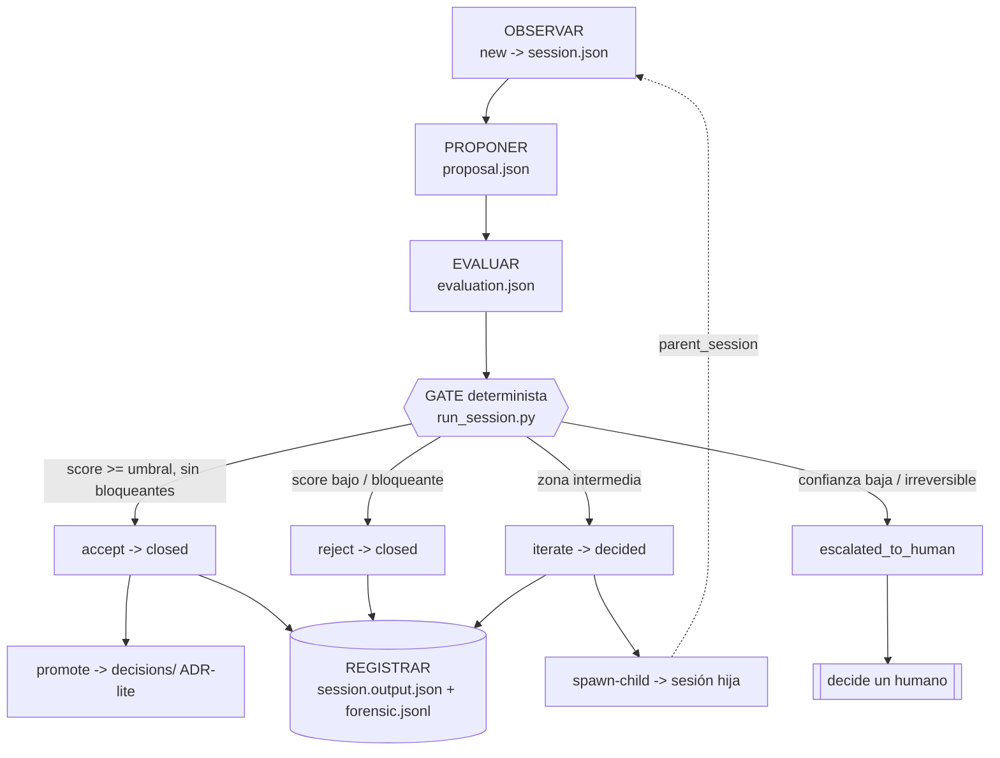

# 01 — Arquitectura

## Componentes y fronteras

```
┌───────────────────────────── kaizen/ (raíz aislada) ─────────────────────────────┐
│                                                                                   │
│   NÚCLEO GENÉRICO (portable, sin saber de ningún proyecto)                        │
│   ┌──────────┐   ┌───────────┐   ┌──────────┐   ┌───────────┐   ┌─────────────┐  │
│   │  docs/   │   │ contracts/│   │ prompts/ │   │  agents/  │   │   skills/   │  │
│   └──────────┘   └─────┬─────┘   └────┬─────┘   └─────┬─────┘   └──────┬──────┘  │
│                        │              │               │                │         │
│                        ▼              ▼               ▼                ▼         │
│                  ┌─────────────────────────────────────────────────────────┐    │
│                  │           CICLO DE SESIÓN (templates/ + scripts/)        │    │
│                  └─────────────────────────┬───────────────────────────────┘    │
│                                            │ produce                            │
│                                            ▼                                    │
│                  ┌──────────┐   ┌───────────┐   ┌────────────┐                  │
│                  │sessions/ │   │ artifacts/│   │ decisions/ │   (datos)        │
│                  └──────────┘   └───────────┘   └────────────┘                  │
│                                            ▲                                    │
│  ─ ─ ─ ─ ─ ─ ─ ─ ─ ─ ─ ─ ─ ─ ─ ─ ─ ─ ─ ─ ─│─ ─ ─ ─ ─ ─ ─ ─ ─ ─ frontera ─ ─    │
│                                            │ resuelto por config                │
│   ACOPLAMIENTO AISLADO                     │                                    │
│   ┌─────────────────────────────┐   ┌──────┴───────────────┐                    │
│   │  config/kaizen.config.yaml  │──►│  adapters/<proyecto>/ │ (REEMPLAZABLE)     │
│   └─────────────────────────────┘   └──────────────────────┘                    │
│                                            │                                    │
└────────────────────────────────────────────┼────────────────────────────────────┘
                                              ▼
                                   Proyecto real (afuera; opcional)
```

## Grafo del ciclo y el gate (Mermaid)



> Este grafo es la vista canónica del runbook (`docs/06_RUNBOOK_AGENTE.md`). Cada nodo mapea a un
> subcomando de `kaizen.py`: `new`, `run` (GATE), `promote`, `spawn-child`.

## Flujo de datos (una sesión)

1. `config/kaizen.config.yaml` define `mode` (hitl|aotl) y `adapter` (cuál usar).
2. `scripts/new_session.py` instancia las plantillas de `templates/` en `sessions/<id>/`.
3. El proponedor (humano o `agents/improver`) produce `proposal.md` conforme a
   `contracts/proposal.schema.json`.
4. El evaluador (humano o `agents/evaluator`) produce `evaluation.md` conforme a
   `contracts/evaluation.schema.json`, usando la rúbrica de `docs/04_HUMAN_REVIEW.md`.
5. Se registra `decision.md` (`contracts/decision.schema.json`) y se actualiza
   `sessions/_index.json` y, si corresponde, `decisions/` y `artifacts/`.

## Reglas de dependencia (qué puede importar qué)

| Capa | Puede depender de | NO puede depender de |
|---|---|---|
| `docs/`, `templates/`, `prompts/` | nada (texto) | — |
| `contracts/` | nada | proyecto padre, adapters |
| `agents/`, `skills/` | `contracts/`, `prompts/` | adapter concreto por nombre |
| `scripts/` | stdlib, `templates/`, `contracts/` | proyecto padre, adapter concreto por nombre |
| `config/` | nombres de adapters (por string) | — |
| `adapters/<x>/` | lo que el proyecto necesite | otros adapters |

> Regla de oro: **el núcleo nunca nombra un adapter concreto.** Lo resuelve por configuración.
> Esto es lo que hace el sistema portable (ver `PORTABILITY.md`).

## Punto de extensión: el "motor"

Kaizen define *qué* produce cada paso (contratos) y *quién* lo produce (agentes), pero no
incluye un orquestador de LLM. Conectar un motor real (un runtime de agentes, un CLI, una API)
se hace en el adapter, implementando el contrato de `adapters/adapter.contract.md`. Así el
núcleo permanece sin dependencias y portable.
